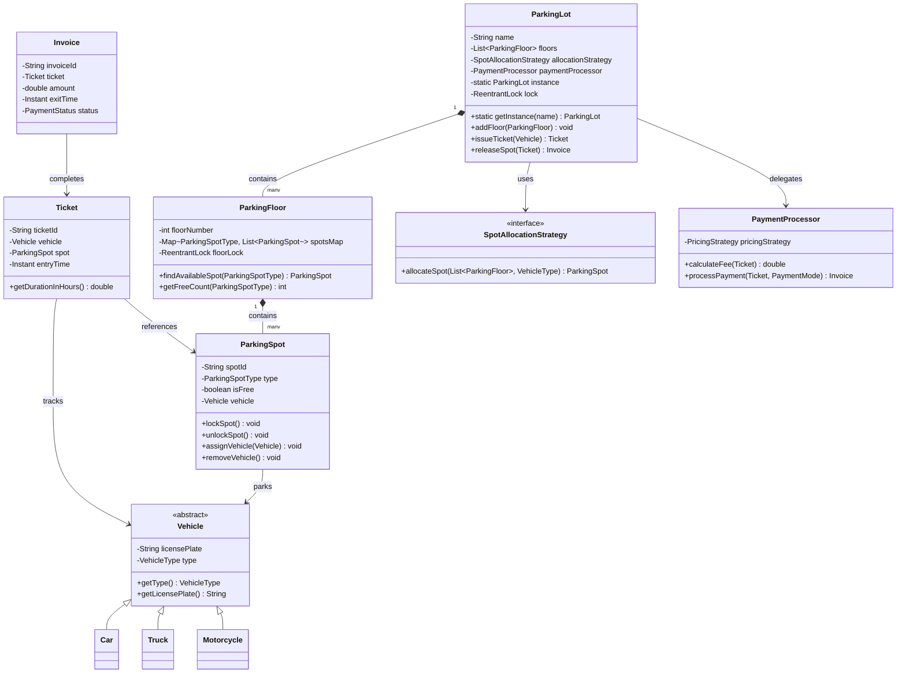
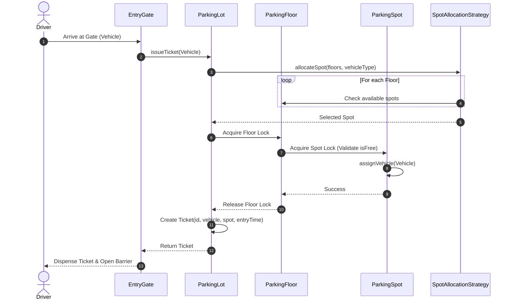

# LLD: Design a Parking Lot

## 1. Core System Scope & Requirements

### Functional Requirements
1. **Multi-Floor & Capacity:** The parking lot has multiple floors, each containing multiple parking spots of different types (Motorcycle, Compact, Large).
2. **Vehicle Compatibility:** The system must support different vehicle types (Motorcycle, Car, Truck). A vehicle can only park in a spot that is compatible with or larger than its size (e.g., Car can park in Compact or Large spots; Motorcycle in Motorcycle, Compact, or Large spots; Truck only in Large spots).
3. **Ticketing & Booking:** When a vehicle enters, the system issues a unique, timestamped ticket if a spot is available, and marks that spot as occupied.
4. **Exit & Payment:** When a vehicle exits, it presents the ticket. The system calculates the fee based on the duration of the stay and vehicle type, processes payment, and releases the spot.
5. **Dynamic Spot Allocation:** The allocation strategy (e.g., nearest to entry, lowest level first) should be pluggable.
6. **Real-time Status Dashboard:** The system must display the number of free spots of each type on each floor.

### Non-Functional Requirements
1. **Thread Safety & Concurrency:** The system must handle concurrent entry and exit requests safely. Multiple vehicles entering simultaneously must not be allocated the same parking spot.
2. **Low Latency:** High throughput and low latency at the gates. Lock contention must be minimized (e.g., floor-level locks instead of locking the entire parking lot).
3. **Fault Tolerance & Extensibility:** Decoupled architecture allowing easy integration of new pricing algorithms or allocation strategies.

---

## 2. Visual Representation (Diagrams)

### UML Class Diagram



### Sequence Flow (Vehicle Entry & Booking)



---

## 3. Violating Design vs. Refactored Design

### The Violating Design (Anti-Pattern)
In a naive design, a single global class manages everything. It uses global synchronized methods, checks vehicle types directly with `if-else` branches, and hardcodes fee calculations.

```java
// VIOLATION: Poor encapsulation, lack of single responsibility, high lock contention, and OCP violation
class BadParkingLot {
    public List<String> spots = new ArrayList<>(); // String list representing spot status: "CAR_FREE", "TRUCK_OCCUPIED"
    
    // Global lock causes severe throughput bottleneck
    public synchronized String bookSpot(String vehicleType) {
        for (int i = 0; i < spots.size(); i++) {
            String spot = spots.get(i);
            if (vehicleType.equals("CAR") && spot.equals("COMPACT_FREE")) {
                spots.set(i, "COMPACT_OCCUPIED");
                return "SPOT_" + i;
            } else if (vehicleType.equals("TRUCK") && spot.equals("LARGE_FREE")) {
                spots.set(i, "LARGE_OCCUPIED");
                return "SPOT_" + i;
            }
        }
        return "FULL";
    }

    // High coupling: calculation logic embedded within the parking class
    public double calculateFee(String spotType, long hours) {
        if (spotType.equals("COMPACT")) return hours * 5.0;
        if (spotType.equals("LARGE")) return hours * 10.0;
        return hours * 2.0;
    }
}
```

### Why it fails:
1. **Concurrency Bottleneck:** Synchronizing `bookSpot` globally stops all entry and exit operations across the entire parking lot, regardless of different floors or spot types.
2. **OCP Violation:** Adding a new vehicle type requires editing `bookSpot` and `calculateFee` directly.
3. **No Representation of Entities:** Spots, tickets, and payments are represented as raw strings instead of domain models.

---

## 4. Production-Ready Java Implementation

Below is the complete, thread-safe, modular Java implementation. It utilizes `ReentrantLock` to protect floors and spots independently, minimizing locking scope.

```java
import java.time.Duration;
import java.time.Instant;
import java.util.*;
import java.util.concurrent.ConcurrentHashMap;
import java.util.concurrent.locks.ReentrantLock;

// --- Domain Enums ---
enum VehicleType {
    MOTORCYCLE, CAR, TRUCK
}

enum ParkingSpotType {
    MOTORCYCLE, COMPACT, LARGE;

    public boolean canFit(VehicleType vehicleType) {
        switch (this) {
            case MOTORCYCLE:
                return vehicleType == VehicleType.MOTORCYCLE;
            case COMPACT:
                return vehicleType == VehicleType.MOTORCYCLE || vehicleType == VehicleType.CAR;
            case LARGE:
                return true; // Large fits everything
            default:
                return false;
        }
    }
}

enum PaymentStatus {
    PENDING, COMPLETED, FAILED
}

// --- Domain Models ---
abstract class Vehicle {
    private final String licensePlate;
    private final VehicleType type;

    protected Vehicle(String licensePlate, VehicleType type) {
        this.licensePlate = licensePlate;
        this.type = type;
    }

    public String getLicensePlate() { return licensePlate; }
    public VehicleType getType() { return type; }
}

class Car extends Vehicle {
    public Car(String licensePlate) {
        super(licensePlate, VehicleType.CAR);
    }
}

class Truck extends Vehicle {
    public Truck(String licensePlate) {
        super(licensePlate, VehicleType.TRUCK);
    }
}

class Motorcycle extends Vehicle {
    public Motorcycle(String licensePlate) {
        super(licensePlate, VehicleType.MOTORCYCLE);
    }
}

class ParkingSpot {
    private final String spotId;
    private final ParkingSpotType type;
    private boolean isFree;
    private Vehicle currentVehicle;
    private final ReentrantLock spotLock = new ReentrantLock();

    public ParkingSpot(String spotId, ParkingSpotType type) {
        this.spotId = spotId;
        this.type = type;
        this.isFree = true;
    }

    public String getSpotId() { return spotId; }
    public ParkingSpotType getType() { return type; }
    
    public boolean isFree() {
        spotLock.lock();
        try {
            return isFree;
        } finally {
            spotLock.unlock();
        }
    }

    public boolean assignVehicle(Vehicle vehicle) {
        spotLock.lock();
        try {
            if (!isFree) return false;
            this.currentVehicle = vehicle;
            this.isFree = false;
            return true;
        } finally {
            spotLock.unlock();
        }
    }

    public void removeVehicle() {
        spotLock.lock();
        try {
            this.currentVehicle = null;
            this.isFree = true;
        } finally {
            spotLock.unlock();
        }
    }
}

class ParkingFloor {
    private final int floorNumber;
    private final List<ParkingSpot> spots;
    private final ReentrantLock floorLock = new ReentrantLock();

    public ParkingFloor(int floorNumber) {
        this.floorNumber = floorNumber;
        this.spots = new ArrayList<>();
    }

    public int getFloorNumber() { return floorNumber; }

    public void addSpot(ParkingSpot spot) {
        floorLock.lock();
        try {
            spots.add(spot);
        } finally {
            floorLock.unlock();
        }
    }

    public ParkingSpot findAndReserveSpot(VehicleType vehicleType) {
        floorLock.lock();
        try {
            for (ParkingSpot spot : spots) {
                if (spot.getType().canFit(vehicleType) && spot.isFree()) {
                    // Try reserving it
                    if (spot.assignVehicle(null)) { // Placeholder reservation
                        return spot;
                    }
                }
            }
            return null;
        } finally {
            floorLock.unlock();
        }
    }
}

// --- Strategies ---
interface SpotAllocationStrategy {
    ParkingSpot allocateSpot(List<ParkingFloor> floors, VehicleType vehicleType);
}

class NearestSpotAllocationStrategy implements SpotAllocationStrategy {
    @Override
    public ParkingSpot allocateSpot(List<ParkingFloor> floors, VehicleType vehicleType) {
        for (ParkingFloor floor : floors) {
            ParkingSpot spot = floor.findAndReserveSpot(vehicleType);
            if (spot != null) {
                return spot;
            }
        }
        return null;
    }
}

interface PricingStrategy {
    double calculateFee(ParkingSpotType type, Duration duration);
}

class StandardPricingStrategy implements PricingStrategy {
    @Override
    public double calculateFee(ParkingSpotType type, Duration duration) {
        long hours = Math.max(1, duration.toHours());
        double rate = 5.0; // Base rate
        if (type == ParkingSpotType.LARGE) rate = 10.0;
        else if (type == ParkingSpotType.MOTORCYCLE) rate = 2.0;
        return hours * rate;
    }
}

// --- Booking Entities ---
class Ticket {
    private final String ticketId;
    private final Vehicle vehicle;
    private final ParkingSpot spot;
    private final Instant entryTime;

    public Ticket(String ticketId, Vehicle vehicle, ParkingSpot spot) {
        this.ticketId = ticketId;
        this.vehicle = vehicle;
        this.spot = spot;
        this.entryTime = Instant.now();
    }

    public String getTicketId() { return ticketId; }
    public Vehicle getVehicle() { return vehicle; }
    public ParkingSpot getSpot() { return spot; }
    public Instant getEntryTime() { return entryTime; }
}

class Invoice {
    private final String invoiceId;
    private final Ticket ticket;
    private final double amount;
    private final Instant exitTime;
    private final PaymentStatus status;

    public Invoice(String invoiceId, Ticket ticket, double amount, PaymentStatus status) {
        this.invoiceId = invoiceId;
        this.ticket = ticket;
        this.amount = amount;
        this.exitTime = Instant.now();
        this.status = status;
    }

    @Override
    public String toString() {
        return "Invoice[" + invoiceId + "] Spot:" + ticket.getSpot().getSpotId() +
               ", Plate:" + ticket.getVehicle().getLicensePlate() +
               ", Amount:$" + amount + ", Status:" + status;
    }
}

// --- Main Parking Lot Controller ---
class ParkingLot {
    private final String name;
    private final List<ParkingFloor> floors;
    private final SpotAllocationStrategy allocationStrategy;
    private final PricingStrategy pricingStrategy;
    private final ReentrantLock globalLock = new ReentrantLock();

    private static volatile ParkingLot instance;

    private ParkingLot(String name, SpotAllocationStrategy allocationStrategy, PricingStrategy pricingStrategy) {
        this.name = name;
        this.floors = new ArrayList<>();
        this.allocationStrategy = allocationStrategy;
        this.pricingStrategy = pricingStrategy;
    }

    public static ParkingLot getInstance(String name, SpotAllocationStrategy strategy, PricingStrategy pricing) {
        if (instance == null) {
            synchronized (ParkingLot.class) {
                if (instance == null) {
                    instance = new ParkingLot(name, strategy, pricing);
                }
            }
        }
        return instance;
    }

    public void addFloor(ParkingFloor floor) {
        globalLock.lock();
        try {
            floors.add(floor);
        } finally {
            globalLock.unlock();
        }
    }

    public Ticket issueTicket(Vehicle vehicle) {
        // Find spot using allocation strategy
        ParkingSpot spot = allocationStrategy.allocateSpot(floors, vehicle.getType());
        if (spot == null) {
            throw new IllegalStateException("Parking Lot is Full for vehicle type: " + vehicle.getType());
        }
        
        // Finalize assignment
        spot.assignVehicle(vehicle);
        String ticketId = "TCK-" + UUID.randomUUID().toString().substring(0, 8).toUpperCase();
        return new Ticket(ticketId, vehicle, spot);
    }

    public Invoice releaseSpot(Ticket ticket) {
        ParkingSpot spot = ticket.getSpot();
        spot.removeVehicle();
        
        Duration duration = Duration.between(ticket.getEntryTime(), Instant.now());
        double amount = pricingStrategy.calculateFee(spot.getType(), duration);
        
        String invoiceId = "INV-" + UUID.randomUUID().toString().substring(0, 8).toUpperCase();
        return new Invoice(invoiceId, ticket, amount, PaymentStatus.COMPLETED);
    }
}

// --- Client Driver ---
public class Main {
    public static void main(String[] args) throws InterruptedException {
        System.out.println("Initializing Parking Lot System...");
        
        ParkingLot parkingLot = ParkingLot.getInstance(
            "Central Park", 
            new NearestSpotAllocationStrategy(), 
            new StandardPricingStrategy()
        );

        // Add 2 floors
        ParkingFloor floor1 = new ParkingFloor(1);
        floor1.addSpot(new ParkingSpot("1-A", ParkingSpotType.MOTORCYCLE));
        floor1.addSpot(new ParkingSpot("1-B", ParkingSpotType.COMPACT));
        floor1.addSpot(new ParkingSpot("1-C", ParkingSpotType.LARGE));

        ParkingFloor floor2 = new ParkingFloor(2);
        floor2.addSpot(new ParkingSpot("2-A", ParkingSpotType.COMPACT));
        floor2.addSpot(new ParkingSpot("2-B", ParkingSpotType.LARGE));

        parkingLot.addFloor(floor1);
        parkingLot.addFloor(floor2);

        // Simulate concurrent vehicle arrivals
        Vehicle car1 = new Car("CAR-1234");
        Vehicle truck1 = new Truck("TRUCK-5678");

        System.out.println("Simulating Booking...");
        Ticket t1 = parkingLot.issueTicket(car1);
        System.out.println("Ticket issued for Car: " + t1.getTicketId() + " at Spot: " + t1.getSpot().getSpotId());

        Ticket t2 = parkingLot.issueTicket(truck1);
        System.out.println("Ticket issued for Truck: " + t2.getTicketId() + " at Spot: " + t2.getSpot().getSpotId());

        // Simulate wait & exit
        Thread.sleep(100); 
        Invoice inv1 = parkingLot.releaseSpot(t1);
        System.out.println("Exit complete: " + inv1);

        Invoice inv2 = parkingLot.releaseSpot(t2);
        System.out.println("Exit complete: " + inv2);
    }
}
```

---

## 5. Edge Cases & Concurrency Handling

1. **Race Conditions on Spot Selection:** If multiple threads attempt to book the same spot simultaneously, the combination of `floorLock` inside `ParkingFloor` and `spotLock` within `ParkingSpot` ensures that only one thread succeeds. When a spot is selected, its state is changed atomically under lock validation.
2. **Lock Timeouts to Prevent Starvation:** If a thread takes too long to lock a floor, we can refactor `floorLock.lock()` to `floorLock.tryLock(timeout, unit)` to gracefully fail and let the driver try another terminal.
3. **Double Reservation Defense:** The `assignVehicle` method explicitly verifies `isFree` before allocating. If another thread grabbed it in a millisecond window, the second caller receives `false` and continues searching.

---

## 6. Comprehensive Interview Q&A

### Q1: How would you extend this system to support multiple entry and exit gates?
**A:** The design decouples ticketing gates from the core logic. Multiple gate terminals can interact with the same `ParkingLot` singleton concurrently. The thread safety is handled at the Floor and Spot levels, ensuring that gates can safely request tickets simultaneously without race conditions.

### Q2: What happens if a truck arrives, but all Large spots are full while 3 Compact spots are empty?
**A:** The allocation logic uses the `canFit` function of `ParkingSpotType`. A Compact spot returns `false` when queried with a `TRUCK` vehicle type. Hence, the system correctly fails and throws an `IllegalStateException("Parking Lot is Full")` rather than misallocating a small spot to a vehicle it cannot support.

### Q3: How do you handle dynamic pricing (e.g., surge charges during weekends)?
**A:** We use the **Strategy Pattern** for pricing. We can implement `SurgePricingStrategy` which implements `PricingStrategy`. It inspects the current time and day when calculating the final rate, completely separating business logic from the parking spot state.

### Q4: How would you support reserving a spot in advance?
**A:** We can introduce a `Reservation` entity containing `reservationId`, `vehicle`, `spot`, `startTime`, and `endTime`. We can expand `ParkingSpot` to include a `List<Reservation> reservations` rather than just a single `isFree` flag. Before parking or booking, the allocation engine checks if there is any overlapping reservation for that spot during the target window.
