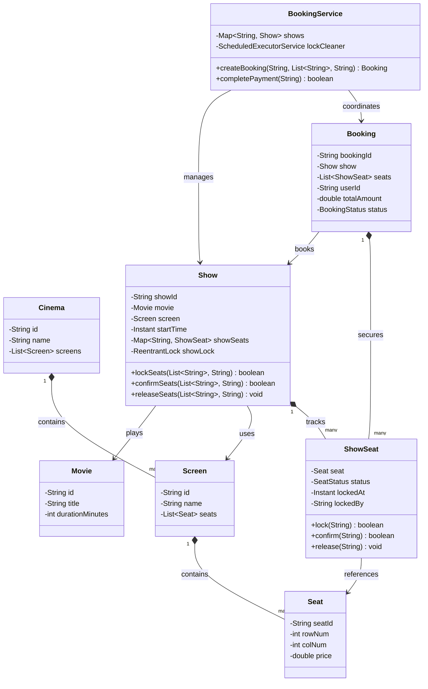
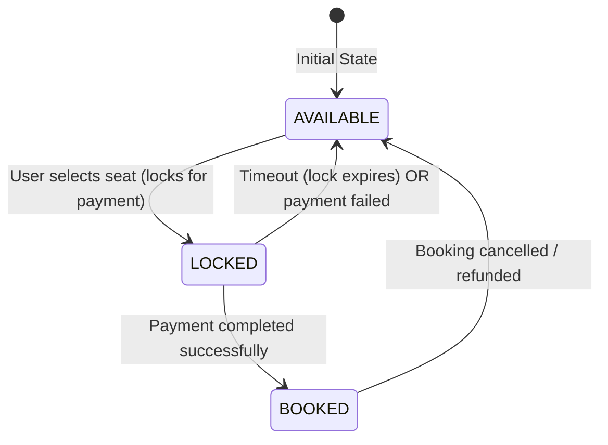

# LLD: Design BookMyShow (Movie Booking System)

## 1. Core System Scope & Requirements

### Functional Requirements
1. **Catalog Browsing:** Users can browse movies by city, cinema, language, and genre.
2. **Cinema & Screens:** Cinemas have multiple screens, and screens show different movies across multiple shows/showtimes daily.
3. **Seat Selection & Locking:** Users can select seats for a specific show. Selected seats are temporarily put into a `LOCKED` state for a configured window (e.g., 5-10 minutes) to allow payment processing.
4. **Booking Confirmation:** Upon successful payment, seats transition from `LOCKED` to `BOOKED`, and a ticket is issued.
5. **Autorelease Timer:** If payment is not completed within the lock window, the locked seats are released back to the `AVAILABLE` pool.
6. **Concurrent Requests:** Multiple users must not be allowed to book/lock the same seats of a show simultaneously.

### Non-Functional Requirements
1. **High Concurrency & Throughput:** The system must handle high traffic volume during peak hours (e.g., blockbuster ticket openings) without double booking.
2. **Transactional Integrity:** Locking and booking must be ACID compliant. Partial failures (booking 2 out of 3 seats) must result in a complete rollback of the selected group.
3. **Low Latency:** High responsiveness for checking seat availability.

---

## 2. Visual Representation (Diagrams)

### UML Class Diagram



### State Transition Diagram of ShowSeat



---

## 3. Violating Design vs. Refactored Design

### The Violating Design (Anti-Pattern)
In a poorly designed movie booking system, seat state is checked and updated dynamically across multiple database connections without proper row or transactional synchronization, risking race conditions and double bookings.

```java
// VIOLATION: Checking and setting state non-atomically. No rollback logic.
class UnsafeBookingService {
    private Map<String, String> seatStatus = new HashMap<>(); // "A1" -> "AVAILABLE"

    public boolean bookSeats(List<String> seatIds) {
        // Step 1: Check availability (Non-atomic check)
        for (String seatId : seatIds) {
            if (!"AVAILABLE".equals(seatStatus.get(seatId))) {
                return false; // Exit, but what if some were already modified?
            }
        }

        // Step 2: Update status (Race condition window here!)
        for (String seatId : seatIds) {
            seatStatus.put(seatId, "BOOKED");
        }
        return true;
    }
}
```

### Why it fails:
1. **No Atomicity (Check-Then-Act Race):** Between checking if all seats are available and updating their status, another thread could execute the exact same block, resulting in both threads believing they successfully booked the seats.
2. **Partial Success Failures:** If one seat in the batch is taken, the transaction should fail completely. The unsafe version above does not restore previously mutated seats back to their original state (lack of rollback).

---

## 4. Production-Ready Java Implementation

Below is a robust, concurrent Movie Booking implementation. It uses `ReentrantLock` per `Show` to ensure atomic reservations, paired with a `ScheduledExecutorService` to automatically expire locks.

```java
import java.time.Duration;
import java.time.Instant;
import java.util.*;
import java.util.concurrent.*;
import java.util.concurrent.locks.ReentrantLock;

enum SeatStatus {
    AVAILABLE, LOCKED, BOOKED
}

enum BookingStatus {
    PENDING, CONFIRMED, EXPIRED, CANCELLED
}

class Seat {
    private final String seatId;
    private final double price;

    public Seat(String seatId, double price) {
        this.seatId = seatId;
        this.price = price;
    }

    public String getSeatId() { return seatId; }
    public double getPrice() { return price; }
}

class ShowSeat {
    private final Seat seat;
    private SeatStatus status;
    private Instant lockedAt;
    private String lockedBy;

    public ShowSeat(Seat seat) {
        this.seat = seat;
        this.status = SeatStatus.AVAILABLE;
    }

    public Seat getSeat() { return seat; }
    public SeatStatus getStatus() { return status; }

    public boolean isLockExpired() {
        if (status != SeatStatus.LOCKED || lockedAt == null) return false;
        return Instant.now().isAfter(lockedAt.plus(Duration.ofSeconds(10))); // 10-second timeout for demo
    }

    public boolean lock(String userId) {
        if (status == SeatStatus.AVAILABLE || (status == SeatStatus.LOCKED && isLockExpired())) {
            this.status = SeatStatus.LOCKED;
            this.lockedAt = Instant.now();
            this.lockedBy = userId;
            return true;
        }
        return false;
    }

    public boolean confirm(String userId) {
        if (status == SeatStatus.LOCKED && userId.equals(lockedBy) && !isLockExpired()) {
            this.status = SeatStatus.BOOKED;
            this.lockedAt = null;
            return true;
        }
        return false;
    }

    public void release() {
        this.status = SeatStatus.AVAILABLE;
        this.lockedAt = null;
        this.lockedBy = null;
    }
}

class Show {
    private final String showId;
    private final String movieTitle;
    private final Map<String, ShowSeat> seatMap;
    private final ReentrantLock showLock = new ReentrantLock();

    public Show(String showId, String movieTitle, List<Seat> physicalSeats) {
        this.showId = showId;
        this.movieTitle = movieTitle;
        this.seatMap = new HashMap<>();
        for (Seat seat : physicalSeats) {
            seatMap.put(seat.getSeatId(), new ShowSeat(seat));
        }
    }

    public String getShowId() { return showId; }
    public String getMovieTitle() { return movieTitle; }

    public boolean lockSeats(List<String> seatIds, String userId) {
        showLock.lock();
        try {
            // Validate all seats are available
            for (String id : seatIds) {
                ShowSeat seat = seatMap.get(id);
                if (seat == null || (seat.getStatus() != SeatStatus.AVAILABLE && !seat.isLockExpired())) {
                    return false; // Fail fast if any seat is unavailable
                }
            }

            // Lock all seats in the list
            for (String id : seatIds) {
                seatMap.get(id).lock(userId);
            }
            return true;
        } finally {
            showLock.unlock();
        }
    }

    public boolean confirmSeats(List<String> seatIds, String userId) {
        showLock.lock();
        try {
            for (String id : seatIds) {
                ShowSeat seat = seatMap.get(id);
                if (seat == null || !seat.confirm(userId)) {
                    return false;
                }
            }
            return true;
        } finally {
            showLock.unlock();
        }
    }

    public void releaseSeats(List<String> seatIds, String userId) {
        showLock.lock();
        try {
            for (String id : seatIds) {
                ShowSeat seat = seatMap.get(id);
                if (seat != null && SeatStatus.LOCKED.equals(seat.getStatus()) && userId.equals(seat.lockedBy)) {
                    seat.release();
                }
            }
        } finally {
            showLock.unlock();
        }
    }

    public List<ShowSeat> getSeats() {
        return new ArrayList<>(seatMap.values());
    }
}

class Booking {
    private final String bookingId;
    private final Show show;
    private final List<String> seatIds;
    private final String userId;
    private BookingStatus status;
    private final double totalAmount;

    public Booking(String bookingId, Show show, List<String> seatIds, String userId, double totalAmount) {
        this.bookingId = bookingId;
        this.show = show;
        this.seatIds = seatIds;
        this.userId = userId;
        this.totalAmount = totalAmount;
        this.status = BookingStatus.PENDING;
    }

    public String getBookingId() { return bookingId; }
    public Show getShow() { return show; }
    public List<String> getSeatIds() { return seatIds; }
    public String getUserId() { return userId; }
    public BookingStatus getStatus() { return status; }
    public void setStatus(BookingStatus status) { this.status = status; }
    public double getTotalAmount() { return totalAmount; }
}

class BookingService {
    private final Map<String, Show> activeShows = new ConcurrentHashMap<>();
    private final Map<String, Booking> bookings = new ConcurrentHashMap<>();
    private final ScheduledExecutorService expiryScheduler = Executors.newScheduledThreadPool(2);

    public void addShow(Show show) {
        activeShows.put(show.getShowId(), show);
    }

    public Booking createBooking(String showId, List<String> seatIds, String userId) {
        Show show = activeShows.get(showId);
        if (show == null) throw new IllegalArgumentException("Show not found");

        // Try to lock the seats
        boolean success = show.lockSeats(seatIds, userId);
        if (!success) {
            throw new IllegalStateException("One or more selected seats are unavailable.");
        }

        // Calculate pricing
        double total = 0;
        for (ShowSeat ss : show.getSeats()) {
            if (seatIds.contains(ss.getSeat().getSeatId())) {
                total += ss.getSeat().getPrice();
            }
        }

        String bookingId = "BK-" + UUID.randomUUID().toString().substring(0, 8).toUpperCase();
        Booking booking = new Booking(bookingId, show, seatIds, userId, total);
        bookings.put(bookingId, booking);

        // Schedule auto-expiry release
        expiryScheduler.schedule(() -> {
            Booking activeB = bookings.get(bookingId);
            if (activeB != null && activeB.getStatus() == BookingStatus.PENDING) {
                System.out.println("Payment window expired for booking " + bookingId + ". Releasing seats...");
                activeB.setStatus(BookingStatus.EXPIRED);
                show.releaseSeats(seatIds, userId);
            }
        }, 10, TimeUnit.SECONDS); // Expire after 10 seconds for testing

        return booking;
    }

    public boolean completePayment(String bookingId) {
        Booking booking = bookings.get(bookingId);
        if (booking == null || booking.getStatus() != BookingStatus.PENDING) {
            return false;
        }

        boolean success = booking.getShow().confirmSeats(booking.getSeatIds(), booking.getUserId());
        if (success) {
            booking.setStatus(BookingStatus.CONFIRMED);
            return true;
        } else {
            booking.setStatus(BookingStatus.EXPIRED);
            return false;
        }
    }

    public void shutdown() {
        expiryScheduler.shutdown();
    }
}

// --- Client Driver ---
public class Main {
    public static void main(String[] args) throws InterruptedException {
        System.out.println("Initializing Booking System...");

        List<Seat> physicalSeats = Arrays.asList(
            new Seat("A1", 10.0), new Seat("A2", 10.0),
            new Seat("B1", 15.0), new Seat("B2", 15.0)
        );

        Show show = new Show("SHOW-99", "Inception 3D", physicalSeats);
        BookingService service = new BookingService();
        service.addShow(show);

        // Scenario 1: User A locks A1, A2 successfully
        System.out.println("\n--- Scenario 1: User A locks seats ---");
        Booking b1 = service.createBooking("SHOW-99", Arrays.asList("A1", "A2"), "UserA");
        System.out.println("Booking created for UserA: " + b1.getBookingId() + " Status: " + b1.getStatus());

        // Scenario 2: User B tries to lock A1, A2 concurrently -> Should fail
        System.out.println("\n--- Scenario 2: User B tries to book locked seats ---");
        try {
            service.createBooking("SHOW-99", Arrays.asList("A1", "B1"), "UserB");
        } catch (IllegalStateException e) {
            System.out.println("System successfully rejected UserB request: " + e.getMessage());
        }

        // Scenario 3: User A finishes payment
        System.out.println("\n--- Scenario 3: User A completes payment ---");
        boolean paid = service.completePayment(b1.getBookingId());
        System.out.println("Payment Success? " + paid + " | Booking Final Status: " + b1.getStatus());

        // Scenario 4: User B books B1, B2, but fails to pay (test expiration)
        System.out.println("\n--- Scenario 4: User B locks B1, B2 and lets it expire ---");
        Booking b2 = service.createBooking("SHOW-99", Arrays.asList("B1", "B2"), "UserB");
        System.out.println("Booking created for UserB: " + b2.getBookingId());

        // Wait 12 seconds to trigger scheduled expiration
        Thread.sleep(12000);

        System.out.println("Seat B1 status now (re-available)?");
        for (ShowSeat ss : show.getSeats()) {
            if (ss.getSeat().getSeatId().equals("B1")) {
                System.out.println("B1 Status is: " + ss.getStatus());
            }
        }

        service.shutdown();
    }
}
```

---

## 5. Edge Cases & Concurrency Handling

1. **Simultaneous Multi-Seat Selection (Conflict Overlap):** If User A requests seats `[A1, A2]` and User B requests `[A2, A3]` concurrently, the locking logic checks all seats in the requested list under the unified `showLock`. Since `A2` is overlapping, only one transaction can acquire `showLock`, complete validation, and transition the status. The other user is safely rejected.
2. **Timer Expiry Race Condition:** What if the payment gateway completes payment at the exact millisecond the scheduled clean-up job tries to expire the booking? We handle this by verifying the seat's status inside `confirmSeats` using `confirm(userId)` which confirms that status is still `LOCKED`. If the clean-up job executes first, it sets status back to `AVAILABLE`. The payment confirmation step will then fail to transition the seat, allowing the system to cancel the transaction and trigger an automatic refund.
3. **Database Concurrency in Real-World SQL Systems:** In real databases, we use Pessimistic locking. To query and lock seats, we execute:
   `SELECT * FROM show_seats WHERE show_id = :showId AND seat_id IN (:seatIds) FOR UPDATE;`
   This prevents database level race conditions.

---

## 6. Comprehensive Interview Q&A

### Q1: How do you scale this system to handle millions of page views when blockbusters are launched?
**A:** We apply a CQRS (Command Query Responsibility Segregation) pattern. The catalog browsing (read path) is heavily cached using Redis. Dynamic showseat maps can be held in Redis using bitmasks or hash sets. Writes (bookings) are redirected to a seat allocation microservice. Under massive spikes, bookings are queued using Kafka/RabbitMQ to rate-limit writes to the relational database.

### Q2: What happens if the booking service crashes? How do we recover the active locks?
**A:** If we rely solely on in-memory timers, a service crash would cause us to lose track of locked seats, leaving them locked forever or orphaned. To prevent this, we persist the lock state in the database with a `locked_until` timestamp or use Redis with set TTLs (`SET seat_lock:show_id:seat_id user_id EX 600 NX`). A background cron sweep restores any expired seats whose reservations did not complete.

### Q3: How do we prevent users from choosing seats scattered apart if the cinema demands adjacent seats?
**A:** We add validation rules to the `BookingService` before invoking `show.lockSeats()`. The validator reviews the indices (row and column numbers) of the requested seats and flags a violation if they leave single-seat gaps between already booked seats.

### Q4: How would you handle dynamic cinema layouts (e.g. IMAX vs Standard layouts)?
**A:** The cinema layout is decoupled by mapping a `Show` to a specific `Screen`. A screen contains a list of generic physical `Seat` objects with coordinates (`row`, `col`) and type properties (`VIP`, `IMAX`, `Regular`). The pricing strategy reads the seat type to calculate the correct base cost.
