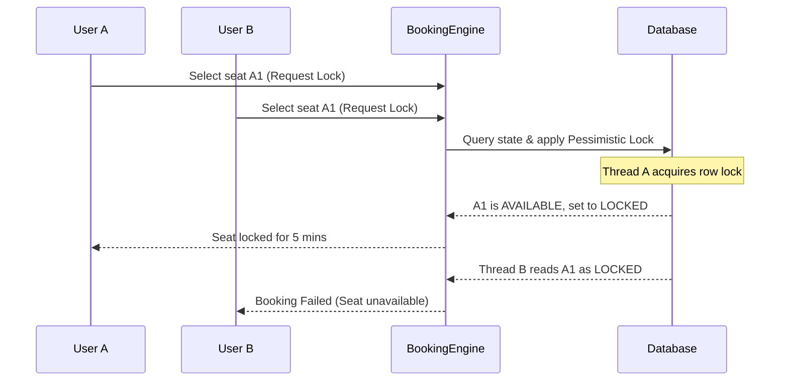

# LLD: Design BookMyShow (Movie Booking System)

This design focuses on concurrency, booking state machines, and temporal seat locking (releasing unconfirmed seats after 5-10 minutes).

---

## Requirements
1. **Multi-Cinema & Screen Support:** Cinema halls have multiple screens showing different movies.
2. **Showtime Management:** Dynamic booking slots.
3. **Seat State Management:** Seats can be `AVAILABLE`, `LOCKED` (temp reservation), or `BOOKED`.
4. **Concurrency Handling:** Prevent duplicate seat booking.
5. **Expiry Mechanism:** Release `LOCKED` seats back to `AVAILABLE` if payment fails or is not completed within 5 minutes.

---

## Concurrency Sequence



---

## Core Java Classes (Simplified Model)

```java
import java.time.Instant;
import java.util.HashMap;
import java.util.List;
import java.util.Map;

enum SeatStatus { AVAILABLE, LOCKED, BOOKED }

class Seat {
    private final String id;
    private final double price;
    public Seat(String id, double price) { this.id = id; this.price = price; }
    public String getId() { return id; }
    public double getPrice() { return price; }
}

class ShowSeat {
    private final Seat seat;
    private SeatStatus status = SeatStatus.AVAILABLE;
    private Instant lockedAt;
    private String lockedByUserId;

    public ShowSeat(Seat seat) { this.seat = seat; }

    public synchronized boolean lockSeat(String userId) {
        if (status == SeatStatus.AVAILABLE || (status == SeatStatus.LOCKED && isLockExpired())) {
            this.status = SeatStatus.LOCKED;
            this.lockedAt = Instant.now();
            this.lockedByUserId = userId;
            return true;
        }
        return false;
    }

    public synchronized boolean confirmBooking(String userId) {
        if (status == SeatStatus.LOCKED && userId.equals(lockedByUserId) && !isLockExpired()) {
            this.status = SeatStatus.BOOKED;
            return true;
        }
        return false;
    }

    public synchronized void releaseSeat() {
        this.status = SeatStatus.AVAILABLE;
        this.lockedAt = null;
        this.lockedByUserId = null;
    }

    private boolean isLockExpired() {
        if (lockedAt == null) return true;
        return Instant.now().isAfter(lockedAt.plusSeconds(300)); // 5 minutes lock
    }
}

class Show {
    private final String showId;
    private final List<ShowSeat> showSeats;

    public Show(String showId, List<ShowSeat> seats) {
        this.showId = showId;
        this.showSeats = seats;
    }

    public List<ShowSeat> getShowSeats() { return showSeats; }
}

class BookingService {
    private final Map<String, Show> activeShows = new HashMap<>();

    public boolean reserveSeats(String showId, List<String> seatIds, String userId) {
        Show show = activeShows.get(showId);
        // Step 1: Collect show seats matching IDs
        // Step 2: Attempt locking all seats. Rollback if any single lock fails.
        return true; 
    }
}
```

---

## Interview Q&A Corner

> [!WARNING]
> **Q: How do you handle database-level locks for hot seats?**
> A: 
> * **Optimistic Locking:** Use version numbers on the `ShowSeat` database row. If version changes before transaction commits, fail/retry.
> * **Pessimistic Locking (Preferred here):** Execute query with `SELECT * FROM show_seat WHERE id IN (...) FOR UPDATE;`. This blocks concurrent transactions trying to lock the exact same seats.
>
> **Q: How does the system handle lock expiration in real production?**
> A: Instead of synchronous in-memory checks, use an **Active TTL / Event Scheduler** (e.g., Redis Key-Space Notifications or RabbitMQ Delayed Queues). When a seat is locked, publish a delayed message to clean up after 5 minutes if booking status has not transitioned to `BOOKED`.
