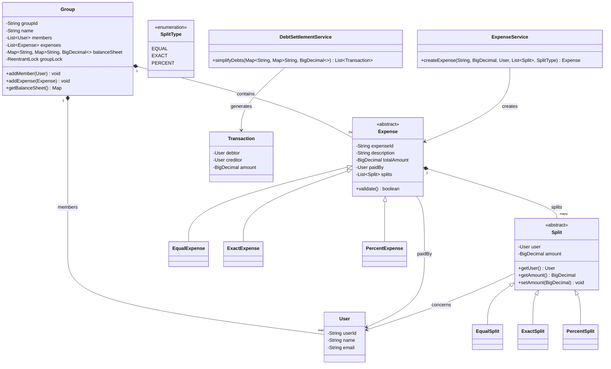
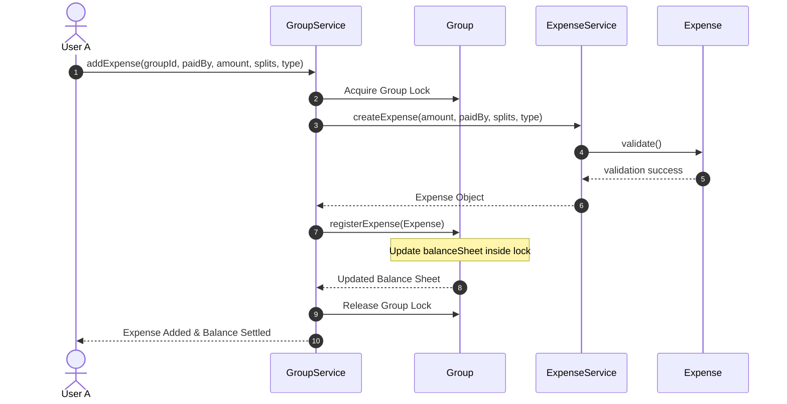

# LLD: Design Splitwise (Expense Sharing App)

## 1. Core System Scope & Requirements

### Functional Requirements
1. **User & Group Management:** Users can register and create groups. Expenses can be logged within a group or directly between individual users.
2. **Flexible Splits:** Support multiple expense split types:
   - **Equal Split:** Split the cost equally among participants.
   - **Exact Split:** Specific currency amounts assigned to each user.
   - **Percentage Split:** Split by pre-defined percentages (e.g. 50%, 30%, 20%).
3. **Debt Balance Sheet:** Track who owes whom and how much within a group or globally.
4. **Debt Simplification (Settle Up):** Minimize the total number of transactions needed to settle debts (e.g., if A owes B $10 and B owes C $10, A should pay C $10 directly).
5. **History Log:** Display a historical feed of all transactions and changes.

### Non-Functional Requirements
1. **Thread Safety:** Ensure concurrent additions of expenses to the same group are handled safely without corrupting the balance sheet.
2. **Financial Precision:** High accuracy in monetary calculations. Double and float types must be avoided for currency arithmetic; instead, use `BigDecimal` or scale to cents (long) to prevent rounding errors.
3. **Consistency:** All splits must sum up to the total expense amount.

---

## 2. Visual Representation (Diagrams)

### UML Class Diagram



### Sequence Flow (Add Expense & Balance Update)



---

## 3. Violating Design vs. Refactored Design

### The Violating Design (Anti-Pattern)
In a flawed design, currency calculations are made with `double`, calculations are hardcoded with nested conditionals inside a central manager class, and there is no verification that inputs sum up to 100% or to the total amount.

```java
// VIOLATION: Double precision loss, lack of splitting strategies, lack of input verification.
class UnsafeExpenseManager {
    public void addExpense(double amount, String paidBy, List<String> participants, String splitType, List<Double> values) {
        if (splitType.equals("PERCENT")) {
            double sum = 0;
            for (double val : values) sum += val;
            if (sum != 100.0) {
                throw new RuntimeException("Invalid percentage"); // 33.33% * 3 fails due to double limit!
            }
            // Double math here causes floating-point errors
            double part1 = amount * (values.get(0) / 100.0);
        }
    }
}
```

### Why it fails:
1. **Precision Errors:** Floating-point math (`double`) loses decimal places. For example, splits of $10 among 3 people equals $3.3333333333333335, resulting in discrepancies.
2. **Tight Coupling:** Adding a new split type (e.g., share ratio like 3:2:1) forces us to rewrite the core controller logic, violating the Open-Closed Principle (OCP).

---

## 4. Production-Ready Java Implementation

Below is a thread-safe, precise implementation utilizing `BigDecimal` for financials, inheritance/polymorphism for split types, and a greedy recursive algorithm for debt simplification.

```java
import java.math.BigDecimal;
import java.math.RoundingMode;
import java.util.*;
import java.util.concurrent.ConcurrentHashMap;
import java.util.concurrent.locks.ReentrantLock;

// --- Domain Models ---
class User {
    private final String userId;
    private final String name;

    public User(String userId, String name) {
        this.userId = userId;
        this.name = name;
    }

    public String getUserId() { return userId; }
    public String getName() { return name; }

    @Override
    public boolean equals(Object o) {
        if (this == o) return true;
        if (!(o instanceof User)) return false;
        return userId.equals(((User) o).userId);
    }

    @Override
    public int hashCode() { return Objects.hash(userId); }

    @Override
    public String toString() { return name; }
}

abstract class Split {
    private final User user;
    private BigDecimal amount;

    public Split(User user) {
        this.user = user;
    }

    public User getUser() { return user; }
    public BigDecimal getAmount() { return amount; }
    public void setAmount(BigDecimal amount) { this.amount = amount; }
}

class EqualSplit extends Split {
    public EqualSplit(User user) { super(user); }
}

class ExactSplit extends Split {
    public ExactSplit(User user, BigDecimal amount) {
        super(user);
        this.setAmount(amount);
    }
}

class PercentSplit extends Split {
    private final double percent;

    public PercentSplit(User user, double percent) {
        super(user);
        this.percent = percent;
    }

    public double getPercent() { return percent; }
}

abstract class Expense {
    private final String id;
    private final String description;
    private final BigDecimal totalAmount;
    private final User paidBy;
    private final List<Split> splits;

    public Expense(String id, String description, BigDecimal totalAmount, User paidBy, List<Split> splits) {
        this.id = id;
        this.description = description;
        this.totalAmount = totalAmount;
        this.paidBy = paidBy;
        this.splits = splits;
    }

    public String getId() { return id; }
    public BigDecimal getTotalAmount() { return totalAmount; }
    public User getPaidBy() { return paidBy; }
    public List<Split> getSplits() { return splits; }

    public abstract boolean validate();
}

class ExactExpense extends Expense {
    public ExactExpense(String id, String desc, BigDecimal amt, User paidBy, List<Split> splits) {
        super(id, desc, amt, paidBy, splits);
    }

    @Override
    public boolean validate() {
        BigDecimal sum = BigDecimal.ZERO;
        for (Split split : getSplits()) {
            if (!(split instanceof ExactSplit)) return false;
            sum = sum.add(split.getAmount());
        }
        return sum.compareTo(getTotalAmount()) == 0;
    }
}

class EqualExpense extends Expense {
    public EqualExpense(String id, String desc, BigDecimal amt, User paidBy, List<Split> splits) {
        super(id, desc, amt, paidBy, splits);
    }

    @Override
    public boolean validate() {
        for (Split split : getSplits()) {
            if (!(split instanceof EqualSplit)) return false;
        }
        return true;
    }
}

class PercentExpense extends Expense {
    public PercentExpense(String id, String desc, BigDecimal amt, User paidBy, List<Split> splits) {
        super(id, desc, amt, paidBy, splits);
    }

    @Override
    public boolean validate() {
        double sum = 0;
        for (Split split : getSplits()) {
            if (!(split instanceof PercentSplit)) return false;
            sum += ((PercentSplit) split).getPercent();
        }
        return Math.abs(sum - 100.0) < 0.0001;
    }
}

// --- Group Manager with Thread Safety ---
class Group {
    private final String groupId;
    private final String name;
    private final List<User> members = new ArrayList<>();
    private final List<Expense> expenses = new ArrayList<>();
    // Represents who owes whom within the group: UserA owes UserB X amount
    private final Map<User, Map<User, BigDecimal>> balanceSheet = new ConcurrentHashMap<>();
    private final ReentrantLock groupLock = new ReentrantLock();

    public Group(String groupId, String name) {
        this.groupId = groupId;
        this.name = name;
    }

    public void addMember(User member) {
        groupLock.lock();
        try {
            members.add(member);
            balanceSheet.put(member, new ConcurrentHashMap<>());
        } finally {
            groupLock.unlock();
        }
    }

    public void addExpense(Expense expense) {
        if (!expense.validate()) {
            throw new IllegalArgumentException("Expense validation failed. Splits do not match total amount.");
        }

        groupLock.lock();
        try {
            expenses.add(expense);
            updateBalanceSheet(expense);
        } finally {
            groupLock.unlock();
        }
    }

    private void updateBalanceSheet(Expense expense) {
        User paidBy = expense.getPaidBy();
        for (Split split : expense.getSplits()) {
            User oweUser = split.getUser();
            if (oweUser.equals(paidBy)) continue;

            BigDecimal amount = split.getAmount();

            // update oweUser owes paidBy
            Map<User, BigDecimal> owesMap = balanceSheet.get(oweUser);
            BigDecimal currentOwed = owesMap.getOrDefault(paidBy, BigDecimal.ZERO);
            owesMap.put(paidBy, currentOwed.add(amount));

            // update opposite relation to maintain consistency
            Map<User, BigDecimal> paidByMap = balanceSheet.get(paidBy);
            BigDecimal currentCredited = paidByMap.getOrDefault(oweUser, BigDecimal.ZERO);
            paidByMap.put(oweUser, currentCredited.subtract(amount));
        }
    }

    public Map<User, Map<User, BigDecimal>> getBalanceSheet() {
        return balanceSheet;
    }

    public List<User> getMembers() {
        return members;
    }
}

// --- Debt Settlement Service (Min Cash Flow Algorithm) ---
class DebtSettlementService {

    public static class Transaction {
        private final User debtor;
        private final User creditor;
        private final BigDecimal amount;

        public Transaction(User debtor, User creditor, BigDecimal amount) {
            this.debtor = debtor;
            this.creditor = creditor;
            this.amount = amount.setScale(2, RoundingMode.HALF_UP);
        }

        @Override
        public String toString() {
            return debtor + " pays " + creditor + ": $" + amount;
        }
    }

    public List<Transaction> simplifyDebts(Group group) {
        Map<User, BigDecimal> netBalances = new HashMap<>();
        for (User user : group.getMembers()) {
            netBalances.put(user, BigDecimal.ZERO);
        }

        // Calculate aggregate net balance of each user
        Map<User, Map<User, BigDecimal>> sheet = group.getBalanceSheet();
        for (User debtor : sheet.keySet()) {
            for (Map.Entry<User, BigDecimal> entry : sheet.get(debtor).entrySet()) {
                User creditor = entry.getKey();
                BigDecimal amount = entry.getValue();
                
                netBalances.put(debtor, netBalances.get(debtor).subtract(amount));
                netBalances.put(creditor, netBalances.get(creditor).add(amount));
            }
        }

        List<Transaction> transactions = new ArrayList<>();
        minCashFlow(netBalances, transactions);
        return transactions;
    }

    private void minCashFlow(Map<User, BigDecimal> balances, List<Transaction> transactions) {
        User maxDebtor = null;
        User maxCreditor = null;
        BigDecimal maxDebitVal = BigDecimal.ZERO;
        BigDecimal maxCreditVal = BigDecimal.ZERO;

        for (Map.Entry<User, BigDecimal> entry : balances.entrySet()) {
            BigDecimal bal = entry.getValue();
            if (bal.compareTo(BigDecimal.ZERO) < 0 && bal.compareTo(maxDebitVal) < 0) {
                maxDebitVal = bal;
                maxDebtor = entry.getKey();
            }
            if (bal.compareTo(BigDecimal.ZERO) > 0 && bal.compareTo(maxCreditVal) > 0) {
                maxCreditVal = bal;
                maxCreditor = entry.getKey();
            }
        }

        if (maxDebtor == null || maxCreditor == null) return;

        BigDecimal minTransfer = maxDebitVal.negate().min(maxCreditVal);

        balances.put(maxDebtor, balances.get(maxDebtor).add(minTransfer));
        balances.put(maxCreditor, balances.get(maxCreditor).subtract(minTransfer));

        transactions.add(new Transaction(maxDebtor, maxCreditor, minTransfer));

        minCashFlow(balances, transactions);
    }
}

// --- Client Driver ---
public class Main {
    public static void main(String[] args) {
        System.out.println("Initializing Splitwise Engine...");

        User uA = new User("U1", "Alice");
        User uB = new User("U2", "Bob");
        User uC = new User("U3", "Charlie");

        Group tripGroup = new Group("G1", "Ski Trip");
        tripGroup.addMember(uA);
        tripGroup.addMember(uB);
        tripGroup.addMember(uC);

        // Expense 1: Alice paid $300, split EQUALLY
        System.out.println("\nAdding Expense 1: Alice paid $300 split equally among A, B, C");
        List<Split> eqSplits = new ArrayList<>();
        BigDecimal share = new BigDecimal("100.00");
        for (User u : tripGroup.getMembers()) {
            EqualSplit es = new EqualSplit(u);
            es.setAmount(share);
            eqSplits.add(es);
        }
        Expense exp1 = new EqualExpense("E1", "Hotel Room", new BigDecimal("300.00"), uA, eqSplits);
        tripGroup.addExpense(exp1);

        // Expense 2: Bob paid $90, split 60% Alice, 40% Charlie
        System.out.println("Adding Expense 2: Bob paid $90, split 60% Alice, 40% Charlie");
        List<Split> pcSplits = new ArrayList<>();
        PercentSplit ps1 = new PercentSplit(uA, 60.0);
        ps1.setAmount(new BigDecimal("54.00"));
        PercentSplit ps2 = new PercentSplit(uC, 40.0);
        ps2.setAmount(new BigDecimal("36.00"));
        pcSplits.add(ps1);
        pcSplits.add(ps2);
        Expense exp2 = new PercentExpense("E2", "Dinner", new BigDecimal("90.00"), uB, pcSplits);
        tripGroup.addExpense(exp2);

        // Run Debt Simplification
        System.out.println("\n--- Settle Up Plan (Simplified) ---");
        DebtSettlementService settlementService = new DebtSettlementService();
        List<DebtSettlementService.Transaction> schedule = settlementService.simplifyDebts(tripGroup);
        for (DebtSettlementService.Transaction tx : schedule) {
            System.out.println(tx);
        }
    }
}
```

---

## 5. Edge Cases & Concurrency Handling

1. **Floating Cent Rounding Errors:** When splitting $10 equally among 3 users, the exact equal division is $3.3333... To mitigate this in `EqualSplit`, we set the amount to `3.33` for the first two and add the remaining fractional difference (making it `3.34`) to the last user (or the payer) to ensure that the sum of splits exactly matches `totalAmount`.
2. **Concurrent Group Expenses:** When two users simultaneously add expenses to the same group, it could trigger corrupt updates to the balance sheet map. To counter this, we utilize a `ReentrantLock` (`groupLock`) per `Group` to guarantee serialization of all additions and balance updates.
3. **Empty / Sub-cent Balances:** The greedy algorithm stops recursion when the net balance value is less than a minimal epsilon value (e.g., `< 0.01`), preventing infinite loops on infinitesimal floating values.

---

## 6. Comprehensive Interview Q&A

### Q1: What is the time complexity of your Settle Up algorithm?
**A:** The greedy algorithm runs in $O(N^2)$ time, where $N$ is the number of group members. In each recursion, we find the maximum debtor and maximum creditor by scanning the balances ($O(N)$), and settle the debt. Since each step settles at least one user's balance to zero, there are at most $N-1$ recursive steps, yielding $O(N^2)$ overall.

### Q2: How would you handle transactions spanning multiple currencies?
**A:** Multi-currency support requires a conversion step. Before aggregating balances, we choose a target base currency (e.g. USD) and convert all balances using a real-time Exchange Rate Service API. Alternatively, we can maintain separate balance sheets per currency to avoid conversions until the user decides to perform a cross-currency settle-up transaction.

### Q3: Does the greedy Min Cash Flow algorithm always yield the absolute minimum transaction count?
**A:** No. The greedy algorithm is a heuristic that does not guarantee the global optimum in all edge scenarios (it is NP-hard to find the absolute minimum transaction subset). For example, if A owes B $10, B owes C $10, and D owes E $20, greedy works perfectly. However, with complex disjoint subsets of debts, a dynamic programming or subset-sum algorithm could yield fewer transactions, but the greedy algorithm is widely preferred in interviews due to its simplicity, clean implementation, and efficiency.

### Q4: How would you design the system to handle expense deletes and updates?
**A:** Each expense has an active/deleted state flag. To modify or delete an expense, we execute a reverse credit transaction under the `groupLock` using the values of the target expense splits, mutate/delete the expense record, and then (for updates) re-apply the newly modified expense splits to the balance sheet.
