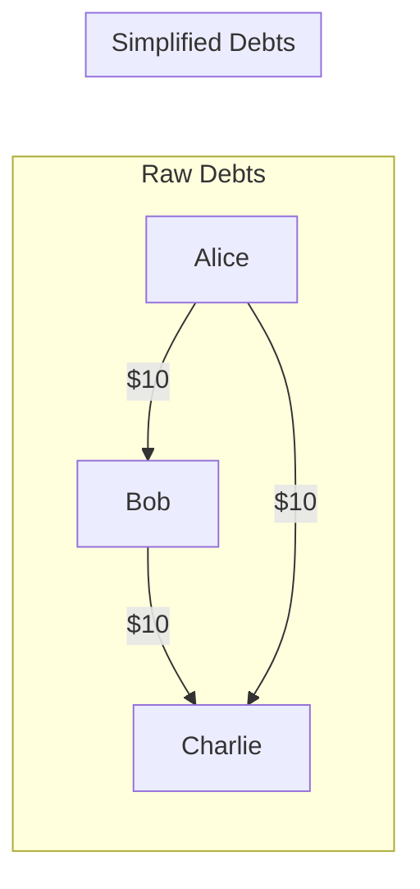

# LLD: Design Splitwise (Expense Sharing App)

This system manages user groups, records expenses, splits balances (Equal, Percent, Exact), and simplifies net balances using greedy algorithms.

---

## Requirements
1. **User & Group Management:** Users can form groups.
2. **Expense Types:** Equal split, exact split, or percentage split.
3. **Debt Balance Sheet:** Track who owes whom and how much.
4. **Min Cash Flow Algorithm (Debt Simplification):** Reduce the total transactions required to settle up.

---

## Debt Simplification Algorithm
The core problem is: Given a set of debts, find the minimum number of transactions needed to resolve all debts.



### Algorithm Design (Greedy Min Cash Flow)
1. Calculate the net balance of each user: `Net = (Total received) - (Total paid)`.
2. Separate users into creditors (positive net) and debtors (negative net).
3. Greedily match the largest debtor with the largest creditor. Settle the amount, update balances, and repeat recursively.

---

## Core Java Implementation

```java
import java.util.*;

enum SplitType { EQUAL, EXACT, PERCENT }

abstract class Split {
    private final User user;
    protected double amount;

    public Split(User user) { this.user = user; }
    public User getUser() { return user; }
    public double getAmount() { return amount; }
    public void setAmount(double amount) { this.amount = amount; }
}

class EqualSplit extends Split { public EqualSplit(User u) { super(u); } }
class ExactSplit extends Split {
    public ExactSplit(User u, double amount) { super(u); this.amount = amount; }
}

class User {
    private final String id;
    private final String name;
    public User(String id, String name) { this.id = id; this.name = name; }
    public String getId() { return id; }
}

class Expense {
    private final String id;
    private final User paidBy;
    private final double amount;
    private final List<Split> splits;

    public Expense(String id, User paidBy, double amount, List<Split> splits) {
        this.id = id;
        this.paidBy = paidBy;
        this.amount = amount;
        this.splits = splits;
    }
}

class BillService {
    // Greedy Settle Debt
    public void settleDebts(Map<User, Double> balances) {
        List<User> users = new ArrayList<>(balances.keySet());
        double[] amount = new double[users.size()];
        for (int i = 0; i < users.size(); i++) {
            amount[i] = balances.get(users.get(i));
        }
        minCashFlow(amount, users);
    }

    private void minCashFlow(double[] amount, List<User> users) {
        int maxDebitIdx = getMinIndex(amount);
        int maxCreditIdx = getMaxIndex(amount);

        if (amount[maxDebitIdx] == 0 && amount[maxCreditIdx] == 0) return;

        double min = Math.min(-amount[maxDebitIdx], amount[maxCreditIdx]);
        amount[maxDebitIdx] += min;
        amount[maxCreditIdx] -= min;

        System.out.println(users.get(maxDebitIdx).getId() + " pays " + min + " to " + users.get(maxCreditIdx).getId());

        minCashFlow(amount, users);
    }

    private int getMaxIndex(double[] arr) {
        int max = 0;
        for (int i = 1; i < arr.length; i++) if (arr[i] > arr[max]) max = i;
        return max;
    }

    private int getMinIndex(double[] arr) {
        int min = 0;
        for (int i = 1; i < arr.length; i++) if (arr[i] < arr[min]) min = i;
        return min;
    }
}
```

---

## Interview Q&A Corner

> [!IMPORTANT]
> **Q: What is the time complexity of the Min Cash Flow algorithm?**
> A: It is $O(N^2)$ in the worst-case, where $N$ is the number of users. We search for the maximum creditor and debtor in each step and run this up to $N-1$ times.
>
> **Q: How does Splitwise validate percentage splits?**
> A: Inside the percentage-split validator, loop through all splits and ensure the sum of percentages exactly equals $100.0$. Precision errors (e.g., $33.33 \times 3 = 99.99$) must be caught, and the remaining cents should be dynamically assigned to the payer or first split member to avoid accounting discrepancies.
