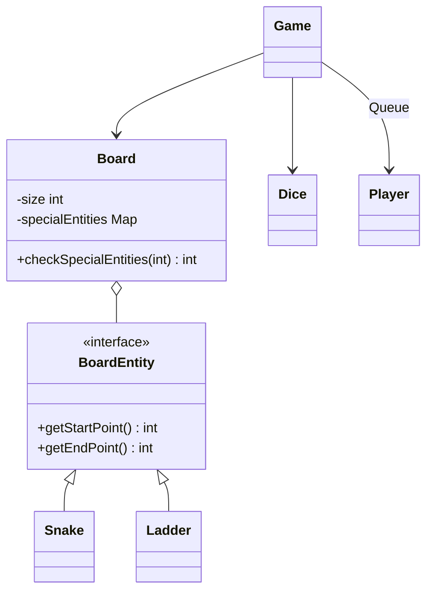

# LLD: Design a Snake and Ladder Game

This is a structural object design problem representing players, boards, dice, board entities (snakes/ladders), and the orchestration loop.

---

## Requirements
1. **Board Grid:** Custom dimensions (usually 10x10).
2. **Snakes & Ladders:** Snakes pull players down; ladders push players up.
3. **Dice Control:** Support 1 or more dice. Player must roll a dice on their turn.
4. **Player Queue:** Multi-player support (2+). Turn-based processing.
5. **Win Condition:** Players must land exactly on the last cell (e.g. 100) to win.

---

## Class Diagram



---

## Java Implementation

```java
import java.util.*;

interface BoardEntity {
    int getStartPoint();
    int getEndPoint();
}

class Snake implements BoardEntity {
    private final int head;
    private final int tail;
    public Snake(int head, int tail) { this.head = head; this.tail = tail; }
    public int getStartPoint() { return head; }
    public int getEndPoint() { return tail; }
}

class Ladder implements BoardEntity {
    private final int foot;
    private final int top;
    public Ladder(int foot, int top) { this.foot = foot; this.top = top; }
    public int getStartPoint() { return foot; }
    public int getEndPoint() { return top; }
}

class Player {
    private final String name;
    private int position = 0;

    public Player(String name) { this.name = name; }
    public String getName() { return name; }
    public int getPosition() { return position; }
    public void setPosition(int pos) { this.position = pos; }
}

class Dice {
    private final int diceCount;
    private final Random random = new Random();

    public Dice(int count) { this.diceCount = count; }
    public int roll() {
        int total = 0;
        for (int i = 0; i < diceCount; i++) {
            total += random.nextInt(6) + 1;
        }
        return total;
    }
}

class Board {
    private final int size;
    private final Map<Integer, BoardEntity> entities = new HashMap<>();

    public Board(int size) { this.size = size; }
    public void addEntity(BoardEntity entity) {
        entities.put(entity.getStartPoint(), entity);
    }

    public int getNewPosition(int currentPosition) {
        if (entities.containsKey(currentPosition)) {
            BoardEntity entity = entities.get(currentPosition);
            System.out.println("Encountered special cell at " + currentPosition + " -> Moving to " + entity.getEndPoint());
            return entity.getEndPoint();
        }
        return currentPosition;
    }
    public int getSize() { return size; }
}

class Game {
    private final Board board;
    private final Dice dice;
    private final Queue<Player> players = new LinkedList<>();
    private Player winner;

    public Game(Board board, Dice dice, List<Player> playerList) {
        this.board = board;
        this.dice = dice;
        this.players.addAll(playerList);
    }

    public void start() {
        while (winner == null) {
            Player currentPlayer = players.poll();
            int roll = dice.roll();
            int nextPosition = currentPlayer.getPosition() + roll;

            if (nextPosition <= board.getSize()) {
                nextPosition = board.getNewPosition(nextPosition);
                currentPlayer.setPosition(nextPosition);
                System.out.println(currentPlayer.getName() + " rolled a " + roll + " and moved to " + nextPosition);

                if (nextPosition == board.getSize()) {
                    winner = currentPlayer;
                    System.out.println("Winner is: " + winner.getName());
                    break;
                }
            } else {
                System.out.println(currentPlayer.getName() + " rolled a " + roll + " but needs exact move to land on " + board.getSize());
            }

            players.offer(currentPlayer); // Put player back in queue for next round
        }
    }
}
```

---

## Interview Q&A Corner

> [!NOTE]
> **Q: How would you scale the game if rules changed to support "roll a 6 gets another turn"?**
> A: Modify the turn processing in the `Game.start()` loop. If `roll == 6`, do not poll the player queue. Allow the same player to roll again, keeping track of consecutive 6s (usually 3 consecutive 6s cancels the turns and resets/skips).
