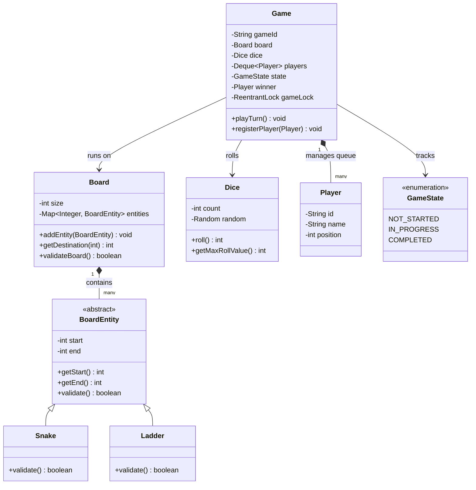

# LLD: Design a Snake and Ladder Game

## 1. Core System Scope & Requirements

### Functional Requirements
1. **Dynamic Board Setup:** The board can be of customizable sizes (e.g., $N \times N$, default is $10 \times 10 = 100$ cells).
2. **Board Entities (Snakes & Ladders):**
   - **Snake:** Has a head and a tail. If a player lands on the head, they slide down to the tail.
   - **Ladder:** Has a foot and a top. If a player lands on the foot, they climb up to the top.
3. **Turn-based Execution:** Multiple players can register. The game runs in a round-robin order using a turn queue.
4. **Dice Mechanics:** Support rolling one or more standard 6-sided dice.
5. **Win Condition:** A player wins by landing exactly on the final cell (e.g., 100). If a dice roll exceeds the remaining cells, the move is skipped.
6. **Custom Rules support:** 
   - Rolling a maximum value (e.g., 6) grants an extra turn, up to a maximum of 3 consecutive rolls (after which all 3 rolls are discarded and the turn ends).

### Non-Functional Requirements
1. **Game Lobby Scalability:** The server must host multiple concurrent game sessions. Session states must be isolated and thread-safe.
2. **Board Validity Check:** The system must validate the board layout during generation to prevent infinite loops (e.g., a snake head at a ladder's top, or direct cycles between entities).

---

## 2. Visual Representation (Diagrams)

### UML Class Diagram



### Game Play Turn Sequence

```mermaid
sequenceDiagram
    autonumber
    participant Loop as Game Engine
    participant G as Game Object
    participant P as Active Player
    participant D as Dice
    participant B as Board

    loop Until State is COMPLETED
        Loop->>G: playTurn()
        G->>G: Retrieve active player from Deque
        G->>D: roll()
        D-->>G: rollValue (e.g., 5)
        
        alt Next Position <= Board Size
            G->>B: getDestination(currPosition + rollValue)
            B->>B: Resolve Snakes/Ladders recursively
            B-->>G: finalPosition
            G->>P: setPosition(finalPosition)
            
            alt finalPosition == Board Size
                G->>G: Set Winner & transition state to COMPLETED
            end
        else Roll Exceeds Board Size
            Note over G: Skip Move (Stay at current position)
        end
        
        G->>G: Re-enqueue Player to end of Deque
    end
```

---

## 3. Violating Design vs. Refactored Design

### The Violating Design (Anti-Pattern)
In a fragile implementation, the board navigation, entity logic, and game loop are nested within a single monolithic class. Board elements are stored as basic integer arrays, which makes checking for loops impossible and limits extension of the rules.

```java
// VIOLATION: Giant class, hardcoded properties, lack of cycle validation, coupled rule checking
class BadSnakeGame {
    int[] board = new int[101]; // board[i] contains destination if snake/ladder, else 0
    Queue<String> players = new LinkedList<>();

    public void play() {
        while(true) {
            String p = players.poll();
            int roll = new Random().nextInt(6) + 1;
            int next = board[roll]; // Directly jumping without validation
            if (next == 100) {
                System.out.println(p + " wins");
                break;
            }
            players.offer(p);
        }
    }
}
```

### Why it fails:
1. **No Loop Validation:** If a board layout is set up where cell 14 has a ladder to 28, and cell 28 has a snake to 14, landing on 14 triggers a StackOverflowError or an infinite loop.
2. **Coupled Roll Logic:** Rules like "roll a 6 gets another turn" require writing dirty flag logic inside the main play loop, making the engine hard to maintain and modify.

---

## 4. Production-Ready Java Implementation

The following complete, compilable implementation handles lobby coordination, validates boards for cycles using depth-first search, and handles custom turn rules like consecutive 6s.

```java
import java.util.*;
import java.util.concurrent.ConcurrentHashMap;
import java.util.concurrent.locks.ReentrantLock;

// --- Domain Models ---
abstract class BoardEntity {
    private final int start;
    private final int end;

    public BoardEntity(int start, int end) {
        this.start = start;
        this.end = end;
    }

    public int getStart() { return start; }
    public int getEnd() { return end; }

    public abstract boolean validate();
}

class Snake extends BoardEntity {
    public Snake(int head, int tail) {
        super(head, tail);
    }

    @Override
    public boolean validate() {
        return getStart() > getEnd(); // Snake head must be higher than tail
    }
}

class Ladder extends BoardEntity {
    public Ladder(int foot, int top) {
        super(foot, top);
    }

    @Override
    public boolean validate() {
        return getStart() < getEnd(); // Ladder foot must be lower than top
    }
}

class Player {
    private final String id;
    private final String name;
    private int position;

    public Player(String id, String name) {
        this.id = id;
        this.name = name;
        this.position = 0; // Starts off-board / cell 0
    }

    public String getId() { return id; }
    public String getName() { return name; }
    public int getPosition() { return position; }
    public void setPosition(int position) { this.position = position; }
}

class Dice {
    private final int count;
    private final Random random = new Random();

    public Dice(int count) {
        this.count = count;
    }

    public int roll() {
        int sum = 0;
        for (int i = 0; i < count; i++) {
            sum += random.nextInt(6) + 1;
        }
        return sum;
    }

    public int getMaxRollValue() {
        return count * 6;
    }
}

class Board {
    private final int size;
    private final Map<Integer, BoardEntity> entities = new HashMap<>();

    public Board(int size) {
        this.size = size;
    }

    public int getSize() { return size; }

    public void addEntity(BoardEntity entity) {
        if (!entity.validate()) {
            throw new IllegalArgumentException("Invalid entity placement coordinates.");
        }
        entities.put(entity.getStart(), entity);
    }

    public int getDestination(int position) {
        if (position > size) return position;
        
        int curr = position;
        // Resolve paths recursively if multi-jump entities are allowed
        while (entities.containsKey(curr)) {
            BoardEntity entity = entities.get(curr);
            curr = entity.getEnd();
        }
        return curr;
    }

    // Graph Cycle Detection to prevent infinite loops in design
    public boolean validateBoard() {
        boolean[] visited = new boolean[size + 1];
        boolean[] recStack = new boolean[size + 1];

        for (int i = 1; i <= size; i++) {
            if (hasCycle(i, visited, recStack)) {
                return false; // Board contains a cyclic loop
            }
        }
        return true;
    }

    private boolean hasCycle(int node, boolean[] visited, boolean[] recStack) {
        if (recStack[node]) return true;
        if (visited[node]) return false;

        visited[node] = true;
        recStack[node] = true;

        if (entities.containsKey(node)) {
            int dest = entities.get(node).getEnd();
            if (hasCycle(dest, visited, recStack)) {
                return true;
            }
        }

        recStack[node] = false;
        return false;
    }
}

// --- Game Manager Lobby ---
enum GameState {
    NOT_STARTED, IN_PROGRESS, COMPLETED
}

class Game {
    private final String gameId;
    private final Board board;
    private final Dice dice;
    private final Deque<Player> players = new ArrayDeque<>();
    private GameState state = GameState.NOT_STARTED;
    private Player winner;
    private final ReentrantLock gameLock = new ReentrantLock();

    public Game(String gameId, Board board, Dice dice) {
        this.gameId = gameId;
        this.board = board;
        this.dice = dice;
    }

    public void registerPlayer(Player player) {
        gameLock.lock();
        try {
            if (state != GameState.NOT_STARTED) {
                throw new IllegalStateException("Cannot add players after game starts.");
            }
            players.offerLast(player);
        } finally {
            gameLock.unlock();
        }
    }

    public void start() {
        gameLock.lock();
        try {
            if (players.size() < 2) {
                throw new IllegalStateException("At least 2 players are required to start.");
            }
            if (!board.validateBoard()) {
                throw new IllegalStateException("Board layout is invalid due to cyclical loops!");
            }
            this.state = GameState.IN_PROGRESS;
        } finally {
            gameLock.unlock();
        }
    }

    public void playTurn() {
        gameLock.lock();
        try {
            if (state != GameState.IN_PROGRESS) return;

            Player currentPlayer = players.pollFirst();
            if (currentPlayer == null) return;

            System.out.println("\n>>> Turn: " + currentPlayer.getName() + " starting from square " + currentPlayer.getPosition());
            
            int consecutiveSixes = 0;
            int totalMove = 0;
            boolean rollAgain = true;

            while (rollAgain) {
                int roll = dice.roll();
                System.out.println("  Rolled a: " + roll);

                if (roll == dice.getMaxRollValue()) {
                    consecutiveSixes++;
                    if (consecutiveSixes == 3) {
                        System.out.println("  Three consecutive max rolls! Turn cancelled.");
                        totalMove = 0;
                        break;
                    }
                    totalMove += roll;
                } else {
                    totalMove += roll;
                    rollAgain = false;
                }
            }

            if (totalMove > 0) {
                int targetPosition = currentPlayer.getPosition() + totalMove;
                if (targetPosition <= board.getSize()) {
                    int finalPosition = board.getDestination(targetPosition);
                    currentPlayer.setPosition(finalPosition);
                    System.out.println("  Moves to: " + finalPosition);

                    if (finalPosition == board.getSize()) {
                        winner = currentPlayer;
                        state = GameState.COMPLETED;
                        System.out.println("  Winner is: " + winner.getName() + "!");
                        return;
                    }
                } else {
                    System.out.println("  Roll value of " + totalMove + " exceeds board boundary. Move skipped.");
                }
            }

            players.offerLast(currentPlayer); // Re-queue player
        } finally {
            gameLock.unlock();
        }
    }

    public GameState getState() { return state; }
    public Player getWinner() { return winner; }
}

// --- Client Driver ---
public class Main {
    public static void main(String[] args) {
        System.out.println("Initializing Snake & Ladder Arena...");

        Board board = new Board(100);
        // Add Ladders
        board.addEntity(new Ladder(2, 38));
        board.addEntity(new Ladder(4, 14));
        board.addEntity(new Ladder(9, 31));
        board.addEntity(new Ladder(21, 42));

        // Add Snakes
        board.addEntity(new Snake(17, 7));
        board.addEntity(new Snake(54, 34));
        board.addEntity(new Snake(62, 19));
        board.addEntity(new Snake(98, 79));

        Dice dice = new Dice(1);
        Game lobby = new Game("G-1001", board, dice);

        lobby.registerPlayer(new Player("P1", "Alice"));
        lobby.registerPlayer(new Player("P2", "Bob"));

        lobby.start();

        int maxTurns = 50;
        while (lobby.getState() == GameState.IN_PROGRESS && maxTurns-- > 0) {
            lobby.playTurn();
        }
    }
}
```

---

## 5. Edge Cases & Concurrency Handling

1. **Cycle Loop Prevention:** To prevent infinite jumps between tiles, `validateBoard` runs a Directed Graph Cycle Detection algorithm. If any path cycles back onto itself (e.g., Cell 10 -> Snake Head to 5 -> Ladder Foot to 10), the game refuses to launch.
2. **Exact Move Target:** If a player is on cell 98 and rolls a 3, their target is 101. The condition `targetPosition <= board.getSize()` catches this, logs a skip, and retains their current position.
3. **Turn Skipping and Consecutive 6s:** The execution loop maintains a counter of max rolls (`consecutiveSixes`). Upon reaching 3, it clears the aggregated moves to 0 and breaks the turn loop, preventing players from abusing roll streaks.

---

## 6. Comprehensive Interview Q&A

### Q1: How would you extend the game to support dynamic boards where snakes and ladders randomly reposition during play?
**A:** We would extend the system to follow the **Observer Pattern**. The `Game` class broadcasts a `PlayerMove` event. A `DynamicLayoutManager` listens to this event. When a player lands on a specific dynamic trigger square, it shifts entities by removing old `BoardEntity` maps and adding new ones, followed by calling `board.validateBoard()` to guarantee no loops were dynamically created.

### Q2: What changes are required to support a multiplayer board with a shared display screen, matching local vs network players?
**A:** We decouple the Game state loop into a client-server architecture. The backend contains the `Game` instance as a controller. Network players send events (`ROLL_DICE`) over WebSockets or HTTP endpoints. A thread-safe message queue processes rolls sequentially. The lobby pushes state update frames to all connected client listeners, displaying their positions in real-time.

### Q3: How do you handle a scenario where two players land on the exact same tile?
**A:** By default in standard Snake & Ladder games, multiple players can reside on the same square. If we want a rule where a player landing on an occupied tile kicks the resident back to the start (like in Ludo), we can modify `playTurn()` to scan all players' current locations. If any other player's position equals the active player's new position, we invoke `otherPlayer.setPosition(0)`.

### Q4: How would you design a solver that calculates the minimum number of rolls required to win a given board?
**A:** This is equivalent to finding the shortest path in an unweighted directed graph, which can be solved efficiently using **Breadth-First Search (BFS)**. We treat each square (0 to 100) as a graph node. From each node, we add edges to the resulting destinations of rolling a 1, 2, 3, 4, 5, or 6 (taking any snakes/ladders at those destinations). Running BFS from node 0 will yield the shortest path to node 100.
