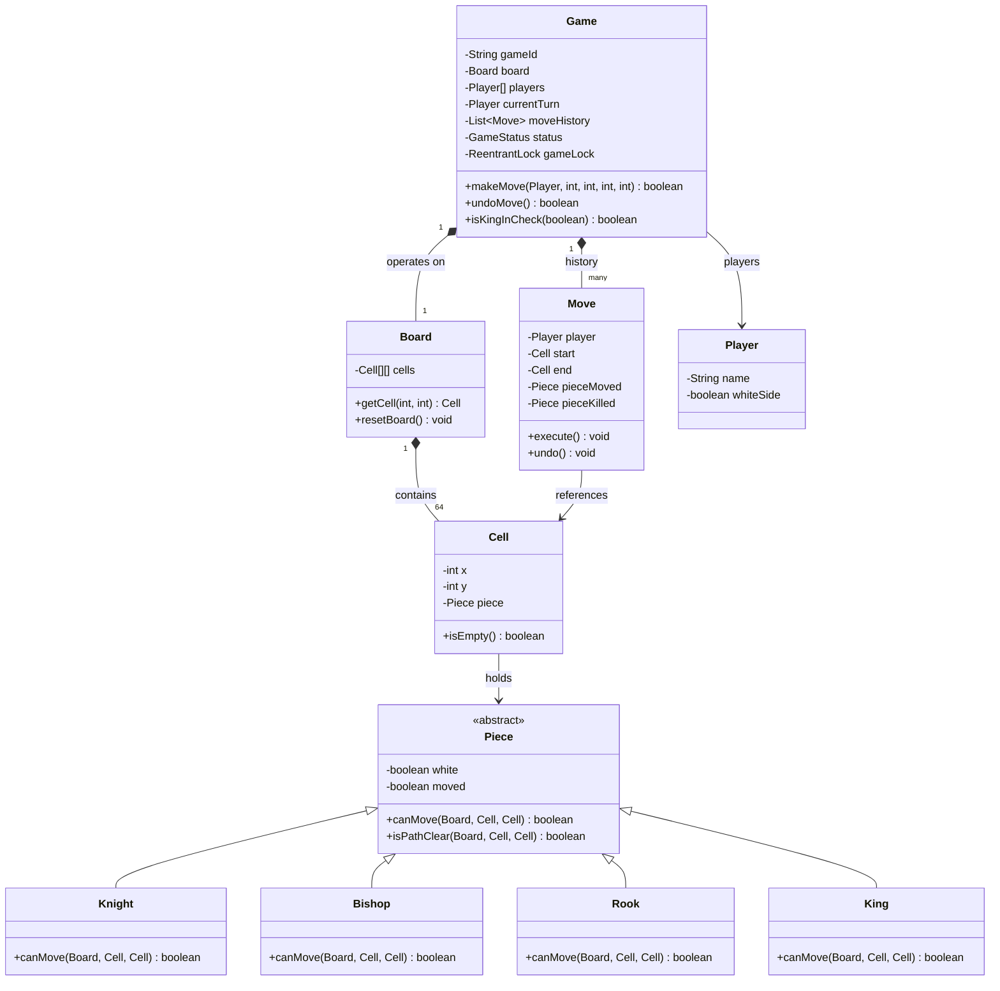
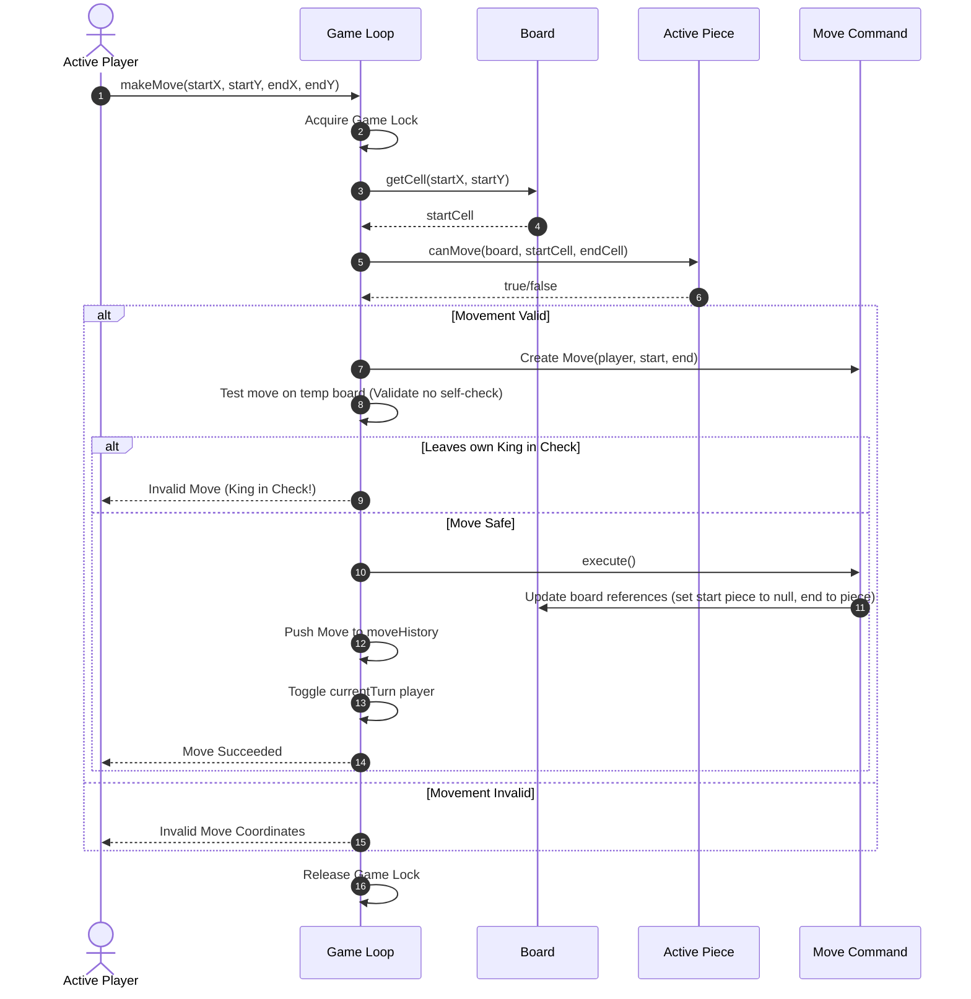

# LLD: Design a Chess Game

## 1. Core System Scope & Requirements

### Functional Requirements
1. **Board Representation:** 8x8 grid composed of 64 squares (cells).
2. **Piece Rules & Polymorphism:** Six piece types (Pawn, Rook, Knight, Bishop, Queen, King) with distinctive movement algorithms.
3. **Turn-based Coordination:** Alternate turns between White and Black players.
4. **Move History & Undo:** Keep a history log of all moves played. Support the ability to undo moves.
5. **Special Move Rules:** Support conditions for:
   - **Castling:** King and Rook move together if neither has moved and no squares in between are threatened.
   - **Pawn Promotion:** Promote pawns reaching the opposite board edge.
   - **En Passant:** Capture enemy pawn on adjacent file that has just advanced two squares.
6. **End Game States:** Detect Checkmate, Stalemate, Draw, and Forfeit.

### Non-Functional Requirements
1. **Concurrent Lobbies:** Host thousands of simultaneous chess sessions. State modifications must be locked per game instance.
2. **Validation Integrity:** Prevent illegal moves (e.g. moves that expose one's own King to check).

---

## 2. Visual Representation (Diagrams)

### UML Class Diagram



### Game Play Sequence Diagram (Make Move Flow)



---

## 3. Violating Design vs. Refactored Design

### The Violating Design (Anti-Pattern)
In a poorly designed structure, movement checks are placed directly inside a central `movePiece` loop using complex nested `switch` or `if-else` blocks on raw string tags. The board modification logic is not decoupled from history, which prevents reverting moves.

```java
// VIOLATION: Giant nested switch statements, hardcoded types, and no encapsulation of piece moves
class BadChessGame {
    public String[][] board = new String[8][8]; // "W_PAWN", "B_KING"

    public void move(int x1, int y1, int x2, int y2) {
        String piece = board[x1][y1];
        if (piece.endsWith("PAWN")) {
            // Complex pawn-specific move checking nested inside main engine
            if (x2 == x1 + 1 && y2 == y1) {
                board[x2][y2] = piece;
                board[x1][y1] = null;
            }
        } else if (piece.endsWith("KNIGHT")) {
            // Knight coordinates...
        }
    }
}
```

### Why it fails:
1. **OCP Violation:** Adding a custom piece type (e.g. Princess or Empress in chess variants) requires modifying the core `BadChessGame` switch branches directly.
2. **Lack of Undo Support:** Modifying the grid strings directly makes it impossible to restore captured pieces during an undo action.
3. **No Safety Checks:** Checking if a move leaves the King exposed to check requires simulating the move and reverting it. The lack of rollback logic makes safety validations error-prone.

---

## 4. Production-Ready Java Implementation

Below is a robust, modular Java representation of Chess. It implements the **Command Pattern** for Move tracking to make undo operations simple, and uses subclass polymorphism for Piece actions.

```java
import java.util.*;
import java.util.concurrent.locks.ReentrantLock;

// --- Domain Enums ---
enum GameStatus {
    ACTIVE, WHITE_WIN, BLACK_WIN, DRAW, RESIGNED
}

// --- Domain Models ---
class Player {
    private final String name;
    private final boolean whiteSide;

    public Player(String name, boolean whiteSide) {
        this.name = name;
        this.whiteSide = whiteSide;
    }

    public String getName() { return name; }
    public boolean isWhiteSide() { return whiteSide; }
}

class Cell {
    private final int x;
    private final int y;
    private Piece piece;

    public Cell(int x, int y) {
        this.x = x;
        this.y = y;
    }

    public int getX() { return x; }
    public int getY() { return y; }
    public Piece getPiece() { return piece; }
    public void setPiece(Piece piece) { this.piece = piece; }
    public boolean isEmpty() { return piece == null; }
}

abstract class Piece {
    private final boolean white;
    private boolean moved = false;

    public Piece(boolean white) {
        this.white = white;
    }

    public boolean isWhite() { return white; }
    public boolean hasMoved() { return moved; }
    public void setMoved(boolean moved) { this.moved = moved; }

    public abstract boolean canMove(Board board, Cell start, Cell end);
    
    protected boolean isPathClear(Board board, Cell start, Cell end) {
        int dx = Integer.compare(end.getX(), start.getX());
        int dy = Integer.compare(end.getY(), start.getY());
        
        int cx = start.getX() + dx;
        int cy = start.getY() + dy;
        
        while (cx != end.getX() || cy != end.getY()) {
            if (!board.getCell(cx, cy).isEmpty()) return false;
            cx += dx;
            cy += dy;
        }
        return true;
    }
}

// --- Piece Implementations ---
class Knight extends Piece {
    public Knight(boolean white) { super(white); }

    @Override
    public boolean canMove(Board board, Cell start, Cell end) {
        if (!end.isEmpty() && end.getPiece().isWhite() == this.isWhite()) return false;
        
        int xDiff = Math.abs(start.getX() - end.getX());
        int yDiff = Math.abs(start.getY() - end.getY());
        return xDiff * yDiff == 2; // (2, 1) or (1, 2)
    }
}

class Bishop extends Piece {
    public Bishop(boolean white) { super(white); }

    @Override
    public boolean canMove(Board board, Cell start, Cell end) {
        if (!end.isEmpty() && end.getPiece().isWhite() == this.isWhite()) return false;

        int xDiff = Math.abs(start.getX() - end.getX());
        int yDiff = Math.abs(start.getY() - end.getY());
        if (xDiff != yDiff) return false;
        
        return isPathClear(board, start, end);
    }
}

class Rook extends Piece {
    public Rook(boolean white) { super(white); }

    @Override
    public boolean canMove(Board board, Cell start, Cell end) {
        if (!end.isEmpty() && end.getPiece().isWhite() == this.isWhite()) return false;

        int xDiff = Math.abs(start.getX() - end.getX());
        int yDiff = Math.abs(start.getY() - end.getY());
        if (xDiff != 0 && yDiff != 0) return false; // Must be horizontal/vertical

        return isPathClear(board, start, end);
    }
}

class King extends Piece {
    public King(boolean white) { super(white); }

    @Override
    public boolean canMove(Board board, Cell start, Cell end) {
        if (!end.isEmpty() && end.getPiece().isWhite() == this.isWhite()) return false;

        int xDiff = Math.abs(start.getX() - end.getX());
        int yDiff = Math.abs(start.getY() - end.getY());
        return xDiff <= 1 && yDiff <= 1; // King moves only 1 cell
    }
}

// --- Board Representation ---
class Board {
    private final Cell[][] cells = new Cell[8][8];

    public Board() {
        for (int i = 0; i < 8; i++) {
            for (int j = 0; j < 8; j++) {
                cells[i][j] = new Cell(i, j);
            }
        }
        resetBoard();
    }

    public Cell getCell(int x, int y) {
        if (x < 0 || x > 7 || y < 0 || y > 7) {
            throw new IllegalArgumentException("Invalid coordinate coordinates.");
        }
        return cells[x][y];
    }

    public void resetBoard() {
        // Place White pieces
        cells[0][1].setPiece(new Knight(true));
        cells[0][2].setPiece(new Bishop(true));
        cells[0][3].setPiece(new King(true));
        cells[0][4].setPiece(new Rook(true));

        // Place Black pieces
        cells[7][1].setPiece(new Knight(false));
        cells[7][2].setPiece(new Bishop(false));
        cells[7][3].setPiece(new King(false));
        cells[7][4].setPiece(new Rook(false));
    }
}

// --- Command Pattern: Move representation ---
class Move {
    private final Player player;
    private final Cell start;
    private final Cell end;
    private final Piece pieceMoved;
    private final Piece pieceKilled;
    private boolean firstMoveFlag = false;

    public Move(Player player, Cell start, Cell end) {
        this.player = player;
        this.start = start;
        this.end = end;
        this.pieceMoved = start.getPiece();
        this.pieceKilled = end.getPiece();
    }

    public void execute() {
        end.setPiece(pieceMoved);
        start.setPiece(null);
        if (!pieceMoved.hasMoved()) {
            pieceMoved.setMoved(true);
            firstMoveFlag = true;
        }
        if (pieceKilled != null) {
            pieceKilled.setMoved(true);
        }
    }

    public void undo() {
        start.setPiece(pieceMoved);
        end.setPiece(pieceKilled);
        if (firstMoveFlag) {
            pieceMoved.setMoved(false);
        }
    }

    public Cell getStart() { return start; }
    public Cell getEnd() { return end; }
    public Piece getPieceMoved() { return pieceMoved; }
    public Piece getPieceKilled() { return pieceKilled; }
}

// --- Game Coordinator ---
class Game {
    private final String gameId;
    private final Board board;
    private final Player[] players = new Player[2];
    private Player currentTurn;
    private GameStatus status = GameStatus.ACTIVE;
    private final List<Move> moveHistory = new ArrayList<>();
    private final ReentrantLock gameLock = new ReentrantLock();

    public Game(String gameId, Player p1, Player p2) {
        this.gameId = gameId;
        this.board = new Board();
        this.players[0] = p1;
        this.players[1] = p2;
        this.currentTurn = p1.isWhiteSide() ? p1 : p2;
    }

    public boolean makeMove(Player player, int startX, int startY, int endX, int endY) {
        gameLock.lock();
        try {
            if (status != GameStatus.ACTIVE || !player.equals(currentTurn)) {
                return false;
            }

            Cell start = board.getCell(startX, startY);
            Cell end = board.getCell(endX, endY);
            Piece movingPiece = start.getPiece();

            if (movingPiece == null || movingPiece.isWhite() != player.isWhiteSide()) {
                return false; // No piece found or piece belongs to the opponent
            }

            // Verify piece-specific movement restrictions
            if (!movingPiece.canMove(board, start, end)) {
                return false;
            }

            // Command pattern execution
            Move move = new Move(player, start, end);
            move.execute();

            // Safety check: Does this move expose own King to check?
            if (isKingInCheck(player.isWhiteSide())) {
                System.out.println("Move invalid: leaves King in check. Reverting...");
                move.undo();
                return false;
            }

            moveHistory.add(move);
            // Switch Turn
            currentTurn = (currentTurn == players[0]) ? players[1] : players[0];
            return true;
        } finally {
            gameLock.unlock();
        }
    }

    public boolean undoMove() {
        gameLock.lock();
        try {
            if (moveHistory.isEmpty()) return false;
            Move lastMove = moveHistory.remove(moveHistory.size() - 1);
            lastMove.undo();
            currentTurn = (currentTurn == players[0]) ? players[1] : players[0];
            return true;
        } finally {
            gameLock.unlock();
        }
    }

    public boolean isKingInCheck(boolean whiteSide) {
        // Find King coordinates
        Cell kingCell = null;
        for (int i = 0; i < 8; i++) {
            for (int j = 0; j < 8; j++) {
                Cell cell = board.getCell(i, j);
                if (!cell.isEmpty() && cell.getPiece() instanceof King && cell.getPiece().isWhite() == whiteSide) {
                    kingCell = cell;
                    break;
                }
            }
        }

        if (kingCell == null) return false;

        // Check if any opponent piece can move to the King's square
        for (int i = 0; i < 8; i++) {
            for (int j = 0; j < 8; j++) {
                Cell cell = board.getCell(i, j);
                if (!cell.isEmpty() && cell.getPiece().isWhite() != whiteSide) {
                    if (cell.getPiece().canMove(board, cell, kingCell)) {
                        return true;
                    }
                }
            }
        }
        return false;
    }

    public Board getBoard() { return board; }
}

// --- Client Driver ---
public class Main {
    public static void main(String[] args) {
        System.out.println("Starting Chess Engine...");
        Player p1 = new Player("WhitePlayer", true);
        Player p2 = new Player("BlackPlayer", false);

        Game game = new Game("G-CHESS-101", p1, p2);

        // White Knight tries to move from (0,1) to (2,2)
        System.out.println("White Knight tries move (0,1) -> (2,2)");
        boolean success = game.makeMove(p1, 0, 1, 2, 2);
        System.out.println("Move execution: " + success);

        // Verify state is preserved
        Cell target = game.getBoard().getCell(2, 2);
        System.out.println("Cell (2,2) occupied? " + (!target.isEmpty() ? target.getPiece().getClass().getSimpleName() : "Empty"));

        // Try undoing the move
        System.out.println("Undoing move...");
        game.undoMove();
        System.out.println("Cell (2,2) occupied after undo? " + (!target.isEmpty() ? "Yes" : "No"));
    }
}
```

---

## 5. Edge Cases & Concurrency Handling

1. **Self-Check Prevention (Pinned Pieces):** If a player moves a piece that was blocking an enemy Rook from their King, they expose their own King to check. The `makeMove` method handles this dynamically: it executes the move, calls `isKingInCheck()`, and immediately rolls back (invoking `move.undo()`) if the validation fails.
2. **Concurrent Match Actions:** Multiple HTTP or WebSocket threads can concurrently trigger moves for the same game session. We use a `ReentrantLock` (`gameLock`) per `Game` to ensure moves are evaluated and executed sequentially.
3. **Undo/Redo Race Conditions:** Calling undo while the opponent is simultaneously making a move is blocked by the session-level lock, ensuring consistent history records.

---

## 6. Comprehensive Interview Q&A

### Q1: How would you extend this design to support Castling?
**A:** Castling is an special case rule. In `King.canMove()`, we add a case: if the King moves 2 cells horizontally, we check if the King and target Rook have `Piece.hasMoved() == false`, verify the path is clear, and confirm that the King does not pass through or land on any square threatened by an enemy piece. If valid, we create a specialized `CastlingMove` subclass of `Move` which overrides `execute()` to relocate both the King and the Rook, and overrides `undo()` to restore both to their original squares.

### Q2: How do you design a chess engine AI evaluator within this structure?
**A:** We use the **Strategy Pattern** for player moves. We define a `MoveStrategy` interface with `getNextMove(Board, Player)`. A human player implements this via keyboard/UI input, while an AI player implements this using a Minimax Search Algorithm with Alpha-Beta Pruning. The AI simulates possible moves on the Board, evaluates positions using heuristics (material count, piece-square tables), and returns the optimal `Move`.

### Q3: How do you handle game persistence so a player can resume a match later?
**A:** We convert the match history into **Portable Game Notation (PGN)** format or a list of coordinate strings (e.g. `e2e4`, `g8f6`). We save this sequence to a database. To restore the game, the server instantiates a fresh `Game` object and replays the moves sequentially to reconstruct the board state.

### Q4: How would you implement Pawn Promotion?
**A:** In the `makeMove` method, after executing the move, we check if the moved piece is a Pawn and has reached the last rank (rank 0 for Black, rank 7 for White). If so, we trigger a callback or response requesting the promotion selection (Queen, Rook, Bishop, Knight), instantiate the chosen piece, and replace the Pawn on that cell.
