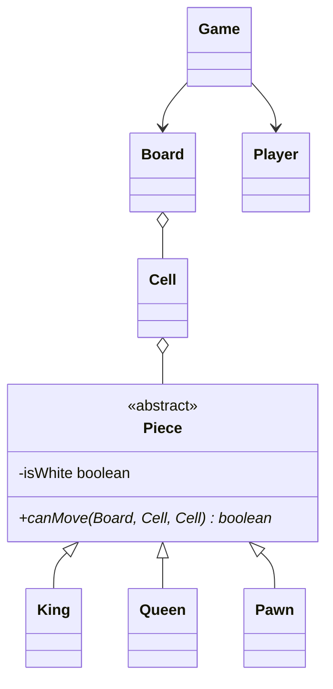

# LLD: Design a Chess Game

Chess is a complex LLD system featuring piece-specific movement strategies, board layouts, status transitions, checkmate detection, and turn structures.

---

## Requirements
1. **Board Representation:** 8x8 matrix representing cells holding pieces.
2. **Piece Polymorphism:** Modular behaviors for Pawn, Rook, Knight, Bishop, Queen, King.
3. **Movement Rules:** Validation for each piece type (using Strategy Pattern or abstract subclasses).
4. **Turn Orchestration:** Active player checks, tracking current color's turn.
5. **Game State:** `ACTIVE`, `BLACK_WIN`, `WHITE_WIN`, `DRAW`, `STALEMATE`.

---

## Class Diagram



---

## Java Implementation

```java
import java.util.List;

enum GameStatus { ACTIVE, WHITE_WIN, BLACK_WIN, FORFEIT, DRAW }

class Cell {
    private final int x;
    private final int y;
    private Piece piece;

    public Cell(int x, int y, Piece piece) { this.x = x; this.y = y; this.piece = piece; }
    public int getX() { return x; }
    public int getY() { return y; }
    public Piece getPiece() { return piece; }
    public void setPiece(Piece piece) { this.piece = piece; }
}

abstract class Piece {
    private final boolean isWhite;
    private boolean killed = false;

    public Piece(boolean isWhite) { this.isWhite = isWhite; }
    public boolean isWhite() { return isWhite; }
    public void setKilled(boolean killed) { this.killed = killed; }
    
    // Core method for movement strategy
    public abstract boolean canMove(Board board, Cell start, Cell end);
}

class Knight extends Piece {
    public Knight(boolean isWhite) { super(isWhite); }

    @Override
    public boolean canMove(Board board, Cell start, Cell end) {
        if (end.getPiece() != null && end.getPiece().isWhite() == this.isWhite()) return false;
        int xDiff = Math.abs(start.getX() - end.getX());
        int yDiff = Math.abs(start.getY() - end.getY());
        return xDiff * yDiff == 2; // Knights move in an L-shape (2x1 or 1x2 = 2)
    }
}

class Board {
    private final Cell[][] cells = new Cell[8][8];

    public Board() { resetBoard(); }
    public Cell getCell(int x, int y) {
        if (x < 0 || x > 7 || y < 0 || y > 7) throw new IllegalArgumentException("Index out of bound");
        return cells[x][y];
    }

    public void resetBoard() {
        // Initialize cells and place Pawns, Rooks, Knights, etc.
        cells[0][1] = new Cell(0, 1, new Knight(true));
        // Remaining board setup...
    }
}

class Move {
    private final Player player;
    private final Cell start;
    private final Cell end;
    private final Piece pieceMoved;
    private final Piece pieceKilled;

    public Move(Player p, Cell start, Cell end) {
        this.player = p;
        this.start = start;
        this.end = end;
        this.pieceMoved = start.getPiece();
        this.pieceKilled = end.getPiece();
    }
}

class Player {
    private final boolean isWhiteSide;
    public Player(boolean isWhiteSide) { this.isWhiteSide = isWhiteSide; }
    public boolean isWhiteSide() { return isWhiteSide; }
}
```

---

## Interview Q&A Corner

> [!TIP]
> **Q: How would you design the system to support undo/redo moves?**
> A: Keep a historical list of `Move` objects. When a user calls `undo()`, pop the last `Move` from the stack, put the `pieceMoved` back on `start` cell, and restore `pieceKilled` back onto the `end` cell (and toggle the active player).
>
> **Q: How should Checkmate and Stalemate be calculated?**
> A: After every move, scan all possible moves for the opponent. If the opponent King is under check and they have **zero** legal moves to escape the check, declare `Checkmate`. If they have zero legal moves but their King is **not** currently under check, declare `Stalemate` (Draw).
