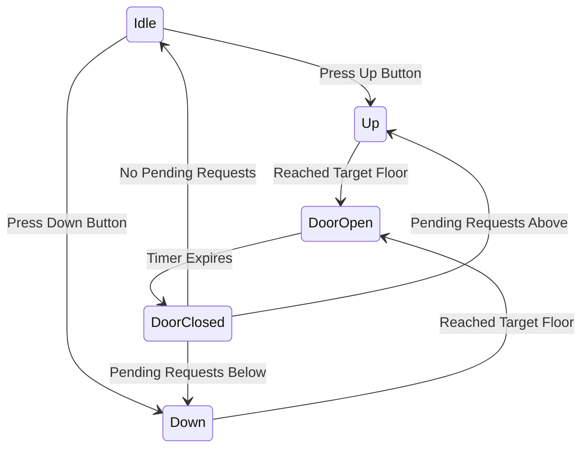

# LLD: Design an Elevator System

An elevator system represents cars moving between floors, handling internal/external requests, and optimizing scheduling through scheduling algorithms.

---

## Requirements
1. **Elevator Car State:** Handles direction (`UP`, `DOWN`, `IDLE`) and door states.
2. **Dispatch Algorithm:** Route requests optimally. Standard algorithms include SCAN / LOOK.
3. **Internal & External Buttons:** Internal panel allows destination selection. External panel registers directions.
4. **Safety & Alerts:** Handle overweight or emergency stops.

---

## Elevator State Machine



---

## Java Implementation

```java
import java.util.TreeSet;

enum Direction { UP, DOWN, IDLE }

class Request implements Comparable<Request> {
    private final int targetFloor;
    private final Direction direction;

    public Request(int floor, Direction dir) { this.targetFloor = floor; this.direction = dir; }
    public int getTargetFloor() { return targetFloor; }
    public Direction getDirection() { return direction; }

    @Override
    public int compareTo(Request other) {
        return Integer.compare(this.targetFloor, other.targetFloor);
    }
}

class ElevatorCar {
    private int currentFloor = 0;
    private Direction currentDirection = Direction.IDLE;
    
    // TreeSet sorts requests for LOOK/SCAN optimization
    private final TreeSet<Integer> upRequests = new TreeSet<>();
    private final TreeSet<Integer> downRequests = new TreeSet<>();

    public void addRequest(Request req) {
        if (req.getDirection() == Direction.UP) {
            upRequests.add(req.getTargetFloor());
        } else {
            downRequests.add(req.getTargetFloor());
        }
    }

    public void move() {
        while (!upRequests.isEmpty() || !downRequests.isEmpty()) {
            if (currentDirection == Direction.UP || currentDirection == Direction.IDLE) {
                currentDirection = Direction.UP;
                Integer nextFloor = upRequests.ceiling(currentFloor); // Look for next up request above current
                if (nextFloor == null) {
                    currentDirection = Direction.DOWN; // Switch direction
                    continue;
                }
                upRequests.remove(nextFloor);
                currentFloor = nextFloor;
                System.out.println("Elevator reached floor (UP): " + currentFloor);
            } else if (currentDirection == Direction.DOWN) {
                Integer nextFloor = downRequests.floor(currentFloor); // Look for next down request below current
                if (nextFloor == null) {
                    currentDirection = Direction.UP; // Switch direction
                    continue;
                }
                downRequests.remove(nextFloor);
                currentFloor = nextFloor;
                System.out.println("Elevator reached floor (DOWN): " + currentFloor);
            }
        }
        currentDirection = Direction.IDLE;
        System.out.println("Elevator is IDLE.");
    }
}
```

---

## Interview Q&A Corner

> [!IMPORTANT]
> **Q: What is the LOOK algorithm, and why is it preferred over FCFS?**
> A: 
> * **FCFS (First-Come, First-Served)** causes the elevator to bounce wildly across floors, wasting power and time.
> * **LOOK algorithm** behaves like a real elevator: it continues in the current direction as long as there are pending requests in that direction. Once no more requests exist in the current direction, it reverses and services requests the other way. This minimizes travel distance.
