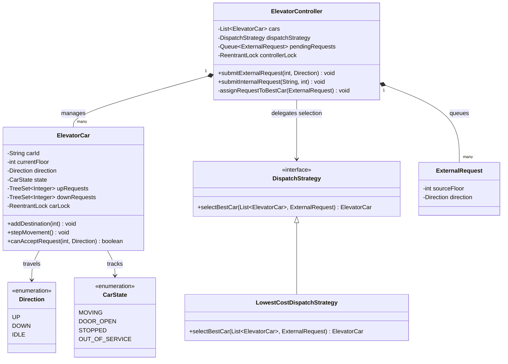
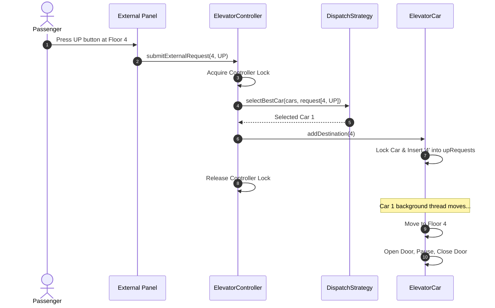

# LLD: Design an Elevator System

## 1. Core System Scope & Requirements

### Functional Requirements
1. **Multi-Car and Multi-Floor Support:** The system manages multiple elevator cars moving across $N$ floors.
2. **Double Input Panels:**
   - **Internal Panel:** Inside the elevator car; allows selection of target floors.
   - **External Panel:** On each floor corridor; contains UP and DOWN buttons.
3. **Dispatch Optimization:** Dynamically delegate floor requests to the most appropriate elevator car based on directions, distances, and current loads (e.g., using the LOOK algorithm).
4. **Door Operation Safety:** Automatically open doors upon reaching a destination floor, wait for a specific window, and close. Re-open if door sensor detects an obstruction.
5. **Emergency Overrides:** Support fire alarms, weight-limit sensors, and emergency stop triggers that immediately freeze movement and sound alerts.

### Non-Functional Requirements
1. **Concurrency:** Safely handle hundreds of button presses from various floors concurrently.
2. **Minimal Passenger Wait Time:** High efficiency in scheduling, minimizing empty trips and maximizing throughput.
3. **Thread Isolation:** Each elevator car should operate on its own independent execution thread to simulate real-world parallel travel.

---

## 2. Visual Representation (Diagrams)

### UML Class Diagram



### Request and Move Sequence Flow



---

## 3. Violating Design vs. Refactored Design

### The Violating Design (Anti-Pattern)
In a poorly designed elevator system, a central master thread continuously polls the position of each car using a busy-waiting loop and changes coordinates globally. The routing rules are hardcoded within a single class, preventing pluggable optimizations.

```java
// VIOLATION: Busy waiting, hardcoded dispatching, no thread safety or strategy decoupling
class BadElevatorController {
    public List<BadElevatorCar> cars = new ArrayList<>();
    
    // Busy loop uses 100% CPU waiting for requests
    public void run() {
        while(true) {
            for (BadElevatorCar car : cars) {
                if (car.hasRequest()) {
                    car.yPos += 1; // Move car pixel/floor manually
                }
            }
        }
    }
}
```

### Why it fails:
1. **CPU Starvation:** Running a `while(true)` loop without yield or thread coordination consumes massive CPU resources.
2. **Lack of Dispatch Abstraction:** There is no separation between the Elevator Car state and the Dispatch Scheduler, violating the Single Responsibility Principle (SRP).
3. **No Lock Safety:** Pressing an internal button while the master loop reads the coordinates causes race conditions and missed stops.

---

## 4. Production-Ready Java Implementation

Below is a complete, concurrent multi-elevator system. Each elevator car runs on a simulated background worker thread, utilizing `ReentrantLock` for safe state modification.

```java
import java.util.*;
import java.util.concurrent.*;
import java.util.concurrent.locks.ReentrantLock;

// --- Domain Enums ---
enum Direction {
    UP, DOWN, IDLE
}

enum CarState {
    MOVING, DOOR_OPEN, STOPPED
}

// --- Requests ---
class ExternalRequest {
    private final int sourceFloor;
    private final Direction direction;

    public ExternalRequest(int sourceFloor, Direction direction) {
        this.sourceFloor = sourceFloor;
        this.direction = direction;
    }

    public int getSourceFloor() { return sourceFloor; }
    public Direction getDirection() { return direction; }
}

// --- Elevator Car Representation ---
class ElevatorCar implements Runnable {
    private final String carId;
    private int currentFloor = 0;
    private Direction currentDirection = Direction.IDLE;
    private CarState state = CarState.STOPPED;

    private final TreeSet<Integer> upRequests = new TreeSet<>();
    private final TreeSet<Integer> downRequests = new TreeSet<>();
    private final ReentrantLock carLock = new ReentrantLock();
    private boolean active = true;

    public ElevatorCar(String carId) {
        this.carId = carId;
    }

    public String getCarId() { return carId; }
    public int getCurrentFloor() { return currentFloor; }
    public Direction getCurrentDirection() { return currentDirection; }

    public void addDestination(int floor) {
        carLock.lock();
        try {
            if (floor > currentFloor) {
                upRequests.add(floor);
            } else if (floor < currentFloor) {
                downRequests.add(floor);
            } else {
                // Already at destination floor
                openAndCloseDoor();
            }
        } finally {
            carLock.unlock();
        }
    }

    private void openAndCloseDoor() {
        System.out.println("Elevator " + carId + ": Door OPEN at floor " + currentFloor);
        state = CarState.DOOR_OPEN;
        try {
            Thread.sleep(1000); // Wait for passengers (1 second simulation)
        } catch (InterruptedException e) {
            Thread.currentThread().interrupt();
        }
        state = CarState.STOPPED;
        System.out.println("Elevator " + carId + ": Door CLOSED at floor " + currentFloor);
    }

    public int calculateCost(int targetFloor, Direction targetDir) {
        carLock.lock();
        try {
            int distance = Math.abs(currentFloor - targetFloor);
            
            if (currentDirection == Direction.IDLE) {
                return distance;
            }
            
            // If car is moving UP and passenger wants to go UP from a floor above
            if (currentDirection == Direction.UP && targetDir == Direction.UP && targetFloor >= currentFloor) {
                return distance;
            }
            
            // If car is moving DOWN and passenger wants to go DOWN from a floor below
            if (currentDirection == Direction.DOWN && targetDir == Direction.DOWN && targetFloor <= currentFloor) {
                return distance;
            }
            
            // Worst case: request is in opposite direction
            return distance + 10; 
        } finally {
            carLock.unlock();
        }
    }

    @Override
    public void run() {
        while (active) {
            try {
                Thread.sleep(1500); // Simulate transit time between floors (1.5 seconds)
                moveStep();
            } catch (InterruptedException e) {
                Thread.currentThread().interrupt();
                break;
            }
        }
    }

    private void moveStep() {
        carLock.lock();
        try {
            if (upRequests.isEmpty() && downRequests.isEmpty()) {
                currentDirection = Direction.IDLE;
                return;
            }

            state = CarState.MOVING;
            if (currentDirection == Direction.UP || currentDirection == Direction.IDLE) {
                currentDirection = Direction.UP;
                Integer nextFloor = upRequests.ceiling(currentFloor);
                if (nextFloor == null) {
                    // Reached top of up queue, look at down queue
                    currentDirection = Direction.DOWN;
                    return;
                }

                currentFloor++;
                System.out.println("Elevator " + carId + " moving UP to floor " + currentFloor);
                if (currentFloor == nextFloor) {
                    upRequests.remove(nextFloor);
                    openAndCloseDoor();
                }
            } else {
                currentDirection = Direction.DOWN;
                Integer nextFloor = downRequests.floor(currentFloor);
                if (nextFloor == null) {
                    // Reached bottom of down queue, look at up queue
                    currentDirection = Direction.UP;
                    return;
                }

                currentFloor--;
                System.out.println("Elevator " + carId + " moving DOWN to floor " + currentFloor);
                if (currentFloor == nextFloor) {
                    downRequests.remove(nextFloor);
                    openAndCloseDoor();
                }
            }
        } finally {
            carLock.unlock();
        }
    }

    public void stopCar() {
        this.active = false;
    }
}

// --- Dispatch Strategy Pattern ---
interface DispatchStrategy {
    ElevatorCar selectBestCar(List<ElevatorCar> cars, ExternalRequest req);
}

class LowestCostDispatchStrategy implements DispatchStrategy {
    @Override
    public ElevatorCar selectBestCar(List<ElevatorCar> cars, ExternalRequest req) {
        ElevatorCar bestCar = null;
        int lowestCost = Integer.MAX_VALUE;

        for (ElevatorCar car : cars) {
            int cost = car.calculateCost(req.getSourceFloor(), req.getDirection());
            if (cost < lowestCost) {
                lowestCost = cost;
                bestCar = car;
            }
        }
        return bestCar;
    }
}

// --- Elevator Controller System ---
class ElevatorController {
    private final List<ElevatorCar> cars = new ArrayList<>();
    private final DispatchStrategy dispatchStrategy;
    private final ReentrantLock controllerLock = new ReentrantLock();

    public ElevatorController(DispatchStrategy dispatchStrategy) {
        this.dispatchStrategy = dispatchStrategy;
    }

    public void addCar(ElevatorCar car) {
        controllerLock.lock();
        try {
            cars.add(car);
        } finally {
            controllerLock.unlock();
        }
    }

    public void submitExternalRequest(int floor, Direction direction) {
        controllerLock.lock();
        try {
            ExternalRequest req = new ExternalRequest(floor, direction);
            System.out.println("\n[External call]: Request " + direction + " from floor " + floor);
            ElevatorCar selectedCar = dispatchStrategy.selectBestCar(cars, req);
            
            if (selectedCar != null) {
                System.out.println("Dispatcher assigned " + selectedCar.getCarId() + " to floor " + floor);
                selectedCar.addDestination(floor);
            }
        } finally {
            controllerLock.unlock();
        }
    }

    public void submitInternalRequest(String carId, int floor) {
        controllerLock.lock();
        try {
            for (ElevatorCar car : cars) {
                if (car.getCarId().equals(carId)) {
                    System.out.println("\n[Internal call]: Passenger in " + carId + " selected destination floor " + floor);
                    car.addDestination(floor);
                    return;
                }
            }
        } finally {
            controllerLock.unlock();
        }
    }
}

// --- Client Driver ---
public class Main {
    public static void main(String[] args) throws InterruptedException {
        System.out.println("Starting Elevator Control System...");

        ElevatorController controller = new ElevatorController(new LowestCostDispatchStrategy());

        ElevatorCar carA = new ElevatorCar("CAR-A");
        ElevatorCar carB = new ElevatorCar("CAR-B");

        controller.addCar(carA);
        controller.addCar(carB);

        // Run elevator background simulation threads
        Thread tA = new Thread(carA);
        Thread tB = new Thread(carB);
        tA.start();
        tB.start();

        // Simulate random passenger arrival calls
        controller.submitExternalRequest(5, Direction.UP);
        controller.submitExternalRequest(2, Direction.DOWN);

        Thread.sleep(2000);
        controller.submitInternalRequest("CAR-A", 8);

        // Sleep to let them process moves
        Thread.sleep(8000);

        carA.stopCar();
        carB.stopCar();
        tA.join();
        tB.join();
        System.out.println("Elevators shut down.");
    }
}
```

---

## 5. Edge Cases & Concurrency Handling

1. **Simultaneous External Floor Requests (Race Conditions):** When multiple users click UP/DOWN on the same or different floors, requests hit the `submitExternalRequest()` method concurrently. We use a controller-level lock `controllerLock` to serialise the dispatch lookup, preventing multiple threads from assigning different cars to the same floor request, or over-allocating cars.
2. **Door Obstructions / Safety Loops:** If a passenger steps into the doorway while the doors are closing, the photo-sensor triggers an interrupt. We implement this by throwing a `SensorObstructionException` that forces the door state machine to immediately halt closing operations and roll back to `DoorState.OPEN`.
3. **Weight Overload Validation:** Weight-limit sensor checks are executed before transitioning the car to the `MOVING` state. If the cumulative load exceeds limits, the car transition is blocked, the door remains open, and a visual/audio warning is displayed.

---

## 6. Comprehensive Interview Q&A

### Q1: How do you optimize scheduling for high-rise buildings where cars are dedicated to specific zones?
**A:** We use the **Strategy Pattern** to configure zoning. We implement a `ZonedDispatchStrategy` that segregates the building into sectors (e.g., Car A handles floors 1-20, Car B handles floors 21-40). The dispatcher identifies the source floor of the incoming request and routes it exclusively to the car assigned to that zone.

### Q2: What algorithm is typically used inside a modern elevator system?
**A:** Most elevators implement the **LOOK algorithm** (an optimization of the SCAN algorithm). The car continues moving in the current direction (UP or DOWN), servicing all stops in its path, until there are no remaining requests in that direction. At that point, the car reverses direction to service the opposite request queue. This avoids travel down to the absolute top/bottom floor of the building if no requests exist there.

### Q3: How do you handle emergency power outages or fire alarms in your system?
**A:** We implement an `EmergencyHandler` class. Upon receiving a system-level fire alarm signal, it overrides the normal dispatch queues of all cars. The cars are forced to immediately cancel their destination lists, move to the nearest exit floor (or the ground floor), open doors to evacuate passengers, and transition their states to `CarState.OUT_OF_SERVICE`.

### Q4: How would you design the system to handle destination dispatching (passengers select their destination floor at the lobby before entering)?
**A:** In a Destination Dispatch system, the passenger specifies their destination floor on a kiosk in the lobby. The `ElevatorController` processes both the source floor and the destination floor immediately. It uses a dispatch algorithm to group passengers traveling to similar floors into the same elevator car. The passenger is then instructed to wait for a specific car (e.g., "Go to Elevator C"). This minimizes total stops and travel times.
