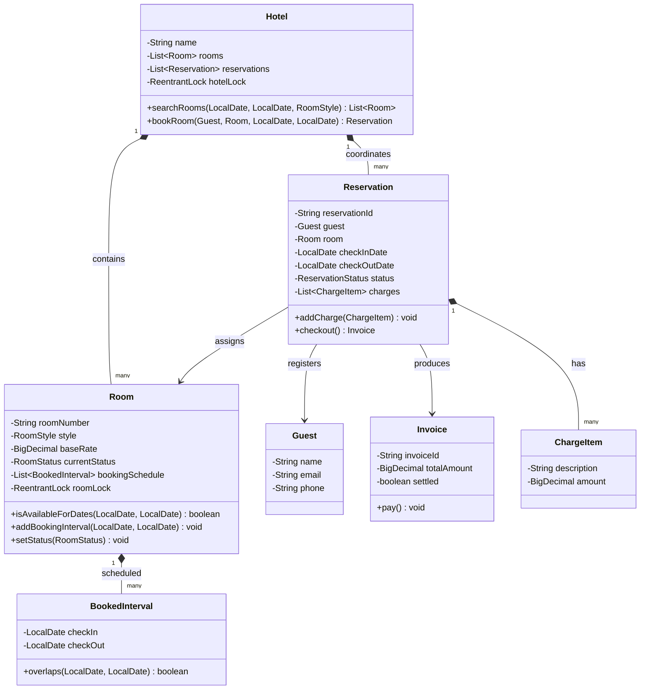
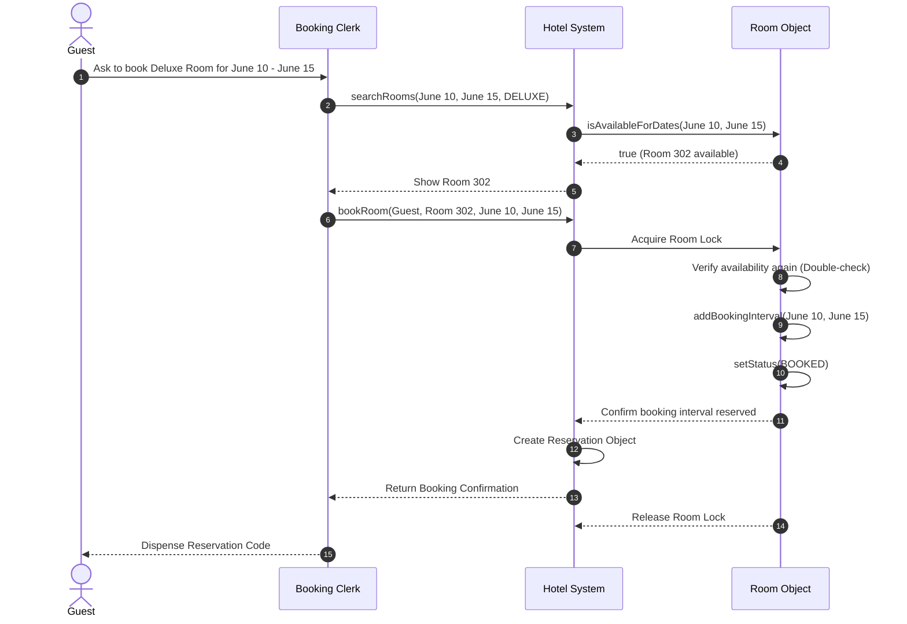

# LLD: Design a Hotel Management System

## 1. Core System Scope & Requirements

### Functional Requirements
1. **Rooms Inventory Management:** Support multiple room styles (Standard, Deluxe, Suite) and track room statuses (`AVAILABLE`, `BOOKED`, `OCCUPIED`, `BEING_CLEANED`, `OUT_OF_SERVICE`).
2. **Booking & Reservation Lifecycle:**
   - Guests can search for available rooms for specific check-in and check-out dates.
   - Support booking creation, cancellation, modification, check-in, and check-out.
3. **Prevent Overlap (Double Bookings):** A room must not be booked by multiple guests for overlapping date ranges.
4. **Housekeeping Integration:** Upon check-out, a room must automatically transition to `BEING_CLEANED`. Housekeepers can claim cleanup tasks and mark rooms as `AVAILABLE` once done.
5. **Dynamic Billing & Room Service Add-ons:** Generate detailed invoices tracking room charges (days stayed $\times$ rate), taxes, and extra add-ons (room service, spa, restaurant tabs).

### Non-Functional Requirements
1. **Concurrency Protection:** Handle multiple booking agents reserving rooms simultaneously without race conditions.
2. **High Precision Billing:** Financial records must use exact decimal values (`BigDecimal`) to avoid rounding discrepancies.
3. **Auditing:** Maintain historical records of room state changes.

---

## 2. Visual Representation (Diagrams)

### UML Class Diagram



### Sequence Diagram (Room Search & Booking Execution)



---

## 3. Violating Design vs. Refactored Design

### The Violating Design (Anti-Pattern)
In a flawed hotel application, a room's availability is represented simply by a single `boolean isAvailable` flag. This design fails to account for booking dates, meaning a room booked for today cannot be reserved by anyone else for a date next week.

```java
// VIOLATION: Simple boolean flag, no concept of reservation dates, no synchronization
class BadRoom {
    public String roomNum;
    public boolean isBooked; // If true, room is occupied/reserved now. No dates!

    public void reserveRoom() {
        if (!isBooked) {
            isBooked = true;
        } else {
            throw new RuntimeException("Room already booked!");
        }
    }
}
```

### Why it fails:
1. **No Temporal Availability:** The system cannot handle reservations in advance. Checking if a room is free for a date in the future is impossible since the room only tracks its current immediate status.
2. **Race Conditions:** Under concurrent traffic, two check-in agents can read `isBooked = false` at the same time and reserve the same room for different guests.

---

## 4. Production-Ready Java Implementation

Below is a complete, concurrent Hotel Management implementation. It models room availability using custom date ranges and uses `ReentrantLock` per room to prevent double-booking.

```java
import java.math.BigDecimal;
import java.time.LocalDate;
import java.time.temporal.ChronoUnit;
import java.util.*;
import java.util.concurrent.locks.ReentrantLock;

// --- Domain Enums ---
enum RoomStyle {
    STANDARD, DELUXE, SUITE
}

enum RoomStatus {
    AVAILABLE, BOOKED, OCCUPIED, BEING_CLEANED, OUT_OF_SERVICE
}

enum ReservationStatus {
    CONFIRMED, CHECKED_IN, CHECKED_OUT, CANCELLED
}

// --- Temporal Booking Intervals ---
class BookedInterval {
    private final LocalDate checkIn;
    private final LocalDate checkOut;

    public BookedInterval(LocalDate checkIn, LocalDate checkOut) {
        this.checkIn = checkIn;
        this.checkOut = checkOut;
    }

    public boolean overlaps(LocalDate start, LocalDate end) {
        return (start.isBefore(checkOut) && end.isAfter(checkIn));
    }
}

// --- Domain Entities ---
class Room {
    private final String roomNumber;
    private final RoomStyle style;
    private final BigDecimal baseRate;
    private RoomStatus currentStatus = RoomStatus.AVAILABLE;
    private final List<BookedInterval> schedule = new ArrayList<>();
    private final ReentrantLock roomLock = new ReentrantLock();

    public Room(String roomNumber, RoomStyle style, BigDecimal baseRate) {
        this.roomNumber = roomNumber;
        this.style = style;
        this.baseRate = baseRate;
    }

    public String getRoomNumber() { return roomNumber; }
    public RoomStyle getStyle() { return style; }
    public BigDecimal getBaseRate() { return baseRate; }
    public RoomStatus getCurrentStatus() { return currentStatus; }

    public void setStatus(RoomStatus status) {
        roomLock.lock();
        try {
            this.currentStatus = status;
        } finally {
            roomLock.unlock();
        }
    }

    public boolean isAvailableForDates(LocalDate start, LocalDate end) {
        roomLock.lock();
        try {
            if (currentStatus == RoomStatus.OUT_OF_SERVICE) return false;
            for (BookedInterval interval : schedule) {
                if (interval.overlaps(start, end)) return false;
            }
            return true;
        } finally {
            roomLock.unlock();
        }
    }

    public boolean reserve(LocalDate start, LocalDate end) {
        roomLock.lock();
        try {
            if (!isAvailableForDates(start, end)) {
                return false;
            }
            schedule.add(new BookedInterval(start, end));
            this.currentStatus = RoomStatus.BOOKED;
            return true;
        } finally {
            roomLock.unlock();
        }
    }
}

class Guest {
    private final String name;
    private final String email;

    public Guest(String name, String email) {
        this.name = name;
        this.email = email;
    }

    public String getName() { return name; }
}

class ChargeItem {
    private final String description;
    private final BigDecimal amount;

    public ChargeItem(String description, BigDecimal amount) {
        this.description = description;
        this.amount = amount;
    }

    public BigDecimal getAmount() { return amount; }
    @Override
    public String toString() { return description + ": $" + amount; }
}

class Invoice {
    private final String invoiceId;
    private final BigDecimal totalAmount;
    private boolean settled = false;

    public Invoice(String invoiceId, BigDecimal totalAmount) {
        this.invoiceId = invoiceId;
        this.totalAmount = totalAmount;
    }

    public void pay() {
        this.settled = true;
    }

    @Override
    public String toString() {
        return "Invoice[" + invoiceId + "] Amount: $" + totalAmount + " (Settled: " + settled + ")";
    }
}

class Reservation {
    private final String id;
    private final Guest guest;
    private final Room room;
    private final LocalDate checkInDate;
    private final LocalDate checkOutDate;
    private ReservationStatus status = ReservationStatus.CONFIRMED;
    private final List<ChargeItem> charges = new ArrayList<>();

    public Reservation(String id, Guest guest, Room room, LocalDate in, LocalDate out) {
        this.id = id;
        this.guest = guest;
        this.room = room;
        this.checkInDate = in;
        this.checkOutDate = out;
        
        // Add initial base room charges
        long days = ChronoUnit.DAYS.between(in, out);
        BigDecimal roomCharge = room.getBaseRate().multiply(BigDecimal.valueOf(days));
        charges.add(new ChargeItem("Base room stay (" + days + " nights)", roomCharge));
    }

    public String getId() { return id; }
    public Room getRoom() { return room; }
    public ReservationStatus getStatus() { return status; }

    public void checkIn() {
        if (status == ReservationStatus.CONFIRMED) {
            this.status = ReservationStatus.CHECKED_IN;
            room.setStatus(RoomStatus.OCCUPIED);
        }
    }

    public void addCharge(String desc, BigDecimal amt) {
        charges.add(new ChargeItem(desc, amt));
    }

    public Invoice checkOut() {
        this.status = ReservationStatus.CHECKED_OUT;
        room.setStatus(RoomStatus.BEING_CLEANED);

        BigDecimal total = BigDecimal.ZERO;
        for (ChargeItem charge : charges) {
            total = total.add(charge.getAmount());
        }

        String invId = "INV-" + UUID.randomUUID().toString().substring(0, 6).toUpperCase();
        return new Invoice(invId, total);
    }
}

// --- Hotel Manager Core ---
class Hotel {
    private final String name;
    private final List<Room> rooms = new ArrayList<>();
    private final Map<String, Reservation> activeReservations = new HashMap<>();
    private final ReentrantLock hotelLock = new ReentrantLock();

    public Hotel(String name) {
        this.name = name;
    }

    public void addRoom(Room room) {
        hotelLock.lock();
        try {
            rooms.add(room);
        } finally {
            hotelLock.unlock();
        }
    }

    public List<Room> searchRooms(LocalDate start, LocalDate end, RoomStyle style) {
        List<Room> available = new ArrayList<>();
        hotelLock.lock();
        try {
            for (Room r : rooms) {
                if (r.getStyle() == style && r.isAvailableForDates(start, end)) {
                    available.add(r);
                }
            }
        } finally {
            hotelLock.unlock();
        }
        return available;
    }

    public Reservation createBooking(Guest guest, Room room, LocalDate start, LocalDate end) {
        // Attempt reservation inside room's own concurrency lock
        boolean success = room.reserve(start, end);
        if (!success) {
            throw new IllegalStateException("Room " + room.getRoomNumber() + " is already occupied for these dates.");
        }

        hotelLock.lock();
        try {
            String resId = "RES-" + UUID.randomUUID().toString().substring(0, 6).toUpperCase();
            Reservation reservation = new Reservation(resId, guest, room, start, end);
            activeReservations.put(resId, reservation);
            return reservation;
        } finally {
            hotelLock.unlock();
        }
    }

    public Reservation getReservation(String id) {
        return activeReservations.get(id);
    }
}

// --- Client Driver ---
public class Main {
    public static void main(String[] args) {
        System.out.println("Starting Hotel Operations Engine...");

        Hotel grandHotel = new Hotel("The Grand Palace");
        grandHotel.addRoom(new Room("101", RoomStyle.STANDARD, new BigDecimal("100.00")));
        Room rDeluxe = new Room("302", RoomStyle.DELUXE, new BigDecimal("250.00"));
        grandHotel.addRoom(rDeluxe);

        Guest guestA = new Guest("David", "david@example.com");

        LocalDate today = LocalDate.now();
        LocalDate nextWeek = today.plusDays(5);

        // Scenario 1: Search and Book room deluxe
        System.out.println("\nChecking room availability for Deluxe category...");
        List<Room> searchResults = grandHotel.searchRooms(today, nextWeek, RoomStyle.DELUXE);
        System.out.println("Rooms found: " + searchResults.size() + " | Room Number: " + searchResults.get(0).getRoomNumber());

        Reservation res = grandHotel.createBooking(guestA, searchResults.get(0), today, nextWeek);
        System.out.println("Reservation Confirmed! Code: " + res.getId());

        // Scenario 2: Guest checks in, orders room service, and checkouts
        System.out.println("\n--- Processing Check-In ---");
        res.checkIn();
        System.out.println("Room " + res.getRoom().getRoomNumber() + " status is: " + res.getRoom().getCurrentStatus());

        System.out.println("\n--- Ordering Room Service ---");
        res.addCharge("Club Sandwich Room Service", new BigDecimal("18.50"));
        res.addCharge("Spa Package Addon", new BigDecimal("75.00"));

        System.out.println("\n--- Processing Checkout ---");
        Invoice invoice = res.checkOut();
        System.out.println(invoice);
        System.out.println("Room " + res.getRoom().getRoomNumber() + " status after checkout: " + res.getRoom().getCurrentStatus());
    }
}
```

---

## 5. Edge Cases & Concurrency Handling

1. **Double Reservation Avoidance:** Room lock acquisition is separated from the Hotel master lock. When reserving, `room.reserve()` grabs the specific `roomLock`. If two guests attempt to reserve the same room simultaneously, the second caller will block on the lock, evaluate `isAvailableForDates` again once the lock is acquired, read it as `false`, and return `false`, preventing double bookings.
2. **Checkout to Housekeeping Pipeline:** At check-out, the room transitions to `BEING_CLEANED`. We block check-in requests for subsequent guests if the active status of the room is still `BEING_CLEANED`, even if the target check-in date is technically today.
3. **Reservation Cancellations & Refund Policies:** When a guest cancels, we remove their interval from the room's `schedule` and release the room status to `AVAILABLE`. We can charge a cancellation penalty depending on how close the cancellation is to the check-in date.

---

## 6. Comprehensive Interview Q&A

### Q1: How would you scale the system to search for room availability across a chain of 1,000 hotels?
**A:** Searching sequentially through lists in memory would be too slow. We index hotel room inventory in a Relational Database with index columns: `(hotel_id, room_style, date)`. For scaling search queries, we use a search engine (like Elasticsearch) or cached inventory bitmaps where each bit represents a room's availability for a specific day.

### Q2: How do you handle room updates / upgrades mid-stay?
**A:** If a room has maintenance issues, we execute an upgrade. We search for an available room of the same or higher category for the remaining dates of the stay. If found, we update the current reservation's room reference, free the remaining dates on the original room, and book the corresponding intervals on the new room. We log a `RoomTransfer` audit trail for billing.

### Q3: How would you implement a dynamic pricing model (e.g. surge pricing for holidays)?
**A:** We use the **Strategy Pattern** for billing. When instantiating `Reservation`, we inject a `PricingStrategy` interface. The standard strategy multiplies nights by `baseRate`. A `DynamicSurgePricingStrategy` queries a database of seasonal multipliers, checking if any dates in the reservation range land on holidays or high-demand windows, and scales the daily rate accordingly.

### Q4: How do you manage keys/e-cards for checked-in guests?
**A:** We define a `KeyCard` entity containing `cardId`, `reservationId`, and an `expiryTime`. When a guest checks in, the system calls a card encoder service to write the key card record. The physical door locks read the card chip and validate that the `reservationId` matches the occupant of the room and that the current time is before the card's `expiryTime`.
