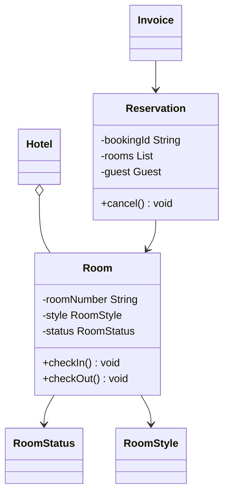

# LLD: Design a Hotel Management System

This design models hotel rooms, reservations, check-ins, invoicing, and housekeeping coordination.

---

## Requirements
1. **Rooms Management:** Various room categories (Standard, Deluxe, Suite) with states (`AVAILABLE`, `BOOKED`, `OCCUPIED`, `BEING_CLEANED`).
2. **Reservation Lifecycle:** Booking, modify booking, check-in, check-out.
3. **Housekeeping:** Auto-flag room as `BEING_CLEANED` on check-out; assign tasks to housekeepers.
4. **Billing & Invoicing:** Dynamically calculate stay price, room service add-ons, and taxes.

---

## Class Diagram



---

## Java Implementation

```java
import java.util.Date;
import java.util.List;

enum RoomStyle { STANDARD, DELUXE, SUITE }
enum RoomStatus { AVAILABLE, BOOKED, OCCUPIED, BEING_CLEANED }
enum ReservationStatus { ACTIVE, COMPLETED, CANCELLED }

class Room {
    private final String roomNumber;
    private final RoomStyle style;
    private double rate;
    private RoomStatus status = RoomStatus.AVAILABLE;

    public Room(String num, RoomStyle style, double rate) {
        this.roomNumber = num;
        this.style = style;
        this.rate = rate;
    }

    public synchronized void setStatus(RoomStatus status) { this.status = status; }
    public RoomStatus getStatus() { return status; }
    public double getRate() { return rate; }
}

class Guest {
    private String name;
    private String email;
}

class Reservation {
    private final String id;
    private final List<Room> bookedRooms;
    private final Guest guest;
    private final Date checkInDate;
    private ReservationStatus status = ReservationStatus.ACTIVE;

    public Reservation(String id, List<Room> rooms, Guest guest, Date in) {
        this.id = id;
        this.bookedRooms = rooms;
        this.guest = guest;
        this.checkInDate = in;
    }

    public void checkIn() {
        for (Room room : bookedRooms) {
            room.setStatus(RoomStatus.OCCUPIED);
        }
    }

    public void checkOut() {
        for (Room room : bookedRooms) {
            room.setStatus(RoomStatus.BEING_CLEANED);
        }
        this.status = ReservationStatus.COMPLETED;
    }
}

class Invoice {
    private final String invoiceId;
    private final double totalAmount;
    private boolean isPaid = false;

    public Invoice(String id, double amount) {
        this.invoiceId = id;
        this.totalAmount = amount;
    }
    public void markPaid() { this.isPaid = true; }
}
```

---

## Interview Q&A Corner

> [!TIP]
> **Q: How does this model scale if a guest extends their stay mid-visit?**
> A: Validate room availability for the extended days. If the room is already booked by another reservation, search for an upgrade or similar room category. If available, transfer the guest (creating a `RoomTransfer` audit log) and update the checkout date on the `Reservation`.
