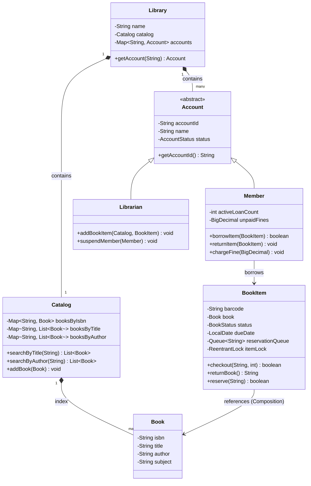
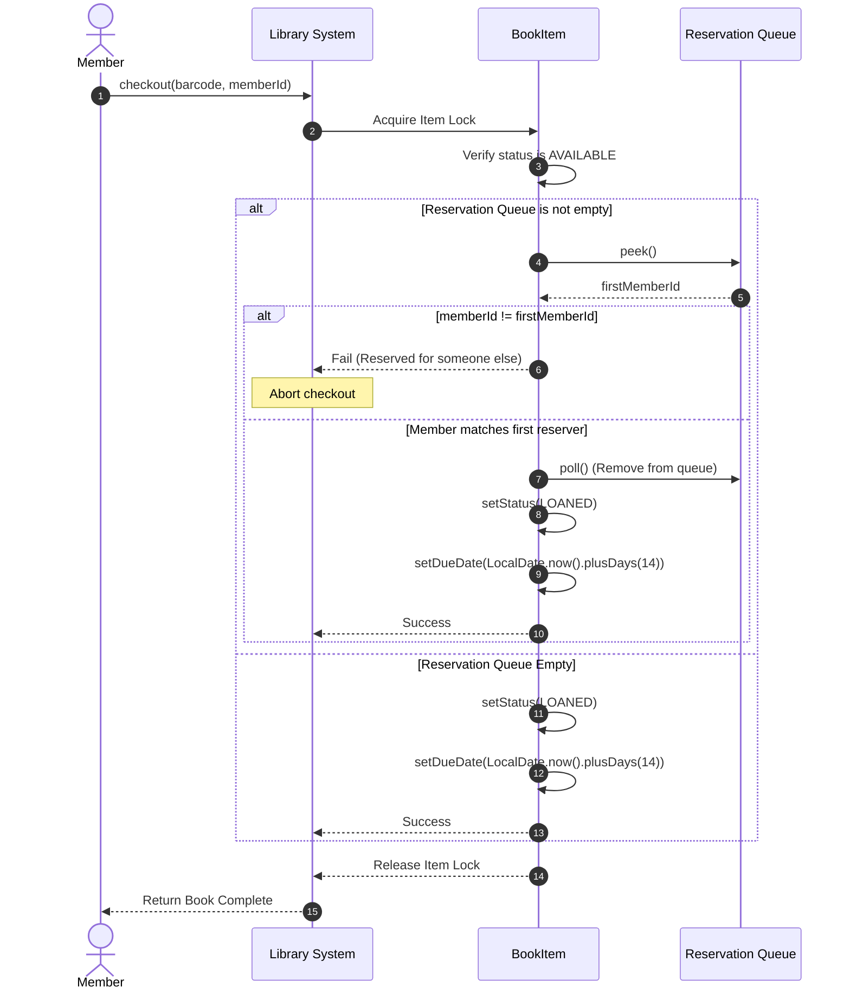

# LLD: Design a Library Management System

## 1. Core System Scope & Requirements

### Functional Requirements
1. **Catalog Indexing & Search:** Users can search for books by title, author, subject, or publication date. The catalog must offer $O(1)$ search complexity.
2. **Book vs. BookItem Decoupling:** 
   - `Book` represents the generic metadata (ISBN, Title, Author, Subject).
   - `BookItem` represents a physical copy in the library, identified by a unique barcode and tracking its own `BookStatus` (`AVAILABLE`, `LOANED`, `RESERVED`, `LOST`).
3. **Borrowing Limitations:** Members can borrow up to a maximum limit (e.g., 5 items) for a maximum duration (e.g., 14 days).
4. **Reservation Queue:** If a book item is currently loaned out, members can place a reservation request. When returned, the item is held for the first member in the reservation queue.
5. **Overdue Fine System:** Calculate fines for late returns (e.g., $1.00 per day past the due date). A member's card is suspended if unpaid fines exceed a specific threshold.

### Non-Functional Requirements
1. **Thread-Safe Checkouts:** Prevent race conditions where two members attempt to check out or reserve the exact same physical copy at the same time.
2. **Extensible User Hierarchy:** Polymorphic user actions for Members (borrow, return, reserve) and Librarians (add books, update status, cancel cards).

---

## 2. Visual Representation (Diagrams)

### UML Class Diagram



### Sequence Flow (Book Checkout with Reservation Queue check)



---

## 3. Violating Design vs. Refactored Design

### The Violating Design (Anti-Pattern)
In a poorly structured library system, `BookItem` inherits from `Book`, combining metadata with copy-specific data. Searches iterate over a list in $O(N)$ time, and there is no reservation queue.

```java
// VIOLATION: Subclassing metadata (BookItem extends Book), linear list searches, no synchronization
class BadBookItem extends Book {
    public String barcode;
    public String status; // "AVAILABLE", "LOANED"

    public BadBookItem(String isbn, String title, String author, String barcode) {
        super(isbn, title, author);
        this.barcode = barcode;
    }
}

class BadCatalog {
    public List<BadBookItem> items = new ArrayList<>();

    // O(N) search is slow and inefficient
    public BadBookItem search(String title) {
        for (BadBookItem item : items) {
            if (item.getTitle().equals(title)) return item;
        }
        return null;
    }
}
```

### Why it fails:
1. **Inheritance Abuse (Composition Violation):** Inheriting `BookItem` from `Book` duplicates metadata for each copy. If a library has 50 copies of "Inception", it holds 50 copies of the title, author, and description strings in memory.
2. **Linear Search Complexity:** A search through a list of 1,000,000 books runs in $O(N)$ time, causing unacceptable lag.
3. **No Reservation Logic:** If a book is checked out, other members cannot queue up for it, leading to inventory blockages.

---

## 4. Production-Ready Java Implementation

Below is a complete, concurrent Library Management System. It uses composition for Book items, pre-computed indexes in the Catalog for $O(1)$ search lookups, and a `ReentrantLock` per item to protect checkout states.

```java
import java.math.BigDecimal;
import java.time.LocalDate;
import java.time.temporal.ChronoUnit;
import java.util.*;
import java.util.concurrent.ConcurrentHashMap;
import java.util.concurrent.locks.ReentrantLock;

// --- Domain Enums ---
enum BookStatus {
    AVAILABLE, LOANED, RESERVED, LOST
}

enum AccountStatus {
    ACTIVE, SUSPENDED, CLOSED
}

// --- Domain Models ---
class Book {
    private final String isbn;
    private final String title;
    private final String author;
    private final String subject;

    public Book(String isbn, String title, String author, String subject) {
        this.isbn = isbn;
        this.title = title;
        this.author = author;
        this.subject = subject;
    }

    public String getIsbn() { return isbn; }
    public String getTitle() { return title; }
    public String getAuthor() { return author; }
    public String getSubject() { return subject; }
}

class BookItem {
    private final String barcode;
    private final Book book;
    private BookStatus status = BookStatus.AVAILABLE;
    private LocalDate dueDate;
    private final Queue<String> reservationQueue = new LinkedList<>();
    private final ReentrantLock itemLock = new ReentrantLock();

    public BookItem(String barcode, Book book) {
        this.barcode = barcode;
        this.book = book;
    }

    public String getBarcode() { return barcode; }
    public Book getBook() { return book; }
    public BookStatus getStatus() { return status; }
    public LocalDate getDueDate() { return dueDate; }

    public boolean checkout(String memberId, int durationDays) {
        itemLock.lock();
        try {
            if (status != BookStatus.AVAILABLE && status != BookStatus.RESERVED) {
                return false;
            }

            // Check reservation queue priority
            if (!reservationQueue.isEmpty()) {
                String nextInQueue = reservationQueue.peek();
                if (!memberId.equals(nextInQueue)) {
                    System.out.println("Item " + barcode + " is reserved for another member.");
                    return false; // Reserved for someone else
                }
                reservationQueue.poll(); // Remove member from queue
            }

            this.status = BookStatus.LOANED;
            this.dueDate = LocalDate.now().plusDays(durationDays);
            return true;
        } finally {
            itemLock.unlock();
        }
    }

    public String returnBook() {
        itemLock.lock();
        try {
            this.dueDate = null;
            if (!reservationQueue.isEmpty()) {
                this.status = BookStatus.RESERVED;
                return reservationQueue.peek(); // Notify next reserver
            }
            this.status = BookStatus.AVAILABLE;
            return null;
        } finally {
            itemLock.unlock();
        }
    }

    public boolean reserve(String memberId) {
        itemLock.lock();
        try {
            if (status == BookStatus.AVAILABLE) {
                this.status = BookStatus.RESERVED;
            }
            reservationQueue.offer(memberId);
            return true;
        } finally {
            itemLock.unlock();
        }
    }
}

// --- Accounts Hierarchy ---
abstract class Account {
    private final String accountId;
    private final String name;
    private AccountStatus status = AccountStatus.ACTIVE;

    public Account(String accountId, String name) {
        this.accountId = accountId;
        this.name = name;
    }

    public String getAccountId() { return accountId; }
    public String getName() { return name; }
    public AccountStatus getStatus() { return status; }
    public void setStatus(AccountStatus status) { this.status = status; }
}

class Member extends Account {
    private int activeLoanCount = 0;
    private BigDecimal unpaidFines = BigDecimal.ZERO;
    private final ReentrantLock memberLock = new ReentrantLock();

    public Member(String id, String name) {
        super(id, name);
    }

    public int getActiveLoanCount() { return activeLoanCount; }
    public BigDecimal getUnpaidFines() { return unpaidFines; }

    public boolean borrowItem(BookItem item) {
        memberLock.lock();
        try {
            if (getStatus() == AccountStatus.SUSPENDED) {
                System.out.println("Member account suspended due to unpaid fines.");
                return false;
            }
            if (activeLoanCount >= 5) {
                System.out.println("Borrowing limit (5) reached.");
                return false;
            }

            boolean success = item.checkout(getAccountId(), 14);
            if (success) {
                activeLoanCount++;
                return true;
            }
            return false;
        } finally {
            memberLock.unlock();
        }
    }

    public void returnItem(BookItem item) {
        memberLock.lock();
        try {
            LocalDate dueDate = item.getDueDate();
            String nextReserver = item.returnBook();
            activeLoanCount--;

            if (dueDate != null && LocalDate.now().isAfter(dueDate)) {
                long daysOverdue = ChronoUnit.DAYS.between(dueDate, LocalDate.now());
                BigDecimal fine = BigDecimal.valueOf(daysOverdue).multiply(new BigDecimal("1.00"));
                chargeFine(fine);
                System.out.println("Overdue return! Charged a fine of: $" + fine);
            }

            if (nextReserver != null) {
                System.out.println("Notify Member ID " + nextReserver + ": reserved book is ready.");
            }
        } finally {
            memberLock.unlock();
        }
    }

    public void chargeFine(BigDecimal amount) {
        memberLock.lock();
        try {
            this.unpaidFines = this.unpaidFines.add(amount);
            if (this.unpaidFines.compareTo(new BigDecimal("20.00")) > 0) {
                setStatus(AccountStatus.SUSPENDED);
            }
        } finally {
            memberLock.unlock();
        }
    }
}

// --- Pre-indexed Catalog search (O(1)) ---
class Catalog {
    private final Map<String, Book> isbnIndex = new ConcurrentHashMap<>();
    private final Map<String, List<Book>> titleIndex = new ConcurrentHashMap<>();
    private final Map<String, List<Book>> authorIndex = new ConcurrentHashMap<>();

    public void addBook(Book book) {
        isbnIndex.put(book.getIsbn(), book);
        titleIndex.computeIfAbsent(book.getTitle().toLowerCase(), k -> new ArrayList<>()).add(book);
        authorIndex.computeIfAbsent(book.getAuthor().toLowerCase(), k -> new ArrayList<>()).add(book);
    }

    public List<Book> searchByTitle(String title) {
        return titleIndex.getOrDefault(title.toLowerCase(), Collections.emptyList());
    }

    public List<Book> searchByAuthor(String author) {
        return authorIndex.getOrDefault(author.toLowerCase(), Collections.emptyList());
    }
}

// --- Client Driver ---
public class Main {
    public static void main(String[] args) {
        System.out.println("Initializing Library Management Engine...");

        Catalog catalog = new Catalog();

        Book book1 = new Book("978-01", "Clean Code", "Robert C. Martin", "Software Engineering");
        Book book2 = new Book("978-02", "Effective Java", "Joshua Bloch", "Java programming");

        catalog.addBook(book1);
        catalog.addBook(book2);

        BookItem copyA = new BookItem("BC-001", book1);
        BookItem copyB = new BookItem("BC-002", book1);

        Member member1 = new Member("M-01", "Alice");
        Member member2 = new Member("M-02", "Bob");

        // Scenario 1: Searching Catalog
        System.out.println("\nSearching Catalog for title: 'clean code'...");
        List<Book> matches = catalog.searchByTitle("Clean Code");
        System.out.println("Found match: " + matches.get(0).getTitle() + " by " + matches.get(0).getAuthor());

        // Scenario 2: Checkout copy A
        System.out.println("\nAlice checking out Copy A (BC-001)...");
        boolean borrowed = member1.borrowItem(copyA);
        System.out.println("Checkout Success? " + borrowed + " | Book Status: " + copyA.getStatus());

        // Scenario 3: Bob tries to checkout Copy A, fails, reserves it instead
        System.out.println("\nBob tries checking out Copy A...");
        boolean bobBorrowed = member2.borrowItem(copyA);
        System.out.println("Bob checkout status: " + bobBorrowed);

        System.out.println("Bob reserving Copy A...");
        copyA.reserve(member2.getAccountId());
        System.out.println("Copy A Reservation Queue check...");

        // Scenario 4: Alice returns Copy A, Bob is notified
        System.out.println("\nAlice returns Copy A...");
        member1.returnItem(copyA);
        System.out.println("Copy A Status after return: " + copyA.getStatus());

        // Scenario 5: Bob checks out reserved Copy A
        System.out.println("\nBob checking out Copy A now...");
        boolean bobBorrowedSuccess = member2.borrowItem(copyA);
        System.out.println("Bob Checkout Success? " + bobBorrowedSuccess);
    }
}
```

---

## 5. Edge Cases & Concurrency Handling

1. **Simultaneous Checkout of Same Copy:** Two members at different checkout terminals might try to check out the same physical copy (`BookItem`) at the exact same time. The Checkout operation is synchronized at the `BookItem` level using a `ReentrantLock` (`itemLock`). The first thread to acquire the lock validates the status as `AVAILABLE`, sets it to `LOANED`, and releases the lock. The second thread subsequently reads the status as `LOANED` and is rejected.
2. **Over-Borrowing Prevention:** The validation of the maximum limit (`activeLoanCount < 5`) is synchronized inside the `memberLock` of the `Member` object. This prevents race conditions where a member rapidly scans 6 books at once to bypass checkout limits.
3. **Queue Skipping Prevention:** If a book is `RESERVED` for Member A, and Member B finds the returned book on the shelf and tries to check it out, the `checkout()` method verifies if the reservation queue contains entries and checks if the active member matches the queue head. If not, the checkout fails.

---

## 6. Comprehensive Interview Q&A

### Q1: How do you structure searches on multiple attributes (e.g. search by title AND author)?
**A:** In memory, we implement this using the **Intersection of Sets**. The Catalog retrieves the list of books matching the title from `titleIndex` and the list matching the author from `authorIndex`. It converts both lists into HashSets and calls `setA.retainAll(setB)` to find the intersection of the two sets in $O(M+N)$ time. In a production system, we leverage Elasticsearch or DB compound indices.

### Q2: What is the difference between a Book and a BookItem, and why is this decoupling important?
**A:** This is a classic application of the **Flyweight Pattern** or Composition. A `Book` stores the heavy immutable metadata (Title, Author, ISBN, Synopsis). A `BookItem` contains only copy-specific variables (barcode, status, due date) and holds a reference to the `Book` object. This saves memory and prevents data duplication (e.g., if there are 100 physical copies of a book, we don't duplicate the synopsis string 100 times).

### Q3: How do you handle book loss? What transitions happen?
**A:** If a book is reported lost, the Librarian marks the `BookItem` status as `LOST`. The system charges a fine equal to the replacement cost of the book to the borrowing member's account. Once the fine is paid, the item is removed from the active loan logs.

### Q4: How would you implement a book renewal system?
**A:** We add a `renewItem(BookItem)` method to the `Member` class. It locks the `BookItem` and verifies:
1. The item is currently loaned to this member.
2. The item has not exceeded the maximum number of allowed renewals.
3. The reservation queue for this item is empty.
If all checks pass, the item's due date is extended by an additional 14 days.
