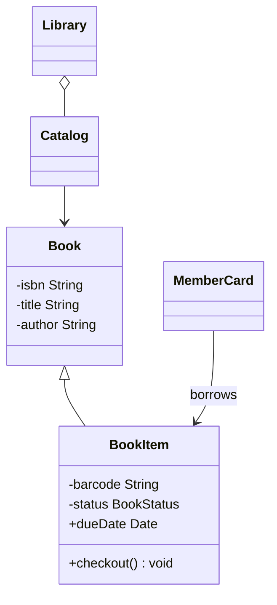

# LLD: Design a Library Management System

This design models books, multiple physical copies (BookItems), catalog search strategies, member loans, and fine calculations.

---

## Requirements
1. **Catalog Search:** Multi-attribute search (by Title, Author, Subject).
2. **Book vs BookItem:** A `Book` holds metadata. A `BookItem` represents a physical copy with a barcode and status (`AVAILABLE`, `LOANED`, `RESERVED`, `LOST`).
3. **Membership Limitations:** Limit active loans (e.g. max 5 books) and duration (e.g. 14 days).
4. **Fines System:** Calculate fines for late returns ($1/day).

---

## Class Diagram



---

## Java Implementation

```java
import java.time.LocalDate;
import java.time.temporal.ChronoUnit;
import java.util.*;

enum BookStatus { AVAILABLE, LOANED, RESERVED, LOST }

class Book {
    private final String isbn;
    private final String title;
    private final String author;

    public Book(String isbn, String title, String author) {
        this.isbn = isbn;
        this.title = title;
        this.author = author;
    }
    public String getTitle() { return title; }
    public String getAuthor() { return author; }
}

class BookItem extends Book {
    private final String barcode;
    private BookStatus status = BookStatus.AVAILABLE;
    private LocalDate dueDate;

    public BookItem(String isbn, String title, String author, String barcode) {
        super(isbn, title, author);
        this.barcode = barcode;
    }

    public synchronized boolean checkout(int durationDays) {
        if (status == BookStatus.AVAILABLE) {
            this.status = BookStatus.LOANED;
            this.dueDate = LocalDate.now().plusDays(durationDays);
            return true;
        }
        return false;
    }

    public synchronized void returnBook() {
        this.status = BookStatus.AVAILABLE;
        this.dueDate = null;
    }

    public LocalDate getDueDate() { return dueDate; }
}

class LibraryCard {
    private final String id;
    private final List<BookItem> borrowedItems = new ArrayList<>();

    public LibraryCard(String id) { this.id = id; }
    public List<BookItem> getBorrowedItems() { return borrowedItems; }

    public boolean borrow(BookItem item) {
        if (borrowedItems.size() >= 5) {
            System.out.println("Maximum checkout limit reached!");
            return false;
        }
        if (item.checkout(14)) {
            borrowedItems.add(item);
            return true;
        }
        return false;
    }

    public double returnItem(BookItem item) {
        borrowedItems.remove(item);
        LocalDate dueDate = item.getDueDate();
        item.returnBook();

        // Calculate fine
        if (LocalDate.now().isAfter(dueDate)) {
            long daysLate = ChronoUnit.DAYS.between(dueDate, LocalDate.now());
            return daysLate * 1.0; // $1.00 fine per day
        }
        return 0.0;
    }
}
```

---

## Interview Q&A Corner

> [!NOTE]
> **Q: How should Search be optimized in the Catalog class?**
> A: Maintaining a linear list search in memory is $O(N)$ and inefficient. In LLD, represent the catalog index using HashMap lookup structures:
> `Map<String, List<Book>> titleIndex;`
> `Map<String, List<Book>> authorIndex;`
> When books are added, insert references into these pre-computed maps to achieve $O(1)$ search lookups.
