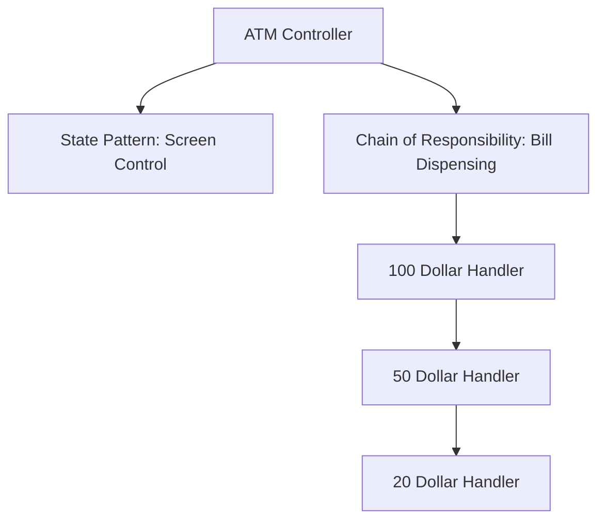

# LLD: Design an ATM (Automated Teller Machine)

This design uses the **State Pattern** to control screen states and the **Chain of Responsibility Pattern** to dispense currency denominations.

---

## Requirements
1. **Denomination Allocation:** Dispense cash using the minimum number of bills (e.g., $100, $50, $20, $10).
2. **State Machine Transitions:** `IDLE` -> `CARD_INSERTED` -> `PIN_ENTERED` -> `CASH_DISPENSE` -> `TRANSACTION_COMPLETED` (or error rollbacks).
3. **Card Reading & Balance Checks:** Interacting with banking databases.

---

## Architecture Flow



---

## Java Implementation

### 1. Dispense Chain (Chain of Responsibility)
```java
abstract class CashDispenser {
    protected CashDispenser next;
    public void setNext(CashDispenser next) { this.next = next; }

    public void dispense(int amount) {
        if (next != null) next.dispense(amount);
    }
}

class Dollar100Dispenser extends CashDispenser {
    public void dispense(int amount) {
        int numBills = amount / 100;
        int remainder = amount % 100;
        if (numBills > 0) {
            System.out.println("Dispensing " + numBills + " x $100 bills");
        }
        if (remainder > 0) super.dispense(remainder);
    }
}

class Dollar50Dispenser extends CashDispenser {
    public void dispense(int amount) {
        int numBills = amount / 50;
        int remainder = amount % 50;
        if (numBills > 0) {
            System.out.println("Dispensing " + numBills + " x $50 bills");
        }
        if (remainder > 0) super.dispense(remainder);
    }
}
```

### 2. State Controller
```java
interface ATMState {
    void insertCard();
    void enterPin(int pin);
    void withdrawCash(int amount);
}

class ATMController {
    private ATMState currentState;
    private final CashDispenser dispenserChain;

    public ATMController() {
        // Setup cash dispenser chain
        Dollar100Dispenser d100 = new Dollar100Dispenser();
        Dollar50Dispenser d50 = new Dollar50Dispenser();
        d100.setNext(d50);
        this.dispenserChain = d100;
    }

    public void setState(ATMState state) { this.currentState = state; }
    public void dispenseCash(int amount) {
        dispenserChain.dispense(amount);
    }
}
```

---

## Interview Q&A Corner

> [!WARNING]
> **Q: How does the system handle transaction failures midway through dispensing cash?**
> A: Use a **Two-Phase Commit (2PC)** style transaction lifecycle:
> 1. Reserve balance on the user account database (DB hold).
> 2. Direct ATM hardware to dispense cash.
> 3. Verify hardware success feedback. If success: commit account balance debit. If failure (e.g. paper jam): rollback the DB hold and notify the user.
