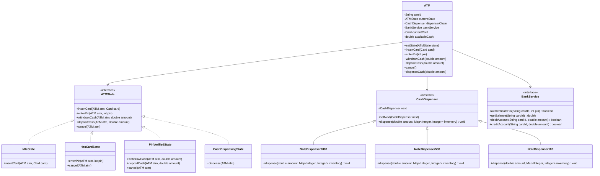
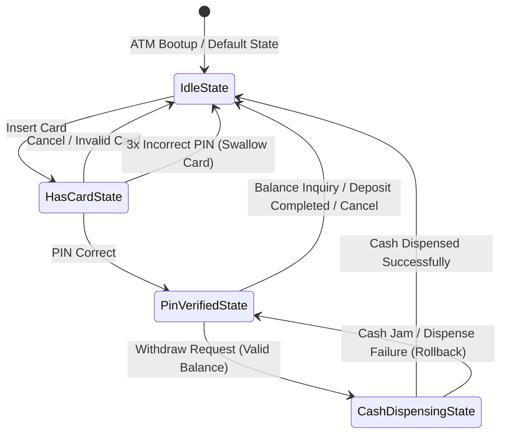

# Low-Level Design: ATM (Automated Teller Machine)

This document presents a comprehensive, production-grade Low-Level Design (LLD) for an Automated Teller Machine (ATM) system using Java.

---

## 1. Core System Scope & Requirements

### 1.1 Functional Requirements
1. **User Authentication:** Users insert their card, and the system reads the card details. The user enters a PIN, which is validated against the bank server. The card is locked/blocked after 3 consecutive failed attempts.
2. **Cash Withdrawal:** Users can withdraw cash in various denominations. The ATM should dispense cash using the minimum number of bills available in its physical dispenser vaults.
3. **Balance Inquiry:** Users can view their current account balance.
4. **Deposit Support:** Users can deposit cash or checks (validated by slot scanners).
5. **Transaction Status & Rollback:** Transactions must be atomic. If cash dispensing fails physically (e.g., cash jam, power failure), the transaction must roll back, ensuring no balance is debited.
6. **State Transitions:** The ATM acts as a strict state machine (`IDLE` -> `CARD_INSERTED` -> `PIN_ENTERED` -> `TRANSACTION_SELECTION` -> `CASH_DISPENSING` -> `TICKET_PRINTING` -> `IDLE`).

### 1.2 Non-Functional Requirements
1. **Thread Safety & Concurrency:** The system must handle concurrent balance update requests (e.g., two ATMs accessing the same account simultaneously) using database locks or thread synchronization models.
2. **Security:** End-to-end encryption for PIN verification. Secure communications between the ATM and the core banking system.
3. **Reliability & Audit Logging:** Detailed hardware logs and transaction logs for reconciliation.
4. **Extensibility:** Easily add new cash denominations or supporting components (e.g., biometric authentication) without rewriting core logic.

---

## 2. Visual Representation

### 2.1 UML Class Diagram


### 2.2 State Transition Diagram


---

## 3. Complete Domain Model & Entities

```java
package lowleveldesign.atm;

import java.util.Date;

// Domain Entity representing a physical debit/credit card
public class Card {
    private final String cardNumber;
    private final String cardHolderName;
    private final Date expiryDate;
    private final String cvv;
    private int pinHash;
    private boolean isBlocked;
    private int failedPinAttempts;

    public Card(String cardNumber, String cardHolderName, Date expiryDate, String cvv, int pinHash) {
        this.cardNumber = cardNumber;
        this.cardHolderName = cardHolderName;
        this.expiryDate = expiryDate;
        this.cvv = cvv;
        this.pinHash = pinHash;
        this.isBlocked = false;
        this.failedPinAttempts = 0;
    }

    public String getCardNumber() { return cardNumber; }
    public int getPinHash() { return pinHash; }
    public boolean isBlocked() { return isBlocked; }
    
    public void incrementFailedPinAttempts() {
        this.failedPinAttempts++;
        if (this.failedPinAttempts >= 3) {
            this.isBlocked = true;
        }
    }
    
    public void resetFailedAttempts() {
        this.failedPinAttempts = 0;
    }
}

// Domain Entity representing a bank account
public class Account {
    private final String accountId;
    private final String accountNumber;
    private double balance;

    public Account(String accountId, String accountNumber, double initialBalance) {
        this.accountId = accountId;
        this.accountNumber = accountNumber;
        this.balance = initialBalance;
    }

    public String getAccountId() { return accountId; }
    public double getBalance() { return balance; }

    public synchronized void debit(double amount) {
        if (amount <= 0) throw new IllegalArgumentException("Invalid debit amount");
        if (this.balance < amount) throw new IllegalStateException("Insufficient funds");
        this.balance -= amount;
    }

    public synchronized void credit(double amount) {
        if (amount <= 0) throw new IllegalArgumentException("Invalid credit amount");
        this.balance += amount;
    }
}
```

---

## 4. Production-Ready Java Implementation

### 4.1 State Pattern Interfaces & Concrete States
```java
package lowleveldesign.atm;

import java.util.Map;

// ATM Custom Exceptions
class ATMException extends RuntimeException {
    public ATMException(String message) { super(message); }
}
class InsufficientFundsException extends ATMException {
    public InsufficientFundsException(String msg) { super(msg); }
}
class BlockedCardException extends ATMException {
    public BlockedCardException(String msg) { super(msg); }
}
class HardwareException extends ATMException {
    public HardwareException(String msg) { super(msg); }
}

// State Interface
interface ATMState {
    void insertCard(ATM atm, Card card);
    void enterPin(ATM atm, int pin);
    void withdrawCash(ATM atm, double amount);
    void depositCash(ATM atm, double amount);
    void cancel(ATM atm);
}

// Idle State
class IdleState implements ATMState {
    @Override
    public void insertCard(ATM atm, Card card) {
        if (card.isBlocked()) {
            throw new BlockedCardException("This card is blocked.");
        }
        atm.setCurrentCard(card);
        atm.setState(new HasCardState());
        System.out.println("Card read successfully. Please enter PIN.");
    }

    @Override
    public void enterPin(ATM atm, int pin) { throw new ATMException("Please insert card first."); }
    @Override
    public void withdrawCash(ATM atm, double amount) { throw new ATMException("Please insert card first."); }
    @Override
    public void depositCash(ATM atm, double amount) { throw new ATMException("Please insert card first."); }
    @Override
    public void cancel(ATM atm) { System.out.println("Nothing to cancel."); }
}

// Has Card State
class HasCardState implements ATMState {
    @Override
    public void insertCard(ATM atm, Card card) { throw new ATMException("Card already inserted."); }

    @Override
    public void enterPin(ATM atm, int pin) {
        Card card = atm.getCurrentCard();
        boolean isValid = atm.getBankService().authenticatePin(card.getCardNumber(), pin);
        if (isValid) {
            card.resetFailedAttempts();
            atm.setState(new PinVerifiedState());
            System.out.println("PIN validated. Select transaction.");
        } else {
            card.incrementFailedPinAttempts();
            if (card.isBlocked()) {
                atm.setState(new IdleState());
                atm.setCurrentCard(null);
                throw new BlockedCardException("PIN entered incorrectly 3 times. Card swallowed/blocked.");
            }
            throw new ATMException("Incorrect PIN. Please try again.");
        }
    }

    @Override
    public void withdrawCash(ATM atm, double amount) { throw new ATMException("Please enter PIN first."); }
    @Override
    public void depositCash(ATM atm, double amount) { throw new ATMException("Please enter PIN first."); }

    @Override
    public void cancel(ATM atm) {
        atm.setCurrentCard(null);
        atm.setState(new IdleState());
        System.out.println("Card returned. ATM is now Idle.");
    }
}

// Pin Verified State
class PinVerifiedState implements ATMState {
    @Override
    public void insertCard(ATM atm, Card card) { throw new ATMException("Card already inserted."); }
    @Override
    public void enterPin(ATM atm, int pin) { throw new ATMException("PIN already verified."); }

    @Override
    public void withdrawCash(ATM atm, double amount) {
        if (amount > atm.getAvailableCash()) {
            throw new InsufficientFundsException("ATM has insufficient physical cash.");
        }
        
        BankService bank = atm.getBankService();
        String cardNum = atm.getCurrentCard().getCardNumber();
        
        // Step 1: Pre-auth / Account debit check
        boolean success = bank.debitAccount(cardNum, amount);
        if (!success) {
            throw new InsufficientFundsException("Insufficient funds in account.");
        }

        // Step 2: Transition to Cash Dispensing State
        atm.setState(new CashDispensingState());
        try {
            atm.dispenseCash(amount);
            System.out.println("Withdrawal complete. Please collect your cash.");
        } catch (HardwareException he) {
            // Rollback account debit in case of hardware failure
            bank.creditAccount(cardNum, amount);
            System.out.println("Rollback complete due to hardware failure.");
            throw he;
        } finally {
            // Return to Idle State
            atm.setCurrentCard(null);
            atm.setState(new IdleState());
        }
    }

    @Override
    public void depositCash(ATM atm, double amount) {
        BankService bank = atm.getBankService();
        String cardNum = atm.getCurrentCard().getCardNumber();
        bank.creditAccount(cardNum, amount);
        atm.addCash(amount);
        System.out.println("Deposit of " + amount + " processed successfully.");
        atm.setCurrentCard(null);
        atm.setState(new IdleState());
    }

    @Override
    public void cancel(ATM atm) {
        atm.setCurrentCard(null);
        atm.setState(new IdleState());
        System.out.println("Transaction cancelled. Card returned.");
    }
}

// Cash Dispensing State (Intermediate processing state)
class CashDispensingState implements ATMState {
    @Override
    public void insertCard(ATM atm, Card card) { throw new ATMException("ATM currently dispensing cash."); }
    @Override
    public void enterPin(ATM atm, int pin) { throw new ATMException("ATM currently dispensing cash."); }
    @Override
    public void withdrawCash(ATM atm, double amount) { throw new ATMException("ATM currently dispensing cash."); }
    @Override
    public void depositCash(ATM atm, double amount) { throw new ATMException("ATM currently dispensing cash."); }
    @Override
    public void cancel(ATM atm) { throw new ATMException("Cannot cancel during cash dispensing."); }
}
```

### 4.2 Bill Dispenser (Chain of Responsibility)
```java
package lowleveldesign.atm;

import java.util.HashMap;
import java.util.Map;

// Base Dispenser class
abstract class CashDispenser {
    protected CashDispenser next;

    public void setNext(CashDispenser next) {
        this.next = next;
    }

    public abstract void dispense(int amount, Map<Integer, Integer> resultBills, Map<Integer, Integer> vaultInventory);
}

// Dispenser for $2000 bills
class NoteDispenser2000 extends CashDispenser {
    @Override
    public void dispense(int amount, Map<Integer, Integer> resultBills, Map<Integer, Integer> vaultInventory) {
        int noteVal = 2000;
        int requiredNotes = amount / noteVal;
        int availableNotes = vaultInventory.getOrDefault(noteVal, 0);
        int notesToDispense = Math.min(requiredNotes, availableNotes);

        int remainder = amount - (notesToDispense * noteVal);
        if (notesToDispense > 0) {
            resultBills.put(noteVal, notesToDispense);
            vaultInventory.put(noteVal, availableNotes - notesToDispense);
        }

        if (remainder > 0) {
            if (next == null) {
                throw new ATMException("Cannot dispense the exact amount requested.");
            }
            next.dispense(remainder, resultBills, vaultInventory);
        }
    }
}

// Dispenser for $500 bills
class NoteDispenser500 extends CashDispenser {
    @Override
    public void dispense(int amount, Map<Integer, Integer> resultBills, Map<Integer, Integer> vaultInventory) {
        int noteVal = 500;
        int requiredNotes = amount / noteVal;
        int availableNotes = vaultInventory.getOrDefault(noteVal, 0);
        int notesToDispense = Math.min(requiredNotes, availableNotes);

        int remainder = amount - (notesToDispense * noteVal);
        if (notesToDispense > 0) {
            resultBills.put(noteVal, notesToDispense);
            vaultInventory.put(noteVal, availableNotes - notesToDispense);
        }

        if (remainder > 0) {
            if (next == null) {
                throw new ATMException("Cannot dispense the exact amount requested.");
            }
            next.dispense(remainder, resultBills, vaultInventory);
        }
    }
}

// Dispenser for $100 bills
class NoteDispenser100 extends CashDispenser {
    @Override
    public void dispense(int amount, Map<Integer, Integer> resultBills, Map<Integer, Integer> vaultInventory) {
        int noteVal = 100;
        int requiredNotes = amount / noteVal;
        int availableNotes = vaultInventory.getOrDefault(noteVal, 0);
        int notesToDispense = Math.min(requiredNotes, availableNotes);

        int remainder = amount - (notesToDispense * noteVal);
        if (notesToDispense > 0) {
            resultBills.put(noteVal, notesToDispense);
            vaultInventory.put(noteVal, availableNotes - notesToDispense);
        }

        if (remainder > 0) {
            if (next == null) {
                throw new ATMException("Cannot dispense the exact amount requested with available denominations.");
            }
            next.dispense(remainder, resultBills, vaultInventory);
        }
    }
}
```

### 4.3 ATM System & Bank Service Implementation
```java
package lowleveldesign.atm;

import java.util.HashMap;
import java.util.Map;
import java.util.concurrent.locks.ReentrantLock;

// Simulated Core Bank Service
interface BankService {
    boolean authenticatePin(String cardNumber, int pin);
    double getBalance(String cardNumber);
    boolean debitAccount(String cardNumber, double amount);
    boolean creditAccount(String cardNumber, double amount);
}

class BankServiceImpl implements BankService {
    private final Map<String, Account> accounts = new HashMap<>();
    private final Map<String, Integer> pinDatabase = new HashMap<>();

    public void addAccount(String cardNumber, Account acc, int pin) {
        accounts.put(cardNumber, acc);
        pinDatabase.put(cardNumber, pin);
    }

    @Override
    public boolean authenticatePin(String cardNumber, int pin) {
        return pinDatabase.containsKey(cardNumber) && pinDatabase.get(cardNumber) == pin;
    }

    @Override
    public double getBalance(String cardNumber) {
        return accounts.get(cardNumber).getBalance();
    }

    @Override
    public synchronized boolean debitAccount(String cardNumber, double amount) {
        Account account = accounts.get(cardNumber);
        if (account != null && account.getBalance() >= amount) {
            account.debit(amount);
            return true;
        }
        return false;
    }

    @Override
    public synchronized boolean creditAccount(String cardNumber, double amount) {
        Account account = accounts.get(cardNumber);
        if (account != null) {
            account.credit(amount);
            return true;
        }
        return false;
    }
}

// Complete ATM Main Device Class
public class ATM {
    private final String atmId;
    private ATMState currentState;
    private final BankService bankService;
    private Card currentCard;
    private final Map<Integer, Integer> vaultInventory = new HashMap<>();
    private final CashDispenser dispenserChain;
    private final ReentrantLock lock = new ReentrantLock();

    public ATM(String atmId, BankService bankService) {
        this.atmId = atmId;
        this.bankService = bankService;
        this.currentState = new IdleState();

        // Build Dispenser Chain
        CashDispenser d2000 = new NoteDispenser2000();
        CashDispenser d500 = new NoteDispenser500();
        CashDispenser d100 = new NoteDispenser100();
        d2000.setNext(d500);
        d500.setNext(d100);
        this.dispenserChain = d2000;
    }

    public void setState(ATMState state) { this.currentState = state; }
    public ATMState getCurrentState() { return currentState; }
    public BankService getBankService() { return bankService; }
    public void setCurrentCard(Card card) { this.currentCard = card; }
    public Card getCurrentCard() { return currentCard; }

    public void loadCash(int noteValue, int count) {
        lock.lock();
        try {
            vaultInventory.put(noteValue, vaultInventory.getOrDefault(noteValue, 0) + count);
        } finally {
            lock.unlock();
        }
    }

    public void addCash(double amount) {
        // Safe addition from deposits
        loadCash(100, (int) (amount / 100));
    }

    public double getAvailableCash() {
        lock.lock();
        try {
            return vaultInventory.entrySet().stream()
                    .mapToDouble(e -> e.getKey() * e.getValue())
                    .sum();
        } finally {
            lock.unlock();
        }
    }

    public void insertCard(Card card) { currentState.insertCard(this, card); }
    public void enterPin(int pin) { currentState.enterPin(this, pin); }
    
    public void withdrawCash(double amount) {
        lock.lock();
        try {
            currentState.withdrawCash(this, amount);
        } finally {
            lock.unlock();
        }
    }

    public void depositCash(double amount) {
        lock.lock();
        try {
            currentState.depositCash(this, amount);
        } finally {
            lock.unlock();
        }
    }

    public void cancel() { currentState.cancel(this); }

    // Internal method to handle cash dispensation via hardware
    public void dispenseCash(double amount) {
        Map<Integer, Integer> resultBills = new HashMap<>();
        // Make a copy of inventory to process transaction isolation
        Map<Integer, Integer> inventoryCopy = new HashMap<>(vaultInventory);

        try {
            dispenserChain.dispense((int) amount, resultBills, inventoryCopy);
            
            // Simulating hardware check (1% failure chance)
            if (Math.random() < 0.01) {
                throw new HardwareException("Physical dispenser jam detected.");
            }

            // Commit cash subtraction
            vaultInventory.clear();
            vaultInventory.putAll(inventoryCopy);
            System.out.println("Dispensed Notes: " + resultBills);
        } catch (Exception e) {
            throw new HardwareException("Hardware Dispensation Failed: " + e.getMessage());
        }
    }
}
```

### 4.4 Client Driver Program
```java
package lowleveldesign.atm;

import java.util.Date;

public class ATMDriver {
    public static void main(String[] args) {
        // Initialize bank services and account
        BankServiceImpl bank = new BankServiceImpl();
        Account userAccount = new Account("ACC01", "123456789", 5000.0);
        Card userCard = new Card("CARD01", "John Doe", new Date(), "123", 1111);
        bank.addAccount("CARD01", userAccount, 1111);

        // Initialize ATM
        ATM atm = new ATM("ATM-MUM-01", bank);
        atm.loadCash(2000, 2); // 4000
        atm.loadCash(500, 4);  // 2000
        atm.loadCash(100, 10); // 1000 => Total physical cash = 7000

        System.out.println("==== Test Case 1: Valid Withdrawal ====");
        atm.insertCard(userCard);
        atm.enterPin(1111);
        atm.withdrawCash(2600); // Should dispense 1x2000, 1x500, 1x100
        System.out.println("Remaining Balance: " + bank.getBalance("CARD01"));

        System.out.println("\n==== Test Case 2: Out of Sequence Transaction ====");
        try {
            atm.withdrawCash(1000);
        } catch (Exception e) {
            System.out.println("Exception handled: " + e.getMessage());
        }

        System.out.println("\n==== Test Case 3: Block Card on Invalid Pins ====");
        Card anotherCard = new Card("CARD02", "Jane Doe", new Date(), "456", 2222);
        bank.addAccount("CARD02", new Account("ACC02", "987654321", 10000.0), 2222);
        
        atm.insertCard(anotherCard);
        for (int i = 0; i < 3; i++) {
            try {
                atm.enterPin(9999);
            } catch (Exception e) {
                System.out.println("Attempt " + (i+1) + " failed: " + e.getMessage());
            }
        }
    }
}
```

---

## 5. Edge Cases & Concurrency Handling

1. **Double Spending (Concurrent Withdrawal from Multiple ATMs):**
   * *Problem:* A user has $1,000. They insert cards linked to the same account in two different ATMs and execute withdraws of $1,000 at the exact same millisecond.
   * *Solution:* Resolved via DB transaction isolation level `SERIALIZABLE` or select-for-update rows blocking on the central banking database (`BankServiceImpl.debitAccount` contains a synchronized block, which in real-life translates to a Row Lock in the database).
2. **Physical Jam midway through Dispense:**
   * *Problem:* Bills are partially dispensed, and a mechanical jam occurs.
   * *Solution:* The state transition implements a rollback model (`PinVerifiedState.withdrawCash` wraps the physical action inside a try-catch, invoking `bank.creditAccount` if a `HardwareException` is thrown).
3. **Denomination Shortage:**
   * *Problem:* The user requests $600. The ATM has $100 bills but no $500 bills, or vice-versa.
   * *Solution:* The Chain of Responsibility dispenser dynamically reads available vault inventory. If one node (e.g., $500) has 0 notes, it forwards the entire remainder to the next node in the chain ($100).
4. **Sudden ATM Power Outage:**
   * *Problem:* Power fails during transition.
   * *Solution:* The physical ATM hardware contains a local non-volatile journal (disk write-ahead log). Once the system boots back up, it compares the physical cash container sensors with the recorded transaction status and reconciliation registers.

---

## 6. Comprehensive Interview Q&A

### Q1: Why use the State Pattern instead of switch-case statements inside the ATM controller?
**Answer:** The ATM has complex state-dependent logic. With switch-cases, adding a new state (e.g., `BiometricVerifiedState` or `OtpVerificationState`) requires modifying every method inside the ATM Controller (e.g., `insertCard`, `enterPin`, `withdraw`). The State Pattern makes the design Open-Closed compliant; new states are added as separate classes implementing the `ATMState` interface, localizing state transition logic.

### Q2: What are the benefits of the Chain of Responsibility for bill dispensing? How is it modified for dynamic denomination selection?
**Answer:** The Chain of Responsibility isolates note dispensing logic into separate classes ($2000 dispenser, $500 dispenser, $100 dispenser). This simplifies adding new notes (e.g., $200 bills). For dynamic note optimization (e.g., trying to minimize bills dispensed or keeping an even distribution), the chain can read the cash inventory map and apply dynamic programming/backtracking locally in the dispenser manager before executing physical movements.

### Q3: How do we handle network partitions between the ATM and the Bank Server?
**Answer:** The ATM operates strictly as a dependent client. In a network partition, it must fail-safe. No local balance database is cached on the ATM. Any write operation requires synchronization with the bank's transaction processor. If the connection drops during transaction commit phase, the transaction defaults to **aborted**, cash remains in the vault, and the user's account hold is released by the bank's transaction coordinator using timeout reconciliation.

### Q4: Explain the difference in concurrency handling between the ATM's physical lock and the Account balance lock.
**Answer:** 
* The **ATM physical lock** (e.g., `ReentrantLock` in `ATM`) prevents a single physical machine from processing multiple cards/transactions concurrently at the physical deck level.
* The **Account lock** (e.g., Row locking or synchronized `debit` on `Account`) prevents concurrent operations on the *same account balance* regardless of which physical ATM is being used across the country. Both levels of security are required.
