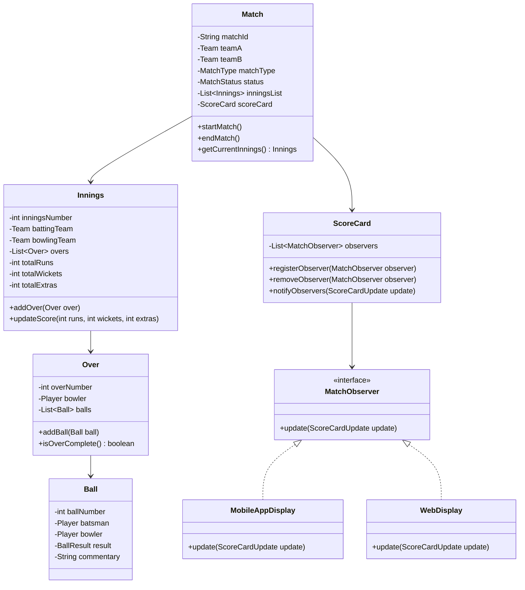
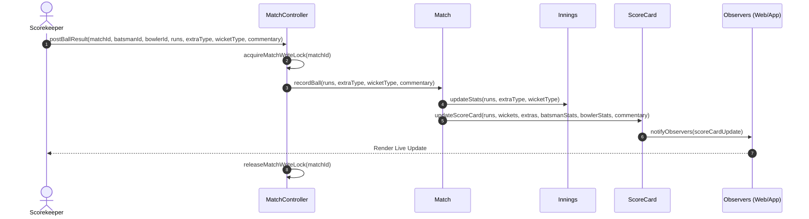

# Low-Level Design: Cricinfo / Cricbuzz (Live Scoreboard)

This document details the Low-Level Design (LLD) for a real-time cricket scoreboard and commentary system like Cricinfo or Cricbuzz.

---

## 1. Core System Scope & Requirements

### 1.1 Functional Requirements
1. **Match Structuring & Formats:** Support multiple cricket formats (T20, ODI, Test). Each match consists of multiple innings (2 for ODI/T20, 4 for Test).
2. **Real-time Scorecard Tracking:** Track runs, wickets, overs, extras (wides, no-balls, byes, leg-byes), and current run rate (CRR) / required run rate (RRR).
3. **Player Statistics:** Maintain live individual statistics for batters (runs, balls faced, 4s, 6s, strike rate) and bowlers (overs, maidens, runs conceded, wickets, economy).
4. **Ball-by-Ball Live Commentary:** Record and display detailed text commentary for every ball.
5. **Real-time Notifications (Observer Pattern):** Broadcast scoreboard and commentary updates immediately to various channels (Web client, Mobile app, Admin dashboards, third-party APIs).
6. **Admin Scoring Control:** Provide thread-safe controls for match scorekeepers (admins) to enter ball results.

### 1.2 Non-Functional Requirements
1. **Low Latency & High Read Throughput:** Scorecard displays must be updated within sub-seconds of the admin's input.
2. **Thread Safety & Data Consistency:** Handle concurrent read requests during frequent writes. Block multiple concurrent scorekeepers from entering inconsistent data for the same match.
3. **Decoupled Architecture:** Read clients should not directly query the admin write database.
4. **Reliability:** Keep historical records of matches, players, and overs for post-match statistics.

---

## 2. Visual Representation

### 2.1 UML Class Diagram


### 2.2 Sequence Diagram: Scoring a Ball


---

## 3. Complete Domain Model & Entities

```java
package lowleveldesign.cricinfo;

public enum MatchType { T20, ODI, TEST }
public enum MatchStatus { SCHEDULED, IN_PROGRESS, COMPLETED, ABANDONED }
public enum ExtraType { NONE, WIDE, NO_BALL, BYE, LEG_BYE }
public enum WicketType { NONE, BOWLED, CAUGHT, LBW, RUN_OUT, STUMPED, HIT_WICKET }

// Domain Entity representing a Player
class Player {
    private final String playerId;
    private final String name;
    private final String role; // BATSMAN, BOWLER, ALL_ROUNDER, WICKET_KEEPER

    public Player(String playerId, String name, String role) {
        this.playerId = playerId;
        this.name = name;
        this.role = role;
    }

    public String getPlayerId() { return playerId; }
    public String getName() { return name; }
    public String getRole() { return role; }
}

// Domain Entity representing a Team
import java.util.List;

class Team {
    private final String teamId;
    private final String teamName;
    private final List<Player> playingEleven;

    public Team(String teamId, String teamName, List<Player> playingEleven) {
        this.teamId = teamId;
        this.teamName = teamName;
        this.playingEleven = playingEleven;
    }

    public String getTeamId() { return teamId; }
    public String getTeamName() { return teamName; }
    public List<Player> getPlayingEleven() { return playingEleven; }
}
```

---

## 4. Production-Ready Java Implementation

### 4.1 Statistics Trackers
```java
package lowleveldesign.cricinfo;

class BatsmanStats {
    int runs = 0;
    int ballsFaced = 0;
    int fours = 0;
    int sixes = 0;

    public synchronized void recordBall(int runsScored, boolean isExtraBall) {
        if (!isExtraBall) {
            ballsFaced++;
        }
        if (runsScored == 4) fours++;
        if (runsScored == 6) sixes++;
        this.runs += runsScored;
    }

    public double getStrikeRate() {
        if (ballsFaced == 0) return 0.0;
        return ((double) runs / ballsFaced) * 100.0;
    }
}

class BowlerStats {
    int ballsBowled = 0;
    int runsConceded = 0;
    int wickets = 0;
    int maidens = 0;

    public synchronized void recordBall(int runsConceded, boolean isWicket, boolean isExtraBall) {
        if (!isExtraBall) {
            ballsBowled++;
        }
        this.runsConceded += runsConceded;
        if (isWicket) wickets++;
    }

    public String getOvers() {
        int overs = ballsBowled / 6;
        int balls = ballsBowled % 6;
        return overs + "." + balls;
    }

    public double getEconomy() {
        if (ballsBowled == 0) return 0.0;
        double overs = ballsBowled / 6.0;
        return runsConceded / overs;
    }
}
```

### 4.2 Core Logic & Observer Pattern
```java
package lowleveldesign.cricinfo;

import java.util.ArrayList;
import java.util.HashMap;
import java.util.List;
import java.util.Map;

// Update payload for Observers
class ScoreCardUpdate {
    public final String matchId;
    public final int runs;
    public final int wickets;
    public final String overs;
    public final String commentary;
    public final String batsmanName;
    public final int batsmanRuns;
    public final String bowlerName;
    public final int bowlerWickets;

    public ScoreCardUpdate(String matchId, int runs, int wickets, String overs, String commentary, 
                           String batsmanName, int batsmanRuns, String bowlerName, int bowlerWickets) {
        this.matchId = matchId;
        this.runs = runs;
        this.wickets = wickets;
        this.overs = overs;
        this.commentary = commentary;
        this.batsmanName = batsmanName;
        this.batsmanRuns = batsmanRuns;
        this.bowlerName = bowlerName;
        this.bowlerWickets = bowlerWickets;
    }
}

// Observer interface
interface MatchObserver {
    void update(ScoreCardUpdate update);
}

// ScoreCard (Subject)
class ScoreCard {
    private final String matchId;
    private int totalRuns = 0;
    private int totalWickets = 0;
    private int ballsBowled = 0;
    
    private final Map<String, BatsmanStats> batsmanStatsMap = new HashMap<>();
    private final Map<String, BowlerStats> bowlerStatsMap = new HashMap<>();
    private final List<MatchObserver> observers = new ArrayList<>();

    public ScoreCard(String matchId) {
        this.matchId = matchId;
    }

    public void registerObserver(MatchObserver o) {
        synchronized(observers) {
            observers.add(o);
        }
    }

    public void removeObserver(MatchObserver o) {
        synchronized(observers) {
            observers.remove(o);
        }
    }

    public synchronized void recordBall(Player batsman, Player bowler, int runs, ExtraType extra, WicketType wicket, String commentary) {
        // Init stats if not exists
        batsmanStatsMap.putIfAbsent(batsman.getPlayerId(), new BatsmanStats());
        bowlerStatsMap.putIfAbsent(bowler.getPlayerId(), new BowlerStats());

        boolean isWicket = (wicket != WicketType.NONE && wicket != WicketType.RUN_OUT); // Run-out runs don't go to bowler's wicket credit
        boolean isExtraBall = (extra == ExtraType.WIDE || extra == ExtraType.NO_BALL);

        // Update Batsman
        int battingRuns = (extra == ExtraType.NONE || extra == ExtraType.BYE || extra == ExtraType.LEG_BYE) ? runs : 0;
        batsmanStatsMap.get(batsman.getPlayerId()).recordBall(battingRuns, isExtraBall);

        // Update Bowler
        int bowlerRunsConceded = runs + ((extra == ExtraType.WIDE || extra == ExtraType.NO_BALL) ? 1 : 0);
        bowlerStatsMap.get(bowler.getPlayerId()).recordBall(bowlerRunsConceded, isWicket, isExtraBall);

        // Update Scorecard Total
        if (!isExtraBall) {
            ballsBowled++;
        }
        totalRuns += battingRuns + ((extra == ExtraType.WIDE || extra == ExtraType.NO_BALL) ? 1 : 0);
        if (wicket != WicketType.NONE) {
            totalWickets++;
        }

        // Notify Observers
        String overs = (ballsBowled / 6) + "." + (ballsBowled % 6);
        ScoreCardUpdate updateObj = new ScoreCardUpdate(
                matchId, totalRuns, totalWickets, overs, commentary,
                batsman.getName(), batsmanStatsMap.get(batsman.getPlayerId()).runs,
                bowler.getName(), bowlerStatsMap.get(bowler.getPlayerId()).wickets
        );
        notifyObservers(updateObj);
    }

    private void notifyObservers(ScoreCardUpdate update) {
        synchronized(observers) {
            for (MatchObserver observer : observers) {
                observer.update(update);
            }
        }
    }
}
```

### 4.3 Match & Controller (Thread-Safe)
```java
package lowleveldesign.cricinfo;

import java.util.concurrent.ConcurrentHashMap;
import java.util.concurrent.locks.ReentrantReadWriteLock;

class Match {
    private final String matchId;
    private final Team teamA;
    private final Team teamB;
    private final MatchType type;
    private MatchStatus status;
    private final ScoreCard scoreCard;
    private final ReentrantReadWriteLock rwLock = new ReentrantReadWriteLock();

    public Match(String matchId, Team teamA, Team teamB, MatchType type) {
        this.matchId = matchId;
        this.teamA = teamA;
        this.teamB = teamB;
        this.type = type;
        this.status = MatchStatus.SCHEDULED;
        this.scoreCard = new ScoreCard(matchId);
    }

    public String getMatchId() { return matchId; }
    public ScoreCard getScoreCard() { return scoreCard; }
    public ReentrantReadWriteLock.WriteLock getWriteLock() { return rwLock.writeLock(); }
    public ReentrantReadWriteLock.ReadLock getReadLock() { return rwLock.readLock(); }

    public void setStatus(MatchStatus status) {
        getWriteLock().lock();
        try {
            this.status = status;
        } finally {
            getWriteLock().unlock();
        }
    }
}

// Controller Coordinating Live Updates safely
class MatchController {
    private static MatchController instance;
    private final Map<String, Match> matches = new ConcurrentHashMap<>();

    private MatchController() {}

    public static synchronized MatchController getInstance() {
        if (instance == null) {
            instance = new MatchController();
        }
        return instance;
    }

    public void addMatch(Match match) {
        matches.put(match.getMatchId(), match);
    }

    public void recordBall(String matchId, Player batsman, Player bowler, int runs, ExtraType extra, WicketType wicket, String commentary) {
        Match match = matches.get(matchId);
        if (match == null) throw new IllegalArgumentException("Match not found");

        // Obtain lock at match level to ensure serialization of input events
        match.getWriteLock().lock();
        try {
            match.getScoreCard().recordBall(batsman, bowler, runs, extra, wicket, commentary);
        } finally {
            match.getWriteLock().unlock();
        }
    }
}
```

### 4.4 Concrete Observers & Driver
```java
package lowleveldesign.cricinfo;

import java.util.Arrays;

// Display Implementations
class WebDisplay implements MatchObserver {
    @Override
    public void update(ScoreCardUpdate update) {
        System.out.println("[Web App] MATCH " + update.matchId + " -> " + update.runs + "/" + update.wickets +
                " in " + update.overs + " Overs. [" + update.batsmanName + ": " + update.batsmanRuns +
                "*, Bowler: " + update.bowlerName + " (" + update.bowlerWickets + " Wkts)]");
        System.out.println("Commentary: " + update.commentary);
    }
}

class MobileAppDisplay implements MatchObserver {
    @Override
    public void update(ScoreCardUpdate update) {
        System.out.println("[Mobile Push Alert] Live Score: " + update.runs + "-" + update.wickets + " (" + update.overs + " ov)");
    }
}

// Client Driver Class
public class CricinfoDriver {
    public static void main(String[] args) {
        // Setup Players
        Player virat = new Player("P1", "Virat Kohli", "BATSMAN");
        Player rohit = new Player("P2", "Rohit Sharma", "BATSMAN");
        Player starc = new Player("P3", "Mitchell Starc", "BOWLER");

        Team india = new Team("T1", "India", Arrays.asList(virat, rohit));
        Team australia = new Team("T2", "Australia", Arrays.asList(starc));

        // Create Match & Controller
        Match indVsAus = new Match("IND-AUS-2026", india, australia, MatchType.T20);
        MatchController controller = MatchController.getInstance();
        controller.addMatch(indVsAus);

        // Register Observers
        WebDisplay web = new WebDisplay();
        MobileAppDisplay mob = new MobileAppDisplay();
        indVsAus.getScoreCard().registerObserver(web);
        indVsAus.getScoreCard().registerObserver(mob);

        indVsAus.setStatus(MatchStatus.IN_PROGRESS);

        // Simulate Match Actions
        System.out.println("--- Ball 1 ---");
        controller.recordBall("IND-AUS-2026", virat, starc, 4, ExtraType.NONE, WicketType.NONE, "Starc to Kohli, FOUR runs! Driven through extra cover.");

        System.out.println("\n--- Ball 2 (Wide) ---");
        controller.recordBall("IND-AUS-2026", virat, starc, 1, ExtraType.WIDE, WicketType.NONE, "Starc to Kohli, 1 Wide. Down the leg side.");

        System.out.println("\n--- Ball 3 (Wicket) ---");
        controller.recordBall("IND-AUS-2026", virat, starc, 0, ExtraType.NONE, WicketType.BOWLED, "Starc to Kohli, OUT! Clean bowled. Starc strikes!");
    }
}
```

---

## 5. Edge Cases & Concurrency Handling

1. **Concurrent Scorekeeping Inconsistency:**
   * *Problem:* Two commentators at the stadium input results for the same ball simultaneously.
   * *Solution:* Using `ReentrantReadWriteLock` on the `Match` instance. The `recordBall` function acquires a write lock, ensuring only one commentary request updates the score and increments the ball count sequentially.
2. **Extras and Over Calculations:**
   * *Problem:* Wides and No-Balls count as runs but do not increment the ball count of an Over.
   * *Solution:* In `ScoreCard.recordBall`, we check if `isExtraBall` is true. If it is, the code adds runs to the total but does not increment the `ballsBowled` count.
3. **Out-of-Order Delivery Logs:**
   * *Problem:* Real-time scoring updates arrive delayed or out-of-order over high-latency networks.
   * *Solution:* The controller enforces a sequence identifier (e.g. `overs.balls` sequence mapping) inside the database. If a request is received with a ball index that doesn't match the current sequential state (e.g., trying to write ball 4 before ball 3), it gets blocked or flagged for validation review.
4. **Observer Notification Storm:**
   * *Problem:* Broadcasting scorecards to millions of open websockets could slow down the scorekeeping system.
   * *Solution:* Offload observer notifications using an asynchronous event broker (e.g., Kafka). Instead of the JVM notifying Web/Mobile clients synchronously, `notifyObservers` writes to an in-memory queue or Kafka topic. Decoupled microservices consume the topic to push updates to clients.

---

## 6. Comprehensive Interview Q&A

### Q1: How do you design this system to support multi-day formats like Test Matches where states are persistent?
**Answer:** Test matches require state persistence since they span 5 days with sessions (Lunch, Tea, Stumps) and up to 4 innings. In the database layer, we persist the state of each innings, overs, and ball entities mapped with a unique key. In-memory caching (e.g. Redis hashes) matches active live matches for scorekeepers, and changes write-through to PostgreSQL to prevent loss of data in case of JVM crashes.

### Q2: What design patterns other than the Observer Pattern are highly applicable here?
**Answer:** 
* **State Pattern:** To manage Match states (`SCHEDULED`, `LIVE`, `LUNCH`, `RAIN_DELAY`, `COMPLETED`).
* **Strategy Pattern:** To calculate match results under different tournament rules (e.g., Super Over calculation, Duckworth-Lewis-Stern method for rain-shortened matches).
* **Command Pattern:** To encapsulate score inputs as command objects (`RecordBallCommand`) to support "undo" actions if a scorer enters a wrong score.

### Q3: How do you calculate complex live rates like Run Rate (CRR) and Net Run Rate (NRR) efficiently?
**Answer:** Calculate these metrics dynamically on demand rather than storing them for every ball. 
$$\text{CRR} = \frac{\text{Total Runs}}{\text{Total Overs Bowled}}$$
Overs are formatted base-6 (e.g. 5.3 overs is converted to $5 + \frac{3}{6} = 5.5$ overs in mathematical operations). The read layer caches the total runs and total balls in memory to perform this $O(1)$ calculation instantly upon request.
