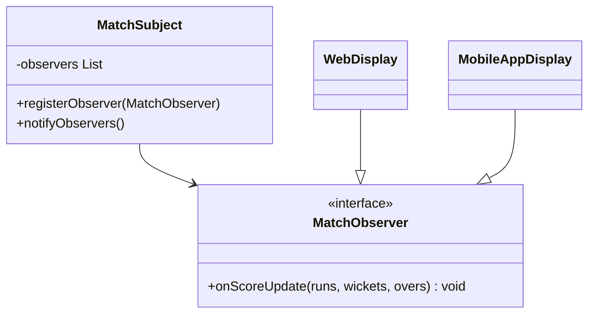

# LLD: Design Cricinfo / Cricbuzz (Live Scoreboard)

This system models matches, innings, overs, balls, and players, pushing live commentary and scoreboard updates to subscribers using the **Observer Pattern**.

---

## Requirements
1. **Match Structure:** Models Test, ODI, and T20 formats. A match has 2 innings.
2. **Detailed Inning tracking:** Overs, balls, batsman/bowler stats, run rate, score.
3. **Live Updates:** Register screens and notify clients of run/wicket/commentary events.

---

## Scoreboard Observer Structure



---

## Java Implementation

```java
import java.util.ArrayList;
import java.util.List;

class Player {
    private final String name;
    public Player(String name) { this.name = name; }
}

class Inning {
    private int runs = 0;
    private int wickets = 0;
    private double oversBowled = 0.0;
    
    public void addRuns(int r) { this.runs += r; }
    public void addWicket() { this.wickets++; }
    public void updateOvers(double o) { this.oversBowled = o; }
    
    public int getRuns() { return runs; }
    public int getWickets() { return wickets; }
    public double getOvers() { return oversBowled; }
}

interface MatchObserver {
    void onScoreUpdate(Inning inning);
}

class MatchScorecard {
    private final List<MatchObserver> observers = new ArrayList<>();
    private final Inning currentInning = new Inning();

    public void addObserver(MatchObserver o) { observers.add(o); }
    public void removeObserver(MatchObserver o) { observers.remove(o); }

    public void recordBall(int runsScored, boolean isWicket, double overNum) {
        currentInning.addRuns(runsScored);
        if (isWicket) currentInning.addWicket();
        currentInning.updateOvers(overNum);
        notifyObservers();
    }

    private void notifyObservers() {
        for (MatchObserver observer : observers) {
            observer.onScoreUpdate(currentInning);
        }
    }
}

class WebsiteScoreboard implements MatchObserver {
    public void onScoreUpdate(Inning inning) {
        System.out.println("Website displays: " + inning.getRuns() + "/" + 
                           inning.getWickets() + " in " + inning.getOvers() + " overs");
    }
}
```

---

## Interview Q&A Corner

> [!IMPORTANT]
> **Q: How does this scoreboard handle high scale concurrent reads without choking the MatchScorecard class?**
> A: The LLD classes write updates to memory. However, to handle millions of reading clients, decouple writes from reads using a **CQRS (Command Query Responsibility Segregation)** pattern. Match updates write to a primary store, which publishes events to Kafka. A separate read-service reads events and updates static redis cache stores, which are queried by public users.
