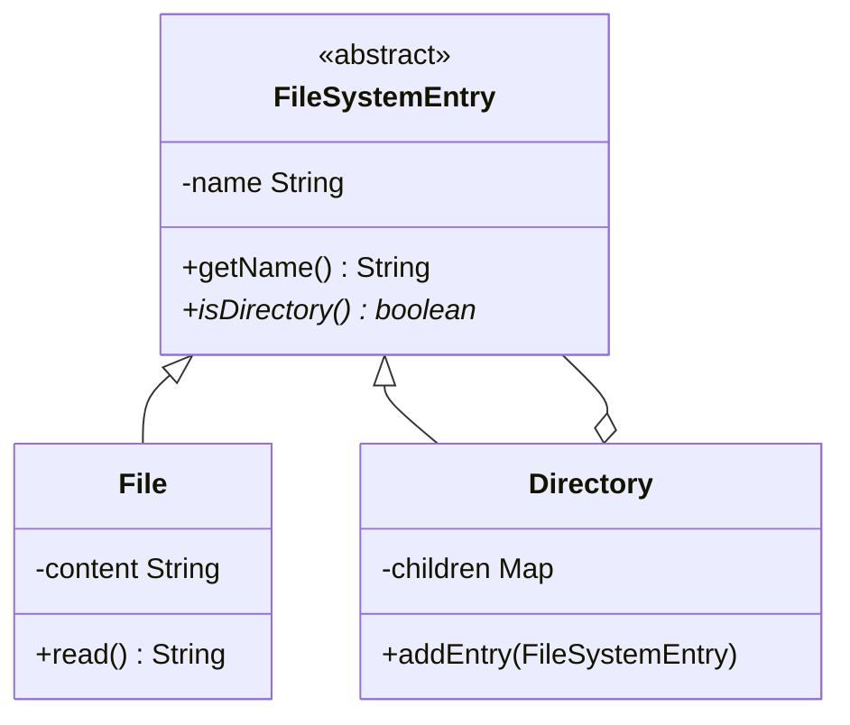

# LLD: Design an In-Memory File System

This design models directories and files using the **Composite Design Pattern** and supports standard filesystem traversal commands (`mkdir`, `ls`, `createFile`, `read`).

---

## Requirements
1. **Directory & File Hierarchy:** Composite tree structure.
2. **Commands:**
   - `mkdir(path)`: Create folder hierarchy.
   - `ls(path)`: List directory contents.
   - `createFile(path, content)`: Create file and write content.
   - `readFile(path)`: Read file content.

---

## Composite Pattern Structure



---

## Java Implementation

```java
import java.util.*;

abstract class FileSystemEntry {
    protected String name;
    public FileSystemEntry(String name) { this.name = name; }
    public String getName() { return name; }
    public abstract boolean isDirectory();
}

class File extends FileSystemEntry {
    private String content = "";

    public File(String name) { super(name); }
    public boolean isDirectory() { return false; }
    
    public void setContent(String content) { this.content = content; }
    public String getContent() { return content; }
}

class Directory extends FileSystemEntry {
    private final Map<String, FileSystemEntry> children = new TreeMap<>(); // sorted list

    public Directory(String name) { super(name); }
    public boolean isDirectory() { return true; }
    
    public Map<String, FileSystemEntry> getChildren() { return children; }
    public void addEntry(FileSystemEntry entry) { children.put(entry.getName(), entry); }
}

class FileSystem {
    private final Directory root = new Directory("/");

    public void mkdir(String path) {
        traverseAndCreate(path);
    }

    public List<String> ls(String path) {
        Directory dir = traverse(path);
        return new ArrayList<>(dir.getChildren().keySet());
    }

    public void writeToFile(String path, String content) {
        int lastSlash = path.lastIndexOf("/");
        String dirPath = path.substring(0, lastSlash == 0 ? 1 : lastSlash);
        String fileName = path.substring(lastSlash + 1);

        Directory parentDir = traverseAndCreate(dirPath);
        File file = new File(fileName);
        file.setContent(content);
        parentDir.addEntry(file);
    }

    private Directory traverseAndCreate(String path) {
        String[] parts = path.split("/");
        Directory current = root;
        for (String part : parts) {
            if (part.isEmpty()) continue;
            if (!current.getChildren().containsKey(part)) {
                current.addEntry(new Directory(part));
            }
            current = (Directory) current.getChildren().get(part);
        }
        return current;
    }

    private Directory traverse(String path) {
        String[] parts = path.split("/");
        Directory current = root;
        for (String part : parts) {
            if (part.isEmpty()) continue;
            current = (Directory) current.getChildren().get(part);
        }
        return current;
    }
}
```

---

## Interview Q&A Corner

> [!TIP]
> **Q: Why is TreeMap used for storing directory children?**
> A: TreeMap sorts keys lexicographically. This makes listing directory contents (e.g. `ls` command) run in alphabetical order automatically, which matches standard filesystem expectations with $O(\log N)$ insert speed.
