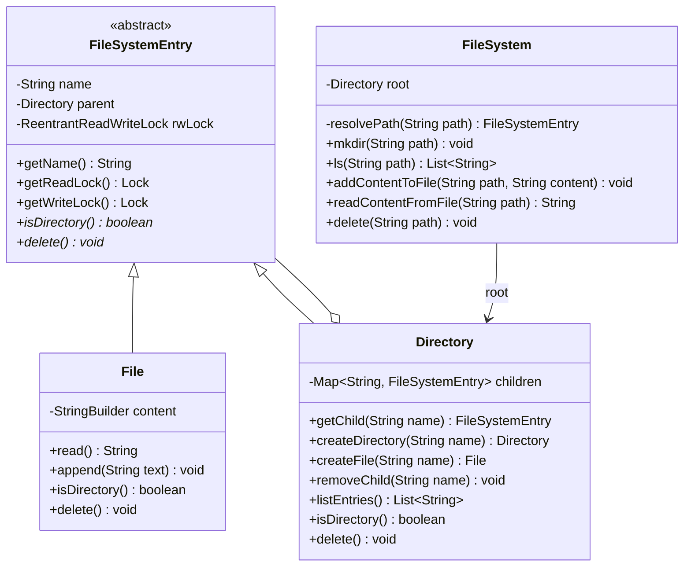
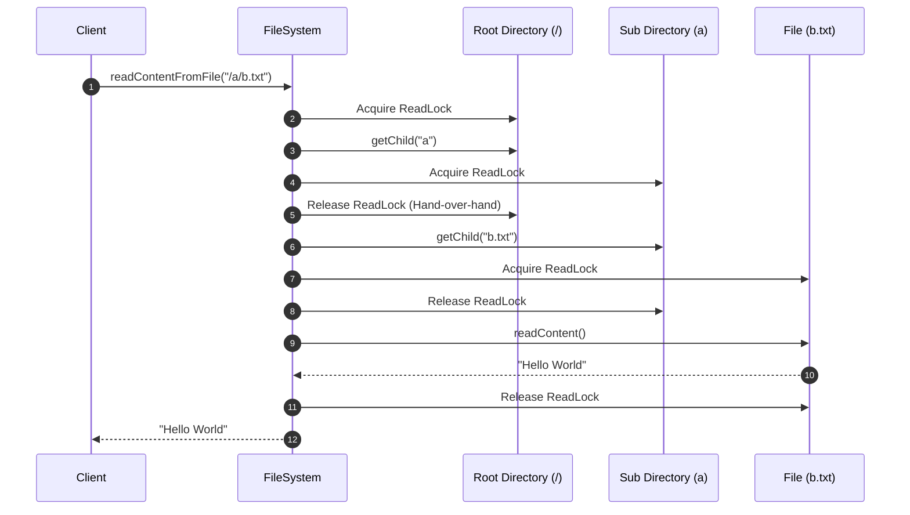

# Low-Level Design: In-Memory File System

This document presents a detailed, production-grade Low-Level Design (LLD) for a thread-safe, hierarchical In-Memory File System using Java.

---

## 1. Core System Scope & Requirements

### 1.1 Functional Requirements
1. **Hierarchical Directory Tree:** Model files and directories using the **Composite Design Pattern**.
2. **Path Traversal & Operations:**
   * `mkdir(String path)`: Create a directory path (including all parent directories if they don't exist).
   * `ls(String path)`: Return a list of names of files and directories in the path, sorted lexicographically. If the path is a file, return just the file name.
   * `createFile(String path, String name)`: Create an empty file at the path.
   * `addContentToFile(String path, String content)`: Append content to a file. Create the file if it does not exist.
   * `readContentFromFile(String path)`: Retrieve the content of a file.
   * `delete(String path)`: Delete a file or a directory (and all its subcomponents).
3. **Advanced Path Resolution:** Resolve paths containing relative operators like `.` (current directory) and `..` (parent directory).

### 1.2 Non-Functional Requirements
1. **Thread Safety & High Concurrency:** Allow concurrent reads (e.g. `ls`, `readFile`) across different parts of the system without bottlenecking. Avoid global synchronization.
2. **Lock Coupling (Hand-over-hand locking):** Read/write operations should lock directories and files incrementally along the path traversal to prevent race conditions during concurrent updates.
3. **Data Integrity:** Prevent creation of files with duplicate names in the same directory, or file-directory collisions.
4. **Memory Optimization:** Dynamically reclaim memory when files/directories are deleted.

---

## 2. Visual Representation

### 2.1 UML Class Diagram


### 2.2 Sequence Diagram: Thread-Safe Path Resolution (Read Operation)


---

## 3. Complete Domain Model & Entities

```java
package lowleveldesign.filesystem;

import java.util.concurrent.locks.Lock;
import java.util.concurrent.locks.ReentrantReadWriteLock;

// Custom Exceptions
class FileSystemException extends RuntimeException {
    public FileSystemException(String message) { super(message); }
}
class EntryNotFoundException extends FileSystemException {
    public EntryNotFoundException(String message) { super(message); }
}
class EntryAlreadyExistsException extends FileSystemException {
    public EntryAlreadyExistsException(String message) { super(message); }
}

// Base Composite Abstract Class
public abstract class FileSystemEntry {
    protected final String name;
    protected Directory parent;
    protected final ReentrantReadWriteLock rwLock = new ReentrantReadWriteLock();

    public FileSystemEntry(String name, Directory parent) {
        this.name = name;
        this.parent = parent;
    }

    public String getName() { return name; }
    public Directory getParent() { return parent; }
    public void setParent(Directory parent) { this.parent = parent; }

    public Lock readLock() { return rwLock.readLock(); }
    public Lock writeLock() { return rwLock.writeLock(); }

    public abstract boolean isDirectory();
    public abstract void delete();
}
```

---

## 4. Production-Ready Java Implementation

### 4.1 Leaf Entity (File) & Composite Entity (Directory)
```java
package lowleveldesign.filesystem;

import java.util.ArrayList;
import java.util.List;
import java.util.Map;
import java.util.TreeMap;

// File (Leaf)
class File extends FileSystemEntry {
    private final StringBuilder content = new StringBuilder();

    public File(String name, Directory parent) {
        super(name, parent);
    }

    @Override
    public boolean isDirectory() { return false; }

    public void appendContent(String text) {
        writeLock().lock();
        try {
            content.append(text);
        } finally {
            writeLock().unlock();
        }
    }

    public String getContent() {
        readLock().lock();
        try {
            return content.toString();
        } finally {
            readLock().unlock();
        }
    }

    @Override
    public void delete() {
        writeLock().lock();
        try {
            content.setLength(0); // clear memory reference
            this.parent = null;
        } finally {
            writeLock().unlock();
        }
    }
}

// Directory (Composite)
class Directory extends FileSystemEntry {
    // TreeMap to maintain sorted children
    private final Map<String, FileSystemEntry> children = new TreeMap<>();

    public Directory(String name, Directory parent) {
        super(name, parent);
    }

    @Override
    public boolean isDirectory() { return true; }

    public FileSystemEntry getChild(String name) {
        readLock().lock();
        try {
            return children.get(name);
        } finally {
            readLock().unlock();
        }
    }

    public Directory createSubdirectory(String name) {
        writeLock().lock();
        try {
            if (children.containsKey(name)) {
                FileSystemEntry entry = children.get(name);
                if (entry.isDirectory()) {
                    return (Directory) entry;
                }
                throw new EntryAlreadyExistsException("A file named '" + name + "' already exists.");
            }
            Directory newDir = new Directory(name, this);
            children.put(name, newDir);
            return newDir;
        } finally {
            writeLock().unlock();
        }
    }

    public File createNewFile(String name) {
        writeLock().lock();
        try {
            if (children.containsKey(name)) {
                FileSystemEntry entry = children.get(name);
                if (!entry.isDirectory()) {
                    return (File) entry;
                }
                throw new EntryAlreadyExistsException("A directory named '" + name + "' already exists.");
            }
            File newFile = new File(name, this);
            children.put(name, newFile);
            return newFile;
        } finally {
            writeLock().unlock();
        }
    }

    public void removeChild(String name) {
        writeLock().lock();
        try {
            FileSystemEntry entry = children.remove(name);
            if (entry != null) {
                entry.delete();
            }
        } finally {
            writeLock().unlock();
        }
    }

    public List<String> listEntries() {
        readLock().lock();
        try {
            return new ArrayList<>(children.keySet());
        } finally {
            readLock().unlock();
        }
    }

    @Override
    public void delete() {
        writeLock().lock();
        try {
            for (FileSystemEntry child : children.values()) {
                child.delete();
            }
            children.clear();
            this.parent = null;
        } finally {
            writeLock().unlock();
        }
    }
}
```

### 4.2 FileSystem Traversal & Command Controller
```java
package lowleveldesign.filesystem;

import java.util.*;
import java.util.concurrent.locks.Lock;

public class FileSystem {
    private final Directory root = new Directory("/", null);

    // Resolves path using Hand-over-hand (lock-coupling) protocol
    private FileSystemEntry resolvePath(String path, boolean createMissingDirs, boolean isWritingFile, String fileToWriteContent) {
        if (path == null || path.isEmpty()) {
            throw new IllegalArgumentException("Path cannot be null or empty.");
        }

        // Clean & split the path
        String[] parts = parsePath(path);
        
        Lock currentLock = root.readLock();
        currentLock.lock();
        FileSystemEntry current = root;

        try {
            for (int i = 0; i < parts.length; i++) {
                String part = parts[i];
                if (part.equals(".")) continue;
                if (part.equals("..")) {
                    FileSystemEntry next = current.getParent();
                    if (next != null) {
                        Lock nextLock = next.readLock();
                        nextLock.lock();
                        currentLock.unlock();
                        currentLock = nextLock;
                        current = next;
                    }
                    continue;
                }

                if (!current.isDirectory()) {
                    throw new FileSystemException("Invalid path: component '" + current.getName() + "' is not a directory.");
                }

                Directory currentDir = (Directory) current;
                FileSystemEntry next = currentDir.getChild(part);

                if (next == null) {
                    if (createMissingDirs) {
                        // Upgrade to write lock for directory creation
                        currentLock.unlock();
                        currentLock = currentDir.writeLock();
                        currentLock.lock();
                        
                        // Double-checked locking pattern
                        next = currentDir.getChild(part);
                        if (next == null) {
                            if (isWritingFile && i == parts.length - 1) {
                                next = currentDir.createNewFile(part);
                            } else {
                                next = currentDir.createSubdirectory(part);
                            }
                        }
                    } else {
                        throw new EntryNotFoundException("Path component not found: '" + part + "'");
                    }
                }

                // Acquire Lock on next node
                Lock nextLock = (isWritingFile && i == parts.length - 1) ? next.writeLock() : next.readLock();
                nextLock.lock();
                
                // Release Lock on current node (Hand-over-hand pattern)
                currentLock.unlock();
                currentLock = nextLock;
                current = next;
            }

            // Perform write operations inside lock context if applicable
            if (isWritingFile && fileToWriteContent != null && !current.isDirectory()) {
                ((File) current).appendContent(fileToWriteContent);
            }

            return current;
        } finally {
            if (currentLock != null) {
                currentLock.unlock();
            }
        }
    }

    private String[] parsePath(String path) {
        StringTokenizer st = new StringTokenizer(path, "/");
        List<String> list = new ArrayList<>();
        while (st.hasMoreTokens()) {
            list.add(st.nextToken());
        }
        return list.toArray(new String[0]);
    }

    // --- Core Commands API ---

    public void mkdir(String path) {
        resolvePath(path, true, false, null);
    }

    public List<String> ls(String path) {
        if (path.equals("/")) {
            return root.listEntries();
        }
        FileSystemEntry entry = resolvePath(path, false, false, null);
        if (entry.isDirectory()) {
            return ((Directory) entry).listEntries();
        } else {
            return Collections.singletonList(entry.getName());
        }
    }

    public void addContentToFile(String path, String content) {
        resolvePath(path, true, true, content);
    }

    public String readContentFromFile(String path) {
        FileSystemEntry entry = resolvePath(path, false, false, null);
        if (entry.isDirectory()) {
            throw new FileSystemException("Target path '" + path + "' is a directory, not a file.");
        }
        return ((File) entry).getContent();
    }

    public void delete(String path) {
        if (path.equals("/")) {
            throw new FileSystemException("Cannot delete root directory.");
        }
        int lastSlash = path.lastIndexOf("/");
        String parentPath = (lastSlash == 0) ? "/" : path.substring(0, lastSlash);
        String name = path.substring(lastSlash + 1);

        FileSystemEntry parentEntry = resolvePath(parentPath, false, false, null);
        if (!parentEntry.isDirectory()) {
            throw new FileSystemException("Parent path component is not a directory.");
        }

        Directory parentDir = (Directory) parentEntry;
        parentDir.removeChild(name);
    }
}
```

### 4.3 Client Driver Program
```java
package lowleveldesign.filesystem;

import java.util.List;

public class FileSystemDriver {
    public static void main(String[] args) {
        FileSystem fs = new FileSystem();

        System.out.println("==== Test Case 1: Create Directories ====");
        fs.mkdir("/usr/local/bin");
        fs.mkdir("/var/log");
        System.out.println("Root Entries: " + fs.ls("/"));
        System.out.println("usr Entries: " + fs.ls("/usr"));
        System.out.println("usr/local Entries: " + fs.ls("/usr/local"));

        System.out.println("\n==== Test Case 2: Create and Read File ====");
        fs.addContentToFile("/usr/local/bin/run.sh", "#!/bin/bash\n");
        fs.addContentToFile("/usr/local/bin/run.sh", "echo \"Running script\"\n");
        
        System.out.println("File Content:");
        System.out.println(fs.readContentFromFile("/usr/local/bin/run.sh"));
        System.out.println("bin Entries: " + fs.ls("/usr/local/bin"));

        System.out.println("\n==== Test Case 3: Relative Path Navigation ====");
        fs.mkdir("/usr/local/bin/../lib");
        System.out.println("local Entries: " + fs.ls("/usr/local")); // should contain bin & lib

        System.out.println("\n==== Test Case 4: Delete File ====");
        fs.delete("/usr/local/bin/run.sh");
        System.out.println("bin Entries after delete: " + fs.ls("/usr/local/bin"));

        System.out.println("\n==== Test Case 5: Verify Concurrent Access ====");
        // Run concurrent writers
        Runnable writer1 = () -> fs.addContentToFile("/var/log/sys.log", "Thread 1 update\n");
        Runnable writer2 = () -> fs.addContentToFile("/var/log/sys.log", "Thread 2 update\n");

        Thread t1 = new Thread(writer1);
        Thread t2 = new Thread(writer2);
        t1.start();
        t2.start();

        try {
            t1.join();
            t2.join();
        } catch (InterruptedException e) {
            e.printStackTrace();
        }

        System.out.println("Log Content:\n" + fs.readContentFromFile("/var/log/sys.log"));
    }
}
```

---

## 5. Edge Cases & Concurrency Handling

1. **Lock Coupling (Hand-over-hand Locking) vs Global Locking:**
   * *Problem:* A single global lock forces readers to block while a writer edits any unrelated file.
   * *Solution:* Each `FileSystemEntry` (Directory and File) has its own `ReentrantReadWriteLock`. During traversal, the filesystem locks a parent directory, locates the child, locks the child, and then releases the lock on the parent. Multiple threads can read/write different subtrees simultaneously.
2. **Deadlocks in Path Operations:**
   * *Problem:* Traversing top-down (e.g. `/a/b/c`) while another thread navigates bottom-up (using `..` like `/a/b/c/../..`) could cause cycles.
   * *Solution:* Both traversals must lock the hierarchy in a consistent top-down ordering. Even when resolving `..`, the lock on the child is released *before* requesting a lock on the parent directory.
3. **Write-Collision / Double-Creation:**
   * *Problem:* Two threads attempt to execute `mkdir("/a/b")` concurrently when directory `/a` doesn't exist yet.
   * *Solution:* We upgrade to a WriteLock on the parent directory (`Directory.createSubdirectory` and `Directory.createNewFile` are guarded by write locks). If a folder already exists, the write operation safely returns the existing entry instead of throwing an error.
4. **Relational Operations (`.` and `..`):**
   * *Problem:* Paths like `/../..` or `/a/./b` could break parsing.
   * *Solution:* The path tokenizer filters out `.`. If `..` is encountered and the parent is null (i.e. we are at root), it safety ignores the instruction and remains at the root directory.

---

## 6. Comprehensive Interview Q&A

### Q1: Why did you choose the Composite Design Pattern for this problem?
**Answer:** The filesystem has a recursive tree-like hierarchy (directories contain both files and other directories). The Composite Pattern lets us treat individual files and composite directories uniformly under the `FileSystemEntry` interface. Operations like `delete()` can be triggered recursively on any entry without client-side checking of node types.

### Q2: How does Hand-over-Hand (Lock Coupling) work during path resolution?
**Answer:** Hand-over-hand locking is a synchronization technique where a thread holds a lock on a parent node while acquiring a lock on the child node, and releases the parent lock only *after* securing the child lock. This prevents another thread from deleting or renaming the child node during the traversal gap, ensuring consistency while permitting concurrent processes in other folders of the tree.

### Q3: How would you scale this in-memory filesystem to a distributed filesystem (like HDFS or GFS)?
**Answer:** An in-memory system is constrained by single-node RAM. To transition to a distributed design:
1. **NameNode / Metadata Server:** Maintain the folder structure/directory namespace in memory (using similar LLD patterns).
2. **DataNodes:** Store the actual file contents as blocks on different disk arrays.
3. **Partitioning:** Partition or shard the directory tree namespace across multiple NameNodes (using consistent hashing on folder paths) to handle massive metadata scaling.

### Q4: How is memory management handled during massive creations and deletions?
**Answer:** Standard JVM Garbage Collection (GC) reclaims memory once the references to the files are severed. In `delete(path)`, we remove the target name from the parent directory's child map and invoke `delete()` on the child. The child clears its content string builders and parents, setting internal links to null. This detaches the subtree entirely from the root root nodes, making it eligible for GC.
