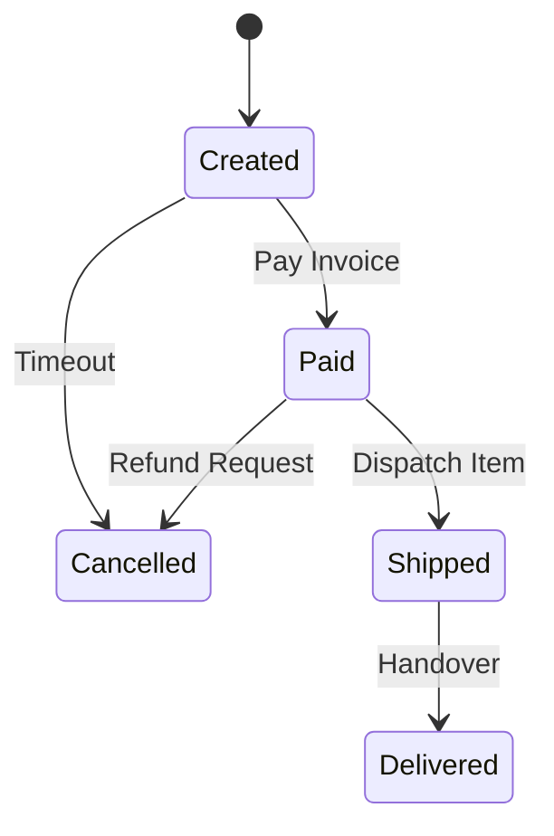

# LLD: Design Online Shopping / E-Commerce System

This design covers products, shopping carts, inventory synchronization, order states, and payment handling.

---

## Requirements
1. **Catalog Search:** Users can browse products.
2. **Shopping Cart Lifecycle:** Add items, adjust quantity, persist session.
3. **Inventory Reservation:** Reserve items on checkout; handle concurrent orders for low-stock items.
4. **Order State Machine:** Track orders through `CREATED`, `PAID`, `SHIPPED`, `DELIVERED`, `CANCELLED` states.

---

## Order State Transitions



---

## Java Implementation

```java
import java.util.*;

enum OrderStatus { CREATED, PAID, SHIPPED, DELIVERED, CANCELLED }

class Product {
    private final String id;
    private final String name;
    private double price;

    public Product(String id, String name, double price) {
        this.id = id;
        this.name = name;
        this.price = price;
    }
    public double getPrice() { return price; }
}

class CartItem {
    private final Product product;
    private int quantity;

    public CartItem(Product p, int q) { this.product = p; this.quantity = q; }
    public Product getProduct() { return product; }
    public int getQuantity() { return quantity; }
}

class ShoppingCart {
    private final List<CartItem> items = new ArrayList<>();
    public void addItem(Product p, int q) { items.add(new CartItem(p, q)); }
    public List<CartItem> getItems() { return items; }
}

class Order {
    private final String orderId;
    private final List<CartItem> items;
    private OrderStatus status = OrderStatus.CREATED;
    private double totalAmount;

    public Order(String id, List<CartItem> items) {
        this.orderId = id;
        this.items = items;
        calculateTotal();
    }

    private void calculateTotal() {
        this.totalAmount = items.stream().mapToDouble(i -> i.getProduct().getPrice() * i.getQuantity()).sum();
    }

    public synchronized void setStatus(OrderStatus status) { this.status = status; }
}

class InventoryService {
    private final Map<String, Integer> stock = new HashMap<>();

    public synchronized boolean checkAndDeduct(List<CartItem> items) {
        // Double pass to prevent partial deductions
        for (CartItem item : items) {
            String pId = item.getProduct().getPrice() + ""; // Mock product ID mapping
            if (stock.getOrDefault(pId, 0) < item.getQuantity()) {
                return false;
            }
        }
        for (CartItem item : items) {
            String pId = item.getProduct().getPrice() + "";
            stock.put(pId, stock.get(pId) - item.getQuantity());
        }
        return true;
    }
}
```

---

## Interview Q&A Corner

> [!WARNING]
> **Q: How do you prevent inventory overselling during high concurrency (e.g., Flash Sales)?**
> A: 
> 1. Use **Pessimistic locking** on database queries: `SELECT quantity FROM inventory WHERE product_id = ? FOR UPDATE;`.
> 2. Implement **Distributed Locks** using Redis (`Redisson` library) to lock check-and-deduct paths per product.
> 3. Use **in-memory token buckets** (e.g. Redis hashes) to queue reservations before hitting the relational database.
