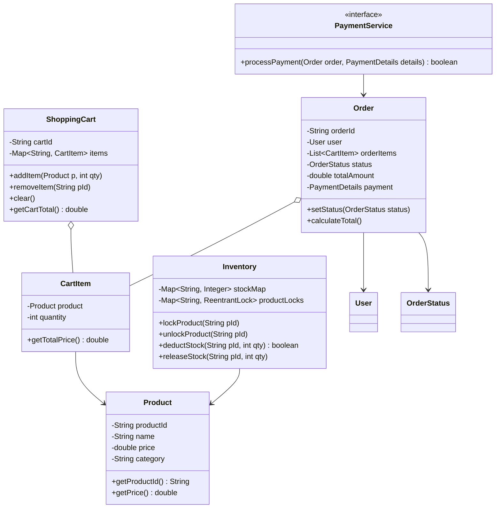
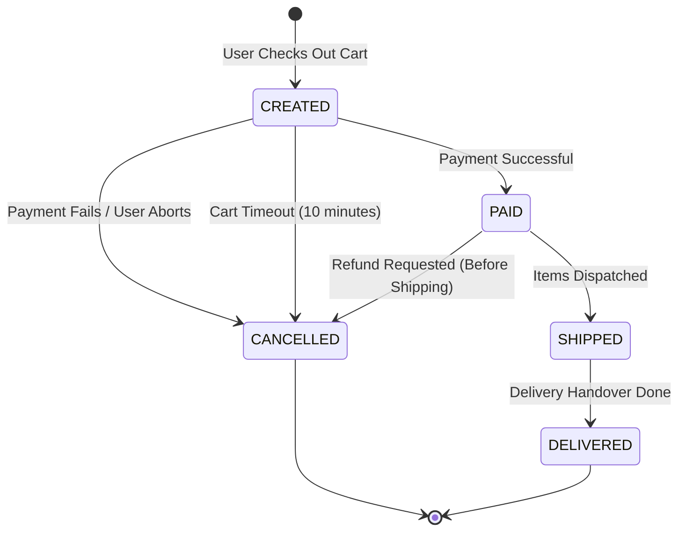
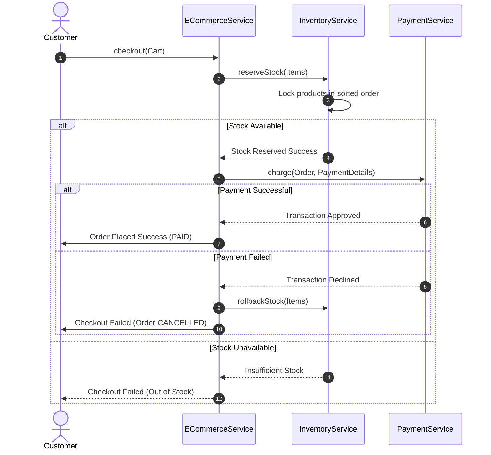

# Low-Level Design: Online Shopping / E-Commerce System

This document details the Low-Level Design (LLD) for a thread-safe, scalable online shopping and e-commerce system using Java.

---

## 1. Core System Scope & Requirements

### 1.1 Functional Requirements
1. **Catalog Search:** Users can browse products by categories, search by keywords, and apply filters (price range, rating, brand).
2. **Shopping Cart Lifecycle:** Add items, update quantities, remove items, and calculate live totals. Cart details must persist across sessions.
3. **Thread-Safe Inventory Management:** Prevent overselling (two users checkout the last item simultaneously). Check and deduct inventory atomically.
4. **Order Processing & Checkout:** Transition orders through states: `CREATED`, `PAID`, `SHIPPED`, `DELIVERED`, `CANCELLED`.
5. **Payment Processing Integration:** Process payments securely (simulated via credit card, UPI, etc.) and handle payment failures.
6. **Order Cancellation & Stock Rollback:** If an order is canceled or payment fails, reserve stock must be returned back to the inventory pool immediately.

### 1.2 Non-Functional Requirements
1. **Concurrency Protection:** Handle flash sales where thousands of buyers request limited stock concurrently.
2. **Extensibility:** The search engine should accept new filtering criteria without violating the Open-Closed Principle.
3. **Data Integrity:** Prevent double payments and partial transactions (atomic order creation).
4. **Reliability:** Implement rollback mechanisms for checkout steps in case of payment/network failures.

---

## 2. Visual Representation

### 2.1 UML Class Diagram


### 2.2 Order State Transition Diagram


### 2.3 Checkout & Payment Sequence Diagram


---

## 3. Complete Domain Model & Entities

```java
package lowleveldesign.ecommerce;

import java.util.HashMap;
import java.util.Map;

// Product Entity
class Product {
    private final String productId;
    private final String name;
    private final double price;
    private final String category;

    public Product(String productId, String name, double price, String category) {
        this.productId = productId;
        this.name = name;
        this.price = price;
        this.category = category;
    }

    public String getProductId() { return productId; }
    public String getName() { return name; }
    public double getPrice() { return price; }
    public String getCategory() { return category; }
}

// User representation
class User {
    private final String userId;
    private final String name;
    private final String email;

    public User(String userId, String name, String email) {
        this.userId = userId;
        this.name = name;
        this.email = email;
    }

    public String getUserId() { return userId; }
    public String getName() { return name; }
}

// Shopping Cart Item
class CartItem {
    private final Product product;
    private int quantity;

    public CartItem(Product product, int quantity) {
        this.product = product;
        this.quantity = quantity;
    }

    public Product getProduct() { return product; }
    public int getQuantity() { return quantity; }
    public void setQuantity(int quantity) { this.quantity = quantity; }
    public double getTotalPrice() { return product.getPrice() * quantity; }
}
```

---

## 4. Production-Ready Java Implementation

### 4.1 Shopping Cart & Order States
```java
package lowleveldesign.ecommerce;

import java.util.ArrayList;
import java.util.Collections;
import java.util.HashMap;
import java.util.List;
import java.util.Map;

enum OrderStatus { CREATED, PAID, SHIPPED, DELIVERED, CANCELLED }

class ShoppingCart {
    private final String cartId;
    private final Map<String, CartItem> items = new HashMap<>();

    public ShoppingCart(String cartId) {
        this.cartId = cartId;
    }

    public synchronized void addItem(Product product, int qty) {
        if (qty <= 0) return;
        if (items.containsKey(product.getProductId())) {
            CartItem item = items.get(product.getProductId());
            item.setQuantity(item.getQuantity() + qty);
        } else {
            items.put(product.getProductId(), new CartItem(product, qty));
        }
    }

    public synchronized void removeItem(String productId) {
        items.remove(productId);
    }

    public synchronized List<CartItem> getItems() {
        return new ArrayList<>(items.values());
    }

    public synchronized void clear() {
        items.clear();
    }

    public synchronized double getCartTotal() {
        return items.values().stream().mapToDouble(CartItem::getTotalPrice).sum();
    }
}

// Order Entity
class Order {
    private final String orderId;
    private final User user;
    private final List<CartItem> orderItems;
    private double totalAmount;
    private OrderStatus status;

    public Order(String orderId, User user, List<CartItem> items) {
        this.orderId = orderId;
        this.user = user;
        this.orderItems = new ArrayList<>(items);
        this.status = OrderStatus.CREATED;
        calculateTotal();
    }

    private void calculateTotal() {
        this.totalAmount = orderItems.stream().mapToDouble(CartItem::getTotalPrice).sum();
    }

    public String getOrderId() { return orderId; }
    public User getUser() { return user; }
    public List<CartItem> getOrderItems() { return orderItems; }
    public double getTotalAmount() { return totalAmount; }
    public synchronized OrderStatus getStatus() { return status; }
    
    public synchronized void setStatus(OrderStatus status) {
        this.status = status;
    }
}
```

### 4.2 Thread-Safe Inventory Service (Fine-Grained Locking)
```java
package lowleveldesign.ecommerce;

import java.util.ArrayList;
import java.util.Comparator;
import java.util.List;
import java.util.Map;
import java.util.concurrent.ConcurrentHashMap;
import java.util.concurrent.locks.ReentrantLock;

class InventoryService {
    private final Map<String, Integer> stockMap = new ConcurrentHashMap<>();
    private final Map<String, ReentrantLock> productLocks = new ConcurrentHashMap<>();

    public void updateStock(String productId, int quantity) {
        stockMap.put(productId, quantity);
        productLocks.putIfAbsent(productId, new ReentrantLock());
    }

    public int getStock(String productId) {
        return stockMap.getOrDefault(productId, 0);
    }

    // Atomically reserves (deducts) multiple items safely, avoiding deadlocks.
    public boolean reserveStock(List<CartItem> items) {
        // Sort items by Product ID to ensure lock acquisition order (prevents deadlock)
        List<CartItem> sortedItems = new ArrayList<>(items);
        sortedItems.sort(Comparator.comparing(item -> item.getProduct().getProductId()));

        List<ReentrantLock> acquiredLocks = new ArrayList<>();
        try {
            // Step 1: Acquire locks for all items
            for (CartItem item : sortedItems) {
                String pId = item.getProduct().getProductId();
                ReentrantLock lock = productLocks.computeIfAbsent(pId, k -> new ReentrantLock());
                lock.lock();
                acquiredLocks.add(lock);
            }

            // Step 2: Validate stock for all items (All-or-Nothing check)
            for (CartItem item : sortedItems) {
                String pId = item.getProduct().getProductId();
                int currentStock = stockMap.getOrDefault(pId, 0);
                if (currentStock < item.getQuantity()) {
                    return false; // Rollback check - insufficient stock
                }
            }

            // Step 3: Deduct stock
            for (CartItem item : sortedItems) {
                String pId = item.getProduct().getProductId();
                stockMap.put(pId, stockMap.get(pId) - item.getQuantity());
            }
            return true;
        } finally {
            // Step 4: Release all locks in reverse order
            for (int i = acquiredLocks.size() - 1; i >= 0; i--) {
                acquiredLocks.get(i).unlock();
            }
        }
    }

    // Rollback stock if payment fails
    public void rollbackStock(List<CartItem> items) {
        for (CartItem item : items) {
            String pId = item.getProduct().getProductId();
            ReentrantLock lock = productLocks.computeIfAbsent(pId, k -> new ReentrantLock());
            lock.lock();
            try {
                stockMap.put(pId, stockMap.getOrDefault(pId, 0) + item.getQuantity());
            } finally {
                lock.unlock();
            }
        }
    }
}
```

### 4.3 Integration Services & Orchestrator
```java
package lowleveldesign.ecommerce;

import java.util.List;
import java.util.UUID;

interface PaymentService {
    boolean charge(String orderId, double amount, String paymentMethod);
}

class PaymentServiceImpl implements PaymentService {
    @Override
    public boolean charge(String orderId, double amount, String paymentMethod) {
        System.out.println("Processing payment for Order " + orderId + " (" + amount + ") via: " + paymentMethod);
        // Simulate payment success (95% rate)
        return Math.random() < 0.95;
    }
}

class ECommerceService {
    private final InventoryService inventoryService;
    private final PaymentService paymentService;

    public ECommerceService(InventoryService inventoryService, PaymentService paymentService) {
        this.inventoryService = inventoryService;
        this.paymentService = paymentService;
    }

    public Order checkout(User user, ShoppingCart cart, String paymentMethod) {
        List<CartItem> items = cart.getItems();
        if (items.isEmpty()) {
            throw new IllegalStateException("Cart is empty.");
        }

        // 1. Reserve Stock (All or Nothing)
        boolean stockReserved = inventoryService.reserveStock(items);
        if (!stockReserved) {
            throw new IllegalStateException("Checkout failed: Some items are out of stock.");
        }

        // 2. Create Order
        String orderId = "ORD-" + UUID.randomUUID().toString().substring(0, 8).toUpperCase();
        Order order = new Order(orderId, user, items);
        System.out.println("Created Order: " + orderId + " for user " + user.getName());

        // 3. Process Payment
        boolean paymentSuccess = paymentService.charge(orderId, order.getTotalAmount(), paymentMethod);
        if (paymentSuccess) {
            order.setStatus(OrderStatus.PAID);
            cart.clear();
            System.out.println("Order " + orderId + " is paid successfully!");
        } else {
            // Payment failed -> rollback stock and cancel order
            order.setStatus(OrderStatus.CANCELLED);
            inventoryService.rollbackStock(items);
            System.out.println("Order " + orderId + " payment failed. Stock rolled back.");
        }

        return order;
    }
}
```

### 4.4 Driver Client Class
```java
package lowleveldesign.ecommerce;

public class ECommerceDriver {
    public static void main(String[] args) {
        // Init Services
        InventoryService inventory = new InventoryService();
        PaymentService payment = new PaymentServiceImpl();
        ECommerceService engine = new ECommerceService(inventory, payment);

        // Populate Catalog Inventory
        Product laptop = new Product("PROD01", "MacBook Pro", 2000.0, "Electronics");
        Product phone = new Product("PROD02", "iPhone 15", 1000.0, "Electronics");
        inventory.updateStock("PROD01", 5);
        inventory.updateStock("PROD02", 2); // iPhone is low stock

        User userA = new User("U01", "Alice", "alice@example.com");
        User userB = new User("U02", "Bob", "bob@example.com");

        // Alice Cart
        ShoppingCart cartAlice = new ShoppingCart("CART-ALICE");
        cartAlice.addItem(laptop, 1);
        cartAlice.addItem(phone, 2); // reserves remaining 2 iPhones

        // Bob Cart
        ShoppingCart cartBob = new ShoppingCart("CART-BOB");
        cartBob.addItem(phone, 1); // Bob wants 1 iPhone too

        System.out.println("==== Test Case 1: Alice Checks Out Successfully ====");
        Order orderAlice = engine.checkout(userA, cartAlice, "CreditCard");
        System.out.println("Alice Order Status: " + orderAlice.getStatus());
        System.out.println("Remaining Phone Stock: " + inventory.getStock("PROD02")); // Should be 0

        System.out.println("\n==== Test Case 2: Bob Checks Out (Out of Stock expected) ====");
        try {
            engine.checkout(userB, cartBob, "UPI");
        } catch (Exception e) {
            System.out.println("Bob checkout failed: " + e.getMessage());
        }
    }
}
```

---

## 5. Edge Cases & Concurrency Handling

1. **Deadlock Prevention (Sorted Locking):**
   * *Problem:* Thread 1 tries to reserve Product A then Product B. Thread 2 tries to reserve Product B then Product A concurrently. If both lock their first product, a deadlock occurs.
   * *Solution:* In `InventoryService.reserveStock`, products are sorted alphabetically by `productId` before lock acquisition. This guarantees that all threads lock products in the exact same sequence, making deadlocks mathematically impossible.
2. **Flash Sales & Overselling:**
   * *Problem:* Thousands of threads access a product's stock count simultaneously.
   * *Solution:* Rather than synchronization on the entire checkout process (which is slow), fine-grained locks are acquired only on the relevant product IDs during the reservation phase.
3. **Double Payment & Re-entrancy:**
   * *Problem:* User double-clicks "Pay", generating two payment requests.
   * *Solution:* Payment requests must include an Idempotency Key (e.g. `orderId`). The payment gateway records this key and rejects duplicate submissions within a short timeout block.
4. **Checkout Abandonment / Payment Timeout:**
   * *Problem:* Stock is reserved, but the user leaves the tab before completing the payment.
   * *Solution:* Store reservations inside a temporary queue (e.g., Redis hash table) with an expiration timeout (TTL). A background worker thread sweeps expired orders, releases the hold, and adds the stock counts back to `InventoryService`.

---

## 6. Comprehensive Interview Q&A

### Q1: How do you implement dynamic search filters without writing multiple if-else search blocks?
**Answer:** Use the **Specification Pattern** or **Strategy Pattern**. Design a `ProductSpecification` interface with a `boolean isSatisfied(Product p)` method. Implement specific specification classes like `PriceRangeSpecification`, `CategorySpecification`, and a composite specification `AndSpecification` that dynamically combines these conditions. This lets you construct clean query builders like:
```java
ProductSpecification spec = new AndSpecification(new CategorySpecification("Electronics"), new PriceSpecification(0, 1000));
```

### Q2: What is the benefit of Sorting Product IDs before locking in `reserveStock`?
**Answer:** Sorting product IDs implements a global lock acquisition hierarchy. If Thread A requests (P1, P2) and Thread B requests (P2, P1), sorting ensures both request P1's lock first. The second thread blocks on P1 instead of holding P2 and blocking on P1 (which causes a circular dependency deadlock).

### Q3: How would you handle Shopping Carts for anonymous users who aren't logged in?
**Answer:** Anonymous shopping carts can be saved on the browser's client storage (e.g., LocalStorage) or indexed via a temporary session ID UUID stored in a cookie. When the user logs in, a cart merge service is invoked, combining the items from the anonymous session cart with the user's permanent database cart (handling duplicate products by aggregating quantity).

### Q4: How does Optimistic Locking differ from Pessimistic Locking for inventory updates?
**Answer:** 
* **Optimistic Locking:** Assumes conflict is rare. Each database row has a `version` column. We execute: `UPDATE inventory SET stock = stock - qty, version = version + 1 WHERE product_id = ? AND version = ?`. If version changed, transaction fails and rolls back. Good for high read-to-write ratio.
* **Pessimistic Locking:** Assumes conflict is high (e.g., flash sales). We lock rows on read: `SELECT stock FROM inventory WHERE product_id = ? FOR UPDATE`. Other threads block until the transaction commits. Better for preventing checkout failure loops under heavy writes.
