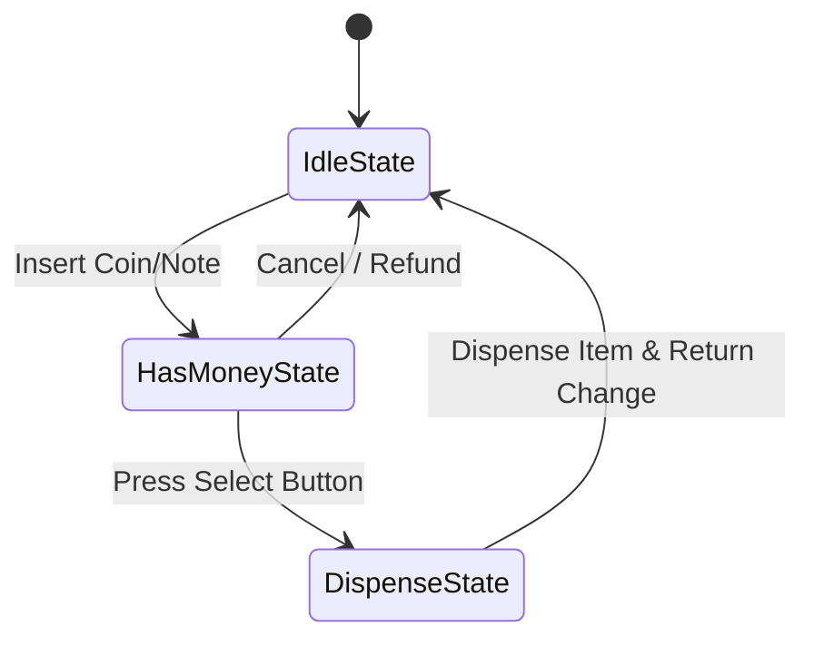

# LLD: Design a Vending Machine

This design employs the **State Pattern** to handle operations such as cash insertion, item selection, product dispensing, and refunds.

---

## State Diagram



---

## Java Implementation

```java
import java.util.HashMap;
import java.util.Map;

class Item {
    private final String name;
    private final double price;
    public Item(String name, double price) { this.name = name; this.price = price; }
    public String getName() { return name; }
    public double getPrice() { return price; }
}

interface VendingState {
    void insertMoney(double amount);
    void selectProduct(String code);
    void dispenseProduct();
    void refund();
}

class VendingMachineController {
    private final Map<String, Item> inventory = new HashMap<>();
    private final Map<String, Integer> stock = new HashMap<>();
    
    private VendingState currentState;
    private double balance = 0.0;
    private String selectedItemCode;

    public VendingMachineController() {
        currentState = new IdleVendingState(this);
    }

    public void setState(VendingState state) { this.currentState = state; }
    public double getBalance() { return balance; }
    public void addBalance(double amount) { this.balance += amount; }
    public void resetBalance() { this.balance = 0.0; }
    
    public void setSelectedItemCode(String code) { this.selectedItemCode = code; }
    public String getSelectedItemCode() { return selectedItemCode; }
    
    public Map<String, Item> getInventory() { return inventory; }
    public Map<String, Integer> getStock() { return stock; }

    // Delegates
    public void insertMoney(double amt) { currentState.insertMoney(amt); }
    public void selectProduct(String code) { currentState.selectProduct(code); }
    public void dispense() { currentState.dispenseProduct(); }
    public void cancel() { currentState.refund(); }
}

class IdleVendingState implements VendingState {
    private final VendingMachineController machine;
    public IdleVendingState(VendingMachineController machine) { this.machine = machine; }

    public void insertMoney(double amount) {
        machine.addBalance(amount);
        System.out.println("Inserted: $" + amount + " | Current Balance: $" + machine.getBalance());
        machine.setState(new HasMoneyVendingState(machine));
    }
    public void selectProduct(String code) { System.out.println("Insert money first."); }
    public void dispenseProduct() { System.out.println("Select item first."); }
    public void refund() { System.out.println("Nothing to refund."); }
}

class HasMoneyVendingState implements VendingState {
    private final VendingMachineController machine;
    public HasMoneyVendingState(VendingMachineController machine) { this.machine = machine; }

    public void insertMoney(double amount) {
        machine.addBalance(amount);
        System.out.println("Current Balance: $" + machine.getBalance());
    }

    public void selectProduct(String code) {
        Item item = machine.getInventory().get(code);
        if (item == null || machine.getStock().getOrDefault(code, 0) <= 0) {
            System.out.println("Item out of stock!");
            return;
        }
        if (machine.getBalance() < item.getPrice()) {
            System.out.println("Insufficient funds! Needs $" + item.getPrice());
            return;
        }
        machine.setSelectedItemCode(code);
        machine.setState(new DispenseVendingState(machine));
    }

    public void dispenseProduct() { System.out.println("Choose product first."); }
    public void refund() {
        System.out.println("Refunding balance: $" + machine.getBalance());
        machine.resetBalance();
        machine.setState(new IdleVendingState(machine));
    }
}

class DispenseVendingState implements VendingState {
    private final VendingMachineController machine;
    public DispenseVendingState(VendingMachineController machine) { this.machine = machine; }

    public void insertMoney(double amount) { System.out.println("Dispensing in progress. Cannot insert money."); }
    public void selectProduct(String code) { System.out.println("Already selected. Dispensing in progress."); }

    public void dispenseProduct() {
        String code = machine.getSelectedItemCode();
        Item item = machine.getInventory().get(code);
        
        machine.getStock().put(code, machine.getStock().get(code) - 1);
        double change = machine.getBalance() - item.getPrice();
        System.out.println("Dispensed: " + item.getName());
        
        if (change > 0) {
            System.out.println("Returning change: $" + change);
        }
        
        machine.resetBalance();
        machine.setSelectedItemCode(null);
        machine.setState(new IdleVendingState(machine));
    }

    public void refund() { System.out.println("Cannot refund, dispensing in progress."); }
}
```

---

## Interview Q&A Corner

> [!NOTE]
> **Q: What is the main design difference between the State pattern and a state machine database setup?**
> A: The LLD **State Pattern** encapsulates logic in subclass objects in memory (great for local JVM applications). In a large-scale microservice architecture, storing state patterns in memory is problematic because servers are stateless. State is usually stored as a status string in a relational database, and transitions are validated via state machine engines (like Spring State Machine) reading from database rows.
