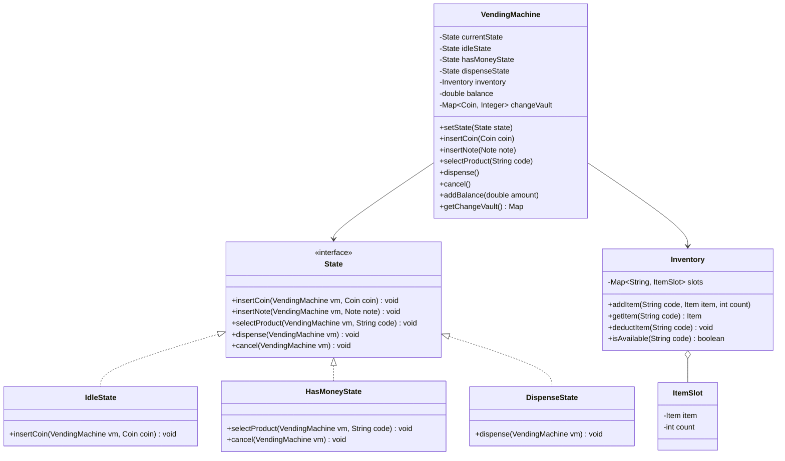
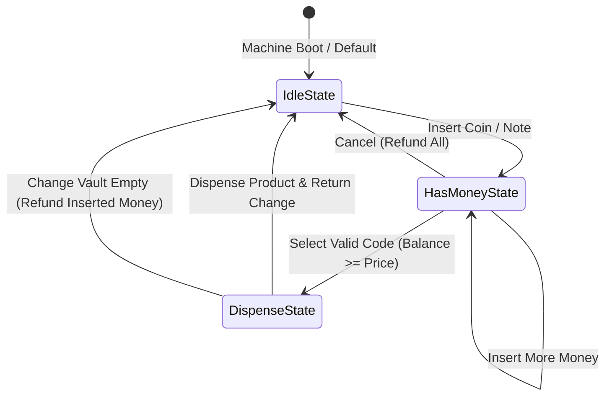

# Low-Level Design: Vending Machine

This document presents a comprehensive, production-grade Low-Level Design (LLD) for a Vending Machine system using the **State Design Pattern** in Java.

---

## 1. Core System Scope & Requirements

### 1.1 Functional Requirements
1. **Product Inventory:** The machine holds items in slots, each identified by a unique code (e.g., A1, A2, B1). Each slot has a specific product, price, and stock count.
2. **Accept Payments:** Accept multiple currencies (Coins: $1, $5, $10, $25; Notes: $100, $500).
3. **State Machine States:**
   * `IdleState`: Waiting for currency insertion.
   * `HasMoneyState`: User inserted money, can insert more or select a product code.
   * `DispenseState`: Dispense the product and automatically calculate/return change.
4. **Change Dispenser:** The machine holds an internal vault of coins to return change. If the machine cannot return the exact change, it must rollback the transaction and refund the inserted money.
5. **Cancellation/Refund:** The user can press "Cancel" at any time before dispensing to receive a full refund.

### 1.2 Non-Functional Requirements
1. **Concurrency Control:** Ensure thread safety. Multiple threads simulating physical operations (inserting coin, selecting item) must not cause inconsistent inventory or incorrect balance calculations.
2. **Deterministic Change Return:** Use a change-making algorithm to return the maximum possible larger denominations first.
3. **Robustness & Self-Healing:** Detect out-of-stock items, invalid inputs, and lack of internal change cash before starting dispensing.

---

## 2. Visual Representation

### 2.1 UML Class Diagram


### 2.2 State Transition Diagram


---

## 3. Complete Domain Model & Entities

```java
package lowleveldesign.vendingmachine;

public enum Coin {
    PENNY(1), NICKEL(5), DIME(10), QUARTER(25);
    private final int value; // value in cents
    Coin(int value) { this.value = value; }
    public int getValue() { return value; }
}

public enum Note {
    ONE_DOLLAR(100), FIVE_DOLLARS(500);
    private final int value; // value in cents
    Note(int value) { this.value = value; }
    public int getValue() { return value; }
}

class Item {
    private final String name;
    private final int price; // price in cents to avoid float inaccuracies

    public Item(String name, int price) {
        this.name = name;
        this.price = price;
    }

    public String getName() { return name; }
    public int getPrice() { return price; }
}

class ItemSlot {
    private final Item item;
    private int count;

    public ItemSlot(Item item, int count) {
        this.item = item;
        this.count = count;
    }

    public Item getItem() { return item; }
    public int getCount() { return count; }
    public void decrementCount() { this.count--; }
    public void incrementCount(int amount) { this.count += amount; }
}
```

---

## 4. Production-Ready Java Implementation

### 4.1 State Interface and Concrete Implementations
```java
package lowleveldesign.vendingmachine;

import java.util.HashMap;
import java.util.Map;

// State Interface
interface State {
    void insertCoin(VendingMachine vm, Coin coin);
    void insertNote(VendingMachine vm, Note note);
    void selectProduct(VendingMachine vm, String code);
    void dispense(VendingMachine vm);
    void cancel(VendingMachine vm);
}

// Exception Classes
class VendingException extends RuntimeException {
    public VendingException(String message) { super(message); }
}

// Idle State
class IdleState implements State {
    @Override
    public void insertCoin(VendingMachine vm, Coin coin) {
        vm.addBalance(coin.getValue());
        vm.setState(vm.getHasMoneyState());
        System.out.println("Coin inserted: " + coin + ". Current Balance: " + vm.getBalance() + " cents.");
    }

    @Override
    public void insertNote(VendingMachine vm, Note note) {
        vm.addBalance(note.getValue());
        vm.setState(vm.getHasMoneyState());
        System.out.println("Note inserted: " + note + ". Current Balance: " + vm.getBalance() + " cents.");
    }

    @Override
    public void selectProduct(VendingMachine vm, String code) {
        throw new VendingException("Please insert money first before choosing products.");
    }

    @Override
    public void dispense(VendingMachine vm) {
        throw new VendingException("Nothing to dispense. Insert money first.");
    }

    @Override
    public void cancel(VendingMachine vm) {
        System.out.println("No balance to refund.");
    }
}

// Has Money State
class HasMoneyState implements State {
    @Override
    public void insertCoin(VendingMachine vm, Coin coin) {
        vm.addBalance(coin.getValue());
        System.out.println("Coin inserted: " + coin + ". Current Balance: " + vm.getBalance() + " cents.");
    }

    @Override
    public void insertNote(VendingMachine vm, Note note) {
        vm.addBalance(note.getValue());
        System.out.println("Note inserted: " + note + ". Current Balance: " + vm.getBalance() + " cents.");
    }

    @Override
    public void selectProduct(VendingMachine vm, String code) {
        Inventory inv = vm.getInventory();
        if (!inv.isAvailable(code)) {
            throw new VendingException("Product out of stock or invalid code.");
        }

        Item item = inv.getItem(code);
        if (vm.getBalance() < item.getPrice()) {
            throw new VendingException("Insufficient funds. Item price: " + item.getPrice() + " cents.");
        }

        vm.setSelectedCode(code);
        vm.setState(vm.getDispenseState());
        System.out.println("Product " + item.getName() + " selected. Processing...");
    }

    @Override
    public void dispense(VendingMachine vm) {
        throw new VendingException("Select product first.");
    }

    @Override
    public void cancel(VendingMachine vm) {
        int refundVal = vm.getBalance();
        vm.resetBalance();
        vm.setState(vm.getIdleState());
        System.out.println("Transaction canceled. Refunding " + refundVal + " cents.");
    }
}

// Dispense State
class DispenseState implements State {
    @Override
    public void insertCoin(VendingMachine vm, Coin coin) { throw new VendingException("Dispensation in progress. Cannot insert cash."); }
    @Override
    public void insertNote(VendingMachine vm, Note note) { throw new VendingException("Dispensation in progress. Cannot insert cash."); }
    @Override
    public void selectProduct(VendingMachine vm, String code) { throw new VendingException("Dispensation in progress. Cannot reselect."); }

    @Override
    public void dispense(VendingMachine vm) {
        String code = vm.getSelectedCode();
        Item item = vm.getInventory().getItem(code);
        int changeRequired = vm.getBalance() - item.getPrice();

        try {
            // Attempt to calculate change
            Map<Coin, Integer> changeReturned = calculateChange(changeRequired, vm.getChangeVault());
            
            // Deduct Item
            vm.getInventory().deductItem(code);
            System.out.println("Dispensed Product: " + item.getName());

            if (changeRequired > 0) {
                System.out.println("Dispensed Change coins: " + changeReturned);
            }
            
            vm.resetBalance();
            vm.setSelectedCode(null);
            vm.setState(vm.getIdleState());

        } catch (VendingException ve) {
            // Rollback state - return original money inserted
            System.out.println("Transaction aborted: " + ve.getMessage() + " Refunding inserted cash: " + vm.getBalance() + " cents.");
            vm.resetBalance();
            vm.setSelectedCode(null);
            vm.setState(vm.getIdleState());
        }
    }

    private Map<Coin, Integer> calculateChange(int changeAmount, Map<Coin, Integer> vault) {
        Map<Coin, Integer> result = new HashMap<>();
        Coin[] denominations = {Coin.QUARTER, Coin.DIME, Coin.NICKEL, Coin.PENNY};

        for (Coin coin : denominations) {
            int coinVal = coin.getValue();
            int requiredCoins = changeAmount / coinVal;
            int availableCoins = vault.getOrDefault(coin, 0);
            int coinsToDispense = Math.min(requiredCoins, availableCoins);

            if (coinsToDispense > 0) {
                result.put(coin, coinsToDispense);
                changeAmount -= (coinsToDispense * coinVal);
            }
        }

        if (changeAmount > 0) {
            throw new VendingException("Machine has insufficient coins to return exact change.");
        }

        // Commit vault deduction
        for (Map.Entry<Coin, Integer> entry : result.entrySet()) {
            vault.put(entry.getKey(), vault.get(entry.getKey()) - entry.getValue());
        }

        return result;
    }

    @Override
    public void cancel(VendingMachine vm) {
        throw new VendingException("Cannot cancel during dispensing process.");
    }
}
```

### 4.2 Inventory & Vending Machine Orchestrator
```java
package lowleveldesign.vendingmachine;

import java.util.HashMap;
import java.util.Map;
import java.util.concurrent.ConcurrentHashMap;
import java.util.concurrent.locks.ReentrantLock;

class Inventory {
    private final Map<String, ItemSlot> slots = new ConcurrentHashMap<>();

    public void addSlot(String code, Item item, int count) {
        slots.put(code, new ItemSlot(item, count));
    }

    public Item getItem(String code) {
        ItemSlot slot = slots.get(code);
        return (slot != null) ? slot.getItem() : null;
    }

    public boolean isAvailable(String code) {
        ItemSlot slot = slots.get(code);
        return slot != null && slot.getCount() > 0;
    }

    public void deductItem(String code) {
        ItemSlot slot = slots.get(code);
        if (slot != null) {
            slot.decrementCount();
        }
    }

    public int getStockCount(String code) {
        ItemSlot slot = slots.get(code);
        return (slot != null) ? slot.getCount() : 0;
    }
}

public class VendingMachine {
    private final State idleState = new IdleState();
    private final State hasMoneyState = new HasMoneyState();
    private final State dispenseState = new DispenseState();
    
    private State currentState = idleState;
    private final Inventory inventory = new Inventory();
    private final Map<Coin, Integer> changeVault = new HashMap<>();
    private final ReentrantLock machineLock = new ReentrantLock();

    private int balance = 0; // In cents
    private String selectedCode;

    public VendingMachine() {
        // Hydrate default change coins in vault
        changeVault.put(Coin.QUARTER, 10);
        changeVault.put(Coin.DIME, 10);
        changeVault.put(Coin.NICKEL, 10);
        changeVault.put(Coin.PENNY, 10);
    }

    public void setState(State state) { this.currentState = state; }
    public State getIdleState() { return idleState; }
    public State getHasMoneyState() { return hasMoneyState; }
    public State getDispenseState() { return dispenseState; }

    public Inventory getInventory() { return inventory; }
    public Map<Coin, Integer> getChangeVault() { return changeVault; }

    public int getBalance() { return balance; }
    public void addBalance(int amount) { this.balance += amount; }
    public void resetBalance() { this.balance = 0; }

    public String getSelectedCode() { return selectedCode; }
    public void setSelectedCode(String selectedCode) { this.selectedCode = selectedCode; }

    // Intermediary action gateways guarded by locks
    public void insertCoin(Coin coin) {
        machineLock.lock();
        try {
            currentState.insertCoin(this, coin);
        } finally {
            machineLock.unlock();
        }
    }

    public void insertNote(Note note) {
        machineLock.lock();
        try {
            currentState.insertNote(this, note);
        } finally {
            machineLock.unlock();
        }
    }

    public void selectProduct(String code) {
        machineLock.lock();
        try {
            currentState.selectProduct(this, code);
            // Auto dispense if state moved to DispenseState
            if (currentState == dispenseState) {
                currentState.dispense(this);
            }
        } finally {
            machineLock.unlock();
        }
    }

    public void cancel() {
        machineLock.lock();
        try {
            currentState.cancel(this);
        } finally {
            machineLock.unlock();
        }
    }
}
```

### 4.3 Client Driver Program
```java
package lowleveldesign.vendingmachine;

public class VendingMachineDriver {
    public static void main(String[] args) {
        VendingMachine vm = new VendingMachine();

        // Load Items: Coke at 75 cents, Chips at 110 cents
        vm.getInventory().addSlot("A1", new Item("Coke", 75), 3);
        vm.getInventory().addSlot("B1", new Item("Chips", 110), 1);

        System.out.println("==== Test Case 1: Simple Success Purchase with Change ====");
        vm.insertNote(Note.ONE_DOLLAR); // 100 cents
        vm.selectProduct("A1"); // Coke costs 75. Expected Change: 25 cents (1 Quarter)
        System.out.println("Inventory left A1: " + vm.getInventory().getStockCount("A1"));

        System.out.println("\n==== Test Case 2: Insufficient Money Exception ====");
        try {
            vm.insertCoin(Coin.QUARTER); // 25 cents
            vm.selectProduct("A1");      // Costs 75
        } catch (Exception e) {
            System.out.println("Exception: " + e.getMessage());
        }
        vm.cancel(); // Get refund of the quarter

        System.out.println("\n==== Test Case 3: Out of Stock ====");
        vm.insertNote(Note.ONE_DOLLAR);
        vm.insertCoin(Coin.QUARTER); // 125 cents total
        vm.selectProduct("B1"); // Costs 110. Dispenses Chips. Inventory B1 now empty.
        
        System.out.println("\nTry buying B1 again...");
        try {
            vm.insertNote(Note.ONE_DOLLAR);
            vm.insertCoin(Coin.QUARTER);
            vm.selectProduct("B1");
        } catch (Exception e) {
            System.out.println("Exception: " + e.getMessage());
        }
        vm.cancel();
    }
}
```

---

## 5. Edge Cases & Concurrency Handling

1. **Running Out of Change in Vault:**
   * *Problem:* A user inserts a $5 note ($5.00) for a $0.75 Coke. The machine only has three quarters ($0.75) in change.
   * *Solution:* The `calculateChange` method executes a greedy note evaluation. If `changeAmount > 0` remains after checking available inventory, a `VendingException` is raised, prompting the machine to cancel transaction dispensing, spit back the user's original inserted bills, and remain in `IdleState`.
2. **Double-Click Actions (Concurrency):**
   * *Problem:* A user presses two product keys at the exact same millisecond or attempts to insert coins while selection is completing.
   * *Solution:* Methods like `insertCoin`, `selectProduct`, and `cancel` acquire a thread-level `ReentrantLock` on the `VendingMachine` controller class, ensuring state execution and transition commands run sequentially.
3. **Product Jam/Mechanical Failure:**
   * *Problem:* Product fails to slide into the dispenser collection bucket.
   * *Solution:* The physical machine features infrared sensors at the drop bin. If no object breaks the laser curtain within 3 seconds of coil spinning, the machine triggers an internal mechanical fail state, reverts the inventory deduction, and refunds the user's coins.
4. **Vending Machine Power Disruption:**
   * *Problem:* Mid-transaction power outage.
   * *Solution:* The controller runs on an internal battery backup (capacitor) sufficient to safely default physical gates to "Return Tray" mode to push out any un-dispensed user money before shutting down.

---

## 6. Comprehensive Interview Q&A

### Q1: Why did you use the State Pattern instead of having nested if-else checks inside the VendingMachine class?
**Answer:** The vending machine has complex state-dependent behaviors (e.g. inserting money is valid in `Idle` and `HasMoney` states, but invalid in `Dispense` state). If we used if-else checks, every command would require large nested switches. Adding a new state (e.g. `MaintenanceState`, `CardPaymentProcessingState`) would force us to edit every method, violating the Open-Closed Principle. The State Pattern segregates logic into class implementations.

### Q2: Why is the price represented as an `int` (in cents) instead of a `double`?
**Answer:** Float and double representations in Java use binary floating-point arithmetic (IEEE 754), which cannot precisely represent fractional base-10 values (e.g., $0.10$ or $0.20$ results in values like $0.10000000000000001$). For financial transactions or vending balances, storing the currency in base unit integer formats (cents) prevents rounding issues and balance leakage.

### Q3: What happens if the greedy algorithm for change-making is not optimal?
**Answer:** For standard USD currency ($25¢, 10¢, 5¢, 1¢$), the greedy change algorithm is mathematically guaranteed to find the minimum number of coins. However, if the coin denominations are arbitrary (e.g. $21¢, 15¢, 7¢, 1¢$), the greedy approach fails to yield optimal solutions (e.g., to make $22¢$ change, greedy chooses $21¢ + 1¢$ = 2 coins, whereas the optimal is $15¢ + 7¢$ = 2 coins, or to make $30¢$, greedy chooses $21¢ + 7¢ + 1¢ + 1¢$ = 4 coins, whereas two $15¢$ coins is optimal). In arbitrary denomination machines, we must replace the greedy method with a **Dynamic Programming (Unbounded Knapsack)** coin change solver.

### Q4: How would you extend this design to support credit/debit card swipe payments?
**Answer:**
1. Introduce a new interface `PaymentProcessor` with methods like `authorizeTransaction(double amount)`.
2. Add a state `CardProcessingState`.
3. In `HasMoneyState`, if the user selects card payment, transition the machine to `CardProcessingState`, contact the payment gateway, and on success, transition directly to `DispenseState` with a change requirement of 0.
