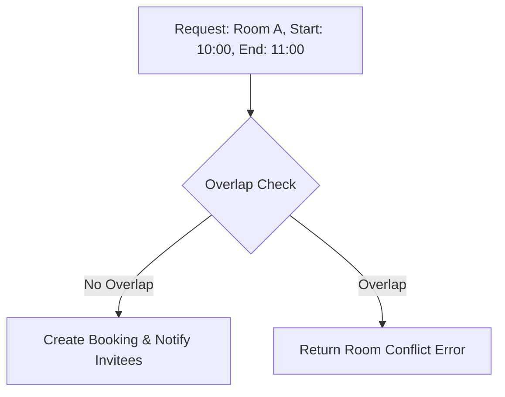

# LLD: Design a Meeting Scheduler

This system coordinates meeting room reservations, checks for schedule conflicts, and notifies invitees of bookings.

---

## Requirements
1. **Meeting Room Catalog:** Multiple meeting rooms with maximum capacities.
2. **Conflict Resolution:** Prevent booking overlapping intervals for the same room.
3. **Availability Search:** Query rooms that are free during a specific time interval.
4. **Notifications:** Send email notifications to meeting participants.

---

## Conflict Detection Flow



### Interval Overlap Mathematical Formula
Two intervals $[S_1, E_1]$ and $[S_2, E_2]$ overlap if and only if:
$$\max(S_1, S_2) < \min(E_1, E_2)$$

---

## Java Implementation

```java
import java.util.*;

class Interval {
    private final int startTime; // Represented as epoch timestamp or minutes of day
    private final int endTime;

    public Interval(int start, int end) {
        if (start >= end) throw new IllegalArgumentException("Start must be before end");
        this.startTime = start;
        this.endTime = end;
    }

    public boolean overlaps(Interval other) {
        return Math.max(this.startTime, other.startTime) < Math.min(this.endTime, other.endTime);
    }
}

class User {
    private String email;
}

class MeetingRoom {
    private final String id;
    private final int capacity;
    private final List<Interval> bookedSlots = new ArrayList<>();

    public MeetingRoom(String id, int cap) { this.id = id; this.capacity = cap; }
    public String getId() { return id; }

    public synchronized boolean book(Interval slot) {
        for (Interval existing : bookedSlots) {
            if (existing.overlaps(slot)) {
                return false; // Conflict detected
            }
        }
        bookedSlots.add(slot);
        return true;
    }
}

class Scheduler {
    private final List<MeetingRoom> rooms = new ArrayList<>();

    public void addRoom(MeetingRoom room) { rooms.add(room); }

    public MeetingRoom schedule(Interval slot, int capacity, List<User> participants) {
        for (MeetingRoom room : rooms) {
            if (room.capacity >= capacity && room.book(slot)) {
                // Trigger notification dispatch async
                notifyParticipants(participants, slot);
                return room;
            }
        }
        throw new RuntimeException("No available rooms for the slot and capacity requirements!");
    }

    private void notifyParticipants(List<User> list, Interval slot) {
        System.out.println("Dispatching meeting notifications for interval...");
    }
}
```

---

## Interview Q&A Corner

> [!IMPORTANT]
> **Q: How does this class structure scale when there are thousands of meetings booked daily?**
> A: Iterating through a list of intervals is $O(N)$ and scales poorly. Use an **Interval Tree** or **Segment Tree** data structure per room. An Interval Tree reduces overlap checking and insertions to $O(\log N)$ time complexity.
