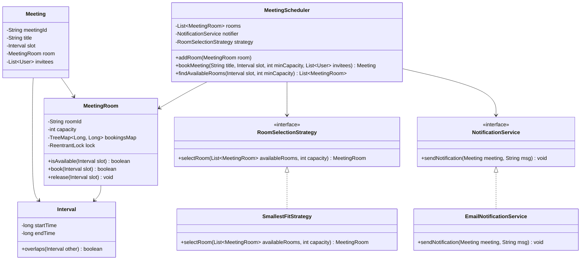
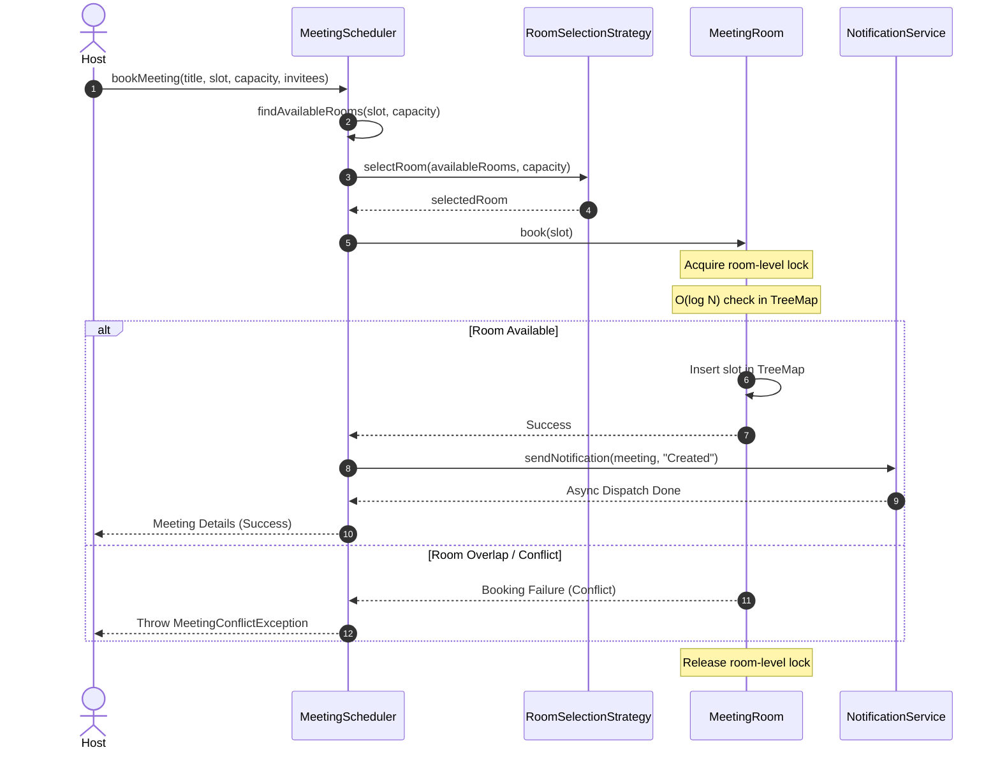

# Low-Level Design: Meeting Scheduler

This document details the Low-Level Design (LLD) for a highly concurrent, optimized Meeting Scheduler system in Java.

---

## 1. Core System Scope & Requirements

### 1.1 Functional Requirements
1. **Meeting Room Management:** Add and manage meeting rooms, each with a unique name/ID, floor location, and maximum seating capacity.
2. **Dynamic Scheduling:** Users can book a meeting room for a specific time interval.
3. **Conflict Detection ($O(\log N)$ Complexity):** Prevent booking overlapping slots in the same room. Use an optimized range query structure instead of an $O(N)$ list search.
4. **Availability Search:** Allow users to query all available rooms that meet a minimum capacity requirement for a given time window.
5. **Notification System:** Notify all meeting invitees when a booking is created, modified, or canceled.
6. **Room Selection Policy:** Support pluggable room selection strategies (e.g., choose the smallest room that fits the capacity, or choose the room closest to the host).

### 1.2 Non-Functional Requirements
1. **High Concurrency:** Avoid global locks on the Scheduler. Multiple users should be able to book different rooms simultaneously without blocking.
2. **Data Consistency:** Ensure that two concurrent booking requests for the same room at the same time fail-safes into exactly one success and one failure.
3. **Extensibility:** Easily switch notification channels (Email, Slack, SMS) or room selection policies using Design Patterns.

---

## 2. Visual Representation

### 2.1 UML Class Diagram


### 2.2 Sequence Diagram: Scheduling a Meeting


---

## 3. Complete Domain Model & Entities

```java
package lowleveldesign.scheduler;

import java.util.List;

// Interval class representing start and end time (epoch seconds)
class Interval {
    private final long startTime;
    private final long endTime;

    public Interval(long startTime, long endTime) {
        if (startTime >= endTime) {
            throw new IllegalArgumentException("Start time must be strictly before end time.");
        }
        this.startTime = startTime;
        this.endTime = endTime;
    }

    public long getStartTime() { return startTime; }
    public long getEndTime() { return endTime; }

    public boolean overlaps(Interval other) {
        return Math.max(this.startTime, other.startTime) < Math.min(this.endTime, other.endTime);
    }
}

// User representation
class User {
    private final String userId;
    private final String name;
    private final String email;

    public User(String userId, String name, String email) {
        this.userId = userId;
        this.name = name;
        this.email = email;
    }

    public String getUserId() { return userId; }
    public String getName() { return name; }
    public String getEmail() { return email; }
}

// Meeting object containing booking state
class Meeting {
    private final String meetingId;
    private final String title;
    private final Interval slot;
    private final MeetingRoom room;
    private final List<User> invitees;

    public Meeting(String meetingId, String title, Interval slot, MeetingRoom room, List<User> invitees) {
        this.meetingId = meetingId;
        this.title = title;
        this.slot = slot;
        this.room = room;
        this.invitees = invitees;
    }

    public String getMeetingId() { return meetingId; }
    public String getTitle() { return title; }
    public Interval getSlot() { return slot; }
    public MeetingRoom getRoom() { return room; }
    public List<User> getInvitees() { return invitees; }
}
```

---

## 4. Production-Ready Java Implementation

### 4.1 Meeting Room Entity ($O(\log N)$ Overlap Logic using TreeMap)
```java
package lowleveldesign.scheduler;

import java.util.Map;
import java.util.TreeMap;
import java.util.concurrent.locks.ReentrantLock;

class MeetingRoom {
    private final String roomId;
    private final int capacity;
    // Map storing: StartTime -> EndTime
    private final TreeMap<Long, Long> bookingsMap = new TreeMap<>();
    private final ReentrantLock lock = new ReentrantLock();

    public MeetingRoom(String roomId, int capacity) {
        this.roomId = roomId;
        this.capacity = capacity;
    }

    public String getRoomId() { return roomId; }
    public int getCapacity() { return capacity; }

    // Evaluates overlaps in O(log N) using TreeMap keys
    public boolean isAvailable(Interval slot) {
        lock.lock();
        try {
            Long start = slot.getStartTime();
            Long end = slot.getEndTime();

            // 1. Check if there's a booking starting before 'start'
            Map.Entry<Long, Long> floorEntry = bookingsMap.floorEntry(start);
            if (floorEntry != null && floorEntry.getValue() > start) {
                return false; // Overlaps with previous slot
            }

            // 2. Check if there's a booking starting before 'end'
            Map.Entry<Long, Long> ceilingEntry = bookingsMap.ceilingEntry(start);
            if (ceilingEntry != null && ceilingEntry.getKey() < end) {
                return false; // Overlaps with next slot
            }

            return true;
        } finally {
            lock.unlock();
        }
    }

    // Book the slot in O(log N) time complexity
    public boolean book(Interval slot) {
        lock.lock();
        try {
            if (!isAvailable(slot)) {
                return false;
            }
            bookingsMap.put(slot.getStartTime(), slot.getEndTime());
            return true;
        } finally {
            lock.unlock();
        }
    }

    // Cancel / Release booking slot
    public void release(Interval slot) {
        lock.lock();
        try {
            bookingsMap.remove(slot.getStartTime());
        } finally {
            lock.unlock();
        }
    }
}
```

### 4.2 Selection Strategy & Notification Service
```java
package lowleveldesign.scheduler;

import java.util.List;

// Strategy Interface to select room
interface RoomSelectionStrategy {
    MeetingRoom selectRoom(List<MeetingRoom> availableRooms, int capacity);
}

// Smallest room that fits the group size
class SmallestFitStrategy implements RoomSelectionStrategy {
    @Override
    public MeetingRoom selectRoom(List<MeetingRoom> availableRooms, int capacity) {
        MeetingRoom selected = null;
        int minDiff = Integer.MAX_VALUE;

        for (MeetingRoom room : availableRooms) {
            if (room.getCapacity() >= capacity) {
                int diff = room.getCapacity() - capacity;
                if (diff < minDiff) {
                    minDiff = diff;
                    selected = room;
                }
            }
        }
        return selected;
    }
}

// Notification System
interface NotificationService {
    void sendNotification(Meeting meeting, String type);
}

class EmailNotificationService implements NotificationService {
    @Override
    public void sendNotification(Meeting meeting, String type) {
        // Simulating async notification dispatch
        new Thread(() -> {
            for (User user : meeting.getInvitees()) {
                System.out.println("[Email Sent] to " + user.getEmail() + " | Subject: Meeting " + type + " - " + meeting.getTitle() + " in " + meeting.getRoom().getRoomId());
            }
        }).start();
    }
}
```

### 4.3 Scheduler Coordinator & Driver
```java
package lowleveldesign.scheduler;

import java.util.ArrayList;
import java.util.List;
import java.util.UUID;
import java.util.concurrent.CopyOnWriteArrayList;
import java.util.stream.Collectors;

class MeetingConflictException extends RuntimeException {
    public MeetingConflictException(String message) { super(message); }
}

public class MeetingScheduler {
    private final List<MeetingRoom> rooms = new CopyOnWriteArrayList<>();
    private final NotificationService notificationService;
    private final RoomSelectionStrategy roomSelectionStrategy;

    public MeetingScheduler(NotificationService notificationService, RoomSelectionStrategy roomSelectionStrategy) {
        this.notificationService = notificationService;
        this.roomSelectionStrategy = roomSelectionStrategy;
    }

    public void addRoom(MeetingRoom room) {
        rooms.add(room);
    }

    public List<MeetingRoom> findAvailableRooms(Interval slot, int minCapacity) {
        return rooms.stream()
                .filter(room -> room.getCapacity() >= minCapacity)
                .filter(room -> room.isAvailable(slot))
                .collect(Collectors.toList());
    }

    public Meeting bookMeeting(String title, Interval slot, int minCapacity, List<User> invitees) {
        List<MeetingRoom> availableRooms = findAvailableRooms(slot, minCapacity);
        if (availableRooms.isEmpty()) {
            throw new MeetingConflictException("No meeting rooms available for the requested capacity and interval.");
        }

        // Apply Selection Strategy
        MeetingRoom selectedRoom = roomSelectionStrategy.selectRoom(availableRooms, minCapacity);
        if (selectedRoom == null) {
            throw new MeetingConflictException("No meeting rooms matching selection criteria.");
        }

        // Lock & Book
        boolean success = selectedRoom.book(slot);
        if (!success) {
            // Recurse / retry finding another room in case of concurrent conflict
            return bookMeeting(title, slot, minCapacity, invitees);
        }

        String meetingId = UUID.randomUUID().toString().substring(0, 8);
        Meeting meeting = new Meeting(meetingId, title, slot, selectedRoom, invitees);
        
        // Broadcast notifications
        notificationService.sendNotification(meeting, "Scheduled");
        return meeting;
    }
}
```

### 4.4 Driver Client Class
```java
package lowleveldesign.scheduler;

import java.util.Arrays;
import java.util.List;

public class SchedulerDriver {
    public static void main(String[] args) throws InterruptedException {
        // Init Scheduler with dependencies
        NotificationService notifier = new EmailNotificationService();
        RoomSelectionStrategy strategy = new SmallestFitStrategy();
        MeetingScheduler scheduler = new MeetingScheduler(notifier, strategy);

        // Populate Rooms
        scheduler.addRoom(new MeetingRoom("Room-Small (Cap 4)", 4));
        scheduler.addRoom(new MeetingRoom("Room-Medium (Cap 10)", 10));
        scheduler.addRoom(new MeetingRoom("Room-Large (Cap 30)", 30));

        // Create Users
        User u1 = new User("U1", "Alice", "alice@test.com");
        User u2 = new User("U2", "Bob", "bob@test.com");
        List<User> list = Arrays.asList(u1, u2);

        // Intervals (e.g. 10:00 to 11:00)
        Interval slot1 = new Interval(1000, 1100);
        Interval slot2 = new Interval(1030, 1130); // Overlapping interval
        Interval slot3 = new Interval(1200, 1300); // Non-overlapping

        System.out.println("==== Test Case 1: Successful Booking ====");
        Meeting m1 = scheduler.bookMeeting("Standup", slot1, 8, list);
        System.out.println("Booked Standup in Room: " + m1.getRoom().getRoomId() + " (Capacity: " + m1.getRoom().getCapacity() + ")");

        System.out.println("\n==== Test Case 2: Overlapping Booking (Expect conflict/fallback) ====");
        // Standup is booked in Room-Medium (Cap 10). Let's try booking another meeting (Medium sized) in the same slot.
        // It should fallback to Room-Large (Cap 30) since Room-Medium is busy.
        Meeting m2 = scheduler.bookMeeting("Design Review", slot2, 8, list);
        System.out.println("Booked Design Review in Room: " + m2.getRoom().getRoomId());

        System.out.println("\n==== Test Case 3: Absolute Overlap (Expect Exception) ====");
        try {
            // Slot 1 is now booked in Room-Medium and Room-Large.
            // Requesting capacity 8 in slot 1 should throw an exception since no matching rooms are free.
            scheduler.bookMeeting("Refactoring sync", slot1, 8, list);
        } catch (Exception e) {
            System.out.println("Booking Failed as expected: " + e.getMessage());
        }

        Thread.sleep(1000); // Wait for background notifications to print
    }
}
```

---

## 5. Edge Cases & Concurrency Handling

1. **Double Booking Prevention (Room-Level Locks):**
   * *Problem:* Two users execute booking calls on the same meeting room for the same interval at the exact same millisecond.
   * *Solution:* Each `MeetingRoom` holds a `ReentrantLock`. Both check and insert (`isAvailable` and `book`) actions occur under this lock context, preventing race conditions.
2. **Interval Tree overlap checking in $O(\log N)$:**
   * *Problem:* A simple linear array search loops through all previous reservations to check overlaps, running in $O(N)$ time.
   * *Solution:* Storing allocations inside a `TreeMap` where the start time is the key allows querying the immediate prior booking (`floorEntry`) and the immediate next booking (`ceilingEntry`) in $O(\log N)$ time, ensuring fast validation regardless of booking counts.
3. **Cascading Retries on Reservation Collisions:**
   * *Problem:* Thread A finds Room X free, and Thread B finds Room X free. Thread A books Room X first. Thread B's booking fails.
   * *Solution:* In `bookMeeting()`, if `selectedRoom.book(slot)` returns false (race condition), the method catches the condition and recursively searches for another room.
4. **Incorrect Intervals:**
   * *Problem:* Users input invalid durations (e.g. start time 11:00, end time 10:00).
   * *Solution:* The `Interval` constructor enforces standard validations, raising an `IllegalArgumentException` on invalid boundaries.

---

## 6. Comprehensive Interview Q&A

### Q1: Why is a simple list of intervals insufficient for booking validation? What is the optimization?
**Answer:** A list of booked slots requires iterating through every booking to identify overlaps, resulting in $O(N)$ complexity per check. For active systems with thousands of daily entries, this causes performance degradation. By utilizing a `TreeMap` (internally structured as a Red-Black self-balancing binary search tree), we check immediate boundaries (`floorEntry` and `ceilingEntry`) to assert conflicts in $O(\log N)$ search time.

### Q2: How does the strategy pattern help us configure different room allocation policies?
**Answer:** The scheduling system needs different selection metrics (e.g., matching the smallest available room, prioritizing rooms with video conferencing equipment, or choosing the floor nearest the user). By defining a `RoomSelectionStrategy` interface, we encapsulate the selection algorithm. The scheduler executes booking calculations independently of the concrete implementation class.

### Q3: How do we handle recurrent/recurring meetings (e.g. daily standup for 3 months) in this LLD?
**Answer:** A recurring meeting cannot be treated as a single interval due to its indefinite/long timeline. We model it by breaking the schedule down into individual occurrence intervals (e.g. 90 separate day-interval objects). We check the room availability for all 90 slots. If a conflict occurs on specific days (e.g. day 12 is booked), we can alert the organizer to either book an alternative room for that single day or suggest the next best room that satisfies all 90 slots.

### Q4: Explain how you would decouple the notification service from the core scheduler thread.
**Answer:** Making sync calls to external mail API services during room booking slows down transactions. We resolve this by decoupling notifying actions. In the implementation, `EmailNotificationService` spawns an asynchronous worker thread. In production, the scheduler pushes a message to a messaging queue (e.g. RabbitMQ/Kafka), and a consumer microservice handles the notification delivery asynchronously.
