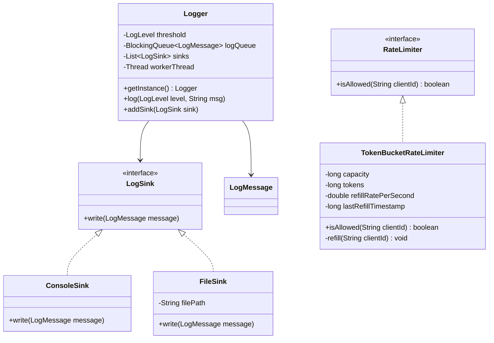
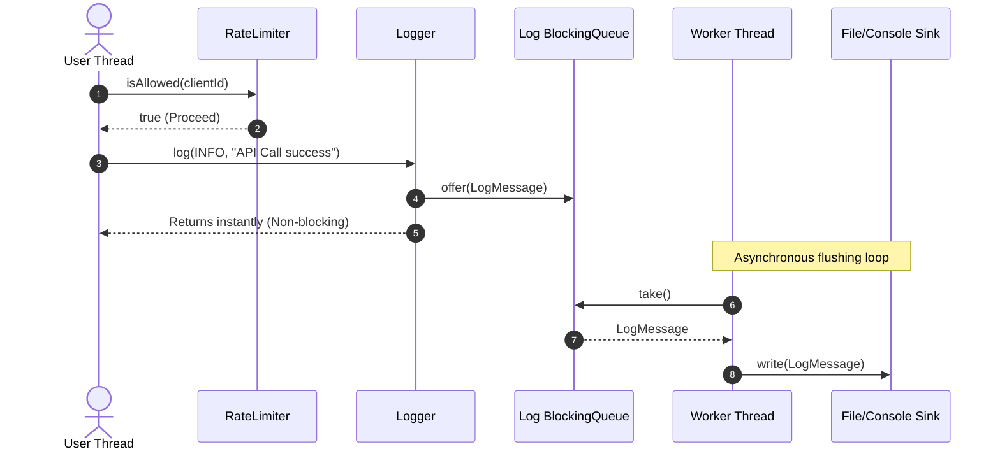

# Low-Level Design: Logger & Rate Limiter System

This document covers two major system design topics: a high-performance, asynchronous, multi-sink Logging Framework, and a thread-safe, scalable Rate Limiter.

---

## Part 1: High-Performance Logging System

### 1.1 Core System Scope & Requirements
1. **Support Log Levels:** `DEBUG`, `INFO`, `WARN`, `ERROR`, `FATAL`. Threshold logic ensures messages below a designated severity are ignored.
2. **Multiple Plug-and-Play Sinks:** Log messages can be routed to Console, File, or Database simultaneously (Observer/Strategy Patterns).
3. **Asynchronous Non-Blocking Logging:** Writing to disk/network must not block user execution threads. The client logs to an in-memory queue, and a background worker thread flushed logs to sinks.
4. **Log Formatting:** Support customizable formats (Plain Text, JSON).
5. **Thread Safety:** Ensure multiple threads can submit log statements concurrently without corruption.

---

## Part 2: Rate Limiter System

### 2.1 Core System Scope & Requirements
1. **Multi-Algorithm Support:** Provide extensible rate limiter algorithms (Token Bucket, Leaking Bucket, Sliding Window Log).
2. **Dynamic Rates:** Limit clients/users based on their IP or client ID to $K$ requests per duration $T$.
3. **Low Latency Overhead:** Checking rate limits must take sub-milliseconds so it doesn't degrade api endpoints.
4. **Thread Safety:** Support high concurrent request loads using non-blocking synchronization (e.g., atomics or concurrent hash maps).

---

## 3. Visual Representations

### 3.1 UML Class Diagram (Combined Logger & Rate Limiter)


### 3.2 Sequence Diagram: Async Logger & Rate Limiter Flow


---

## 4. Complete Domain Model & Entities

```java
package lowleveldesign.loggerratelimiter;

import java.time.Instant;

// Logger Levels
public enum LogLevel { DEBUG, INFO, WARN, ERROR, FATAL }

// Encapsulates a single log event
class LogMessage {
    private final LogLevel level;
    private final String content;
    private final Instant timestamp;
    private final String threadName;

    public LogMessage(LogLevel level, String content) {
        this.level = level;
        this.content = content;
        this.timestamp = Instant.now();
        this.threadName = Thread.currentThread().getName();
    }

    public LogLevel getLevel() { return level; }
    public String getContent() { return content; }
    public Instant getTimestamp() { return timestamp; }
    public String getThreadName() { return threadName; }

    @Override
    public String toString() {
        return String.format("[%s] [%s] [%s] - %s", timestamp.toString(), level, threadName, content);
    }
}
```

---

## 5. Production-Ready Java Implementation

### 5.1 Async Logger with Multiple Sinks
```java
package lowleveldesign.loggerratelimiter;

import java.io.FileWriter;
import java.io.IOException;
import java.io.PrintWriter;
import java.util.ArrayList;
import java.util.List;
import java.util.concurrent.BlockingQueue;
import java.util.concurrent.LinkedBlockingQueue;

// Log Sink Interface (Strategy/Observer Pattern)
interface LogSink {
    void write(LogMessage message);
}

// Console Output Sink
class ConsoleSink implements LogSink {
    @Override
    public void write(LogMessage message) {
        System.out.println("[CONSOLE] " + message.toString());
    }
}

// File Output Sink
class FileSink implements LogSink {
    private final String filePath;

    public FileSink(String filePath) {
        this.filePath = filePath;
    }

    @Override
    public void write(LogMessage message) {
        try (FileWriter fw = new FileWriter(filePath, true);
             PrintWriter pw = new PrintWriter(fw)) {
            pw.println(message.toString());
        } catch (IOException e) {
            System.err.println("Failed to write log to file: " + e.getMessage());
        }
    }
}

// Asynchronous Logger Singleton
public class Logger {
    private static Logger instance;
    private LogLevel threshold = LogLevel.INFO;
    private final BlockingQueue<LogMessage> logQueue = new LinkedBlockingQueue<>(10000); // Backpressure capacity limit
    private final List<LogSink> sinks = new ArrayList<>();
    private volatile boolean running = true;
    private Thread workerThread;

    private Logger() {
        startWorkerThread();
    }

    public static synchronized Logger getInstance() {
        if (instance == null) {
            instance = new Logger();
        }
        return instance;
    }

    public void setThreshold(LogLevel level) { this.threshold = level; }
    
    public void addSink(LogSink sink) {
        synchronized (sinks) {
            sinks.add(sink);
        }
    }

    public void log(LogLevel level, String message) {
        if (level.ordinal() >= threshold.ordinal()) {
            LogMessage logMsg = new LogMessage(level, message);
            // Non-blocking submission to queue. Falls back to drop policy if full.
            boolean offered = logQueue.offer(logMsg);
            if (!offered) {
                System.err.println("Log queue is full. Log discarded: " + message);
            }
        }
    }

    private void startWorkerThread() {
        workerThread = new Thread(() -> {
            while (running || !logQueue.isEmpty()) {
                try {
                    LogMessage msg = logQueue.take();
                    synchronized (sinks) {
                        for (LogSink sink : sinks) {
                            sink.write(msg);
                        }
                    }
                } catch (InterruptedException e) {
                    Thread.currentThread().interrupt();
                    break;
                }
            }
        });
        workerThread.setName("Logger-Worker-Thread");
        workerThread.setDaemon(true); // Daemon thread exits when main JVM stops
        workerThread.start();
    }

    public void shutdown() {
        running = false;
        if (workerThread != null) {
            workerThread.interrupt();
        }
    }
}
```

### 5.2 Thread-Safe Token Bucket Rate Limiter
```java
package lowleveldesign.loggerratelimiter;

import java.util.Map;
import java.util.concurrent.ConcurrentHashMap;

interface RateLimiter {
    boolean isAllowed(String clientId);
}

// Token Bucket Rate Limiter using dynamic time refresh
class TokenBucketRateLimiter implements RateLimiter {
    private final long maxBucketSize;
    private final double refillRatePerSecond;
    private final Map<String, TokenBucket> clientBuckets = new ConcurrentHashMap<>();

    private static class TokenBucket {
        double tokens;
        long lastRefillTimestamp;

        TokenBucket(double maxCapacity) {
            this.tokens = maxCapacity;
            this.lastRefillTimestamp = System.nanoTime();
        }
    }

    public TokenBucketRateLimiter(long maxBucketSize, double refillRatePerSecond) {
        this.maxBucketSize = maxBucketSize;
        this.refillRatePerSecond = refillRatePerSecond;
    }

    @Override
    public boolean isAllowed(String clientId) {
        TokenBucket bucket = clientBuckets.computeIfAbsent(clientId, k -> new TokenBucket(maxBucketSize));

        synchronized (bucket) {
            refill(bucket);
            if (bucket.tokens >= 1.0) {
                bucket.tokens -= 1.0;
                return true;
            }
            return false;
        }
    }

    private void refill(TokenBucket bucket) {
        long now = System.nanoTime();
        double elapsedSeconds = (now - bucket.lastRefillTimestamp) / 1_000_000_000.0;
        if (elapsedSeconds > 0) {
            double tokensToAdd = elapsedSeconds * refillRatePerSecond;
            bucket.tokens = Math.min(maxBucketSize, bucket.tokens + tokensToAdd);
            bucket.lastRefillTimestamp = now;
        }
    }
}
```

### 5.3 Combined Driver Class
```java
package lowleveldesign.loggerratelimiter;

public class LoggerLimiterDriver {
    public static void main(String[] args) throws InterruptedException {
        // Init Logger
        Logger logger = Logger.getInstance();
        logger.addSink(new ConsoleSink());
        logger.addSink(new FileSink("app.log"));
        logger.setThreshold(LogLevel.DEBUG);

        // Init Rate Limiter (Allow max 3 requests, refills at 1 token per second)
        RateLimiter rateLimiter = new TokenBucketRateLimiter(3, 1.0);

        String userIP = "192.168.1.50";

        logger.log(LogLevel.INFO, "System started. Initializing APIs...");

        // Simulate fast requests
        for (int i = 1; i <= 6; i++) {
            boolean allowed = rateLimiter.isAllowed(userIP);
            if (allowed) {
                logger.log(LogLevel.DEBUG, "Request " + i + " processed successfully.");
            } else {
                logger.log(LogLevel.WARN, "Request " + i + " blocked due to Rate Limiting!");
            }
            Thread.sleep(200); // 200ms sleep between attempts
        }

        // Wait for refill window
        logger.log(LogLevel.INFO, "Sleeping to allow token refill...");
        Thread.sleep(1200);

        // Try request again after refill
        if (rateLimiter.isAllowed(userIP)) {
            logger.log(LogLevel.INFO, "Refilled request successfully allowed.");
        }

        // Give worker thread time to flush last lines to disk before closing driver
        Thread.sleep(500);
        logger.shutdown();
    }
}
```

---

## 6. Edge Cases & Concurrency Handling

1. **Backpressure & Logger Queue Overflow:**
   * *Problem:* Sinks (e.g. disk or database write targets) become bottlenecked, and the logger queue fills up. New messages block execution threads or exhaust RAM.
   * *Solution:* In the implementation, we use `logQueue.offer(logMsg)` which returns a boolean immediately if full, rather than blocking the caller. If it is full, the message is discarded, and a warning is printed to system errors. Alternatively, we could configure custom drop strategies (`DROP_OLDEST`, `BLOCK`).
2. **Synchronizing Token Bucket Refills:**
   * *Problem:* Dynamic time refills calculated over multiple concurrent threads on the same client bucket can lead to double updates.
   * *Solution:* Each client bucket has an isolated structural object wrapper inside the `ConcurrentHashMap`. We synchronize locally on the *bucket instance* rather than globally on the entire map, keeping locks granular and scalable.
3. **Distributed Rate Limiting:**
   * *Problem:* If requests are distributed across multiple server nodes, a client could bypass JVM-level rate limits.
   * *Solution:* To scale this distributedly, replace the local JVM map with a Redis cluster. Execute checking and refills via Redis Lua Scripts (to run transactions atomically on keys) or Redis `Redisson` rate limiter libraries.
4. **Log File Rotation:**
   * *Problem:* A single log file grows indefinitely, running out of disk space.
   * *Solution:* Introduce file size validation inside `FileSink.write`. If the size of `app.log` exceeds 10MB, the file is renamed to `app-timestamp.log`, and a fresh `app.log` file is opened.

---

## 7. Comprehensive Interview Q&A

### Q1: Compare Sliding Window Log vs. Token Bucket Rate Limiter algorithms in terms of time and memory complexity.
**Answer:**
* **Sliding Window Log:** Stores the timestamps of *every* granted request in a queue (e.g. deque). Time complexity is $O(N)$ (where $N$ is number of requests in the window) for cleaning old elements. Memory complexity is high because we store $N$ elements.
* **Token Bucket:** Only stores a bucket instance with two values: `tokens` (double) and `lastRefillTimestamp` (long). Space complexity is $O(1)$ per user, which is highly efficient. Refills are computed dynamically using elapsed time, resulting in $O(1)$ constant time complexity.

### Q2: Why is logging done asynchronously? What are the trade-offs?
**Answer:** File IO write operations require OS kernel syscalls and physical disc rotation, taking milliseconds. Synchronous logging forces high-performance thread operations to wait for IO, causing major API latencies. 
* *Trade-off:* If the JVM crashes abruptly (e.g. Out of Memory or power outage), messages stored in the in-memory `logQueue` that were not yet flushed by the background thread are permanently lost.

### Q3: How does the LMAX Disruptor RingBuffer pattern improve over traditional queue-based async loggers?
**Answer:** Loggers like Logback or log4j2 use `ArrayBlockingQueue` which relies on locks and CAS (Compare-And-Swap) operations on tail/head pointers. Under heavy concurrent execution, thread lock contention on the queue's head/tail causes bottlenecks. LMAX Disruptor uses a pre-allocated circular array (**RingBuffer**) and a lock-free indexing sequence, eliminating lock contention and utilizing CPU Cache Line alignment to avoid CPU false sharing.
