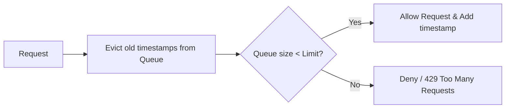

# LLD: Design Logger & Rate Limiter

This covers designing logging libraries with multiple output sinks and implementing an in-memory thread-safe rate limiter.

---

## 1. Rate Limiter (Sliding Window Log)
> **Goal:** Limit requests per user to $K$ requests within a window of $T$ seconds.

### Sliding Window Log Algorithm
1. Store timestamps of each incoming request in a queue (e.g. `DoubleEndedQueue`).
2. When a new request arrives, evict timestamps older than current time minus window $T$.
3. If queue size is less than $K$, allow request, add timestamp, and return true. Otherwise, deny request.



### Java Implementation
```java
import java.util.concurrent.ConcurrentHashMap;
import java.util.concurrent.ConcurrentLinkedQueue;

class SlidingWindowRateLimiter {
    private final int maxRequests;
    private final long windowSizeMillis;
    // Map stores request timestamps per client/IP
    private final ConcurrentHashMap<String, ConcurrentLinkedQueue<Long>> clientRequests = new ConcurrentHashMap<>();

    public SlidingWindowRateLimiter(int limit, int windowSeconds) {
        this.maxRequests = limit;
        this.windowSizeMillis = windowSeconds * 1000L;
    }

    public boolean isAllowed(String clientId) {
        long currentTime = System.currentTimeMillis();
        clientRequests.putIfAbsent(clientId, new ConcurrentLinkedQueue<>());
        ConcurrentLinkedQueue<Long> timestamps = clientRequests.get(clientId);

        synchronized (timestamps) {
            // Evict expired timestamps
            while (!timestamps.isEmpty() && (currentTime - timestamps.peek() > windowSizeMillis)) {
                timestamps.poll();
            }

            if (timestamps.size() < maxRequests) {
                timestamps.offer(currentTime);
                return true;
            }
            return false;
        }
    }
}
```

---

## 2. Logger System
Design log outputs matching levels (`INFO`, `WARN`, `ERROR`) routing to sinks (`Console`, `File`).

```java
enum LogLevel { DEBUG, INFO, WARN, ERROR }

interface LogSink {
    void write(String message);
}

class ConsoleSink implements LogSink {
    public void write(String msg) { System.out.println("[CONSOLE] " + msg); }
}

class Logger {
    private static final Logger INSTANCE = new Logger();
    private final List<LogSink> sinks = new ArrayList<>();
    private LogLevel threshold = LogLevel.INFO;

    private Logger() {}
    public static Logger getInstance() { return INSTANCE; }
    
    public void addSink(LogSink sink) { sinks.add(sink); }
    public void setThreshold(LogLevel level) { this.threshold = level; }

    public void log(LogLevel level, String message) {
        if (level.ordinal() >= threshold.ordinal()) {
            String formatted = "[" + level + "] " + message;
            for (LogSink sink : sinks) {
                sink.write(formatted);
            }
        }
    }
}
```

---

## Interview Q&A Corner

> [!WARNING]
> **Q: What is the main bottleneck of the Sliding Window Log Rate Limiter?**
> A: Memory usage. It stores timestamps for *every* granted request in memory. If a client is allowed 10,000 requests/minute, we store 10,000 long integers per client.
> *Mitigation:* Use the **Token Bucket** or **Sliding Window Counter** algorithms, which only store a few counters (integers) rather than individual timestamps.
