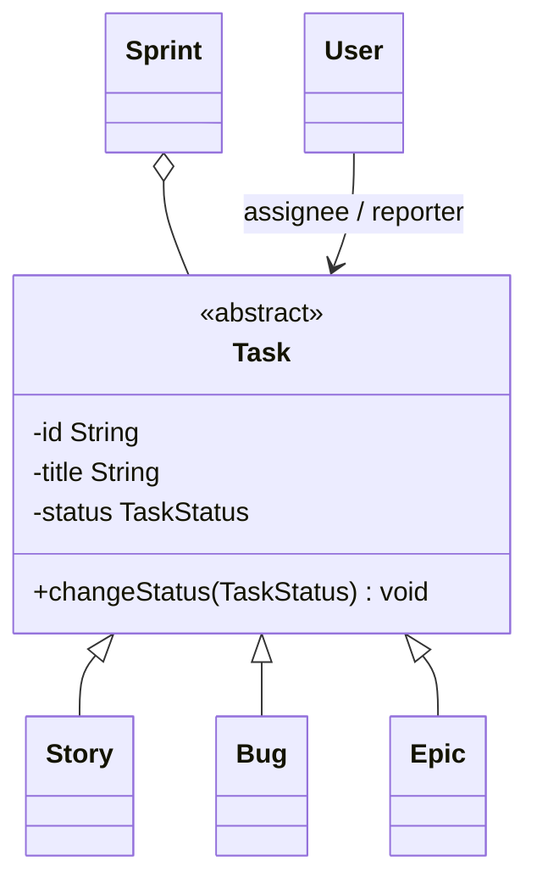

# LLD: Design a Jira (Task Planner) System

This system handles user stories, bugs, epics, sprint boards, assignees, and task status transitions.

---

## Requirements
1. **Task Types:** Support Stories, Bugs, Epics.
2. **Workflows (State Machine):** Task transitions (`TODO` -> `IN_PROGRESS` -> `CODE_REVIEW` -> `DONE`).
3. **Sprint Management:** Create sprints, add tasks, track sprint velocity.
4. **User Assignment:** Track Assignees and Reporters.

---

## Task Hierarchy Class Diagram



---

## Java Implementation

```java
import java.util.*;

enum TaskType { STORY, BUG, EPIC }
enum TaskStatus { TODO, IN_PROGRESS, TESTING, DONE }

abstract class Task {
    private final String id;
    private final String title;
    private final User reporter;
    private User assignee;
    private TaskStatus status = TaskStatus.TODO;

    public Task(String id, String title, User reporter) {
        this.id = id;
        this.title = title;
        this.reporter = reporter;
    }

    public void setAssignee(User user) { this.assignee = user; }
    public void setStatus(TaskStatus status) { this.status = status; }
    
    public abstract TaskType getType();
    public TaskStatus getStatus() { return status; }
}

class Bug extends Task {
    private int severity;
    public Bug(String id, String title, User rep) { super(id, title, rep); }
    public TaskType getType() { return TaskType.BUG; }
}

class Story extends Task {
    private int storyPoints;
    public Story(String id, String title, User rep) { super(id, title, rep); }
    public TaskType getType() { return TaskType.STORY; }
}

class User {
    private String username;
    public User(String username) { this.username = username; }
}

class Sprint {
    private final String name;
    private final List<Task> tasks = new ArrayList<>();
    private boolean isStarted = false;

    public Sprint(String name) { this.name = name; }
    public void addTask(Task t) {
        if (isStarted) throw new IllegalStateException("Cannot add tasks to active sprint!");
        tasks.add(t);
    }
    public void start() { this.isStarted = true; }
}
```

---

## Interview Q&A Corner

> [!TIP]
> **Q: How would you handle subtasks inside user stories?**
> A: Use the **Composite Design Pattern**. Make the base `Task` class hold an optional `List<Task> subTasks`. Subtasks behave like individual tasks, but the parent `Story`'s state will automatically transition to `DONE` only when all of its subtasks are transitioned to `DONE`.
