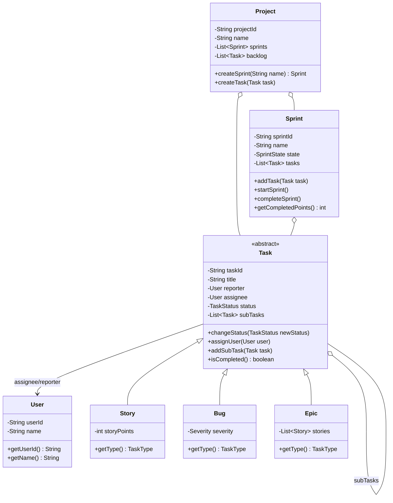
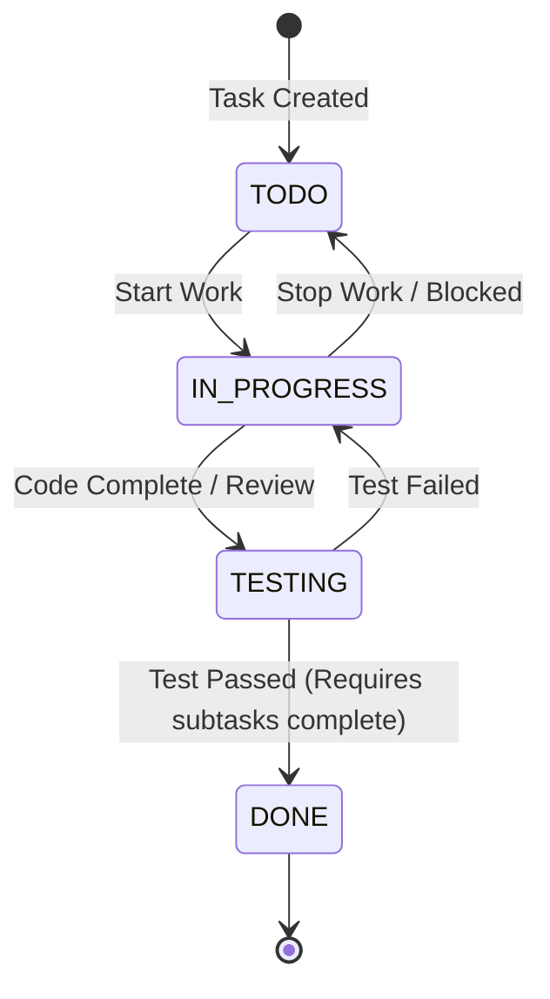

# Low-Level Design: Jira Task Planner System

This document presents a comprehensive, production-grade Low-Level Design (LLD) for a project management and task tracking system like Jira.

---

## 1. Core System Scope & Requirements

### 1.1 Functional Requirements
1. **Task Hierarchy & Polymorphism:**
   * Support multiple task types: `EPIC` (high-level body of work), `STORY` (user stories with story points), `BUG` (defects with severity).
   * Stories can contain nested `SUBTASK` children (Composite Pattern).
2. **Workflows & State Transitions:**
   * Tasks flow through states: `TODO` -> `IN_PROGRESS` -> `TESTING` -> `DONE`.
   * Enforce strict transition rules (e.g. Bugs must enter `TESTING` before going to `DONE`; a Story cannot move to `DONE` if it has incomplete subtasks).
3. **Sprint Lifecycle Management:**
   * Sprints have a name, duration, and list of tasks.
   * Transition states: `PLANNED` -> `ACTIVE` -> `COMPLETED`.
   * Enforce rules: Cannot add/remove tasks in an `ACTIVE` or `COMPLETED` sprint.
4. **Sprint Metrics (Velocity):** Calculate total story points completed during a sprint.
5. **Users & Assignments:** Users can act as Assignee (who does the work) and Reporter (who raised the task).

### 1.2 Non-Functional Requirements
1. **Thread Safety:** Multiple team members updating task states, adding subtasks, or managing sprints concurrently must not result in inconsistent race states.
2. **Data Consistency:** Prevent cyclic subtask dependencies or duplicate assignments.
3. **Extensibility:** Support custom workflow rules or new task types without breaking core logic (Open-Closed Principle).

---

## 2. Visual Representation

### 2.1 UML Class Diagram


### 2.2 Task State Workflow


---

## 3. Complete Domain Model & Entities

```java
package lowleveldesign.jira;

public enum TaskType { EPIC, STORY, BUG, SUBTASK }
public enum TaskStatus { TODO, IN_PROGRESS, TESTING, DONE }
public enum SprintState { PLANNED, ACTIVE, COMPLETED }
public enum Severity { LOW, MEDIUM, HIGH, CRITICAL }

// User Entity
class User {
    private final String userId;
    private final String name;

    public User(String userId, String name) {
        this.userId = userId;
        this.name = name;
    }

    public String getUserId() { return userId; }
    public String getName() { return name; }
}
```

---

## 4. Production-Ready Java Implementation

### 4.1 Base Task & Polymorphic Types (Composite Design)
```java
package lowleveldesign.jira;

import java.util.ArrayList;
import java.util.List;

// Main Abstract Composite Task
public abstract class Task {
    private final String taskId;
    private final String title;
    private final User reporter;
    private User assignee;
    protected TaskStatus status;
    protected final List<Task> subTasks = new ArrayList<>();

    public Task(String taskId, String title, User reporter) {
        this.taskId = taskId;
        this.title = title;
        this.reporter = reporter;
        this.status = TaskStatus.TODO;
    }

    public String getTaskId() { return taskId; }
    public String getTitle() { return title; }
    public synchronized TaskStatus getStatus() { return status; }
    public synchronized User getAssignee() { return assignee; }

    public synchronized void assignUser(User user) {
        this.assignee = user;
    }

    public synchronized void addSubTask(Task task) {
        if (task.getType() != TaskType.SUBTASK) {
            throw new IllegalArgumentException("Only subtasks can be added nested to tasks.");
        }
        subTasks.add(task);
    }

    public synchronized List<Task> getSubTasks() {
        return new ArrayList<>(subTasks);
    }

    // A task is only fully completed if all its composite subtasks are completed.
    public synchronized boolean isCompleted() {
        if (status != TaskStatus.DONE) return false;
        for (Task sub : subTasks) {
            if (!sub.isCompleted()) return false;
        }
        return true;
    }

    // Handles transition validation rules
    public synchronized void changeStatus(TaskStatus newStatus) {
        validateTransition(this.status, newStatus);
        
        // Custom check: Cannot complete parent story if subtasks are still open
        if (newStatus == TaskStatus.DONE) {
            for (Task sub : subTasks) {
                if (sub.getStatus() != TaskStatus.DONE) {
                    throw new IllegalStateException("Cannot move parent task to DONE until all subtasks are complete!");
                }
            }
        }
        this.status = newStatus;
    }

    protected void validateTransition(TaskStatus current, TaskStatus next) {
        if (current == next) return;
        // Default allowed transitions: TODO <-> IN_PROGRESS <-> TESTING -> DONE
        if (current == TaskStatus.TODO && next == TaskStatus.TESTING) {
            throw new IllegalStateException("Cannot jump from TODO directly to TESTING.");
        }
        if (current == TaskStatus.TODO && next == TaskStatus.DONE) {
            throw new IllegalStateException("Cannot move from TODO straight to DONE.");
        }
        if (current == TaskStatus.DONE && next == TaskStatus.TODO) {
            throw new IllegalStateException("Completed tasks cannot be reopened directly to TODO.");
        }
    }

    public abstract TaskType getType();
    public abstract int getStoryPoints();
}

// Story Class
class Story extends Task {
    private final int storyPoints;

    public Story(String taskId, String title, User reporter, int storyPoints) {
        super(taskId, title, reporter);
        this.storyPoints = storyPoints;
    }

    @Override
    public TaskType getType() { return TaskType.STORY; }

    @Override
    public int getStoryPoints() { return storyPoints; }
}

// Bug Class
class Bug extends Task {
    private final Severity severity;

    public Bug(String taskId, String title, User reporter, Severity severity) {
        super(taskId, title, reporter);
        this.severity = severity;
    }

    @Override
    public TaskType getType() { return TaskType.BUG; }

    @Override
    public int getStoryPoints() { return 0; } // Bugs don't hold story point estimations
}

// SubTask Class
class SubTask extends Task {
    public SubTask(String taskId, String title, User reporter) {
        super(taskId, title, reporter);
    }

    @Override
    public TaskType getType() { return TaskType.SUBTASK; }

    @Override
    public int getStoryPoints() { return 0; }
}
```

### 4.2 Sprint & Project Orchestration
```java
package lowleveldesign.jira;

import java.util.ArrayList;
import java.util.List;
import java.util.UUID;
import java.util.concurrent.CopyOnWriteArrayList;

// Sprint representation
class Sprint {
    private final String sprintId;
    private final String name;
    private SprintState state;
    private final List<Task> tasks = new CopyOnWriteArrayList<>();

    public Sprint(String sprintId, String name) {
        this.sprintId = sprintId;
        this.name = name;
        this.state = SprintState.PLANNED;
    }

    public String getSprintId() { return sprintId; }
    public String getName() { return name; }
    public synchronized SprintState getState() { return state; }

    public synchronized void addTask(Task task) {
        if (state != SprintState.PLANNED) {
            throw new IllegalStateException("Cannot add tasks to sprint in state: " + state);
        }
        tasks.add(task);
    }

    public synchronized void startSprint() {
        if (state != SprintState.PLANNED) {
            throw new IllegalStateException("Sprint is already started or completed.");
        }
        state = SprintState.ACTIVE;
        System.out.println("Sprint '" + name + "' is now ACTIVE.");
    }

    public synchronized void completeSprint() {
        if (state != SprintState.ACTIVE) {
            throw new IllegalStateException("Only active sprints can be completed.");
        }
        state = SprintState.COMPLETED;
        System.out.println("Sprint '" + name + "' has been COMPLETED.");
    }

    // Returns sum of completed Story Points (Velocity)
    public synchronized int getCompletedPoints() {
        return tasks.stream()
                .filter(Task::isCompleted)
                .mapToInt(Task::getStoryPoints)
                .sum();
    }

    public List<Task> getTasks() {
        return new ArrayList<>(tasks);
    }
}

// Project Containing backlog and sprints
public class Project {
    private final String projectId;
    private final String name;
    private final List<Task> backlog = new CopyOnWriteArrayList<>();
    private final List<Sprint> sprints = new CopyOnWriteArrayList<>();

    public Project(String projectId, String name) {
        this.projectId = projectId;
        this.name = name;
    }

    public void addToBacklog(Task task) {
        backlog.add(task);
    }

    public Sprint createSprint(String sprintName) {
        String id = "SPN-" + UUID.randomUUID().toString().substring(0, 4).toUpperCase();
        Sprint sprint = new Sprint(id, sprintName);
        sprints.add(sprint);
        return sprint;
    }

    public List<Task> getBacklog() { return backlog; }
    public List<Sprint> getSprints() { return sprints; }
}
```

### 4.3 Client Driver Program
```java
package lowleveldesign.jira;

import java.util.List;

public class JiraDriver {
    public static void main(String[] args) {
        // Users
        User admin = new User("U1", "Dev Lead");
        User dev = new User("U2", "Developer A");

        // Init Project
        Project project = new Project("PROJ-01", "Payments Core");

        // Create Stories & Bugs
        Story storyA = new Story("TSK-101", "Implement Stripe Gateway integration", admin, 8);
        Bug bugB = new Bug("TSK-102", "NPE on credit card expiry validation", admin, Severity.HIGH);

        project.addToBacklog(storyA);
        project.addToBacklog(bugB);

        // Assignee
        storyA.assignUser(dev);
        bugB.assignUser(dev);

        // Add subtasks to Story A
        SubTask sub1 = new SubTask("TSK-101-1", "Setup Stripe SDK config", admin);
        SubTask sub2 = new SubTask("TSK-101-2", "Add webhook endpoints", admin);
        storyA.addSubTask(sub1);
        storyA.addSubTask(sub2);

        // Sprint Planning
        Sprint sprint1 = project.createSprint("Sprint 26 - Launch");
        sprint1.addTask(storyA);
        sprint1.addTask(bugB);

        // Start Sprint
        sprint1.startSprint();

        System.out.println("\n==== Simulate Dev Progress ====");
        dev.getName(); // Mock usage
        
        // Try completing parent story before subtask -> Expect failure
        try {
            storyA.changeStatus(TaskStatus.IN_PROGRESS);
            storyA.changeStatus(TaskStatus.TESTING);
            storyA.changeStatus(TaskStatus.DONE);
        } catch (Exception e) {
            System.out.println("Blocked as expected: " + e.getMessage());
        }

        // Complete subtasks first
        sub1.changeStatus(TaskStatus.IN_PROGRESS);
        sub1.changeStatus(TaskStatus.TESTING);
        sub1.changeStatus(TaskStatus.DONE);

        sub2.changeStatus(TaskStatus.IN_PROGRESS);
        sub2.changeStatus(TaskStatus.TESTING);
        sub2.changeStatus(TaskStatus.DONE);

        // Complete parent now
        storyA.changeStatus(TaskStatus.DONE);
        System.out.println("Parent story status: " + storyA.getStatus() + " | Completed: " + storyA.isCompleted());

        // Complete Bug
        bugB.changeStatus(TaskStatus.IN_PROGRESS);
        bugB.changeStatus(TaskStatus.TESTING);
        bugB.changeStatus(TaskStatus.DONE);

        // End Sprint and calculate Velocity
        sprint1.completeSprint();
        System.out.println("Sprint completed points: " + sprint1.getCompletedPoints()); // Expect 8 (from storyA)
    }
}
```

---

## 5. Edge Cases & Concurrency Handling

1. **Active Sprint Modifications:**
   * *Problem:* A product manager attempts to add tasks to a sprint that is currently active or completed.
   * *Solution:* The `Sprint.addTask` method asserts the sprint status is `PLANNED`. If not, an `IllegalStateException` is thrown, protecting scope creep during sprints.
2. **Subtask Dependency Locks:**
   * *Problem:* A story is set to `DONE` while one of its nested subtask components is still in `IN_PROGRESS` or `TODO`.
   * *Solution:* Inside `Task.changeStatus`, before validating transitions to `DONE`, we recursively assert that all child subtasks in the composite array are in `DONE` status, preventing unfinished features from slipping through.
3. **State Transition Security:**
   * *Problem:* A developer bypasses workflow regulations, e.g., jumping a task from `TODO` directly to `DONE` or reopening finished tasks back to `TODO`.
   * *Solution:* `Task.changeStatus` uses a dedicated state machine validation step. Each state defines permitted transition paths. If an illegal route is attempted, the command is blocked and rolls back.
4. **Concurrent Status Modifications:**
   * *Problem:* Two users attempt to modify the same task's state concurrently.
   * *Solution:* Methods that alter status variables (`changeStatus`, `assignUser`, `addTask`) utilize the Java `synchronized` keyword mapped to the specific task object instance context.

---

## 6. Comprehensive Interview Q&A

### Q1: How does the Composite Pattern help us structure Tasks and Subtasks?
**Answer:** The Composite Design Pattern allows clients to treat individual objects (`SubTask`) and composite groupings (`Story` with multiple nested `SubTasks`) uniformly. Both share the common base `Task` interface. When calculating overall completion (`isCompleted()`), the story delegates evaluation recursively down its tree: it only returns true if its local status is `DONE` and all its child subtask nodes evaluate to `isCompleted() == true`.

### Q2: Why is the state transitions logic isolated inside the task entity instead of using global conditional scripts?
**Answer:** Putting conditional validation directly in the entity makes the domain model **rich and self-validating** (Active Record / Domain-Driven Design pattern). If validation scripts were scattered across service levels, we run the risk of different API controllers modifying statuses arbitrarily, bypassing transition constraints.

### Q3: How would you scale the velocity metrics calculation if there are millions of historical tasks?
**Answer:** Iterating and filtering millions of sprint tasks in memory during query requests degrades system performance. Instead, we:
1. **Pre-aggregate metrics:** When a sprint transitions to `COMPLETED`, calculate the total velocity score once and store it as a static column `velocity_points` in the `sprints` DB database table.
2. **Database indexing:** Index tasks by `sprint_id` and `status` to make read queries $O(\log N)$ or constant indexed reads instead of scanning entire project tables.

### Q4: How do you handle assignee concurrency, e.g., two developers trying to claim/assign the same task at the same time?
**Answer:** Under heavy usage, race conditions could cause two developers to see the task as free and double claim it. In Java, synchronized blocks on the Task object block concurrent execution. In a distributed multi-node system, we enforce database Optimistic Locking: we query `version` on select, and execute `UPDATE tasks SET assignee = ?, version = version + 1 WHERE task_id = ? AND version = ?`. The thread that misses the version update receives a conflict failure and must refresh its dashboard.
