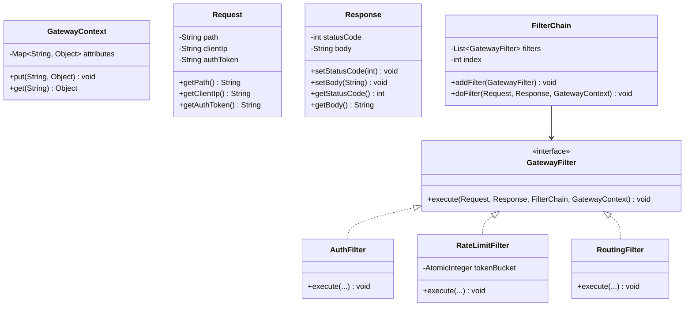
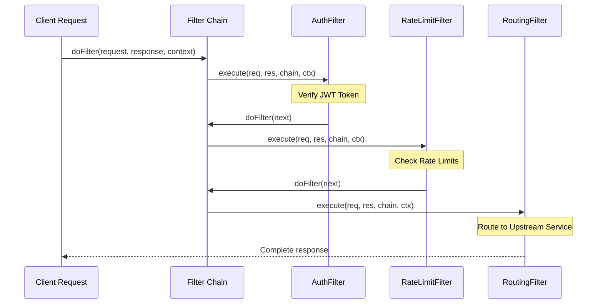

# LLD: API Gateway Router

This section covers the low-level design of an API Gateway request processing engine. The system is designed to execute a pipeline of filters (authentication, rate limiting, routing) dynamically for incoming client requests.

---

## 1. Core Intent & Problem Statement

### Design Intent
An API Gateway must process incoming HTTP requests through a series of cross-cutting concerns (logging, security, rate limiting) before routing them to upstream services.
*   **Real-world Analogy:** Security check lanes at an airport. Every passenger must pass through ticket verification, baggage scanning, and body scanning. If any check fails, the passenger is turned back.
*   **The Pattern:** **Chain of Responsibility** (or **Intercepting Filter**). This pattern chains processing filters together. Each filter decides whether to process the request, modify the context, or block the pipeline.

#### Trade-offs
*   *Pros:* Decouples individual filter logic from the core gateway engine. Allows adding, removing, or re-ordering filters dynamically without changing client routing code.
*   *Cons:* Can increase debugging complexity since request execution flows through multiple dynamic classes rather than a single controller method.

---

## 2. Visual Representation

Below is the UML class structure showing the Filter Chain coordination and the sequence flow of a client request.





---

## 3. Violating Design vs. Refactored Design

### Code Violation: The Monolithic Switch-Case Handler
Below, a single gateway router class handles routing, rate limiting, and authentication.

```java
// VIOLATION: Single class handles all filters. Violates Single Responsibility and Open-Closed principles.
class ApiGatewayHandler {
    private int rateLimitCounter = 10;

    public void handleRequest(String path, String ip, String token, Response response) {
        // 1. Authentication Check
        if (token == null || !token.equals("valid-jwt")) {
            response.setStatusCode(401);
            response.setBody("Unauthorized");
            return;
        }

        // 2. Rate Limiting Check
        if (rateLimitCounter <= 0) {
            response.setStatusCode(429);
            response.setBody("Too Many Requests");
            return;
        }
        rateLimitCounter--;

        // 3. Routing Check
        if (path.startsWith("/orders")) {
            System.out.println("Forwarding payload to orders service...");
            response.setStatusCode(200);
            response.setBody("Orders Created Successfully");
        } else {
            response.setStatusCode(404);
            response.setBody("Not Found");
        }
    }
}
```

#### Why it fails:
*   Adding a new filter (such as CORS, logging, or header modification) requires modifying the core `handleRequest` method.
*   The class is tightly coupled to concrete rate limiting values and auth strategies. It cannot scale as configuration complexities grow.

---

## 4. Production-Ready Java Implementation

```java
package com.example.gateway;

import java.util.*;
import java.util.concurrent.*;
import java.util.concurrent.atomic.AtomicInteger;

// Mock HTTP Request
class Request {
    private final String path;
    private final String clientIp;
    private final String authToken;

    public Request(String path, String clientIp, String authToken) {
        this.path = path;
        this.clientIp = clientIp;
        this.authToken = authToken;
    }

    public String getPath() { return path; }
    public String getClientIp() { return clientIp; }
    public String getAuthToken() { return authToken; }
}

// Mock HTTP Response
class Response {
    private int statusCode = 200;
    private String body = "";

    public void setStatusCode(int statusCode) { this.statusCode = statusCode; }
    public int getStatusCode() { return statusCode; }
    public void setBody(String body) { this.body = body; }
    public String getBody() { return body; }
}

// Thread-safe Request Context
class GatewayContext {
    private final Map<String, Object> attributes = new ConcurrentHashMap<>();

    public void put(String key, Object val) { attributes.put(key, val); }
    public Object get(String key) { return attributes.get(key); }
}

// Filter Abstraction
interface GatewayFilter {
    void execute(Request request, Response response, FilterChain chain, GatewayContext context);
}

// Filter Chain Coordinator
class FilterChain {
    private final List<GatewayFilter> filters = new ArrayList<>();
    private int index = 0;

    public void addFilter(GatewayFilter filter) {
        filters.add(filter);
    }

    public void doFilter(Request request, Response response, GatewayContext context) {
        if (index < filters.size()) {
            GatewayFilter filter = filters.get(index++);
            filter.execute(request, response, this, context);
        }
    }

    // Factory method to copy chain state for new concurrent executions
    public FilterChain copy() {
        FilterChain newChain = new FilterChain();
        newChain.filters.addAll(this.filters);
        return newChain;
    }
}

// 1. Authentication Filter
class AuthenticationFilter implements GatewayFilter {
    @Override
    public void execute(Request request, Response response, FilterChain chain, GatewayContext context) {
        System.out.println("[AuthFilter] Checking credentials for path: " + request.getPath());
        String token = request.getAuthToken();
        if (token == null || !token.startsWith("Bearer ")) {
            response.setStatusCode(401);
            response.setBody("Unauthorized: Invalid Bearer Token");
            return; // Terminate pipeline
        }
        // Save client identity details to context
        String user = token.substring(7);
        context.put("currentUser", user);
        chain.doFilter(request, response, context); // Continue to next filter
    }
}

// 2. Rate Limiting Filter
class RateLimitingFilter implements GatewayFilter {
    private final AtomicInteger tokenBucket;
    private final int capacity;

    public RateLimitingFilter(int capacity) {
        this.capacity = capacity;
        this.tokenBucket = new AtomicInteger(capacity);
    }

    @Override
    public void execute(Request request, Response response, FilterChain chain, GatewayContext context) {
        System.out.println("[RateLimiterFilter] Checking token bucket capacity...");
        int currentTokens = tokenBucket.get();
        if (currentTokens > 0) {
            if (tokenBucket.compareAndSet(currentTokens, currentTokens - 1)) {
                System.out.println("[RateLimiterFilter] Token consumed. Remaining: " + (currentTokens - 1));
                chain.doFilter(request, response, context); // Continue
            } else {
                // Retry if atomic CAS failed due to concurrent conflicts
                execute(request, response, chain, context);
            }
        } else {
            response.setStatusCode(429);
            response.setBody("Too Many Requests: Rate limit exceeded");
            System.out.println("[RateLimiterFilter] Limit exceeded!");
        }
    }

    // Refill helper for simulation
    public void refill() {
        tokenBucket.set(capacity);
        System.out.println("[RateLimiterFilter] Token bucket refilled to: " + capacity);
    }
}

// 3. Routing Filter (Terminating Filter)
class RoutingFilter implements GatewayFilter {
    @Override
    public void execute(Request request, Response response, FilterChain chain, GatewayContext context) {
        String user = (String) context.get("currentUser");
        System.out.println("[RoutingFilter] Mapping path " + request.getPath() + " for user: " + user);

        if (request.getPath().startsWith("/orders")) {
            response.setStatusCode(200);
            response.setBody("JSON: { 'order_id': 49204, 'status': 'Created', 'user': '" + user + "' }");
        } else {
            response.setStatusCode(404);
            response.setBody("Not Found");
        }
        // Routing filter is terminating, it does not call chain.doFilter()
    }
}

// Gateway Driver Manager
public class ApiGatewayEngine {
    private final FilterChain templateChain = new FilterChain();

    public void registerFilter(GatewayFilter filter) {
        templateChain.addFilter(filter);
    }

    public Response route(Request request) {
        Response response = new Response();
        GatewayContext context = new GatewayContext();
        // Create a copy of the chain template to avoid thread conflicts
        FilterChain executionChain = templateChain.copy();
        executionChain.doFilter(request, response, context);
        return response;
    }

    // Driver execution
    public static void main(String[] args) throws InterruptedException {
        ApiGatewayEngine gateway = new ApiGatewayEngine();
        RateLimitingFilter rateLimiter = new RateLimitingFilter(2);

        // Register filters in order
        gateway.registerFilter(new AuthenticationFilter());
        gateway.registerFilter(rateLimiter);
        gateway.registerFilter(new RoutingFilter());

        // Simulate client requests
        ExecutorService executor = Executors.newFixedThreadPool(3);

        Runnable validRequest = () -> {
            Request req = new Request("/orders/create", "192.168.1.10", "Bearer user_alice");
            Response res = gateway.route(req);
            System.out.println("Result code: " + res.getStatusCode() + " | Body: " + res.getBody());
        };

        Runnable unauthRequest = () -> {
            Request req = new Request("/orders/create", "192.168.1.11", "bad-token");
            Response res = gateway.route(req);
            System.out.println("Result code: " + res.getStatusCode() + " | Body: " + res.getBody());
        };

        System.out.println("--- Starting requests execution ---");
        // Run parallel requests
        executor.submit(validRequest); // Succeeds, consumes 1 rate-limit token
        executor.submit(validRequest); // Succeeds, consumes 2nd rate-limit token
        executor.submit(validRequest); // Fails (429 Rate limited)
        executor.submit(unauthRequest); // Fails (401 Unauthorized)

        executor.shutdown();
        executor.awaitTermination(5, TimeUnit.SECONDS);

        // Refill bucket and retry
        rateLimiter.refill();
        gateway.route(new Request("/orders/create", "192.168.1.10", "Bearer user_alice"));
    }
}
```

---

## 5. Edge Cases & Concurrency Handling

*   **Concurrency Isolation (Thread Safety):**
    *   The `FilterChain` stores an `index` integer state that increments as filters execute. If multiple threads share a single `FilterChain` instance, it will cause race conditions and skip filters.
    *   *Mitigation:* The `ApiGatewayEngine` creates a thread-local copy of the filter chain (`templateChain.copy()`) for each request execution, ensuring thread isolation.
*   **State Sharing via ConcurrentHashMap:**
    *   The `GatewayContext` uses a `ConcurrentHashMap` for attributes shared between filters (e.g., storing the user ID from `AuthFilter` for use by `RoutingFilter`), protecting against concurrency conflicts.

---

## 6. Comprehensive Interview Q&A

### Q1: How do you dynamically add or modify filter chains at runtime without restarting the API Gateway JVM?
**Answer:**
To dynamically update filter configurations:
1.  **Introduce a Configuration Registry:** Avoid hardcoding filter orders. Maintain a registry class that maps routes to their configured filter lists.
2.  **Use Thread-Safe Copy-on-Write Lists:** Store the active filters inside a `CopyOnWriteArrayList`.
3.  **Background Updates:** When a configuration changes, the Gateway listens to etcd/Consul updates, builds a new filter list, and replaces the target list reference atomically:
    ```java
    // Atomic reference update
    activeFilters.set(newFilterList);
    ```
    This ensures active requests continue running on the old list, while new requests route to the updated filter chain.

---

### Q2: How does the Filter Chain implementation propagate exceptions or errors? If one filter fails, how is execution halted?
**Answer:**
In a Chain of Responsibility pattern, a filter continues execution by calling `chain.doFilter()`.
*   If a filter fails (e.g., authentication fails or rate limits are exceeded), it sets the appropriate HTTP error code on the `Response` object and returns **without calling `chain.doFilter()`**.
*   This stops the pipeline execution, causing the call stack to unwind and return the error response directly to the client, preventing unauthorized requests from reaching backend services.

---

### Q3: What is the differences between executing filters synchronously (blocking) vs asynchronously (non-blocking) in LLD Java design?
**Answer:**
*   **Synchronous Filters (Blocking):**
    *   *Mechanism:* Each filter runs on the request thread. The thread blocks waiting for downstream actions (like database queries or external network calls) to complete.
    *   *Trade-offs:* Simple to implement and debug. However, it scales poorly under load since thread pools can be easily exhausted by slow downstream services.
*   **Asynchronous Filters (Non-Blocking - e.g. Spring WebFlux or Netty):**
    *   *Mechanism:* Filters return reactive types (e.g. `Mono<Void>` or `CompletableFuture`). The request thread registers a callback and is released to handle other connections.
    *   *Trade-offs:* Requires complex asynchronous programming models (reactive streams), but enables high scale by supporting thousands of concurrent connections on a small thread pool.
