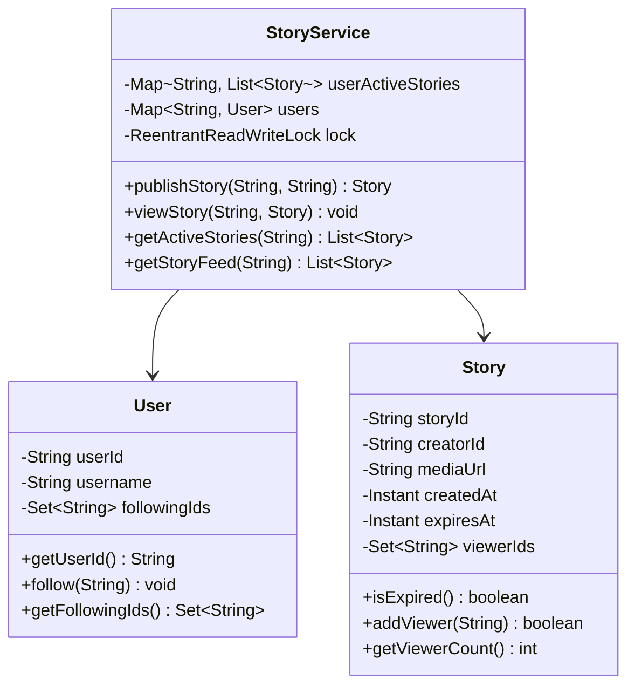
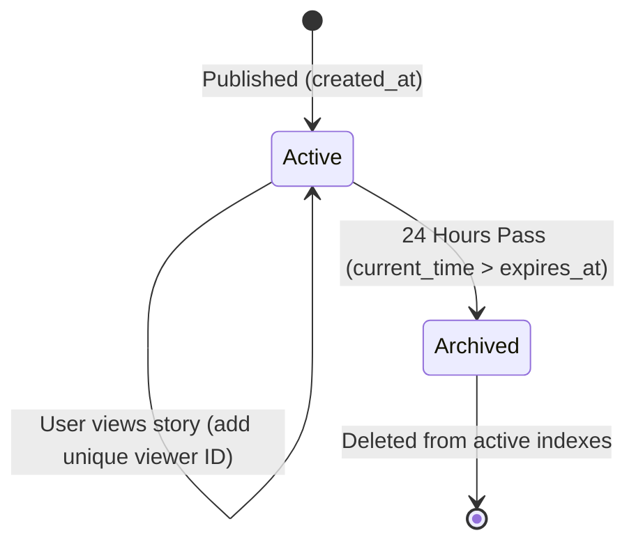

# LLD: Design Instagram Stories

This section covers the low-level design of an Instagram-style Stories service. The system allows users to publish media files as stories, compiles feeds of active stories from followed users, and automatically expires stories after 24 hours.

---

## 1. Core Intent & Problem Statement

### Design Intent
An Instagram Stories service must handle high-volume publishing and viewing requests concurrently. 
*   **Real-world Analogy:** A public bulletin board where notices are pinned and automatically removed by a moderator after exactly 24 hours.
*   **Key Requirements:**
    *   Stories must expire automatically after 24 hours.
    *   Stories must track unique viewers without duplicate counts.
    *   Feed compilation must be fast and thread-safe.

#### Trade-offs
*   *Pros:* In-memory sorted indexes enable low-latency feed retrieval.
*   *Cons:* Memory consumption grows quickly, requiring database pagination and caching strategies.

---

## 2. Visual Representation

Below is the UML class model and the state transition diagram for the story lifecycle.





---

## 3. Violating Design vs. Refactored Design

### Code Violation: The Tightly-Coupled, Non-Thread-Safe Service
Below, list updates and expiration checks are performed without synchronization locks, which can cause data corruption under concurrent access.

```java
// VIOLATION: Lacks concurrency controls and uses thread-unsafe ArrayLists, leading to race conditions.
class BadStoryService {
    private List<Story> allStories = new ArrayList<>(); // Thread-unsafe

    public void addStory(Story story) {
        allStories.add(story); // Can throw ConcurrentModificationException during concurrent reads
    }

    public List<Story> getActiveStories(String userId) {
        List<Story> active = new ArrayList<>();
        for (Story s : allStories) {
            // Expired check performed on read, but list modification lacks synchronization
            if (s.creatorId.equals(userId) && s.expiresAt.isAfter(Instant.now())) {
                active.add(s);
            }
        }
        return active;
    }
}
```

#### Why it fails:
*   `ArrayList` is not thread-safe. Concurrent additions and traversals can throw a `ConcurrentModificationException` or result in data loss.
*   The system lacks locking controls on the unique viewers list, allowing duplicate views to be recorded.

---

## 4. Production-Ready Java Implementation

```java
package com.example.stories;

import java.time.Instant;
import java.time.temporal.ChronoUnit;
import java.util.*;
import java.util.concurrent.*;
import java.util.concurrent.locks.ReentrantReadWriteLock;

// User Entity
class User {
    private final String userId;
    private final String username;
    private final Set<String> followingIds = ConcurrentHashMap.newKeySet();

    public User(String userId, String username) {
        this.userId = userId;
        this.username = username;
    }

    public String getUserId() { return userId; }
    public String getUsername() { return username; }
    
    public void follow(String targetUserId) {
        followingIds.add(targetUserId);
    }
    
    public Set<String> getFollowingIds() { return followingIds; }
}

// Story Entity
class Story {
    private final String storyId;
    private final String creatorId;
    private final String mediaUrl;
    private final Instant createdAt;
    private final Instant expiresAt;
    // Set to track unique viewers concurrently
    private final Set<String> viewerIds = ConcurrentHashMap.newKeySet();

    public Story(String storyId, String creatorId, String mediaUrl) {
        this.storyId = storyId;
        this.creatorId = creatorId;
        this.mediaUrl = mediaUrl;
        this.createdAt = Instant.now();
        // Default TTL: 24 Hours
        this.expiresAt = this.createdAt.plus(24, ChronoUnit.HOURS);
    }

    // Constructor override for testing expiration logic
    public Story(String storyId, String creatorId, String mediaUrl, int durationHours) {
        this.storyId = storyId;
        this.creatorId = creatorId;
        this.mediaUrl = mediaUrl;
        this.createdAt = Instant.now();
        this.expiresAt = this.createdAt.plus(durationHours, ChronoUnit.HOURS);
    }

    public String getStoryId() { return storyId; }
    public String getCreatorId() { return creatorId; }
    public String getMediaUrl() { return mediaUrl; }
    public Instant getExpiresAt() { return expiresAt; }

    public boolean isExpired() {
        return Instant.now().isAfter(expiresAt);
    }

    // Add unique viewer ID (thread-safe, returns true if new viewer)
    public boolean addViewer(String viewerId) {
        return viewerIds.add(viewerId);
    }

    public int getViewerCount() {
        return viewerIds.size();
    }
    
    public Set<String> getViewerIds() {
        return Collections.unmodifiableSet(viewerIds);
    }
}

// Thread-Safe Stories Service
class StoryService {
    private final Map<String, List<Story>> userActiveStories = new ConcurrentHashMap<>();
    private final Map<String, User> usersRegistry = new ConcurrentHashMap<>();
    
    // ReadWriteLock to optimize concurrent reads on active indexes
    private final ReentrantReadWriteLock rwLock = new ReentrantReadWriteLock();

    public void registerUser(User user) {
        usersRegistry.put(user.getUserId(), user);
    }

    // Publish new story
    public Story publishStory(String creatorId, String mediaUrl) {
        rwLock.writeLock().lock();
        try {
            Story story = new Story(UUID.randomUUID().toString(), creatorId, mediaUrl);
            userActiveStories.computeIfAbsent(creatorId, k -> new CopyOnWriteArrayList<>()).add(story);
            System.out.println("[Publish] Story " + story.getStoryId() + " published by User: " + creatorId);
            return story;
        } finally {
            rwLock.writeLock().unlock();
        }
    }

    // Publish story with custom duration (for testing expiration)
    public Story publishStoryWithDuration(String creatorId, String mediaUrl, int durationHours) {
        rwLock.writeLock().lock();
        try {
            Story story = new Story(UUID.randomUUID().toString(), creatorId, mediaUrl, durationHours);
            userActiveStories.computeIfAbsent(creatorId, k -> new CopyOnWriteArrayList<>()).add(story);
            return story;
        } finally {
            rwLock.writeLock().unlock();
        }
    }

    // Log a unique view
    public void viewStory(String viewerId, Story story) {
        if (story.isExpired()) {
            System.out.println("[View Failed] Story has expired.");
            return;
        }
        if (story.addViewer(viewerId)) {
            System.out.println("[View Success] User " + viewerId + " viewed story " + story.getStoryId());
        }
    }

    // Fetch active stories for a specific user
    public List<Story> getActiveStories(String creatorId) {
        rwLock.readLock().lock();
        try {
            List<Story> stories = userActiveStories.get(creatorId);
            if (stories == null) return Collections.emptyList();

            List<Story> active = new ArrayList<>();
            for (Story s : stories) {
                if (!s.isExpired()) {
                    active.add(s);
                }
            }
            return active;
        } finally {
            rwLock.readLock().unlock();
        }
    }

    // Compile active story feed from followed users
    public List<Story> getStoryFeed(String userId) {
        User user = usersRegistry.get(userId);
        if (user == null) return Collections.emptyList();

        List<Story> feed = new ArrayList<>();
        rwLock.readLock().lock();
        try {
            for (String followedId : user.getFollowingIds()) {
                feed.addAll(getActiveStories(followedId));
            }
            // Sort feed: most recent stories first
            feed.sort((a, b) -> b.getExpiresAt().compareTo(a.getExpiresAt()));
            return feed;
        } finally {
            rwLock.readLock().unlock();
        }
    }

    // Background job sweep simulation to remove expired records from memory
    public void cleanupExpiredStories() {
        rwLock.writeLock().lock();
        try {
            System.out.println("[Background Cleanup] Sweeping expired stories...");
            for (Map.Entry<String, List<Story>> entry : userActiveStories.entrySet()) {
                entry.getValue().removeIf(Story::isExpired);
            }
        } finally {
            rwLock.writeLock().unlock();
        }
    }
}

// Client Driver Class
public class InstagramStorySystem {
    public static void main(String[] args) throws InterruptedException {
        StoryService storyService = new StoryService();

        // 1. Create Users
        User alice = new User("usr_alice", "alice_adventurer");
        User bob = new User("usr_bob", "bob_coder");
        User Charlie = new User("usr_charlie", "charlie_chef");

        storyService.registerUser(alice);
        storyService.registerUser(bob);
        storyService.registerUser(Charlie);

        // Establish relationships
        alice.follow("usr_bob");
        alice.follow("usr_charlie");

        System.out.println("--- Publishing Stories ---");
        // 2. Publish active stories
        storyService.publishStory("usr_bob", "https://cdn.com/bob_coding.jpg");
        storyService.publishStory("usr_charlie", "https://cdn.com/charlie_pizza.jpg");

        // Publish an expired story (set duration to -1 hour for testing)
        storyService.publishStoryWithDuration("usr_bob", "https://cdn.com/bob_old.jpg", -1);

        System.out.println("--- Fetching Alice's Feed ---");
        // 3. Compile feed
        List<Story> aliceFeed = storyService.getStoryFeed("usr_alice");
        for (Story s : aliceFeed) {
            System.out.println("Feed Item: User " + s.getCreatorId() + " -> Media: " + s.getMediaUrl());
        }

        System.out.println("--- Recording Story Views ---");
        // 4. View stories
        if (!aliceFeed.isEmpty()) {
            Story activeStory = aliceFeed.get(0);
            // Record concurrent views
            ExecutorService executor = Executors.newFixedThreadPool(2);
            executor.submit(() -> storyService.viewStory("usr_alice", activeStory));
            executor.submit(() -> storyService.viewStory("usr_bob", activeStory));
            executor.submit(() -> storyService.viewStory("usr_alice", activeStory)); // Duplicate check

            executor.shutdown();
            executor.awaitTermination(3, TimeUnit.SECONDS);
            System.out.println("Story Viewer Count: " + activeStory.getViewerCount());
        }

        // Run memory cleanup sweep
        storyService.cleanupExpiredStories();
    }
}
```

---

## 5. Edge Cases & Concurrency Handling

*   **Thread Safety using ReadWriteLocks:**
    *   Feed retrieval is read-heavy. Using a standard `synchronized` block would block concurrent reads, degrading performance.
    *   *Mitigation:* Use `ReentrantReadWriteLock`. Multiple threads can acquire the read lock simultaneously to view feeds. The write lock is only acquired when publishing a new story or running cleanup sweeps, which blocks read threads briefly to ensure consistency.
*   **Duplicate View Filtering:**
    *   The `viewerIds` set is initialized as `ConcurrentHashMap.newKeySet()`. This thread-safe set implementation allows atomic, non-blocking additions (`viewerIds.add(viewerId)`), ensuring that unique views are recorded accurately under concurrent requests.

---

## 6. Comprehensive Interview Q&A

### Q1: How do you design tests to verify the 24-hour expiration logic without waiting for a full day to pass?
**Answer:**
We cannot use real-time sleep operations in unit tests. To test time-dependent expiration logic:
1.  **Inject a Clock abstraction:** Avoid using static calls like `Instant.now()`. Instead, inject a `java.time.Clock` dependency into the `Story` and `StoryService` classes:
    ```java
    public Instant getExpiresAt(Clock clock) {
        return this.createdAt.plus(24, ChronoUnit.HOURS);
    }
    ```
2.  **Mock the Clock:** In unit tests, inject a mutable mock clock (e.g. `MutableClock` or `Clock.offset()`).
3.  **Fast-Forward Time:** In the test setup, publish a story, use the mock clock to fast-forward the time by 25 hours, and assert that `story.isExpired()` returns true and that the feed filter excludes the story.

---

### Q2: How do you design pagination for a user's story feed? If a user follows 1,000 accounts, how do you prevent loading all stories into memory at once?
**Answer:**
To paginate story feeds:
1.  **Introduce Feed Chunking:** Instead of fetching all active stories for all followed users at once, retrieve active story indexes in batches.
2.  **Use Redis Sorted Sets (`ZRANGEBYSCORE`):** Query followed user indexes in parallel using limit offsets:
    `ZRANGEBYSCORE stories:user:<id> <current_time> +inf LIMIT 0 10`
3.  **Client-Side Pagination Cursor:** The API endpoint returns a cursor (containing a timestamp parameter: `next_expires_at_cursor`). The client passes this cursor in subsequent requests:
    `GET /v1/stories/feed?cursor=178040182&limit=10`
    The server uses this cursor to retrieve the next batch of stories from the cache.

---

### Q3: If a celebrity posts a story, how does the system prevent database locking and slow response times?
**Answer:**
If a celebrity has 50 million followers, writing references to all 50 million follower feeds (write fan-out) can degrade system performance.

**Solution:**
Use a **Hybrid Delivery Model**:
*   *For regular users:* When they publish, write references directly to their followers' feed caches.
*   *For celebrities:* Save the story in the celebrity's active stories list only.
*   *On Feed Request:* When a user requests their feed, retrieve their feed cache (containing stories from regular users), query the followings list to identify followed celebrities, fetch active stories directly from the celebrities' active lists, and merge them into the feed.
