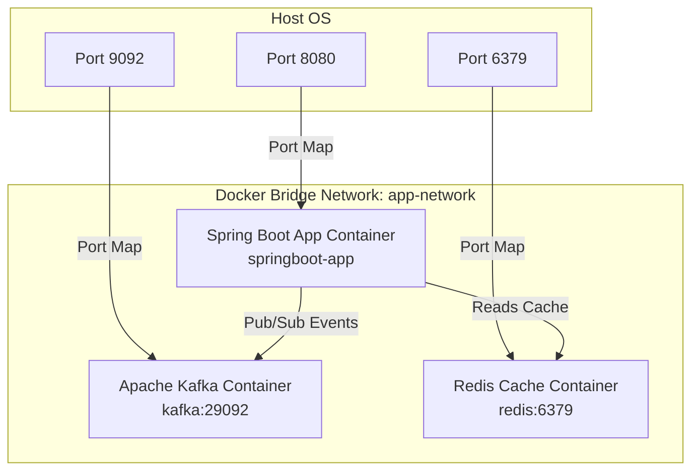

# Spring Boot Containerization, Docker & Orchestration Guide

This guide covers the containerization of our **Spring Boot 3.4.2 (Java 25)** Order Processing System using **Docker** and **Docker Compose**, optimized for production caching, security, and cloud-native standards.

---

## 🚀 How to Build and Run with Docker

To run the entire system (Spring Boot app + Kafka + Redis) in an isolated Docker network, execute the following commands:

### Step 1: Pre-Build the Application Jar
First, build the standard executable fat JAR on your host machine:
```bash
mvn clean package -DskipTests -pl springboot
```

### Step 2: Spin Up the Infrastructure and Application
Use Docker Compose to build the application container and start Redis and KRaft Kafka:
```bash
docker compose -f springboot/docker-compose.yml up --build
```

### Step 3: Verify Container Health
Once the startup logs complete:
1. **Check container status**:
   ```bash
   docker compose -f springboot/docker-compose.yml ps
   ```
2. **Access the endpoints**:
   - Actuator Health (exposing Redis & Kafka health): `curl -u admin:admin http://localhost:8080/actuator/health`
   - DI Demo: `curl -u admin:admin http://localhost:8080/api/di/demo`

---

## 🏗️ Architecture & Configuration Breakdown



### 1. The Multi-Stage `Dockerfile` (Layered JARs)
Instead of copying a single monolithic fat JAR, our `Dockerfile` uses **Spring Boot Layertools** in a multi-stage process:
- **Extraction Stage**: Runs `java -Djarmode=layertools -jar application.jar extract` to decompose the JAR into 4 distinct layers:
  1. `dependencies`: Static third-party libraries (rarely changed).
  2. `spring-boot-loader`: Spring Boot's internal jar loading code (rarely changed).
  3. `snapshot-dependencies`: Internal snapshot dependencies (infrequently changed).
  4. `application`: Your active source code classes and resources (changed constantly!).
- **Runner Stage**: Copies each layer individually. When you change a single line of Java code, **only the application layer (a few kilobytes) is invalidated and rebuilt**. The static dependencies (~50MB) are served directly from the local Docker cache!

### 2. Sane Security defaults (Non-Root User)
Running containerized Java processes as the root user is a critical vulnerability. Our runner stage explicitly provisions a dedicated, underprivileged user and group:
```dockerfile
RUN addgroup -S spring && adduser -S spring -G spring
USER spring:spring
```

### 3. Zookeeper-less Kafka (KRaft Mode)
Our `docker-compose.yml` utilizes **KRaft (Kafka Raft Metadata Mode)**. Zookeeper is fully eliminated. A single container functions both as the broker and controller, drastically reducing memory usage and boot times while aligning with modern Apache Kafka standards.

### 4. Dynamic Profiles and Environment Fallbacks
To support running both on the host machine and inside the Docker container seamlessly, `application.properties` uses environment placeholders with default fallbacks:
- `spring.kafka.bootstrap-servers=${SPRING_KAFKA_BOOTSTRAP_SERVERS:localhost:9092}`
- `spring.data.redis.host=${SPRING_DATA_REDIS_HOST:localhost}`
When run on the host, it defaults to `localhost`. When orchestrated by Docker Compose, the env variables override them to target container hostnames (`kafka:29092` and `redis`).

---

## 🎯 Top Senior Java Backend Interview Q&A

### Q1: How do you optimize Docker image size and build times for a Spring Boot application?
**Answer:**
1. **Multi-Stage Builds**: Separate the build/extraction environment from the production runtime environment to keep the final image small.
2. **Layered JARs (`layertools`)**: Deconstruct the JAR into distinct layers (`dependencies`, `spring-boot-loader`, `snapshot-dependencies`, `application`) and copy them separately. Since dependencies rarely change, Docker caches them, reducing build times from minutes to milliseconds.
3. **Use JRE instead of JDK**: Use minimal base images like `eclipse-temurin:25-jre-alpine` rather than the full JDK, reducing the image footprint from ~400MB to ~150MB.

---

### Q2: Why should you avoid running your Spring Boot application as the `root` user inside a container?
**Answer:**
If an attacker exploits a vulnerability in the application (such as Remote Code Execution) and the process is running as `root`, they instantly gain full root privileges on the container. From there, they can execute host system exploits (Container Escape) or perform malicious network scans.
**Mitigation:** Always create an unprivileged user/group (e.g. `spring:spring`) inside the Dockerfile and switch context using the `USER` instruction before starting the JVM.

---

### Q3: How does the JVM handle memory limits inside a container? What are the dangers?
**Answer:**
Older Java versions were not container-aware and read the host's physical RAM rather than the container's allocated memory limits. As a result, the JVM would grow larger than the container's limits, triggering the OS Out-Of-Memory (OOM) Killer to abruptly terminate the container.
**Solution:** Modern JVMs (Java 17/21/25) are fully container-aware. We configure JVM memory dynamically using `-XX:MaxRAMPercentage=75.0` or `-XX:InitialRAMPercentage=50.0`. This ensures the JVM heap dynamically scales as a percentage of the container's memory limits, preventing OOM-kills.

---

### Q4: How do you configure a Spring Boot app to dynamically switch between Docker Compose and Local Host execution?
**Answer:**
We leverage Spring's support for environment variable placeholders in `application.properties`.
```properties
spring.data.redis.host=${SPRING_DATA_REDIS_HOST:localhost}
```
If `SPRING_DATA_REDIS_HOST` is defined in the environment (as in `docker-compose.yml`), Spring Boot resolves to that hostname (e.g., `redis`). If undefined (local IDE run), it falls back to `localhost`.

---

### Q5: What is the difference between `EXPOSE` in a Dockerfile and `ports` mapping in `docker-compose.yml`?
**Answer:**
- `EXPOSE` is purely documentation. It tells developers and orchestration engines which ports the application inside the container listens on. It does not publish or make the port accessible on the host machine.
- `ports` in `docker-compose.yml` (or `-p` in `docker run`) actually maps a host port to the container port (e.g., `8080:8080`), making the service reachable from external networks and browsers.

---

### Q6: What is Kafka KRaft mode and why is it beneficial in Docker Compose setups?
**Answer:**
KRaft (Kafka Raft Metadata mode) manages cluster metadata directly within Kafka brokers instead of relying on a separate Apache Zookeeper cluster. 
In containerized development environments, this means:
1. **Simplified orchestration**: You only need to run and configure a single service rather than managing Zookeeper and Kafka separately.
2. **Reduced resources**: Cuts CPU and memory consumption in half.
3. **Faster Startup**: KRaft initializes metadata instantly, preventing "Zookeeper not ready" timeout crashes.

---

### Q7: How do you ensure your Spring Boot container waits for dependent services (like Redis) to be fully ready before starting up?
**Answer:**
In Docker Compose, `depends_on` alone only ensures the dependency container has *started*, not that it is *ready* to accept connections.
**Best Practices:**
1. **Compose Healthchecks**: Define a `healthcheck` in the Redis service (e.g., `redis-cli ping`), and set `depends_on` in the `app` service with `condition: service_healthy`:
   ```yaml
   depends_on:
     redis:
       condition: service_healthy
   ```
2. **Application Resilience**: Implement database connection retry configurations or circuit breakers inside the Spring Boot application (using tools like Resilience4j) so the app does not crash if a transient network lag occurs during startup.
