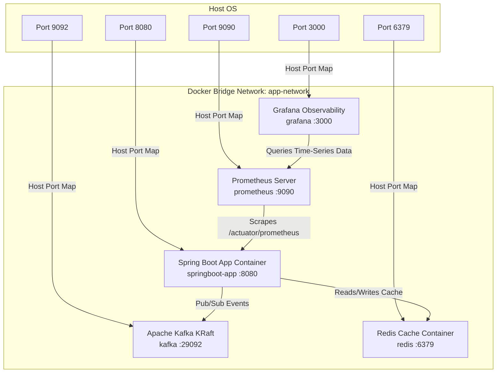

# Spring Boot Containerization, Docker & Orchestration Guide

This guide covers the containerization of our **Spring Boot 3.4.2 (Java 25)** Order Processing System using **Docker** and **Docker Compose**, optimized for production layer caching, container security, cgroup resource management, graceful shutdown, and cloud-native standards.

---

## 🚀 How to Build and Run with Docker

To run the entire system (Spring Boot app + Kafka KRaft + Redis + Prometheus + Grafana) in an isolated Docker network:

### Step 1: Pre-Build the Application Jar
Build the standard executable fat JAR on your host machine:
```bash
mvn clean package -DskipTests -pl springboot
```

### Step 2: Spin Up Infrastructure and Application
Use Docker Compose to build the application container and start infrastructure services:
```bash
docker compose -f springboot/docker-compose.yml up --build -d
```

### Step 3: Verify Container Health & Observability
Once the startup logs complete:
1. **Check container status & healthchecks**:
   ```bash
   docker compose -f springboot/docker-compose.yml ps
   ```
2. **Access endpoints & dashboards**:
   - **Actuator Health**: `curl -u admin:admin http://localhost:8080/actuator/health`
   - **Liveness Probe**: `curl http://localhost:8080/actuator/health/liveness`
   - **Readiness Probe**: `curl http://localhost:8080/actuator/health/readiness`
   - **Prometheus Scrape Raw Metrics**: `curl -u admin:admin http://localhost:8080/actuator/prometheus`
   - **Prometheus Dashboard**: Open `http://localhost:9090` (Query `http_server_requests_seconds_count`).
   - **Grafana Dashboard**: Open `http://localhost:3000` (`admin` / `admin`). Under Datasources, add `http://prometheus:9090`. Import default dashboard **12900** or **4701** to view JVM metrics and connection pool statistics in real-time.

---

## 🏗️ Architecture & Network Topology


```mermaid
graph TD
    subgraph Host OS
        Port8080[Port 8080]
        Port9092[Port 9092]
        Port6379[Port 6379]
        Port9090[Port 9090]
        Port3000[Port 3000]
    end
    subgraph Docker Bridge Network: app-network
        App[Spring Boot App Container<br>springboot-app :8080]
        Kafka[Apache Kafka KRaft<br>kafka :29092]
        Redis[Redis Cache Container<br>redis :6379]
        Prom[Prometheus Server<br>prometheus :9090]
        Graf[Grafana Observability<br>grafana :3000]
    end
    Port8080 -->|Host Port Map| App
    Port9092 -->|Host Port Map| Kafka
    Port6379 -->|Host Port Map| Redis
    Port9090 -->|Host Port Map| Prom
    Port3000 -->|Host Port Map| Graf
    App -->|Reads/Writes Cache| Redis
    App -->|Pub/Sub Events| Kafka
    Prom -->|Scrapes /actuator/prometheus| App
    Graf -->|Queries Time-Series Data| Prom
```

---

## 🛡️ Senior Production Hardening & Best Practices

### 1. Multi-Stage Build with Layered JARs (`layertools`)
Standard Spring Boot fat JARs copy ~50MB of unchanged dependencies on every single code change. Our `Dockerfile` uses **Spring Boot Layertools** in a 2-stage build:
- **Extractor Stage**: Runs `java -Djarmode=layertools -jar application.jar extract` to decompose the JAR into 4 layers:
  1. `dependencies`: Static 3rd-party libraries (infrequent changes).
  2. `spring-boot-loader`: Spring's internal jar launching infrastructure.
  3. `snapshot-dependencies`: Internal snapshot dependencies.
  4. `application`: Business logic classes and configuration files (changed constantly).
- **Runner Stage**: Copies each layer individually. Rebuilding after a Java code modification only invalidates the application layer (few KB), reducing build times from minutes to sub-seconds.

### 2. PID 1 Signal Forwarding & Graceful Shutdown
To ensure zero dropped requests during container restarts or deployments:
- **Exec Form Entrypoint**: We use JSON array syntax `ENTRYPOINT ["java", "org.springframework.boot.loader.launch.JarLauncher"]`. This ensures `java` executes directly as **PID 1** inside the container and receives OS signals like `SIGTERM` immediately. (Shell form `ENTRYPOINT java ...` spawns `/bin/sh` as PID 1, which swallows `SIGTERM`).
- **Spring Boot Graceful Shutdown**: Configured via `server.shutdown=graceful` and `spring.lifecycle.timeout-per-shutdown-phase=30s`. Upon receiving `SIGTERM`, the container stops accepting new traffic, drains active HTTP requests, finishes in-flight Kafka consumers, and cleanly closes DB connections.

### 3. Cgroup v1/v2 Awareness & JVM RAM Limits
Modern JVMs (Java 17+) read cgroup memory limits directly:
- `-XX:MaxRAMPercentage=75.0`: Restricts the Java Heap to 75% of the container's memory ceiling (e.g., 384MB out of 512MB limit).
- **Non-Heap Room**: The remaining 25% accommodates Metaspace, Thread Stacks (1MB per thread), GC native overhead, Direct Byte Buffers, and OS overhead, preventing abrupt Linux kernel Out-Of-Memory (`OOMKilled`) container terminations.

### 4. Non-Root Security Context (Principle of Least Privilege)
Running containerized Java applications as `root` exposes the host machine to Container Escape attacks.
```dockerfile
RUN addgroup -S spring && adduser -S spring -G spring
USER spring:spring
```
The runtime stage drops root privileges and executes as an unprivileged system user `spring`.

### 5. KRaft (Zookeeper-less Apache Kafka) & Dual Listeners
- **KRaft Mode**: Replaces Zookeeper with an internal Raft quorum controller, cutting RAM footprint by half and boot time to ~2 seconds.
- **Dual Listener Architecture**:
  - `PLAINTEXT://kafka:29092`: Internal bridge network communication between Spring Boot container and Kafka.
  - `PLAINTEXT_HOST://localhost:9092`: External communication between local host tools/IDE and Kafka.

---

## 🎯 Top Senior Java Backend Interview Q&A

### Q1: How do you optimize Docker image size and build times for a Spring Boot application?
**Answer:**
1. **Multi-Stage Builds**: Separate the build/extraction environment from the runtime environment to omit build tools (Maven/Gradle) from the production image.
2. **Layered JARs (`layertools`)**: Deconstruct the JAR into distinct layers (`dependencies`, `spring-boot-loader`, `snapshot-dependencies`, `application`) and copy them separately in the Dockerfile. Because dependencies rarely change, Docker reuses cached layers, driving rebuild times down to milliseconds.
3. **Minimal Base Images**: Use Alpine or Distroless base images (e.g., `eclipse-temurin:25-jre-alpine` or `gcr.io/distroless/java21`), keeping final container sizes around ~150MB compared to standard 500MB+ JDK images.

---

### Q2: Why should you avoid running your Spring Boot application as the `root` user inside a container?
**Answer:**
If an attacker exploits a vulnerability in the application (such as Remote Code Execution / RCE) while the process runs as `root`, they inherit root capabilities inside the container. If host isolation protections fail or Docker socket mounting is misused, the attacker can break out of the container (Container Escape) and compromise the host node host filesystem or adjacent workloads.  
**Mitigation:** Create an unprivileged user/group (e.g., `spring:spring`) inside the Dockerfile and switch execution context using `USER spring:spring`.

---

### Q3: How does the JVM handle memory limits inside a container? What happens if `-Xmx` is misconfigured?
**Answer:**
Older Java versions were container-unaware and read host RAM instead of cgroup container limits. Modern JVMs (Java 10+) are cgroup-aware and automatically calculate heap sizes based on container limits.  
If you set `-Xmx` equal to the total container limit (e.g., `-Xmx512m` on a 512MB container), the OS kernel's OOM Killer will forcefully kill the container (`exit code 137`) because off-heap memory (Metaspace, Thread Stacks, GC buffers, Code Cache) pushes total memory usage beyond 512MB.  
**Best Practice:** Use dynamic percentages rather than fixed values: `-XX:MaxRAMPercentage=75.0` (or `80.0`), leaving 20–25% overhead for non-heap usage.

---

### Q4: What is the difference between shell form and exec form in Dockerfile `ENTRYPOINT`/`CMD`? Why does it matter for Graceful Shutdown?
**Answer:**
- **Shell form** (`ENTRYPOINT java -jar app.jar`): Spawns `/bin/sh -c` as **PID 1**, which executes `java` as a child process. `/bin/sh` does NOT forward POSIX signals like `SIGTERM` to child processes. When `docker stop` is invoked, the JVM never receives `SIGTERM` and fails to run shutdown hooks. After the 10-second timeout, Docker sends `SIGKILL`, abruptly killing the app.
- **Exec form** (`ENTRYPOINT ["java", "-jar", "app.jar"]`): Executes `java` directly as **PID 1**. Signals like `SIGTERM` reach the JVM instantly, triggering Spring Boot's graceful shutdown procedure (`server.shutdown=graceful`) to flush buffers and close connections.

---

### Q5: How do you configure a Spring Boot app to dynamically switch between Docker Compose and Local Host execution?
**Answer:**
Leverage Spring Boot environment variable default fallbacks in `application.properties`:
```properties
spring.data.redis.host=${SPRING_DATA_REDIS_HOST:localhost}
spring.kafka.bootstrap-servers=${SPRING_KAFKA_BOOTSTRAP_SERVERS:localhost:9092}
```
When running in Docker Compose, environment variables (`SPRING_DATA_REDIS_HOST=redis`) override defaults to target internal container DNS. When running locally via IDE or terminal, missing env vars fall back seamlessly to `localhost`.

---

### Q6: What is the difference between `EXPOSE` in a Dockerfile and `ports` mapping in `docker-compose.yml`?
**Answer:**
- `EXPOSE` is informational metadata for developers and container orchestrators stating which port the application listens on inside the container. It does NOT open or publish ports to the host machine.
- `ports` in `docker-compose.yml` (or `-p` in `docker run`) configures IP forwarding on the host system (e.g., `8080:8080`), binding host network traffic to container ports.

---

### Q7: What is Kafka KRaft mode and why is it beneficial in Docker Compose setups?
**Answer:**
KRaft (Kafka Raft Metadata mode) manages cluster metadata natively inside Kafka brokers, entirely removing the dependency on Apache Zookeeper.  
**Benefits for Docker Environments:**
1. **Simplified Infrastructure**: Eliminates the Zookeeper container, reducing overall Compose setup complexity.
2. **Resource Efficiency**: Drops memory footprint by ~500MB and speeds up boot times to sub-2-seconds.
3. **Reliability**: Eliminates race conditions where Kafka attempts to connect before Zookeeper is fully initialized.

---

### Q8: How do you ensure your Spring Boot container waits for dependent services (like Redis/Kafka) to be fully ready before starting up?
**Answer:**
`depends_on` without conditions only waits for container creation/start, not service readiness.  
**Robust Production Strategy:**
1. **Compose Healthchecks**: Define healthchecks in dependency services (e.g., `redis-cli ping` for Redis) and configure `depends_on` with `condition: service_healthy` in the app service.
2. **Application Resilience**: Implement startup connection retries inside Spring Boot or Resilience4j circuit breakers so transient startup network delays do not trigger application crash-loops.

---

### Q9: How do Spring Boot Liveness and Readiness probes differ, and how should they be used in container orchestration?
**Answer:**
Spring Boot Actuator exposes two distinct health endpoints when container probes are enabled (`management.endpoint.health.probes.enabled=true`):
- **Liveness Probe** (`/actuator/health/liveness`): Checks if the application process is internally healthy (e.g., LivenessState isn't BROKEN due to thread deadlock or corrupted state). If failed, orchestrators restart the container.
- **Readiness Probe** (`/actuator/health/readiness`): Checks if the app is ready to accept user traffic (e.g., DB connection pools ready, Kafka consumers subscribed). If failed, orchestrators stop routing traffic to the container without killing it.

---

### Q10: What are the trade-offs between Alpine (`musl`) vs Distroless vs Debian-based base images for Spring Boot containers?
**Answer:**
- **Alpine (`musl libc`)**: Tiny image size (~150MB), but uses `musl` instead of `glibc`. Can suffer performance drops in memory allocation under heavy threads, and has potential DNS caching quirks.
- **Distroless (`gcr.io/distroless`)**: Contains only the runtime and dependencies—no shell, no `apt`, no `ls` or package managers. Extremely secure with minimal attack surface, but harder to perform ad-hoc `docker exec` shell debugging.
- **Debian/Ubuntu Slim (`glibc`)**: Slightly larger (~200-250MB), maximum compatibility with native Java performance libraries (Netty epoll, RocksDB), familiar debugging tools available.

---

### Q11: How do Cloud Native Buildpacks (`mvn spring-boot:build-image`) compare to custom multi-stage Dockerfiles?
**Answer:**
- **Buildpacks (CNB / Paketo)**: Automates image creation directly from source code without writing a Dockerfile. Automatically handles JVM tuning, layered caching, SBOM (Software Bill of Materials) generation, and CVE patch re-basing.
- **Custom Dockerfile**: Provides full control over base image selection, custom OS packages, custom non-root UID/GID, and specific security hardening flags required by strict enterprise compliance.

---

### Q12: How do Kafka Dual Listeners work in Docker Compose, and why is `localhost:9092` alone insufficient?
**Answer:**
Kafka brokers communicate their address to clients via **Advertised Listeners**. When Spring Boot runs inside the Docker network, it needs the service name (`kafka:29092`). When host tools (e.g., Kafdrop or local IDE) connect, they require `localhost:9092`.  
To support both concurrently, Kafka uses dual listeners in `docker-compose.yml`:
- `KAFKA_LISTENERS`: `PLAINTEXT://0.0.0.0:29092, PLAINTEXT_HOST://0.0.0.0:9092`
- `KAFKA_ADVERTISED_LISTENERS`: `PLAINTEXT://kafka:29092, PLAINTEXT_HOST://localhost:9092`  
This ensures both container-to-container and host-to-container clients resolve the correct network routes.
