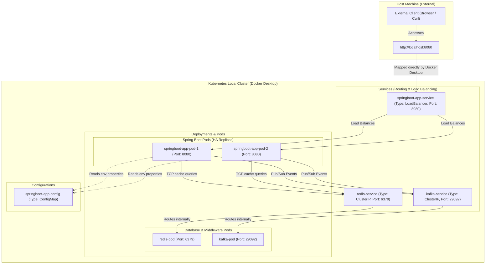

# Spring Boot Kubernetes & Orchestration Guide

This guide introduces the core concepts of **Kubernetes (K8s)**, explains how it integrates with **Spring Boot 3.4.2**, and outlines how to deploy our Order Processing System into a Kubernetes cluster using declarative manifests.

---

## 💡 What is Kubernetes & Why Use It?

While **Docker Compose** is exceptional for running containerized architectures on a **single developer machine**, it is not built for production clusters. 

**Kubernetes** is an open-source container orchestration platform designed to manage, scale, and automate containerized applications across **clusters of physical or virtual machines**.

| Feature | Docker Compose | Kubernetes |
| :--- | :--- | :--- |
| **Target** | Single-host local environments | Multi-host production clusters |
| **Scaling** | Manual (`docker compose up --scale`) | Automated (HPA - Horizontal Pod Autoscaling) |
| **Self-Healing** | Simple container restarts | Auto-replace failed nodes, auto-reschedule dead pods |
| **Service Discovery** | Basic Docker Bridge DNS | Highly advanced internal DNS, LoadBalancers, and Ingress routing |
| **Zero-Downtime Deployments**| None (causes brief disruption) | Standard Rolling Updates (replaces pods progressively) |

---

## 🏗️ Kubernetes Cluster & Networking Architecture

This diagram shows how K8s orchestrates the pods, maps communication via internal/external services, and uses ConfigMaps for configuration injection inside our cluster.



---

## 🛠️ Local Kubernetes Deployment Guide (Docker Desktop)

Since you are using **Docker Desktop with Kubernetes enabled**, local deployment is incredibly simple because the local Docker daemon and the Kubernetes cluster share the **exact same image registry context**. Any image you build locally is instantly visible to Kubernetes without loading commands or VM bridges!

### Step 1: Enable Kubernetes in Docker Desktop
1. Open **Docker Desktop** preferences.
2. Go to **Settings** -> **Kubernetes**.
3. Check **Enable Kubernetes** and click **Apply & restart**.
4. Confirm your context is pointing to Docker Desktop:
   ```bash
   kubectl config current-context
   # Expected output: docker-desktop
   ```

### Step 2: Build the Application Docker Image
Build the JAR on your host, then build the container image. It is immediately registered inside Docker Desktop:
```bash
mvn clean package -DskipTests -pl springboot
docker build -t springboot-interview:latest springboot/
```

### Step 3: Deploy to Kubernetes
Apply all declarative resource configurations in sequence:
```bash
# 1. ConfigMaps and environments
kubectl apply -f springboot/k8s/configmap.yaml

# 2. Redis cluster service
kubectl apply -f springboot/k8s/redis.yaml

# 3. Zookeeper-less Kafka service
kubectl apply -f springboot/k8s/kafka.yaml

# 4. Spring Boot Application (exposes LoadBalancer)
kubectl apply -f springboot/k8s/app.yaml
```

### Step 4: Verify Deployment and Access App
1. **Check status of all pods**:
   ```bash
   kubectl get pods -w
   ```
2. **Access the application directly**:
   Because Docker Desktop’s Kubernetes binds `LoadBalancer` services directly to your host's local network card, **no VM port forwarding or minikube bridges are needed!**
   Simply trigger your local curl/endpoints:
   ```bash
   curl -u admin:admin http://localhost:8080/actuator/health
   ```

---

## 🧩 Kubernetes Manifest Components Explained

Our deployment files under [springboot/k8s/](file:///Users/yogeshwarpatel/Workspace/interview/springboot/k8s) demonstrate enterprise-level best practices:

1. **[app.yaml](file:///Users/yogeshwarpatel/Workspace/interview/springboot/k8s/app.yaml) (Deployment & Service)**:
   - Sets up **2 Replicas** for High Availability.
   - Configures **Probes**: Uses Spring Boot Actuator health checks for container lifecycles.
   - Configures **Resource Constraints**: Requests `256Mi` / Limits `512Mi` of RAM. Since Java 25 is fully container-aware, the G1 garbage collector uses these bounds to set heap allocation, ensuring the container never causes a host-level Out-of-Memory crash.
2. **[configmap.yaml](file:///Users/yogeshwarpatel/Workspace/interview/springboot/k8s/configmap.yaml)**:
   - Externalizes environment variables, mapping internal K8s cluster service DNS hosts (`redis-service:6379` and `kafka-service:29092`) to Spring Boot dynamically.

---

## 🎯 Top Senior Java & Kubernetes Interview Q&A

### Q1: What is the difference between Liveness and Readiness probes? How does Spring Boot support them?
**Answer:**
- **Liveness Probe**: Determines if a container is *alive*. If the liveness probe fails, Kubernetes assumes the container has crashed or entered an unrecoverable deadlock and **kills and restarts it**.
- **Readiness Probe**: Determines if a container is *ready* to accept network traffic. If it fails, Kubernetes **stops routing incoming traffic to this pod** but does not kill it. This is crucial during startup (while database migrations or heavy caches load).

**Spring Boot Integration:**
Starting with Spring Boot 2.3+, the framework automatically detects it is running inside a Kubernetes cluster and exposes dedicated Actuator endpoints:
- Liveness: `/actuator/health/liveness` (returns `UP` as long as the application is running).
- Readiness: `/actuator/health/readiness` (returns `UP` once dependencies are bound and the server is ready to handle requests).

---

### Q2: What is the difference between Resource Requests and Resource Limits in a Pod manifest?
**Answer:**
- **Resource Requests**: The minimum amount of CPU/Memory that the pod needs to start. The K8s Scheduler uses this value to decide **which cluster node has enough capacity** to host the pod. If no nodes have enough requested space, the pod stays in `Pending` state.
- **Resource Limits**: The absolute maximum CPU/Memory a pod is allowed to consume. If a pod exceeds its memory limit, it triggers a kernel-level OOM event, and Kubernetes immediately terminates it (`OOMKilled`). If it exceeds CPU limits, Kubernetes throttles (slows down) the CPU usage but does not kill it.

---

### Q3: Explain what "Container-Awareness" in JVM (Java 17/21/25) means, and what happens if you run an older JVM inside Kubernetes.
**Answer:**
Older JVM versions (Java 8u131 and below) were not container-aware. When reading system limits (like CPU count and total memory), they queried the host OS instead of the container's cgroup limits.
Consequently, if a container was allocated a `512Mi` limit on a host with `64GB` of RAM, the JVM would calculate heap sizes based on `64GB`. The JVM would quickly grow larger than `512Mi`, triggering the host's OOM Killer to instantly abort the container.
Modern JVMs (Java 17+) natively respect cgroup limits. They calculate heap sizes dynamically using options like `-XX:MaxRAMPercentage` (typically set to 70–80%) of the container's allocated memory limits.

---

### Q4: Explain the differences between ClusterIP, NodePort, and LoadBalancer services in K8s.
**Answer:**
- **ClusterIP** (Default): Exposes the service on an **internal IP address** within the cluster. It makes the service reachable only from inside the Kubernetes cluster. Excellent for internal databases (like our Redis and Kafka services).
- **NodePort**: Exposes the service on each node’s IP at a static port (in the range `30000-32767`). It routes external traffic to the service.
- **LoadBalancer**: Provisions a cloud provider's external load balancer (such as AWS ELB or GCP Load Balancer) and assigns a public IP address. It automatically routes external internet traffic into your pods, making it the standard choice for public-facing entry gateways.

---

### Q5: How do you achieve "Zero-Downtime Deployment" for a Spring Boot service in Kubernetes?
**Answer:**
Kubernetes achieves zero downtime via **Rolling Updates** and **Graceful Shutdown**:
1. **Rolling Update Strategy**: Kubernetes creates a new pod, waits for its **Readiness Probe** to succeed (indicating it can safely serve traffic), and only then terminates one old pod. It progresses sequentially until all instances are updated.
2. **Graceful Shutdown in Spring Boot**: Set `server.shutdown=graceful` in `application.properties`. When Kubernetes sends a `SIGTERM` signal to stop a pod, Spring Boot stops accepting new requests but continues processing in-flight requests for a specified grace period (e.g., 30s) before terminating, ensuring zero dropped connections.
