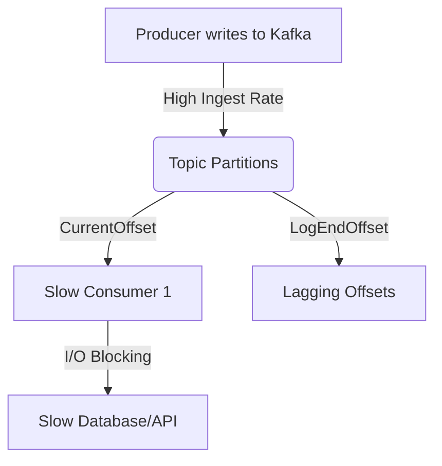
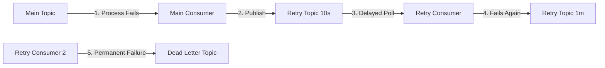

# 🎓 Advanced Apache Kafka - Scenario-Based & Expert Q&A

This document provides a highly technical, production-oriented deep dive into Apache Kafka. It covers architectural scenarios, common production bottlenecks, design trade-offs, and expert-level trick questions frequently asked in senior system design and engineering interviews.

---

## 🗺️ Table of Contents
1. [Consumer Lag & Backpressure](#1-consumer-lag--backpressure)
2. [Partition Strategy & Hotspots](#2-partition-strategy--hotspots)
3. [Message Ordering Guarantees](#3-message-ordering-guarantees)
4. [Retry & Failure Handling Patterns](#4-retry--failure-handling-patterns)
5. [Exactly-Once Semantics (EOS) vs. At-Least-Once](#5-exactly-once-semantics-eos-vs-at-least-once)
6. [ISR Shrinkage & High Availability](#6-isr-shrinkage--high-availability)
7. [High Throughput Optimization (1M msg/sec)](#7-high-throughput-optimization-1m-msgsec)
8. [Consumer Rebalancing & Mitigation](#8-consumer-rebalancing--mitigation)
9. [Preventing Data Loss in Production](#9-preventing-data-loss-in-production)
10. [Schema Evolution with Avro & Schema Registry](#10-schema-evolution-with-avro--schema-registry)
11. [Multi-DC & Disaster Recovery Design](#11-multi-dc--disaster-recovery-design)
12. [Kafka vs. Traditional Queues (e.g., RabbitMQ)](#12-kafka-vs-traditional-queues-eg-rabbitmq)
13. [Exactly-Once Internals (Advanced Deep Dive)](#13-exactly-once-internals-advanced-deep-dive)
14. [Log Compaction vs. Time-based Retention](#14-log-compaction-vs-time-based-retention)
15. [Consumer Offset Management & Crash Recovery](#15-consumer-offset-management--crash-recovery)
16. [🔴 Expert-Level Trick Questions (16-20)](#-expert-level-trick-questions-16-20)
17. [🔑 How to Choose a Partition Key (Trade-off Analysis)](#-how-to-choose-a-partition-key-trade-off-analysis)

---

## 1. Consumer Lag & Backpressure

### 👉 Scenario
Your consumer group is lagging behind heavily in production, causing downstream systems to experience delayed updates.

### ❓ Questions
* How do you identify the root cause of lag?
* What metrics and tools will you check (e.g., offsets, throughput)?
* How would you fix it without downtime?

### 💡 In-Depth Answer

#### A. Identifying the Root Cause
Consumer lag is defined as the gap between the latest message written to the partition log (**LogEndOffset**) and the last message processed and committed by the consumer group (**CurrentOffset**). 

$$\text{Consumer Lag} = \text{LogEndOffset} - \text{CurrentOffset}$$

Monotonically increasing lag indicates that the consumer group's processing rate is lower than the producer group's ingestion rate. To identify the root cause, we must diagnose:
1. **Downstream Bottlenecks (I/O):** Slow database writes, slow external API calls, lock contention, or network latency.
2. **CPU/Memory Bottlenecks:** Heavy deserialization, parsing, or computationally expensive business logic causing high Garbage Collection (GC) pauses.
3. **Consumer Instability:** Frequent crashes triggering constant consumer group rebalances, leaving partitions unassigned.
4. **Configuration Mismatch:** Inefficient batch configuration forcing too many round-trips.



#### B. Metrics & Tools to Monitor
* **Command-Line Tools:**
  * Use the Kafka admin CLI to inspect consumer status:
    ```bash
    kafka-consumer-groups.sh --bootstrap-server localhost:9092 --describe --group order-processing-group
    ```
    This prints a tabular view showing `TOPIC`, `PARTITION`, `CURRENT-OFFSET`, `LOG-END-OFFSET`, `LAG`, `CONSUMER-ID`, `HOST`, and `CLIENT-ID`.
* **Dedicated Lag Monitors:**
  * **Burrow (by LinkedIn):** Monitors consumer offsets and evaluates lag as a status (OK, WARNING, ERROR) rather than just a number. It detects stuck consumers (offsets not moving but lag increasing) without static thresholds.
  * **Kafka Exporter:** A Prometheus exporter that exposes group-level and partition-level lag metrics to build Grafana dashboards.
* **Key Prometheus/JMX Metrics:**
  * `kafka_consumergroup_lag`: Overall lag per consumer group.
  * `records-lag-max`: The maximum lag in messages across all partitions of the consumer.
  * `records-consumed-rate`: The average number of records consumed per second.
  * `fetch-rate`: The number of fetch requests sent to the broker per second.

#### C. Zero-Downtime Mitigation Strategies
1. **Horizontal Scaling (Scale Out Consumers):**
   * Spin up additional consumer instances within the same `group.id`.
   * > [!IMPORTANT]
     > You can only scale horizontally up to the number of partitions in the topic. If you have 10 partitions and 10 consumers, adding an 11th consumer will result in that consumer sitting idle.
2. **Increase Partition Count (If at Consumer Limit):**
   * If you have reached the partition limit (e.g., 8 partitions, 8 consumers), dynamically increase the topic's partition count (e.g., to 16) and immediately launch 8 more consumer instances.
   * > [!WARNING]
     > Increasing partitions will change the key routing math (`hash(key) % partitions`). This breaks message ordering guarantees for future keys relative to historic keys (see Q3).
3. **Tune Consumer Polling & Batch Configuration:**
   * **Reduce Batch Size:** If downstream I/O is slow, reduce `max.poll.records` to ensure the consumer can process and commit the entire batch within the `max.poll.interval.ms` limit, preventing the broker from marking it dead.
   * **Increase Prefetching:** If processing is fast but network latency is high, increase `fetch.min.bytes` (e.g., 50KB) and `fetch.max.wait.ms` (e.g., 500ms) to reduce overall network round-trips.
4. **Implement Multi-threaded Consumer Execution:**
   * Instead of doing heavy processing on the main Kafka poll thread, hand off the message payloads to an internal worker thread pool (e.g., Java `ExecutorService`).
   * **Caveat:** You must manually track offsets and only commit them when all tasks *prior* to that offset are completed successfully.

---

## 2. Partition Strategy & Hotspots

### 👉 Scenario
You have an `Orders` topic with uneven load. Out of 10 partitions, partitions 2 and 5 are consistently overloaded (hotspots), while the others are mostly idle.

### ❓ Questions
* Why does this happen?
* How would you redesign partitioning?
* What key would you choose?

### 💡 In-Depth Answer

#### A. Why Hotspots Occur
By default, the standard Kafka producer employs a hash-based partitioning strategy:

$$\text{Partition} = \text{Math.abs}(\text{MurmurHash2}(\text{Key})) \pmod{\text{Total Partitions}}$$

This works well if keys are highly diverse (high cardinality) and uniformly distributed. However, hotspots occur when:
1. **Low Cardinality Keys:** The partition key has very few unique values (e.g., partitioning by `orderStatus` where 95% of orders are `COMPLETED`).
2. **Key Skew (Hot Keys):** The keys have high cardinality, but a few keys account for a massive percentage of the traffic. For example, partitioning by `sellerId` or `merchantId` in an e-commerce platform where a giant merchant (e.g., Amazon) generates millions of orders, while small sellers generate only 2-3 orders.
3. **Null Keys:** If the key is null, older Kafka clients round-robin messages, but newer versions use the **Sticky Partitioner** (which buffers records in a single partition until it fills up to optimize batching). If configured poorly, it can temporarily skew load.

```
Skewed Key (merchantId)          Composite Key (merchantId_orderId)
[Merchant_A] -> Partition 2       [Merchant_A_1091] -> Partition 1
[Merchant_A] -> Partition 2       [Merchant_A_1092] -> Partition 4
[Merchant_A] -> Partition 2       [Merchant_A_1093] -> Partition 8
(Partition 2 Overloaded!)         (Perfectly Distributed Across Cluster)
```

#### B. Redesigning the Partitioning Strategy
1. **Use a Composite Key:**
   * Combine the business entity key with a high-cardinality transaction identifier (e.g., `merchantId_orderId` or `clientId_timestamp`).
   * This preserves entropy, guaranteeing that hash calculations distribute messages uniformly across all partitions.
2. **Key Salting:**
   * For extremely active keys, append a random suffix or "salt" (e.g., `MerchantA_0`, `MerchantA_1`, `MerchantA_2`).
   * This distributes the traffic of a single merchant across a configured range of partitions.
   * *Trade-off:* The consumer must now consume from all partitions in the salt range to aggregate data for `MerchantA`.
3. **Implement a Custom Partitioner:**
   * Implement Kafka's `Partitioner` interface. Write custom logic:
     * If the payload belongs to a known "hot key", bypass hash-based routing and route it randomly or using a custom round-robin pool.
     * Use standard hashing for normal keys.

#### C. Choosing the Key: Trade-off Matrix

| Key Strategy | Ordering Guarantee | Scalability / Load Balance | Best Used For |
| :--- | :--- | :--- | :--- |
| **No Key (Null)** | None (Global/Topic-level) | **Excellent** (Perfectly uniform via Sticky Partitioner) | High-throughput logging, clickstream analysis. |
| **Simple Key** (e.g., `merchantId`) | Strict order per merchant | **Poor** (High risk of hotspots if a merchant is dominant) | Low-volume systems where entity order is critical. |
| **Composite Key** (e.g., `merchantId_orderId`) | None (Order per individual order, not per merchant) | **Excellent** (High cardinality ensures uniform hash distribution) | Payment processing, transaction ledgers. |
| **Salted Key** (e.g., `merchantId_salt`) | Partition-level order broken | **Good** (Spreads hot seller traffic across $N$ partitions) | High-throughput systems with skewed power-law traffic. |

---

## 3. Message Ordering Guarantees

### 👉 Scenario
Your application processes financial ledger transactions. A user's `DEPOSIT` must always be processed before their `WITHDRAWAL`. 

### ❓ Questions
* How will Kafka ensure ordering?
* What happens if you increase partitions later?
* Can ordering break under specific circumstances?

### 💡 In-Depth Answer

#### A. How Kafka Guarantees Ordering
Kafka guarantees message ordering **only within a single partition**, never globally across a topic. To ensure sequential processing of a user's transactions:
1. **Consistent Partitioning:** The producer must provide a key (e.g., `userId` or `accountId`) with every message.
2. **Deterministic Routing:** Since the hashing logic always maps the same key to the same partition, all events for `user_123` are written to the exact same partition log.
3. **Single Consumer Binding:** Within a consumer group, a partition is assigned to exactly one consumer thread. This ensures that the messages are consumed sequentially.

```
Producer                     Topic Partitions                  Consumer
User_A (Deposit)    -----\                                  
User_B (Deposit)    ------\---> Partition 0 [User_A, User_A] --> Consumer Thread 1 (Strict Order)
User_A (Withdrawal) -----/                                  
User_C (Deposit)    ----------> Partition 1 [User_B, User_C] --> Consumer Thread 2
```

#### B. The Impact of Increasing Partitions
> [!CAUTION]
> Dynamically increasing partition count on an active topic breaks key-to-partition ordering guarantees.
* **Math Shift:** If partition count is increased from 10 to 15, the hashing function $\text{hash}(key) \pmod{10}$ becomes $\text{hash}(key) \pmod{15}$.
* **Data Split:** A user's historical transactions (e.g., `DEPOSIT`) sit in Partition 3, but their new transactions (e.g., `WITHDRAWAL`) will be routed to Partition 8.
* **Race Condition:** Two different consumers will now process Partition 3 and Partition 8 in parallel. The consumer processing Partition 8 might process the `WITHDRAWAL` before the consumer processing Partition 3 processes the older `DEPOSIT`, leading to incorrect balances or transaction failures.

#### C. Scenarios Where Ordering Can Break (Even Without Repartitioning)
1. **Producer Retries without Idempotence:**
   * A producer sends Message 1 (Deposit) and Message 2 (Withdrawal).
   * Message 1 fails due to a transient network timeout, but Message 2 succeeds.
   * The producer retries and successfully writes Message 1.
   * Partition log ordering is now: `[Message 2, Message 1]` (broken ordering).
   * **Fix:** Enable `enable.idempotence=true` (forces the broker to track sequence numbers per producer ID) or set `max.in.flight.requests.per.connection=1` (limits throughput).
2. **Asynchronous Consumer Processing:**
   * A consumer thread fetches a batch of messages: `[Message 1, Message 2]`.
   * It delegates processing to a thread pool to avoid blocking the poll loop.
   * Thread 2 completes `Message 2` faster than Thread 1 completes `Message 1`.
   * **Fix:** Use partition-aware threading where tasks are routed to worker threads based on the key/partition ID, or stick to single-threaded processing per partition.

---

## 4. Retry & Failure Handling Patterns

### 👉 Scenario
A consumer fails to process a payment event because the downstream payment gateway is temporarily unreachable.

### ❓ Questions
* How do you retry?
* What is a DLQ (Dead Letter Queue) / DLT (Dead Letter Topic)?
* How do you avoid infinite retry loops?

### 💡 In-Depth Answer

#### A. Retry Topologies
* **Blocking Retry (Local Retry):**
  * Retry within the consumer's thread context (using library loops or Spring's `RetryTemplate`).
  * *Pros:* Preserves strict message ordering.
  * *Cons:* Blocks the partition. If the downstream API is down for 10 minutes, the consumer cannot fetch new messages, causing severe lag across the entire partition.
* **Non-Blocking Retry (Retry Topics):**
  * The consumer publishes the failed message to a designated retry topic (e.g., `orders-retry-5m`) and commits the offset on the main topic.
  * A separate consumer group processes the retry topic, introducing a delay before retrying.
  * You can create a chain of retry topics with exponential backoffs: `retry-10s` $\rightarrow$ `retry-1m` $\rightarrow$ `retry-10m`.



#### B. Dead Letter Queue (DLQ / DLT)
* If a message continues to fail after all retry attempts (e.g., due to a "poison pill" like a schema violation or malformed JSON), it is published to a Dead Letter Topic (e.g., `orders-dlt`).
* **DLQ Purpose:** Preserves the bad message for out-of-band debugging, logging, and manual reconciliation without stalling the production pipeline.

#### C. Preventing Infinite Retry Loops
1. **Differentiate Exception Types:**
   * **Transient Errors (Retryable):** Network timeouts, DB connection drops, downstream rate limits $\rightarrow$ route to Retry Topics.
   * **Fatal Errors (Non-Retryable):** ClassCastException, JSON parsing errors, validation errors $\rightarrow$ bypass retry topics and route directly to DLQ.
2. **Explicit Max Retry Count:**
   * Keep a retry counter in the message headers (e.g., `x-retry-count`). Increment this header on each failure.
   * Once `x-retry-count >= max_retries`, route the message to the DLQ.
3. **Idempotence Assertion:**
   * If a message is retried, the consumer must verify it hasn't already executed the side effect. (e.g., check database for existing transaction IDs).

---

## 5. Exactly-Once Semantics (EOS) vs. At-Least-Once

### 👉 Scenario
Your payment system must transfer money between accounts. You cannot afford to lose messages (At-Most-Once is unacceptable) or process duplicate payment transactions (At-Least-Once is unacceptable).

### ❓ Questions
* Which delivery semantics will you use?
* How will you implement it?

### 💡 In-Depth Answer

#### A. Delivery Semantics Comparison
* **At-Least-Once:** Messages are guaranteed to be delivered, but duplicates can occur if the consumer crashes before committing its offset.
* **At-Most-Once:** Messages are never duplicated, but can be lost if the consumer commits offsets before successfully processing the payload.
* **Exactly-Once (EOS):** Messages are processed exactly once. System state updates are equivalent to receiving the message exactly once, even in the event of failures.

#### B. Implementation Strategy (The End-to-End Solution)
Exactly-Once cannot be solved by Kafka configurations alone; it requires coordination between the **Producer**, **Broker**, and **Consumer**.

```
PRODUCER                        BROKER (Kafka)                 CONSUMER
enable.idempotence=true  ===>   Two-Phase Commit (2PC)  ===>   isolation.level=read_committed
transactional.id                __transaction_state            Deduplication Key (DB Unique Key)
```

1. **Producer Configuration (Idempotent + Transactional):**
   * Enable idempotency: `enable.idempotence=true`.
   * Assign a unique `transactional.id` to the producer.
   * When sending data, wrap calls inside transactional blocks:
     ```java
     producer.beginTransaction();
     try {
         producer.send(new ProducerRecord<>("TargetTopic", key, value));
         // Commit offsets of the consumed source message within the same transaction!
         producer.sendOffsetsToTransaction(offsets, consumerGroupId);
         producer.commitTransaction();
     } catch (ProducerFencedException e) {
         producer.close();
     } catch (KafkaException e) {
         producer.abortTransaction();
     }
     ```
2. **Broker Configuration:**
   * The broker acts as a transaction coordinator using the internal topic `__transaction_state` to track two-phase commit logs.
3. **Consumer Configuration:**
   * Set `isolation.level=read_committed`.
   * The consumer will buffer incoming messages in memory and only hand them to the application layer after a transaction `COMMIT` marker is read. Aborted transaction messages are automatically filtered out and discarded.
4. **Downstream Deduplication (Application-Level Idempotency):**
   * If the consumer writes to an external RDBMS, Kafka cannot wrap the database write in its transaction block.
   * To achieve true EOS, use a database unique key constraint (e.g., insert record containing `payment_id` into a `processed_payments` table). If the consumer receives a duplicate message, the insert will fail with a duplicate key exception, and the message can be skipped safely.

---

## 6. ISR Shrinkage & High Availability

### 👉 Scenario
You have a Kafka cluster with a replication factor of 3. One of the brokers hosting a follower replica crashes. The In-Sync Replicas (ISR) list shrinks.

### ❓ Questions
* What happens internally when the ISR shrinks?
* What happens if the ISR count drops below `min.insync.replicas`?
* What happens to producers configured with `acks=all`?

### 💡 In-Depth Answer

#### A. Internal Mechanics of ISR Shrinkage
* **In-Sync Replicas (ISR):** The subset of partition replicas that are fully caught up with the partition leader. "Caught up" means they have fetched the latest messages from the leader within the time configured by `replica.lag.time.max.ms` (default: 30 seconds).
* **Shrinkage Trigger:** If a follower replica crashes or suffers network latency, it stops querying the leader. Once the `replica.lag.time.max.ms` threshold is crossed, the leader detects this, removes the follower from the ISR, and writes the metadata update to Zookeeper or the KRaft metadata quorum.

```
Healthy State (ISR = 3)               Broker 3 Down (ISR = 2)
Leader (Broker 1)                     Leader (Broker 1)
Follower (Broker 2)                   Follower (Broker 2)
Follower (Broker 3) [In Sync]         Follower (Broker 3) [DEAD / Out of Sync]
```

#### B. Impact of `min.insync.replicas`
`min.insync.replicas` specifies the minimum number of replicas that must acknowledge a write for it to succeed when the producer uses `acks=all` (or `acks=-1`).
* **Scenario:** Replication Factor = 3, `min.insync.replicas = 2`.
  * **If 1 broker goes down:** ISR size shrinks to 2. Since $\text{ISR size (2)} \ge \text{min.insync.replicas (2)}$, writes continue to succeed.
  * **If 2 brokers go down:** ISR size shrinks to 1. Since $\text{ISR size (1)} < \text{min.insync.replicas (2)}$, the partition leader will **reject** incoming writes. The producer receives a `NotEnoughReplicasException` or `NotEnoughReplicasAfterAppendException`.

#### C. Interaction with `acks=all`
* When a producer is configured with `acks=all`, the partition leader will append the record to its local log and wait for acknowledgments from **all current members of the ISR**.
* If the ISR has shrunk to 2, the leader only waits for 1 follower's ack.
* > [!WARNING]
  > If `min.insync.replicas = 1` and `acks=all`: If 2 followers crash, ISR shrinks to 1. The leader accepts the write and immediately responds with success to the producer (since the single ISR member, the leader itself, has the message). If this leader then crashes before the followers recover, **data loss occurs**, despite the producer using `acks=all`.
* **Standard Production Recommendation:**
  * Replication Factor = 3
  * `min.insync.replicas = 2`
  * `acks = all`
  * This configuration balances durability (can survive 1 broker loss with zero data loss) and availability (can write if at least 2 brokers are healthy).

---

## 7. High Throughput Optimization (1M msg/sec)

### 👉 Scenario
You are designing a log aggregation and clickstream analysis pipeline that must process 1,000,000 messages per second.

### ❓ Questions
* How do you scale Kafka?
* How do you tune the Producer?
* How do you tune the Broker?

### 💡 In-Depth Answer

#### A. Scaling Kafka (Architecture)
* **High Partition Count:** To support massive write and read concurrency, distribute the load across a high number of partitions (e.g., 120-150 partitions). This enables more parallel consumers.
* **Broker Horizontal Scaling:** Add more brokers to the cluster so that the 150 partitions are distributed evenly, avoiding disk, CPU, and network bottlenecks on any single hardware node.

#### B. Producer Tuning (Batching & Compression)
Producers should minimize network round-trips by sending large batches of compressed messages:
1. `linger.ms`: Set to `10` or `20` ms. This instructs the producer to wait for up to 20ms to let more records accumulate in memory before dispatching the batch.
2. `batch.size`: Increase the default size (16KB) to `64KB` or `128KB`. Combined with `linger.ms`, this creates larger, more efficient packets.
3. `compression.type`: Set to `snappy` or `lz4`. These algorithms provide excellent compression ratios with low CPU overhead, reducing network payload size and disk footprint.
4. `buffer.memory`: Increase the total buffer memory (default 32MB) to `64MB` or `128MB` to prevent the producer from blocking if the network cannot keep up with high-throughput writes.
5. `acks`: If slight data loss is acceptable, set `acks=1` (leader only) for maximum throughput. If data loss is unacceptable, keep `acks=all` but ensure `max.in.flight.requests.per.connection=5` to keep the TCP pipeline full.

#### C. Broker Tuning
1. **Network & I/O Thread Configuration:**
   * `num.network.threads`: Set to the number of available CPU cores (handles network requests).
   * `num.io.threads`: Set to $2 \times$ number of CPU cores (handles disk reads/writes).
2. **Page Cache & Disk Flush Tuning:**
   * Rely on OS page cache instead of synchronous flush configurations (`log.flush.interval.messages` and `log.flush.interval.ms` should be left at default/disabled).
   * Tune OS dirty ratios: Set `vm.dirty_background_ratio` (e.g., 5%) and `vm.dirty_ratio` (e.g., 10%) to continuously flush page cache to disk in the background, avoiding bulk flush stalls.
3. **Zero-Copy Optimization:**
   * Ensure the JVM uses standard Unix system calls like `sendfile` (Zero-copy). This allows the OS kernel to copy data directly from the page cache to the NIC buffer without copying it into the JVM space first.

---

## 8. Consumer Rebalancing & Mitigation

### 👉 Scenario
Your consumer group experiences frequent rebalances, causing temporary processing freezes (latency spikes) and duplicate message processing.

### ❓ Questions
* What happens during a rebalance?
* Why is it problematic?
* How do you reduce its impact?

### 💡 In-Depth Answer

#### A. What Happens During a Rebalance
A rebalance is the process where a coordinator broker (the Group Coordinator) redistributes partition assignments among the active members of a consumer group. It is triggered when:
1. A new consumer joins the group.
2. An existing consumer leaves the group (closes gracefully).
3. An existing consumer is marked dead (misses heartbeats or takes too long to poll).
4. Topic partitions are increased.

#### B. Why Rebalancing is Problematic
* **Stop-the-World Pause (Eager Protocol):** Under the default Eager Rebalance protocol, all consumers must stop consuming, revoke their partition ownership, and rejoin the group to get new assignments. During this period, the entire pipeline is frozen.
* **Processing Duplicates:** If a consumer is kicked out mid-batch, its uncommitted offsets will be re-processed by the next consumer that takes over the partition, causing duplicate side effects downstream.
* **Rebalance Storm:** If a consumer takes too long to process a heavy batch, it exceeds `max.poll.interval.ms`. The coordinator marks it dead, triggers a rebalance, and transfers its partition to another consumer. That consumer also struggles with the backlog, times out, and triggers another rebalance. This loop is called a rebalance storm.

```
Consumer A processes slow batch -> Exceeds max.poll.interval.ms -> Group Coordinator ejects Consumer A
  |-> Trigger Rebalance -> Reassign Partition 0 to Consumer B
  |-> Consumer B gets overloaded with backlog -> Exceeds max.poll.interval.ms -> Ejected!
  |-> Infinite Rebalance Storm!
```

#### C. Mitigation Strategies
1. **Switch to Cooperative Sticky Assignor:**
   * Configure `partition.assignment.strategy` to `org.apache.kafka.clients.consumer.CooperativeStickyAssignor`.
   * This uses the **Cooperative Rebalance Protocol**, which reassigns partitions incrementally. Consumers not affected by partition migrations continue processing messages uninterrupted.
2. **Implement Static Membership:**
   * Assign a unique, persistent identifier to each consumer instance using `group.instance.id` (e.g., `group.instance.id=consumer_pod_3`).
   * If a pod restarts, as long as it rejoins within `session.timeout.ms` (e.g., 45 seconds), the coordinator recognizes it as the same consumer and **does not trigger a rebalance**.
3. **Tune Polling Parameters:**
   * **Increase** `max.poll.interval.ms` (e.g., from 5 minutes to 15 minutes) to give the consumer plenty of time to process a large/slow batch of messages.
   * **Decrease** `max.poll.records` (e.g., from 500 to 50) to fetch fewer messages per poll loop, ensuring the consumer can finish processing the batch quickly.
   * **Decrease** `session.timeout.ms` and adjust `heartbeat.interval.ms` (should be $1/3$ of session timeout) to detect actual consumer crashes quickly without false positives.

---

## 9. Preventing Data Loss in Production

### 👉 Scenario
During a minor broker failover, your database reconciliation script reports that around 200 messages written to the `Transactions` topic are missing from the cluster.

### ❓ Questions
* Where could data loss happen in the pipeline?
* How do you prevent it?

### 💡 In-Depth Answer

#### A. Where Data Loss Can Happen
Data loss can occur at three different points: the **Producer**, the **Broker**, and the **Consumer**.

```
PRODUCER                            BROKER                             CONSUMER
[acks=0 / acks=1]                  [unclean.leader.election=true]     [enable.auto.commit=true]
Messages sent but not acked        Follower leader overwrites log     Offset committed before logic runs
```

1. **Producer Side (Unacknowledged Writes):**
   * If `acks=0`, the producer doesn't wait for acknowledgment. If the broker crashes, the message is lost.
   * If `acks=1`, the producer only waits for the leader. If the leader writes the message, acknowledges it, and crashes before the followers fetch it, the new leader won't have the message.
2. **Broker Side (Unclean Leader Election):**
   * If the active leader crashes, and `unclean.leader.election.enable` is set to `true`, an out-of-sync follower (not in the ISR list) can be elected leader. It will truncate its log to its own state, discarding any messages it missed from the old leader.
3. **Consumer Side (Premature Commit):**
   * If `enable.auto.commit=true`, the consumer commits offsets periodically in the background. If the consumer polls a batch, auto-commits offsets, and then crashes before processing the records, the new consumer will skip those records.

#### B. Prevention (The Zero-Data-Loss Checklist)

```ini
# --- Producer Configurations ---
acks=all
retries=2147483647
max.in.flight.requests.per.connection=5

# --- Broker Configurations ---
min.insync.replicas=2
unclean.leader.election.enable=false

# --- Consumer Configurations ---
enable.auto.commit=false
```

* **ACKS=ALL:** Force replication confirmation from all ISR members before returning success to the producer.
* **MIN.INSYNC.REPLICAS=2:** Require at least two replicas (typically 1 leader and 1 follower) to write data before confirming.
* **UNCLEAN.LEADER.ELECTION.ENABLE=FALSE:** Prevent out-of-sync followers from becoming partition leaders. This sacrifices partition availability (it won't accept writes until a healthy ISR replica returns) to guarantee data consistency.
* **MANUAL OFFSET COMMIT:** Disable auto-commits and commit offsets only *after* downstream processing is complete.

---

## 10. Schema Evolution with Avro & Schema Registry

### 👉 Scenario
You need to change the schema of a message by adding a new `shippingAddress` field and removing an obsolete `faxNumber` field.

### ❓ Questions
* How do you ensure backward compatibility?
* What happens if a consumer is not updated?

### 💡 In-Depth Answer

#### A. Ensuring Backward Compatibility
To evolution-proof schemas, use **Confluent Schema Registry** with binary serialization formats like **Apache Avro** or **Protobuf**. 

```
Producer ---> Register Schema ---> [ Schema Registry ]
  |                                      ^
  v                                      |
Serialize Binary payload -------------> Validate Schema compatibility
```

To ensure smooth transitions, you must configure the Schema Registry's compatibility mode:
1. **BACKWARD Compatibility (Default):**
   * *Definition:* Consumers using the new schema can read data written with older schemas.
   * *Rule:* You can only **add optional fields** (with default values) or **delete optional fields**.
   * *Migration Flow:* Update consumers first, then update producers.
2. **FORWARD Compatibility:**
   * *Definition:* Consumers using older schemas can read data written with the new schema.
   * *Rule:* You can **add new fields** (old consumers will ignore them) or **delete mandatory fields**.
   * *Migration Flow:* Update producers first, then update consumers.
3. **FULL Compatibility:**
   * *Definition:* Schemas are both backward and forward compatible.
   * *Rule:* You can only add or delete optional fields that have default values.
   * *Migration Flow:* Update producers/consumers in any order.

#### B. What Happens If the Consumer is Not Updated
* If the change is **Backward Compatible**:
  * An un-updated consumer (running the old schema) can still read new messages. It will ignore the new `shippingAddress` field.
* If the change is **Non-Compatible** (and schema registry validation was bypassed/disabled):
  * The consumer will fail to deserialize the message, throwing a `SerializationException` (poison pill). This halts the partition consumption since the offset cannot be advanced.

---

## 11. Multi-DC & Disaster Recovery Design

### 👉 Scenario
Your primary data center (US-East) experiences a catastrophic power outage, forcing you to failover to your secondary data center (US-West).

### ❓ Questions
* How do you design disaster recovery (DR) for Kafka?
* What tools are available?

### 💡 In-Depth Answer

#### A. Disaster Recovery Topologies
1. **Active-Passive DR:**
   * All production writes go to the Active DC.
   * Replicator engines mirror topics, schemas, and configurations to the Passive DC.
   * If the Active DC goes down, client applications are failed over (re-routed) to connect to the Passive DC.
2. **Active-Active DR:**
   * Both data centers contain active Kafka clusters and process local reads/writes.
   * Topics are bidirectionally replicated.
   * *Challenge:* Managing circular replication loops (must use route prefixing or header tracking) and cross-cluster partition offset mapping.

```
Active DC (US-East)                                 Passive DC (US-West)
  [ Producer ]                                        [ Idle Producer ]
       |                                                      |
       v                                                      v
[ Primary Kafka ] === MirrorMaker 2 (Offset Sync) ===> [ DR Kafka Cluster ]
       ^                                                      ^
       |                                                      |
  [ Consumer ]                                        [ Idle Consumer ]
```

#### B. Replication Tools
* **MirrorMaker 2 (MM2):**
  * An open-source utility bundled with Apache Kafka. It uses the Kafka Connect framework under the hood.
  * In addition to copying messages, it syncs topic metadata, partition states, and maps consumer group offsets using the `__consumer_offsets` topic.
  * When a failover occurs, consumers query the offset translation tables in MM2 to start consuming from the correct offset on the DR cluster.
* **Confluent Replicator / Cluster Linking:**
  * Proprietary tools that support byte-level replication without requiring Kafka Connect, providing low-latency replication directly between brokers.

---

## 12. Kafka vs. Traditional Queues (e.g., RabbitMQ)

### 👉 Scenario
You are choosing a messaging backbone for a new Microservices system. You need to justify choosing Kafka over RabbitMQ.

### ❓ Questions
* Why choose Kafka over RabbitMQ for event streaming?
* What are the architectural differences?

### 💡 In-Depth Answer

#### A. Core Architectural Differences

| Feature | Apache Kafka | RabbitMQ |
| :--- | :--- | :--- |
| **Model** | **Pull-based** (Consumer pulls data at its own pace). | **Push-based** (Broker pushes messages to consumers). |
| **Data Retention** | **Persistent Log** (Messages are written to disk and retained regardless of consumption). | **Transient Queue** (Messages are deleted immediately after ACK). |
| **State Management** | **Smart Consumer** (Consumers track their own offsets). | **Smart Broker** (Broker tracks message deliveries and ACKs). |
| **Replay Capability** | **Yes** (Offsets can be reset to reprocess past messages). | **No** (Once consumed and acknowledged, data is gone). |
| **Routing** | Simple (Topic-and-Partition based). | Complex (Exchanges, Bindings, Wildcards, Headers). |

#### B. Why Use Kafka for Event Streaming
1. **Natural Backpressure:**
   * Because consumers pull data, a slow consumer will not get overwhelmed. It simply fetches batches slower. In RabbitMQ, the push model requires complex prefetch limits to prevent consumer exhaustion.
2. **Replayability & Event Sourcing:**
   * In Kafka, you can write a new microservice, point it to the beginning of a 7-day-old topic, and rebuild state. In RabbitMQ, you cannot replay historical data because it is deleted upon acknowledgement.
3. **Massive Scalability:**
   * Kafka's sequential, append-only disk logging minimizes disk seek time. A single Kafka cluster can process gigabytes of throughput per second, outperforming RabbitMQ which struggles with queue bottlenecks under extremely high load.

---

## 13. Exactly-Once Internals (Advanced Deep Dive)

### 👉 Scenario
An interviewer asks you to explain exactly how Kafka’s transactional system works under the hood.

### ❓ Questions
* How does Kafka achieve exactly-once processing internally?

### 💡 In-Depth Answer

Kafka achieves Exactly-Once Semantics (EOS) using a combination of **Idempotent Producers** and a **Transactional Coordinator**.

```
1. InitTransactions() ──> [ Transaction Coordinator ]
                                  │
                                  ├─ 2. Write Ongoing State
                                  ▼
3. Produce Messages ───> [ Topic Partitions ]
                                  │
                                  ├─ 4. EndTransaction()
                                  ▼
                         [ Transaction Coordinator ]
                                  │
                                  └─ 5. Write Commit Markers
```

1. **Idempotent Producer Internals:**
   * Upon initialization, the broker assigns the producer a unique **Producer ID (PID)**.
   * For every message sent, the producer attaches the PID and an incrementing **Sequence Number** (tracked per partition).
   * The broker validates incoming sequence numbers:
     * If $Seq_{incoming} = Seq_{last} + 1$: Broker accepts and appends.
     * If $Seq_{incoming} \le Seq_{last}$: Broker recognizes duplicate and sends ACK immediately without writing to disk.
     * If $Seq_{incoming} > Seq_{last} + 1$: Broker detects out-of-sequence write (data loss occurred) and throws an exception.
2. **The Transaction Coordinator & `__transaction_state`:**
   * The broker hosts a **Transaction Coordinator** process and an internal log topic called `__transaction_state`.
   * When `producer.beginTransaction()` is called, the coordinator registers the transaction state as `Ongoing`.
3. **Two-Phase Commit (2PC) Execution:**
   * **Phase 1 (Prepare):** When the producer calls `commitTransaction()`, the coordinator writes a `PrepareCommit` state to the `__transaction_state` topic.
   * **Phase 2 (Commit):** The coordinator writes a special **Control Batch (Transaction Marker)** containing either `COMMIT` or `ABORT` to all topic-partitions involved.
   * Once all markers are written, the coordinator updates the state in the transaction log to `Complete`.
4. **Consumer Filtering:**
   * Consumers configured with `isolation.level=read_committed` read the topic log sequentially.
   * If they encounter messages belonging to a transaction, they buffer them in memory.
   * They only emit the buffered messages to the application once they read the corresponding `COMMIT` marker. If they read an `ABORT` marker, they discard the buffered messages.

---

## 14. Compaction vs. Time-based Retention

### 👉 Scenario
You are designing a user profile service. When a user updates their email, you want to store the state in Kafka. You only care about the user's latest email address, not the history of updates.

### ❓ Questions
* What retention policy will you use?
* How does log compaction work?

### 💡 In-Depth Answer

#### A. Retention Policy Comparison
* **Time/Size-based Retention (`cleanup.policy=delete`):**
  * Messages are deleted after a configured period (e.g., `log.retention.hours=168`) or size threshold (`log.retention.bytes`).
* **Log Compaction (`cleanup.policy=compact`):**
  * Kafka guarantees that it will retain at least the **most recent message value for each key** in the log.

#### B. How Log Compaction Works
1. **Log Segmentation:**
   * The partition log is split into segments. The segment actively being written to is the **Active Segment**. Compaction never occurs on the active segment.
2. **Clean vs. Dirty Log:**
   * The inactive log is divided into a **Clean** section (already compacted) and a **Dirty** section (contains new messages that may override keys in the clean section).
3. **Log Cleaner Thread Execution:**
   * The broker's log cleaner thread scans the dirty section and builds an in-memory hash table of keys and their latest offsets: `Map<Key, Offset>`.
   * It then reads the clean section and copies only the messages whose key's offset in the log is equal to or greater than the offset in the hash table. Older versions of the key are discarded.
4. **Tombstones (Deletes):**
   * To delete a key, the producer sends a message with that key and a `null` value. This is called a **tombstone**.
   * During compaction, the cleaner retains the tombstone for a configurable time (`delete.retention.ms`) so consumers have time to read the delete marker before it is permanently purged.

```
Original Log: [ K1:V1, K2:V1, K1:V2, K3:V1, K2:V2 ]
                               |
                               v (Compaction Runs)
Compacted Log: [ K1:V2, K3:V1, K2:V2 ]  (Only latest value per key kept)
```

---

## 15. Consumer Offset Management & Crash Recovery

### 👉 Scenario
A consumer crashes in the middle of processing a batch of 500 messages. It has processed 300 messages, but has not yet committed its offsets.

### ❓ Questions
* What happens to those messages?
* How does the system recover, and how do you handle duplicates?

### 💡 In-Depth Answer

#### A. The Crash Scenario
* Because the consumer crashed before committing its offset to `__consumer_offsets`, the broker's Group Coordinator detects the crash (via heartbeat timeout) and triggers a rebalance.
* The partition is reassigned to another consumer instance in the group.
* This new consumer queries the last committed offset, which points to the **beginning** of the batch of 500.
* The new consumer reads the entire batch again, resulting in **duplicate processing of the first 300 messages** (At-Least-Once behavior).

#### B. Mitigation & Recovery Strategies
1. **Deduplication / Idempotent Consumer (Recommended):**
   * Design downstream operations to be idempotent.
   * E.g., if writing to a database, use a unique constraint like `INSERT ... ON DUPLICATE KEY UPDATE` or `UPSERT`.
   * E.g., if calling an API, pass a unique request ID (e.g., `transaction_id`) that the receiver can deduplicate.
2. **Fine-grained Offset Committing:**
   * Set `ackMode = MANUAL_IMMEDIATE` in Spring Kafka.
   * Commit offsets programmatically after processing a smaller threshold of records (e.g., every 10 messages) rather than waiting for the entire batch to finish.
   * *Trade-off:* Frequent offset commits increase network overhead and write pressure on the `__consumer_offsets` topic.
3. **Transactional Commit:**
   * Wrap the database write and the offset commit in a single atomic transaction (see EOS in Q5 & Q13).

---

## 🔴 Expert-Level Trick Questions (16-20)

### 16. “If partitions < consumers, what happens?”
> **Answer:** The extra consumers will sit **idle** and do nothing. Kafka guarantees that a single partition is assigned to exactly one consumer thread within a consumer group. If you have 3 partitions and 4 consumers in a group, 3 consumers will process 1 partition each, and 1 consumer will remain idle.

### 17. “If consumers < partitions?”
> **Answer:** Some consumers will be assigned **multiple partitions**. For example, if you have 6 partitions and 3 consumers, each consumer will process messages from 2 partitions. This is normal but requires the consumer threads to handle the aggregated throughput of multiple partitions.

```
Partitions: [ P0, P1, P2, P3, P4, P5 ]
              \   /    \   /    \   /
Consumers:  [  C1  ]  [  C2  ]  [  C3  ]   (Each consumer handles 2 partitions)
```

### 18. “Can Kafka guarantee global ordering?”
> **Answer:** **No**, Kafka only guarantees ordering within a partition. The only way to guarantee global ordering across a topic is to design the topic with **exactly 1 partition**. 
> *Warning:* Using a single partition removes Kafka's parallelism benefit, limiting topic throughput to the processing capability of a single consumer thread.

### 19. “What happens if the leader dies before a follower syncs?”
> **Answer:** This depends on the cluster configurations:
> * **If `unclean.leader.election.enable = true`:** The out-of-sync follower is elected as the new leader. Any messages written to the old leader that were not replicated are **permanently lost**. When the old leader recovers, it joins as a follower and truncates its log to match the new leader, discarding the lost messages.
> * **If `unclean.leader.election.enable = false`:** The cluster refuses to elect the out-of-sync follower. The partition becomes **unavailable** for both reads and writes until the original leader recovers and rejoins the cluster.

### 20. “Why not use a single partition for ordering?”
> **Answer:** While a single partition guarantees global ordering, it creates a major architecture bottleneck:
> 1. **Zero Scalability:** You cannot scale consumption horizontally. Only one consumer thread in a group can read from the partition.
> 2. **Single Point of Bottleneck:** All writes and reads go to a single broker hosting that partition leader, limiting disk and network throughput.
> 3. **High Rebalance Latency:** If that single consumer crashes, the partition is offline during the assignment phase.

---

## 🔑 How to Choose a Partition Key (Trade-off Analysis)

Choosing a partition key involves a direct trade-off between **Message Ordering Requirements** and **Load Scalability**.

### Scenario: Payment Transactions Topic
Consider three candidate keys for an e-commerce platform processing transaction requests:

#### Option 1: Key = `accountRequestId` (High Cardinality)
* **Ordering:** Guarantees strict ordering per individual request.
* **Load Distribution:** Excellent. Because request IDs are unique and random, hashes are distributed evenly.
* **Trade-off:** If the account requests have sequential dependencies (e.g., Request 1 must run before Request 2 for the same account), ordering is broken if they hash to different partitions.

#### Option 2: Key = `clientId` (Medium Cardinality)
* **Ordering:** Guarantees that all transactions for a specific client are processed sequentially.
* **Load Distribution:** Good, provided clients have relatively equal transaction volumes.
* **Trade-off:** If you have one massive enterprise client (e.g., generating 70% of transactions) and thousands of small clients, the partition assigned to the enterprise client's hash will hotspot, causing lag.

#### Option 3: Key = `advisorId` (Low Cardinality / Skewed)
* **Ordering:** Guarantees ordering for actions taken by a specific financial advisor.
* **Load Distribution:** Poor. A few active advisors will overload specific partitions, while others sit idle.
* **Trade-off:** High risk of hotspots in production.

### Summary Strategy
* **Need Order?** Choose the narrowest key that encapsulates the ordering dependency (e.g., `accountId` instead of `merchantId`).
* **Need Scale?** Use a composite key (`merchantId_accountId`) or no key (null) to distribute messages evenly.
